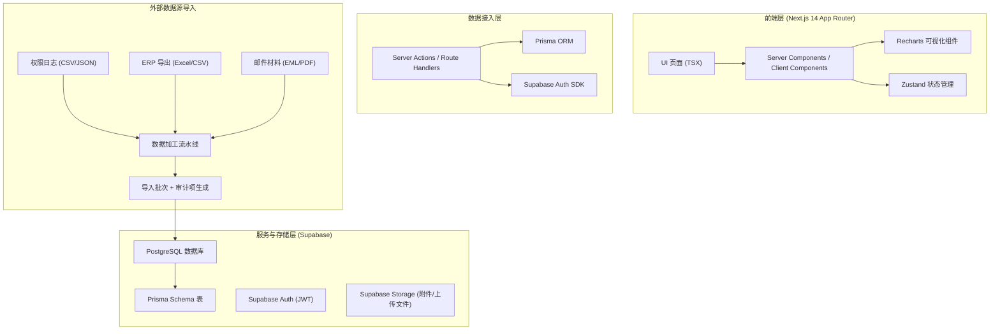
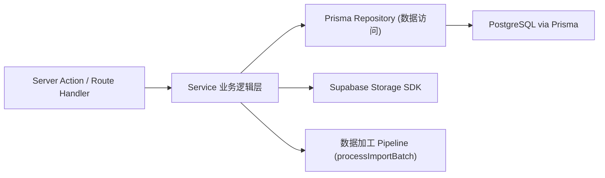
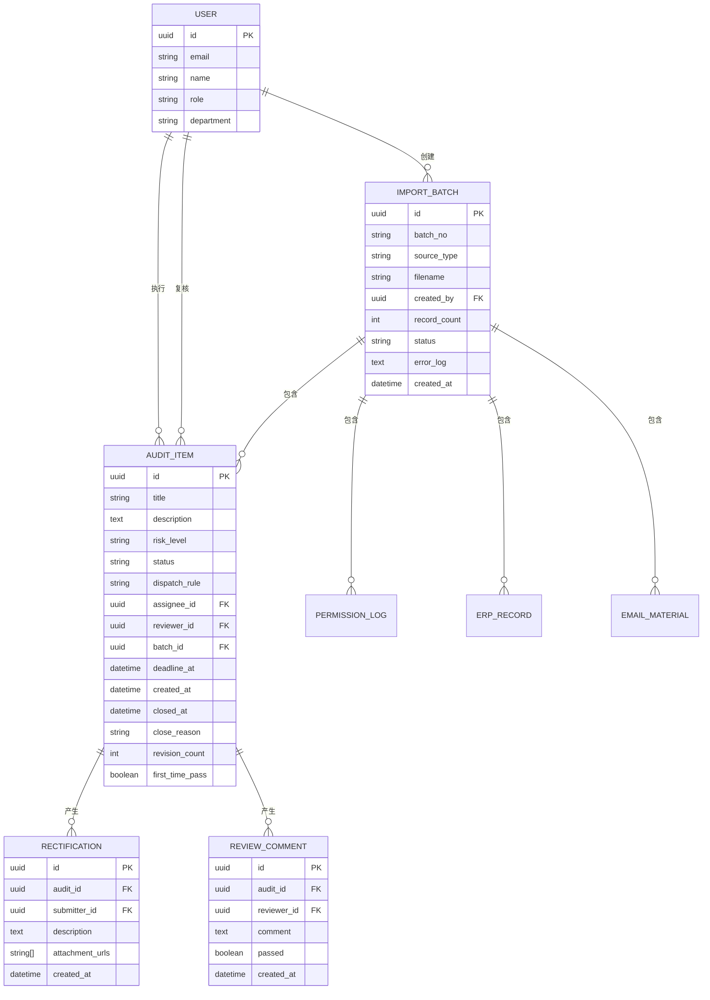

## 1. 架构设计



## 2. 技术说明
- **前端框架**：Next.js 14 (App Router) + React 18 + TypeScript 5
- **样式方案**：Tailwind CSS 3 + clsx + tailwind-merge 条件类名
- **图表库**：Recharts 2（PieChart / FunnelChart / BarChart / AreaChart）
- **状态管理**：Zustand 4（轻量全局状态：用户信息、筛选条件）
- **图标库**：Lucide React
- **认证方案**：Supabase Auth（邮箱密码登录 + Row Level Security）
- **ORM**：Prisma 5（类型安全的数据库访问）
- **数据库**：PostgreSQL 15（Supabase 托管）
- **文件存储**：Supabase Storage（导入源文件、整改附件）
- **初始化方式**：`npx create-next-app@latest --ts --tailwind --eslint --app --src-dir --import-alias "@/*"`

## 3. 路由定义
| Route (App) | 页面用途 | 权限 |
|-------------|---------|------|
| `/` | 首页（自动按角色跳转） | 登录用户 |
| `/login` | 登录页 | 公开 |
| `/dashboard` | 总览仪表盘（管理层：全局KPI+趋势） | 管理层 / 复核人员 |
| `/my-tasks` | 个人整改清单（执行角色：首次解决率+待办） | 执行角色 |
| `/audits` | 审计项列表（多维度筛选+表格） | 所有登录用户（数据按角色过滤） |
| `/audits/[id]` | 审计项详情（时间线+复核面板） | 所有登录用户（数据按角色过滤） |
| `/analytics` | 分析中心（4张核心图表） | 管理层 / 复核人员 |
| `/import` | 数据导入中心（批次列表+导入向导） | 管理层 |
| `/import/[batchId]` | 导入批次详情（回查） | 管理层 |

## 4. API 定义（Next.js Server Actions & Route Handlers）

### 4.1 Server Actions
```ts
// actions/auth.ts
export async function signInAction(formData: FormData): Promise<{ error?: string }>
export async function signOutAction(): Promise<void>

// actions/audit.ts
export async function submitRectificationAction(formData: FormData): Promise<{ error?: string; id: string }>
export async function reviewAuditAction(formData: FormData): Promise<{ error?: string; passed: boolean }>

// actions/import.ts
export async function createImportBatchAction(formData: FormData): Promise<{ error?: string; batchId: string }>
export async function processImportBatchAction(batchId: string): Promise<{ error?: string; count: number }>
```

### 4.2 Route Handlers（供图表/列表异步拉取）
| Method | Path | 用途 | Request / Response |
|--------|------|------|-------------------|
| GET | `/api/kpi/overview` | 总览 KPI 数据 | `→ { inProgress, overdue, firstPassRate, closedRate, trend }` |
| GET | `/api/kpi/my-stats` | 执行角色个人指标 | `→ { pending, firstPassRate, avgDays }` |
| GET | `/api/audits` | 审计项列表（分页+筛选） | Query: `status, risk, dept, rule, batchId, page, pageSize` |
| GET | `/api/audits/[id]` | 审计项详情+时间线 | `→ AuditWithTimelineDTO` |
| GET | `/api/analytics/dispatch-rules` | 派工规则分布 | `→ { name, value }[]` |
| GET | `/api/analytics/funnel` | 处理时限漏斗 | `→ { stage, value, avgHours }[]` |
| GET | `/api/analytics/review-comments` | 复核意见排行 | `→ { reason, count }[]` |
| GET | `/api/analytics/close-reasons` | 关闭原因变化（按周） | `→ { week, [reason]: count }[]` |
| GET | `/api/import/batches` | 导入批次列表 | `→ ImportBatch[]` |
| GET | `/api/import/batches/[id]` | 批次详情+关联审计项 | `→ BatchWithAuditsDTO` |

## 5. 服务分层（Server Action 内部结构）


## 6. 数据模型

### 6.1 ER 图


### 6.2 Prisma Schema 关键片段

```prisma
model User {
  id           String     @id @default(uuid())
  email        String     @unique
  name         String
  role         String     // MANAGEMENT | EXECUTOR | REVIEWER
  department   String?
  createdAt    DateTime   @default(now())
  assigned     AuditItem[] @relation("Assignee")
  reviewed     AuditItem[] @relation("Reviewer")
  batches      ImportBatch[]
}

model ImportBatch {
  id           String        @id @default(uuid())
  batchNo      String        @unique
  sourceType   String        // PERMISSION_LOG | ERP_EXPORT | EMAIL_MATERIAL | COMBINED
  fileName     String?
  filePath     String?
  createdById  String
  createdBy    User          @relation(fields: [createdById], references: [id])
  recordCount  Int           @default(0)
  status       String        // PENDING | PROCESSING | SUCCESS | FAILED
  errorLog     String?
  createdAt    DateTime      @default(now())
  auditItems   AuditItem[]
  permLogs     PermissionLog[]
  erpRecords   ErpRecord[]
  emails       EmailMaterial[]
}

model AuditItem {
  id              String             @id @default(uuid())
  title           String
  description     String
  riskLevel       String             // HIGH | MEDIUM | LOW
  status          String             // CREATED | ASSIGNED | IN_PROGRESS | PENDING_REVIEW | REJECTED | CLOSED
  dispatchRule    String
  assigneeId      String?
  assignee        User?              @relation("Assignee", fields: [assigneeId], references: [id])
  reviewerId      String?
  reviewer        User?              @relation("Reviewer", fields: [reviewerId], references: [id])
  batchId         String
  batch           ImportBatch        @relation(fields: [batchId], references: [id])
  deadlineAt      DateTime
  createdAt       DateTime           @default(now())
  closedAt        DateTime?
  closeReason     String?
  revisionCount   Int                @default(0)
  firstTimePass   Boolean?
  rectifications  Rectification[]
  reviews         ReviewComment[]
}

model Rectification {
  id              String        @id @default(uuid())
  auditId         String
  audit           AuditItem     @relation(fields: [auditId], references: [id])
  submitterId     String
  description     String
  attachmentUrls  String[]
  createdAt       DateTime      @default(now())
}

model ReviewComment {
  id          String     @id @default(uuid())
  auditId     String
  audit       AuditItem  @relation(fields: [auditId], references: [id])
  reviewerId  String
  comment     String     // 复核不通过时必填
  passed      Boolean
  createdAt   DateTime   @default(now())
}

model PermissionLog {
  id         String      @id @default(uuid())
  batchId    String
  batch      ImportBatch @relation(fields: [batchId], references: [id])
  userId     String?
  action     String
  resource   String
  ipAddress  String?
  happenedAt DateTime
}

model ErpRecord {
  id           String      @id @default(uuid())
  batchId      String
  batch        ImportBatch @relation(fields: [batchId], references: [id])
  documentNo   String
  amount       Decimal?
  department   String?
  happenedAt   DateTime
}

model EmailMaterial {
  id         String      @id @default(uuid())
  batchId    String
  batch      ImportBatch @relation(fields: [batchId], references: [id])
  subject    String
  sender     String
  recipients String[]
  sentAt     DateTime
}
```
