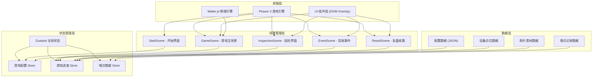

## 1. 架构设计



## 2. 技术描述

### 2.1 核心技术栈
- **游戏引擎**：Phaser 3.70+ - 2D 游戏框架，负责场景管理、渲染、输入处理
- **编程语言**：TypeScript 5.0+ - 类型安全的 JavaScript 超集
- **构建工具**：Vite 5.0+ - 快速的前端构建与开发服务器
- **物理引擎**：Matter.js 0.19+ - 用于拖拽交互、碰撞检测
- **状态管理**：Zustand 4.4+ - 轻量级状态管理，管理游戏状态和配置
- **样式方案**：Tailwind CSS 3.3+ - 用于 DOM Overlay 的 UI 组件样式

### 2.2 项目初始化
- 使用 Vite + vanilla-ts 模板初始化项目
- 手动添加 Phaser 3、Matter.js、Zustand 依赖
- 配置 TypeScript 路径别名 `@/` 指向 `src/`

## 3. 目录结构

```
src/
├── config/              # 配置文件
│   ├── difficulty.ts    # 难度曲线配置
│   ├── items.ts         # 道具冷却配置
│   └── tracking.ts      # 埋点规则配置
├── scenes/              # Phaser 场景
│   ├── BaseScene.ts     # 基础场景类
│   ├── StartScene.ts    # 开始界面
│   ├── GameScene.ts     # 游戏主场景
│   ├── InspectionScene.ts  # 巡检界面
│   ├── EventScene.ts    # 突发事件界面
│   └── ResultScene.ts   # 复盘结算页
├── components/          # UI 组件 (DOM Overlay)
│   ├── PointList.tsx    # 点位清单组件
│   ├── PhotoViewer.tsx  # 照片查看组件
│   ├── Timer.tsx        # 计时器组件
│   ├── ItemBar.tsx      # 道具栏组件
│   ├── ConfigPanel.tsx  # 配置面板
│   └── StatCard.tsx     # 统计卡片
├── store/               # Zustand 状态管理
│   ├── useConfigStore.ts    # 配置状态
│   ├── useGameStore.ts      # 游戏进度状态
│   └── useTrackingStore.ts  # 埋点状态
├── types/               # TypeScript 类型定义
│   ├── game.ts          # 游戏相关类型
│   ├── config.ts        # 配置相关类型
│   └── tracking.ts      # 埋点相关类型
├── utils/               # 工具函数
│   ├── phaser-matter-adapter.ts  # Phaser-Matter 适配器
│   ├── photo-generator.ts        # 动态照片生成器
│   └── tracking-helper.ts        # 埋点辅助函数
├── assets/              # 静态资源
│   ├── images/          # 图片素材
│   ├── photos/          # 巡检照片模板
│   └── data/            # JSON 数据文件
├── main.ts              # 游戏入口
└── App.tsx              # React 根组件 (DOM Overlay)
```

## 4. 核心类型定义

### 4.1 游戏状态类型

```typescript
// types/game.ts
export type DeviceStatus = 'normal' | 'need_clean' | 'fault';
export type DifficultyLevel = 'easy' | 'normal' | 'hard';
export type GamePhase = 'start' | 'playing' | 'paused' | 'inspecting' | 'event' | 'result';
export type FaultType = 'leak' | 'blockage' | 'electrical' | 'mechanical' | 'heating';

export interface Point {
  id: string;
  name: string;
  deviceType: string;
  storeName: string;
  status: DeviceStatus;
  isCompleted: boolean;
  photoUrl: string;
  faultType?: FaultType;
  decisionTime?: number;
  playerDecision?: DeviceStatus;
  isCorrect?: boolean;
  isStuckPoint?: boolean;
}

export interface Item {
  id: string;
  name: string;
  icon: string;
  cooldown: number;
  currentCooldown: number;
  effect: string;
}

export interface GameEvent {
  id: string;
  type: 'device_offline';
  pointId: string;
  triggeredAt: number;
  options: EventOption[];
  playerChoice?: string;
  choiceTime?: number;
}

export interface EventOption {
  id: string;
  label: string;
  description: string;
  scoreImpact: number;
  timeImpact: number;
}
```

### 4.2 配置类型

```typescript
// types/config.ts
export interface DifficultyConfig {
  totalTime: number;
  pointCount: number;
  faultProbability: number;
  cleanProbability: number;
  decisionTimeLimit: number;
  eventFrequency: number;
}

export interface ItemConfig {
  id: string;
  name: string;
  icon: string;
  cooldown: number;
  effect: string;
}

export interface TrackingRule {
  stuckThreshold: number;
  trackDecisionTime: boolean;
  trackErrorTypes: boolean;
  trackOperationPath: boolean;
  trackItemUsage: boolean;
  trackEventHandling: boolean;
}

export interface GameConfig {
  difficulty: Record<DifficultyLevel, DifficultyConfig>;
  items: ItemConfig[];
  tracking: TrackingRule;
  currentDifficulty: DifficultyLevel;
}
```

### 4.3 埋点类型

```typescript
// types/tracking.ts
export interface PointTracking {
  pointId: string;
  viewedAt: number;
  decisionMadeAt: number;
  decisionTime: number;
  playerDecision: DeviceStatus;
  actualStatus: DeviceStatus;
  isCorrect: boolean;
  errorType?: string;
}

export interface ItemUsageTracking {
  itemId: string;
  usedAt: number;
  usedOnPoint?: string;
  effectApplied: boolean;
}

export interface EventTracking {
  eventId: string;
  triggeredAt: number;
  playerChoice: string;
  choiceMadeAt: number;
  choiceTime: number;
}

export interface GameResult {
  totalPoints: number;
  completedPoints: number;
  correctDecisions: number;
  accuracyRate: number;
  totalTime: number;
  timeUsed: number;
  averageDecisionTime: number;
  stuckPoints: string[];
  errorPoints: string[];
  pointTrackings: PointTracking[];
  itemUsages: ItemUsageTracking[];
  events: EventTracking[];
}
```

## 5. 核心模块设计

### 5.1 Phaser + Matter.js 整合

Phaser 3 内置了 Matter.js 支持，但为了更好的拖拽交互体验，创建自定义适配器：

```typescript
// utils/phaser-matter-adapter.ts
export class DragPhysics {
  constructor(scene: Phaser.Scene);
  enableDrag(gameObject: Phaser.GameObjects.Image, options?: DragOptions): void;
  disableDrag(gameObject: Phaser.GameObjects.Image): void;
  setBounds(x: number, y: number, width: number, height: number): void;
}
```

用于实现：
- 点位清单的物理拖拽滚动
- 照片查看器的拖拽平移
- 道具的拖拽使用

### 5.2 动态照片生成器

使用 Canvas API 动态生成不同状态的设备照片：

```typescript
// utils/photo-generator.ts
export class PhotoGenerator {
  generate(status: DeviceStatus, baseImage: HTMLImageElement): HTMLCanvasElement;
  addCleanIndicator(canvas: HTMLCanvasElement): void;
  addFaultIndicator(canvas: HTMLCanvasElement, faultType: FaultType): void;
  addScanlineEffect(canvas: HTMLCanvasElement): void;
}
```

### 5.3 场景流程管理

使用 Phaser Scene Manager + Zustand 管理场景切换：

1. **StartScene** → 选择难度、调整配置 → 启动 GameScene
2. **GameScene** → 主游戏循环，管理点位、计时、道具
3. **InspectionScene** → 从 GameScene 启动，处理单个点位的巡检
4. **EventScene** → 随机触发，处理设备离线等突发事件
5. **ResultScene** → 游戏结束，展示统计和复盘数据

### 5.4 DOM Overlay 架构

React 组件层覆盖在 Phaser Canvas 之上，负责：
- 点位清单的键盘导航和无障碍支持
- 配置面板的表单交互
- 统计数据的展示
- 与 Phaser 场景通过 Zustand store 通信

## 6. 状态管理设计

### 6.1 配置 Store (useConfigStore)
```typescript
{
  difficulty: DifficultyConfig;
  items: ItemConfig[];
  trackingRules: TrackingRule;
  currentDifficulty: DifficultyLevel;
  setDifficulty: (level: DifficultyLevel) => void;
  updateDifficultyConfig: (level: DifficultyLevel, config: Partial<DifficultyConfig>) => void;
  updateItemCooldown: (itemId: string, cooldown: number) => void;
  updateTrackingRules: (rules: Partial<TrackingRule>) => void;
}
```

### 6.2 游戏 Store (useGameStore)
```typescript
{
  phase: GamePhase;
  points: Point[];
  currentPointId: string | null;
  timeRemaining: number;
  totalTime: number;
  score: number;
  items: Item[];
  activeEvent: GameEvent | null;
  result: GameResult | null;
  startGame: () => void;
  selectPoint: (pointId: string) => void;
  makeDecision: (pointId: string, decision: DeviceStatus) => void;
  useItem: (itemId: string) => void;
  triggerEvent: (event: GameEvent) => void;
  handleEventChoice: (optionId: string) => void;
  pauseGame: () => void;
  resumeGame: () => void;
  endGame: () => void;
  restartGame: () => void;
}
```

### 6.3 埋点 Store (useTrackingStore)
```typescript
{
  pointTrackings: PointTracking[];
  itemUsages: ItemUsageTracking[];
  eventTrackings: EventTracking[];
  operationPath: string[];
  recordPointView: (pointId: string) => void;
  recordPointDecision: (tracking: PointTracking) => void;
  recordItemUsage: (tracking: ItemUsageTracking) => void;
  recordEvent: (tracking: EventTracking) => void;
  recordOperation: (operation: string) => void;
  generateResult: () => GameResult;
  clear: () => void;
}
```

## 7. 游戏主循环逻辑

```typescript
// scenes/GameScene.ts
update(time: number, delta: number): void {
  // 1. 更新计时器
  if (this.phase === 'playing') {
    this.updateTimer(delta);
  }
  
  // 2. 更新道具冷却
  this.updateItemCooldowns(delta);
  
  // 3. 检查突发事件触发条件
  this.checkEventTrigger(time);
  
  // 4. 检查游戏结束条件
  if (this.shouldEndGame()) {
    this.endGame();
  }
  
  // 5. 更新埋点数据
  this.updateTrackingData(time);
}
```

## 8. 关键交互实现

### 8.1 点位清单多操作支持
- **鼠标拖拽**：使用 Matter.js 物理体实现惯性滚动
- **触屏滑动**：监听 touch 事件，计算滑动速度
- **键盘操作**：↑↓ 导航，Enter 选中，Esc 返回
- **无障碍**：ARIA 角色，键盘焦点管理

### 8.2 照片状态判断
- 每种设备状态有独特的视觉特征
- 清洁状态：水渍、咖啡渍、灰尘覆盖
- 故障状态：闪烁指示灯、泄漏、异常显示
- 玩家需要在时间限制内做出判断

### 8.3 突发事件系统
- 基于泊松分布的随机触发算法
- 设备离线时需要玩家快速做出决策
- 不同选择影响得分和时间消耗

### 8.4 复盘分析算法
- **卡点识别**：判断时间超过阈值 + 多次切换选项
- **错误分类**：假阳性（正常判故障）、假阴性（故障判正常）、清洁误判
- **操作路径分析**：查看顺序、回溯次数、平均停留时间
