## 1. 架构设计

```mermaid
graph TB
    A["Phaser 3 游戏引擎"] --> B["场景管理器"]
    A --> C["输入系统"]
    A --> D["物理系统 (Matter.js)"]
    A --> E["音频系统"]
    
    B --> B1["BootScene 启动场景"]
    B --> B2["PreloadScene 预加载场景"]
    B --> B3["MainMenuScene 主菜单场景"]
    B --> B4["GameScene 游戏场景"]
    B --> B5["ResultScene 结算场景"]
    B --> B6["ReviewScene 复盘场景"]
    B --> B7["SettingsScene 设置场景"]
    
    C --> C1["鼠标拖拽"]
    C --> C2["触屏手势"]
    C --> C3["键盘导航"]
    
    D --> D1["货架碰撞体"]
    D --> D2["陈列照片物理体"]
    D --> D3["吸附检测"]
    
    E --> E1["BGM 管理"]
    E --> E2["音效管理"]
    
    F["Zustand 全局状态"] --> F1["游戏设置"]
    F --> F2["玩家数据"]
    F --> F3["关卡进度"]
    
    G["数据模块"] --> G1["关卡配置"]
    G --> G2["药品数据"]
    G --> G3["促销规则"]
    
    H["工具模块"] --> H1["动画工具"]
    H --> H2["震动控制"]
    H --> H3["分数计算"]
```



## 2. 技术描述

- **前端框架**: Phaser 3.70 + TypeScript 5.3 + Vite 5.0
- **物理引擎**: Matter-js 0.19 (通过Phaser内置Physics系统集成)
- **状态管理**: Zustand 4.5 (管理游戏设置和玩家进度)
- **样式方案**: TailwindCSS 3.4 (UI层样式)
- **构建工具**: Vite 5.0
- **包管理器**: pnpm

## 3. 目录结构

```
src/
├── scenes/                 # Phaser场景
│   ├── BootScene.ts       # 启动初始化
│   ├── PreloadScene.ts    # 资源预加载
│   ├── MainMenuScene.ts   # 主菜单
│   ├── GameScene.ts       # 游戏主场景
│   ├── ResultScene.ts     # 结算页
│   ├── ReviewScene.ts     # 复盘页
│   └── SettingsScene.ts   # 设置页
├── game/                   # 游戏核心逻辑
│   ├── ShelfGrid.ts       # 货架网格系统
│   ├── DisplayCard.ts     # 陈列卡片类
│   ├── PromotionRule.ts   # 促销规则引擎
│   ├── PhysicsManager.ts  # Matter.js物理管理
│   └── ScoreCalculator.ts # 分数计算
├── store/                  # 状态管理
│   ├── useSettingsStore.ts    # 设置状态
│   ├── usePlayerStore.ts      # 玩家数据
│   └── useGameStateStore.ts   # 游戏状态
├── data/                   # 静态数据
│   ├── levels.ts          # 关卡配置
│   ├── medicines.ts       # 药品数据
│   └── promotions.ts      # 促销规则
├── utils/                  # 工具函数
│   ├── audio.ts           # 音频管理
│   ├── vibration.ts       # 震动控制
│   ├── animation.ts       # 动画工具
│   └── storage.ts         # 本地存储
├── types/                  # 类型定义
│   ├── game.ts
│   └── index.ts
├── ui/                     # UI组件 (DOM层)
│   ├── SettingsPanel.tsx
│   ├── ReviewChart.tsx
│   └── ResultCard.tsx
├── App.tsx
├── main.ts
└── index.css
```

## 4. 核心类型定义

```typescript
// 药品类型
interface Medicine {
  id: string;
  name: string;
  category: string;
  image: string;
  color: string;
}

// 促销规则类型
interface PromotionRule {
  id: string;
  name: string;
  description: string;
  icon: string;
  // 规则类型: category-zone 品类区域 / endcap 端架 / stack 堆头 / price-tag 价签
  type: 'category-zone' | 'endcap' | 'stack' | 'price-tag';
  // 目标货架位置 (row, col)
  targetPositions: { row: number; col: number }[];
  // 目标药品分类
  targetCategory?: string;
  // 分值
  points: number;
}

// 货架格子
interface ShelfCell {
  row: number;
  col: number;
  x: number;
  y: number;
  width: number;
  height: number;
  occupiedBy: string | null;
  isHighlighted: boolean;
}

// 关卡配置
interface Level {
  id: number;
  name: string;
  description: string;
  difficulty: 'easy' | 'medium' | 'hard';
  timeLimit: number; // 秒
  shelfRows: number;
  shelfCols: number;
  promotionRules: string[]; // 规则ID列表
  medicines: string[]; // 药品ID列表
  targetScore: number;
}

// 游戏状态
interface GameState {
  currentLevelId: number;
  timeRemaining: number;
  score: number;
  combo: number;
  maxCombo: number;
  errors: number;
  totalPlacements: number;
  correctPlacements: number;
  startTime: number;
  placementTimes: number[];
}

// 结算数据
interface GameResult {
  levelId: number;
  levelName: string;
  totalScore: number;
  speedScore: number;
  accuracyScore: number;
  comboScore: number;
  timeTaken: number;
  errors: number;
  maxCombo: number;
  correctCount: number;
  totalCount: number;
  promotionAchievement: { [ruleId: string]: number }; // 每个规则的达成率
  timestamp: number;
}

// 游戏设置
interface GameSettings {
  soundEnabled: boolean;
  musicEnabled: boolean;
  animationEnabled: boolean;
  vibrationEnabled: boolean;
  volume: number;
}
```

## 5. 场景流程定义

| 场景名称 | 场景Key | 前置场景 | 后续场景 | 触发条件 |
|----------|---------|----------|----------|----------|
| 启动场景 | Boot | - | Preload | 游戏启动 |
| 预加载场景 | Preload | Boot | MainMenu | 资源加载完成 |
| 主菜单 | MainMenu | Preload/Result/Review/Settings | Game/Review/Settings | 点击开始/复盘/设置 |
| 游戏场景 | Game | MainMenu/Result | Result | 时间结束/全部完成 |
| 结算场景 | Result | Game | MainMenu/Game | 点击返回/重玩/下一关 |
| 复盘场景 | Review | MainMenu | MainMenu | 点击返回 |
| 设置场景 | Settings | MainMenu | MainMenu | 点击返回 |

## 6. 输入系统设计

### 6.1 触屏操作
- 单指拖拽：移动陈列照片
- 单指点击：选中/摆放照片
- 双指缩放：暂不支持（简化操作）

### 6.2 鼠标操作
- 左键拖拽：移动陈列照片
- 左键点击：选中/摆放照片
- 悬停：高亮目标位置

### 6.3 键盘操作
- `Tab` / `Shift+Tab`：在陈列照片间切换焦点
- `←` `→` `↑` `↓`：在货架格子间移动选中的照片
- `Enter` / `Space`：确认摆放
- `Esc`：暂停/返回
- `R`：快速重玩（结算页）

## 7. 物理系统集成

使用Matter.js实现：
1. **陈列照片物理体**：可拖拽的矩形刚体，带有摩擦和 restitution
2. **货架格子传感器**：静态传感器，检测照片是否进入格子区域
3. **吸附效果**：当照片中心接近格子中心时，施加平滑的吸引力
4. **碰撞检测**：防止两张照片重叠在同一格子

## 8. 数据持久化

使用 `localStorage` 存储：
- 游戏设置（音效、动画、震动开关）
- 玩家历史成绩
- 关卡进度和最佳记录
- 复盘数据

存储键名：`pharmacy-game-data-v1`
