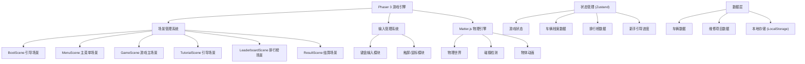
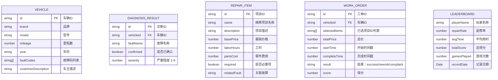

## 1. 架构设计



---

## 2. 技术说明

- **游戏引擎：Phaser 3 + TypeScript
- **构建工具：Vite 5
- **物理引擎：Matter.js（通过 Phaser 内置集成
- **状态管理：Zustand（轻量级状态管理
- **UI 框架：无额外 UI 框架，使用 Phaser 原生 DOM + CSS
- **数据存储：LocalStorage（排行榜、游戏进度）
- **图标库：Lucide（图标资源通过 SVG 加载）

### 2.1 项目依赖

| 依赖包 | 版本 | 用途 |
|--------|------|------|
| phaser | ^3.80.0 | 游戏引擎核心 |
| matter-js | ^0.19.0 | 2D 物理引擎 |
| zustand | ^4.5.0 | 状态管理 |
| typescript | ^5.4.0 | 类型系统 |
| vite | ^5.2.0 | 构建工具 |
| vite |

---

## 3. 场景路由与模块定义

| 场景键名 | 用途 |
|--------|------|
| Boot | 资源预加载、初始化配置 |
| Menu | 主菜单，开始游戏入口 |
| Game | 游戏主场景，核心玩法 |
| Tutorial | 新手引导场景 |
| Leaderboard | 排行榜展示 |
| Result | 单局结算展示 |

---

## 4. 数据模型

### 4.1 车辆档案数据模型



### 4.2 TypeScript 类型定义

```typescript
interface Vehicle {
  id: string;
  brand: string;
  model: string;
  year: number;
  mileage: number;
  faultCodes: string[];
  customerDescription: string;
  imageKey: string;
}

interface DiagnosisItem {
  id: string;
  name: string;
  confirmed: boolean;
  severity: 1 | 2 | 3 | 4 | 5;
  description: string;
}

interface RepairItem {
  id: string;
  name: string;
  description: string;
  basePrice: number;
  laborHours: number;
  partsCost: number;
  required: boolean;
  relatedFaultId: string | null;
  category: 'engine' | 'brake' | 'electrical' | 'body' | 'suspension';
}

interface WorkOrderResult {
  success: boolean;
  score: number;
  isRework: boolean;
  isComplaint: boolean;
  missingItems: string[];
  unnecessaryItems: string[];
  message: string;
}

interface LeaderboardEntry {
  playerName: string;
  reworkRate: number;
  avgCompletionTime: number;
  totalScore: number;
  gamesPlayed: number;
  timestamp: number;
}
```

---

## 5. 核心系统架构

```mermaid
graph LR
    subgraph "游戏主场景
        A["输入系统"] --> B["车辆档案卡片组件]
        A --> C["工单列表组件]
        A --> D["诊断面板组件]
        B --> E["游戏状态管理]
        C --> E
        D --> E
        E --> F["报价计算引擎]
        E --> G["结果判定引擎]
        G --> H["结果反馈组件]
        E --> I["计时系统]
        J["Matter.js 物理世界] --> K["物理动画组件]
    end
```

---

## 6. 目录结构

```
src/
├── main.ts                 # 游戏入口
├── game/
│   ├── GameApp.ts         # Phaser 游戏配置
│   ├── scenes/
│   │   ├── BootScene.ts      # 引导场景
│   │   ├── MenuScene.ts     # 主菜单
│   │   ├── GameScene.ts    # 游戏主场景
│   │   ├── TutorialScene.ts # 新手引导
│   │   ├── LeaderboardScene.ts # 排行榜
│   │   └── ResultScene.ts   # 结算场景
│   ├── systems/
│   │   ├── InputManager.ts  # 输入管理（键盘/触屏
│   │   ├── PhysicsManager.ts # 物理管理
│   │   └── TimerSystem.ts  # 计时系统
│   ├── components/
│   │   ├── VehicleCard.ts  # 车辆档案卡片
│   │   ├── DiagnosisPanel.ts # 诊断面板
│   │   ├── WorkOrderList.ts # 工单列表
│   │   ├── QuotePanel.ts   # 报价面板
│   │   ├── ResultModal.ts # 结果弹窗
│   │   └── TutorialOverlay.ts # 引导遮罩
│   ├── utils/
│   │   ├── QuoteCalculator.ts # 报价计算器
│   │   ├── ResultEvaluator.ts # 结果评估
│   │   └── Storage.ts   # 本地存储
│   ├── data/
│   │   ├── vehicles.ts   # 车辆数据
│   │   ├── repairs.ts    # 维修项目数据
│   │   └── levels.ts   # 关卡配置
│   └── store/
│       └── useGameStore.ts # Zustand 状态
├── styles/
│   └── main.css            # 全局样式
├── types/
│   └── index.ts            # 类型定义
└── config/
    └── constants.ts        # 常量配置
```
