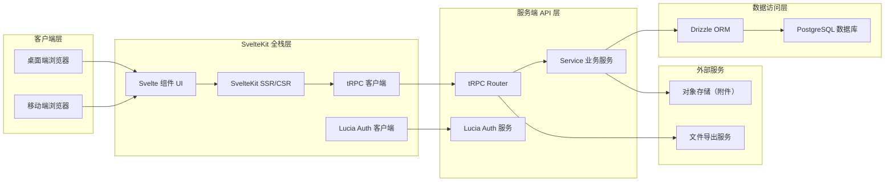
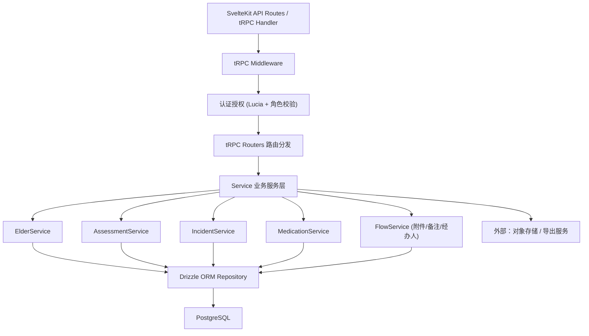
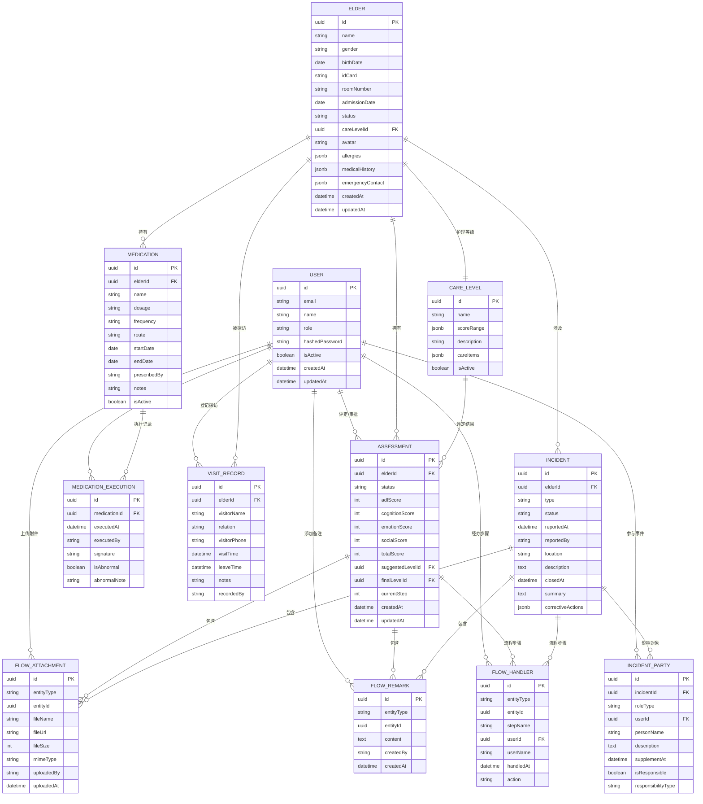

## 1. 架构设计



## 2. 技术说明

- **前端框架**：SvelteKit 2.x + TypeScript — 基于文件路由，支持 SSR/CSR 混合渲染
- **UI 样式**：Tailwind CSS 3.x + 自定义 CSS 变量主题 — 原子化样式配合主题系统
- **图标**：lucide-svelte — 轻量线性图标库
- **图表**：echarts + svelte-echarts — 数据分析仪表盘可视化
- **API 层**：tRPC 11.x — 端到端类型安全的 RPC 框架
- **ORM**：Drizzle ORM 0.30+ — TypeScript 原生 SQL 查询构建器
- **数据库**：PostgreSQL 15+ — 关系型数据库，JSONB 支持动态字段
- **认证**：Lucia Auth 3.x — 无框架锁定的认证库，支持 Session
- **文件处理**：zod — 服务端校验；superjson — 复杂类型序列化
- **导出**：xlsx — Excel 导出；pdfmake — PDF 生成
- **初始化工具**：create-svelte（SvelteKit 官方脚手架）

## 3. 路由定义

| 路由路径 | 用途 | 权限 |
|----------|------|------|
| `/login` | 登录页 | 公开 |
| `/` | 工作台首页 | 登录用户 |
| `/elders` | 老人档案列表 | 登录用户 |
| `/elders/[id]` | 老人档案详情 | 登录用户 |
| `/elders/[id]/assessments` | 入住评估列表 | 护理员+ |
| `/elders/[id]/assessments/[aid]` | 评估详情与流程 | 护理员+ |
| `/care-levels` | 护理等级配置 | 管理员/主管 |
| `/elders/[id]/medications` | 用药清单 | 医生/护理员 |
| `/elders/[id]/visits` | 探访记录 | 登录用户 |
| `/incidents` | 跌倒事件工作台 | 登录用户 |
| `/incidents/[id]` | 跌倒事件详情 | 相关角色 |
| `/analytics` | 数据分析仪表盘 | 管理员/主管 |
| `/analytics/export` | 批量数据导出 | 管理员/主管 |
| `/settings` | 系统设置 | 管理员 |
| `/settings/users` | 用户角色管理 | 管理员 |

## 4. API 定义（tRPC Router）

```typescript
// 共享类型定义
type UserRole = 'admin' | 'supervisor' | 'nurse' | 'doctor' | 'family';

interface Elder {
  id: string;
  name: string;
  gender: 'male' | 'female';
  birthDate: Date;
  idCard: string;
  roomNumber: string;
  admissionDate: Date;
  status: 'pending' | 'admitted' | 'discharged';
  careLevelId: string | null;
  avatar: string | null;
  allergies: string[];
  medicalHistory: string[];
  emergencyContact: { name: string; phone: string; relation: string };
  createdAt: Date;
  updatedAt: Date;
}

interface CareLevel {
  id: string;
  name: string;
  scoreRange: { min: number; max: number };
  description: string;
  careItems: string[];
  isActive: boolean;
}

interface Assessment {
  id: string;
  elderId: string;
  status: 'draft' | 'collecting' | 'evaluating' | 'approving' | 'archived' | 'closed';
  adlScore: number;
  cognitionScore: number;
  emotionScore: number;
  socialScore: number;
  totalScore: number;
  suggestedLevelId: string | null;
  finalLevelId: string | null;
  currentStep: number;
  createdAt: Date;
  updatedAt: Date;
}

interface Medication {
  id: string;
  elderId: string;
  name: string;
  dosage: string;
  frequency: string;
  route: string;
  startDate: Date;
  endDate: Date | null;
  prescribedBy: string;
  notes: string;
  isActive: boolean;
}

interface MedicationExecution {
  id: string;
  medicationId: string;
  executedAt: Date;
  executedBy: string;
  signature: string | null;
  isAbnormal: boolean;
  abnormalNote: string | null;
}

interface VisitRecord {
  id: string;
  elderId: string;
  visitorName: string;
  relation: string;
  visitorPhone: string;
  visitTime: Date;
  leaveTime: Date | null;
  notes: string;
  recordedBy: string;
}

interface Incident {
  id: string;
  elderId: string;
  type: 'fall' | 'other';
  status: 'reported' | 'supplementing' | 'confirming' | 'closed';
  reportedAt: Date;
  reportedBy: string;
  location: string;
  description: string;
  closedAt: Date | null;
  summary: string | null;
  correctiveActions: string[];
}

interface IncidentParty {
  id: string;
  incidentId: string;
  roleType: 'elder' | 'nurse' | 'supervisor' | 'witness' | 'doctor';
  userId: string | null;
  personName: string;
  description: string | null;
  supplementAt: Date | null;
  isResponsible: boolean | null;
  responsibilityType: 'direct' | 'indirect' | null;
}

interface FlowAttachment {
  id: string;
  entityType: 'assessment' | 'incident' | 'elder' | 'medication' | 'visit';
  entityId: string;
  fileName: string;
  fileUrl: string;
  fileSize: number;
  mimeType: string;
  uploadedBy: string;
  uploadedAt: Date;
}

interface FlowRemark {
  id: string;
  entityType: 'assessment' | 'incident' | 'elder' | 'medication' | 'visit';
  entityId: string;
  content: string;
  createdBy: string;
  createdAt: Date;
}

interface FlowHandler {
  id: string;
  entityType: 'assessment' | 'incident';
  entityId: string;
  stepName: string;
  userId: string;
  userName: string;
  handledAt: Date | null;
  action: string;
}
```

### tRPC Router 结构

```
appRouter
├── authRouter
│   ├── login
│   ├── logout
│   └── getSession
├── elderRouter
│   ├── list (分页/筛选)
│   ├── getById
│   ├── create
│   ├── update
│   └── updateStatus
├── assessmentRouter
│   ├── list
│   ├── getById
│   ├── create
│   ├── updateScores
│   ├── advanceStep
│   ├── setFinalLevel
│   └── close
├── careLevelRouter
│   ├── list
│   ├── create
│   ├── update
│   └── toggle
├── medicationRouter
│   ├── listByElder
│   ├── create
│   ├── update
│   ├── recordExecution
│   └── listExecutions
├── visitRouter
│   ├── listByElder
│   ├── create
│   ├── update
│   └── markLeft
├── incidentRouter
│   ├── list
│   ├── getById
│   ├── report (创建跌倒事件，自动列影响对象)
│   ├── supplementParty (角色补充说明)
│   ├── confirmResponsibility (确认责任人)
│   └── close
├── flowRouter (状态流转通用)
│   ├── listAttachments
│   ├── uploadAttachment
│   ├── listRemarks
│   ├── addRemark
│   └── listHandlers
├── analyticsRouter
│   ├── dashboard (核心指标)
│   ├── careLevelDistribution
│   ├── incidentStatistics
│   ├── complianceRate (护理达标率)
│   └── exportData (批量导出)
└── userRouter
    ├── list
    ├── create
    ├── update
    └── updateRole
```

## 5. 服务端架构图



## 6. 数据模型

### 6.1 ER 图



### 6.2 DDL 语句（核心表）

```sql
-- 扩展
CREATE EXTENSION IF NOT EXISTS "pgcrypto";

-- 用户表
CREATE TABLE users (
    id UUID PRIMARY KEY DEFAULT gen_random_uuid(),
    email VARCHAR(255) UNIQUE NOT NULL,
    name VARCHAR(100) NOT NULL,
    role VARCHAR(20) NOT NULL CHECK (role IN ('admin', 'supervisor', 'nurse', 'doctor', 'family')),
    hashed_password VARCHAR(255) NOT NULL,
    is_active BOOLEAN DEFAULT true,
    created_at TIMESTAMPTZ DEFAULT NOW(),
    updated_at TIMESTAMPTZ DEFAULT NOW()
);

CREATE INDEX idx_users_role ON users(role);

-- 护理等级表
CREATE TABLE care_levels (
    id UUID PRIMARY KEY DEFAULT gen_random_uuid(),
    name VARCHAR(50) NOT NULL,
    score_range JSONB NOT NULL,
    description TEXT,
    care_items JSONB DEFAULT '[]'::jsonb,
    is_active BOOLEAN DEFAULT true
);

-- 老人档案表
CREATE TABLE elders (
    id UUID PRIMARY KEY DEFAULT gen_random_uuid(),
    name VARCHAR(100) NOT NULL,
    gender VARCHAR(10) NOT NULL CHECK (gender IN ('male', 'female')),
    birth_date DATE NOT NULL,
    id_card VARCHAR(18) UNIQUE,
    room_number VARCHAR(50),
    admission_date DATE,
    status VARCHAR(20) DEFAULT 'pending' CHECK (status IN ('pending', 'admitted', 'discharged')),
    care_level_id UUID REFERENCES care_levels(id),
    avatar VARCHAR(500),
    allergies JSONB DEFAULT '[]'::jsonb,
    medical_history JSONB DEFAULT '[]'::jsonb,
    emergency_contact JSONB DEFAULT '{}'::jsonb,
    created_at TIMESTAMPTZ DEFAULT NOW(),
    updated_at TIMESTAMPTZ DEFAULT NOW()
);

CREATE INDEX idx_elders_status ON elders(status);
CREATE INDEX idx_elders_care_level ON elders(care_level_id);

-- 入住评估表
CREATE TABLE assessments (
    id UUID PRIMARY KEY DEFAULT gen_random_uuid(),
    elder_id UUID NOT NULL REFERENCES elders(id) ON DELETE CASCADE,
    status VARCHAR(20) DEFAULT 'draft' CHECK (status IN ('draft', 'collecting', 'evaluating', 'approving', 'archived', 'closed')),
    adl_score INT DEFAULT 0,
    cognition_score INT DEFAULT 0,
    emotion_score INT DEFAULT 0,
    social_score INT DEFAULT 0,
    total_score INT DEFAULT 0,
    suggested_level_id UUID REFERENCES care_levels(id),
    final_level_id UUID REFERENCES care_levels(id),
    current_step INT DEFAULT 0,
    created_at TIMESTAMPTZ DEFAULT NOW(),
    updated_at TIMESTAMPTZ DEFAULT NOW()
);

CREATE INDEX idx_assessments_elder ON assessments(elder_id);
CREATE INDEX idx_assessments_status ON assessments(status);

-- 用药表
CREATE TABLE medications (
    id UUID PRIMARY KEY DEFAULT gen_random_uuid(),
    elder_id UUID NOT NULL REFERENCES elders(id) ON DELETE CASCADE,
    name VARCHAR(200) NOT NULL,
    dosage VARCHAR(100) NOT NULL,
    frequency VARCHAR(100) NOT NULL,
    route VARCHAR(50) NOT NULL,
    start_date DATE NOT NULL,
    end_date DATE,
    prescribed_by VARCHAR(100),
    notes TEXT,
    is_active BOOLEAN DEFAULT true
);

CREATE INDEX idx_medications_elder ON medications(elder_id);

-- 用药执行记录表
CREATE TABLE medication_executions (
    id UUID PRIMARY KEY DEFAULT gen_random_uuid(),
    medication_id UUID NOT NULL REFERENCES medications(id) ON DELETE CASCADE,
    executed_at TIMESTAMPTZ NOT NULL DEFAULT NOW(),
    executed_by VARCHAR(100) NOT NULL,
    signature VARCHAR(500),
    is_abnormal BOOLEAN DEFAULT false,
    abnormal_note TEXT
);

-- 探访记录表
CREATE TABLE visit_records (
    id UUID PRIMARY KEY DEFAULT gen_random_uuid(),
    elder_id UUID NOT NULL REFERENCES elders(id) ON DELETE CASCADE,
    visitor_name VARCHAR(100) NOT NULL,
    relation VARCHAR(50),
    visitor_phone VARCHAR(20),
    visit_time TIMESTAMPTZ NOT NULL DEFAULT NOW(),
    leave_time TIMESTAMPTZ,
    notes TEXT,
    recorded_by VARCHAR(100)
);

CREATE INDEX idx_visits_elder_time ON visit_records(elder_id, visit_time);

-- 事件表（跌倒等）
CREATE TABLE incidents (
    id UUID PRIMARY KEY DEFAULT gen_random_uuid(),
    elder_id UUID NOT NULL REFERENCES elders(id) ON DELETE CASCADE,
    type VARCHAR(20) DEFAULT 'fall' CHECK (type IN ('fall', 'other')),
    status VARCHAR(20) DEFAULT 'reported' CHECK (status IN ('reported', 'supplementing', 'confirming', 'closed')),
    reported_at TIMESTAMPTZ DEFAULT NOW(),
    reported_by VARCHAR(100),
    location VARCHAR(200),
    description TEXT,
    closed_at TIMESTAMPTZ,
    summary TEXT,
    corrective_actions JSONB DEFAULT '[]'::jsonb
);

CREATE INDEX idx_incidents_status ON incidents(status);

-- 事件影响对象表
CREATE TABLE incident_parties (
    id UUID PRIMARY KEY DEFAULT gen_random_uuid(),
    incident_id UUID NOT NULL REFERENCES incidents(id) ON DELETE CASCADE,
    role_type VARCHAR(20) NOT NULL CHECK (role_type IN ('elder', 'nurse', 'supervisor', 'witness', 'doctor')),
    user_id UUID REFERENCES users(id),
    person_name VARCHAR(100) NOT NULL,
    description TEXT,
    supplement_at TIMESTAMPTZ,
    is_responsible BOOLEAN,
    responsibility_type VARCHAR(20) CHECK (responsibility_type IN ('direct', 'indirect'))
);

-- 通用附件表（状态流转）
CREATE TABLE flow_attachments (
    id UUID PRIMARY KEY DEFAULT gen_random_uuid(),
    entity_type VARCHAR(20) NOT NULL CHECK (entity_type IN ('assessment', 'incident', 'elder', 'medication', 'visit')),
    entity_id UUID NOT NULL,
    file_name VARCHAR(255) NOT NULL,
    file_url VARCHAR(500) NOT NULL,
    file_size INT,
    mime_type VARCHAR(100),
    uploaded_by VARCHAR(100),
    uploaded_at TIMESTAMPTZ DEFAULT NOW()
);

CREATE INDEX idx_attachments_entity ON flow_attachments(entity_type, entity_id);

-- 通用备注表（状态流转）
CREATE TABLE flow_remarks (
    id UUID PRIMARY KEY DEFAULT gen_random_uuid(),
    entity_type VARCHAR(20) NOT NULL CHECK (entity_type IN ('assessment', 'incident', 'elder', 'medication', 'visit')),
    entity_id UUID NOT NULL,
    content TEXT NOT NULL,
    created_by VARCHAR(100),
    created_at TIMESTAMPTZ DEFAULT NOW()
);

CREATE INDEX idx_remarks_entity ON flow_remarks(entity_type, entity_id);

-- 通用经办人表（状态流转）
CREATE TABLE flow_handlers (
    id UUID PRIMARY KEY DEFAULT gen_random_uuid(),
    entity_type VARCHAR(20) NOT NULL CHECK (entity_type IN ('assessment', 'incident')),
    entity_id UUID NOT NULL,
    step_name VARCHAR(100) NOT NULL,
    user_id UUID REFERENCES users(id),
    user_name VARCHAR(100) NOT NULL,
    handled_at TIMESTAMPTZ,
    action VARCHAR(50)
);

CREATE INDEX idx_handlers_entity ON flow_handlers(entity_type, entity_id);

-- Lucia Auth Session 表
CREATE TABLE user_sessions (
    id VARCHAR(128) PRIMARY KEY,
    user_id UUID NOT NULL REFERENCES users(id) ON DELETE CASCADE,
    active_expires_at BIGINT NOT NULL,
    idle_expires_at BIGINT NOT NULL
);

CREATE INDEX idx_sessions_user ON user_sessions(user_id);

-- 初始护理等级数据
INSERT INTO care_levels (name, score_range, description, care_items, is_active) VALUES
('自理', '{"min": 90, "max": 100}', '日常生活完全自理', '["每日健康监测", "定期体检", "活动组织"]'::jsonb, true),
('半自理', '{"min": 60, "max": 89}', '部分生活需要协助', '["协助穿衣洗漱", "用药提醒", "每日巡房3次"]'::jsonb, true),
('介助', '{"min": 30, "max": 59}', '大部分生活需要帮助', '["协助进食", "协助翻身", "个人卫生护理", "康复训练"]'::jsonb, true),
('介护', '{"min": 0, "max": 29}', '完全依赖护理', '["24小时监护", "鼻饲/喂饭护理", "压疮护理", "生命体征监测"]'::jsonb, true);
```
