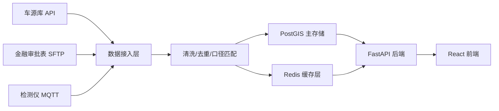
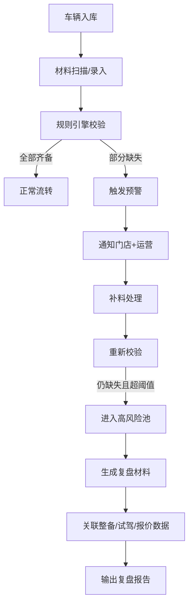

## 1. 产品概述

二手车门店过户材料风险监测系统，专为二手车连锁门店运营团队、风控部门和管理层设计，用于复盘各门店过户材料完整性与合规性。系统通过多数据源融合（车源库、金融审批表、检测仪数据），围绕库存周转周期建立材料缺失预警机制，帮助门店在车辆流转关键节点及时补全过户资料，降低交易合规风险与库存滞压损失。

### 目标用户
- 门店店长：实时查看本店过户材料完成度，处理预警工单
- 区域运营：横向对比多门店风险指标，驱动流程优化
- 风控部门：调整预警阈值，生成复盘报告
- 管理层：总览全国/区域风险热力分布与库存健康度

---

## 2. 核心功能

### 2.1 用户角色

| 角色 | 注册方式 | 核心权限 |
|------|----------|----------|
| 门店店长 | 企业 SSO 登录 | 查看本店数据、处理材料预警、查看单台车复盘 |
| 区域运营 | 企业 SSO 登录 | 区域门店对比、导出报表、发起整改工单 |
| 风控管理员 | 企业 SSO 登录 | 调整预警阈值、管理规则引擎、全量数据查看 |
| 管理层 | 企业 SSO 登录 | 全国/区域 Dashboard、趋势分析、风险地图 |

### 2.2 功能模块

1. **风险监测总览页**：Mapbox 门店地理风险热力图、核心指标分层卡片、实时预警流
2. **过户材料风险图**：库存周转周期 × 材料完成度矩阵、预警命中车辆列表、材料缺失类型分布
3. **管理页（预警线配置）**：材料类型预警阈值、周转阶段触发规则、通知渠道配置
4. **复盘材料生成页**：单台车辆完整时间轴、整备/试驾/报价关联数据、一键导出复盘报告
5. **图表分析区**：整备清单趋势、试驾记录分布、报价历史波动三大独立图表分层展示

### 2.3 页面详情

| 页面名称 | 模块名称 | 功能描述 |
|----------|----------|----------|
| 风险监测总览 | Mapbox 地理热力图 | 按门店经纬度渲染风险等级（绿/黄/橙/红），点击下钻至单店详情 |
| 风险监测总览 | 核心指标分层卡 | 第一层：在库车辆数、预警车辆数、高风险占比；第二层：平均补料时长、30天过户率；第三层：材料缺失 Top3 类型 |
| 风险监测总览 | 实时预警流 | 滚动展示最新命中预警的车辆，含门店、车架号、缺失项、滞库天数 |
| 过户材料风险图 | 周转×材料矩阵图 | 横轴：库龄分段（0-7d/8-15d/16-30d/31d+），纵轴：材料完成度百分比区间，气泡大小=车辆数，颜色=风险等级 |
| 过户材料风险图 | 材料缺失分布 | 堆叠柱状图：行驶证/登记证/购置税/保单/发票/其他 各类型在不同库龄段的缺失数量 |
| 过户材料风险图 | 预警命中车辆列表 | 可筛选门店/库龄/缺失类型，点击行进入单车复盘 |
| 管理页 | 预警阈值配置 | 滑块+输入框调整：各材料项预警触发天数、高风险阈值、多级预警间隔 |
| 管理页 | 规则引擎配置 | 周转阶段与材料项的关联规则（如：整备完成前必须具备行驶证）、逻辑组合（与/或） |
| 管理页 | 通知配置 | 钉钉/企微/邮件渠道开关、接收人按角色/门店映射 |
| 复盘生成页 | 单车时间轴 | 入库→整备→试驾→报价→成交→过户 全节点时间戳，材料缺失点红色标记 |
| 复盘生成页 | 关联数据区 | 整备项目清单（含完成状态）、试驾记录（次数/评价/里程）、报价历史（每次报价时间+金额+意向客户），三区域分 Tab 呈现，不堆叠 |
| 复盘生成页 | 导出功能 | PDF/Excel 导出复盘报告，含风险评级、建议补料清单、库存周转影响分析 |
| 图表分析区 | 整备清单趋势图 | 折线图：近30/60/90天各门店整备完成率、平均整备周期、材料齐套率（整备开始vs材料齐备） |
| 图表分析区 | 试驾记录分布图 | 堆叠面积图：每周试驾次数分布（首次试驾/二次/三次+）、试驾-报价转化率、试驾时材料齐备占比 |
| 图表分析区 | 报价历史波动图 | 蜡烛图风格：单车/门店报价区间（最高-最低）、成交价偏离度、报价次数与成交概率相关性；标注车源库延迟同步的时间段 |
| 图表分析区 | 延迟标注功能 | 当车源库数据同步时间 > 24h 时，在所有时间序列图表上以灰色虚线+提示框标注「数据延迟区域」，并显示延迟时长 |

---

## 3. 核心流程

### 3.1 数据处理主流程

车源库、金融审批表、检测仪数据通过各自接入方式进入系统，经过 ETL 管道清洗去重、口径匹配后落入 PostGIS。Redis 缓存热点指标和实时预警状态，前端通过 FastAPI 接口消费。

### 3.2 预警命中与复盘流程

---

## 4. 用户界面设计

### 4.1 设计风格

**整体风格：专业风控仪表盘（Dashboard Pro）**
- 主色调：深炭灰 `#0F1419` 背景 + 警告红 `#E63946` + 安全绿 `#2ECC71` + 琥珀黄 `#F39C12`
- 辅助色：Mapbox 地图蓝 `#1E88E5`、信息蓝 `#3B82F6`、图表紫 `#8B5CF6`
- 字体：标题用 Space Grotesk（几何工业感），正文用 Inter（高可读性数字渲染）
- 卡片：半透明玻璃拟态 + 1px 微妙描边 + 硬阴影，营造分层数据感
- 动效：数据加载时骨架屏脉冲，卡片 hover 时轻微上浮 + 描边发光
- 图标：Lucide 线性图标，风险等级用带填充的警示色圆点

### 4.2 页面设计概述

| 页面名称 | 模块名称 | UI 元素描述 |
|----------|----------|-------------|
| 风险监测总览 | 顶部导航栏 | 左侧品牌 Logo + 系统名，中间全局搜索（车架号/门店），右侧日期范围选择器、用户头像下拉 |
| 风险监测总览 | 指标卡片区 | 3 行 × 4 列网格，第一层核心指标（大号数字+同比箭头），第二层效率指标（趋势迷你图），第三层结构指标（环形进度条） |
| 风险监测总览 | 地图 + 预警流 | 左侧 2/3 宽度 Mapbox 地图（支持缩放/筛选/图层切换），右侧 1/3 实时预警时间线（滚动 + 新条目高亮） |
| 过户材料风险图 | 矩阵图区 | 全宽 SVG 矩阵气泡图，左上角图例，右上角切换（按门店/按区域），鼠标悬停显示该格子的车辆明细 |
| 过户材料风险图 | 分布柱图 + 列表 | 上下布局：上方堆叠柱图（可按缺失类型过滤），下方车辆数据表（支持排序/分页/批量导出） |
| 管理页 | 阈值配置表单 | 卡片式分组，每组包含材料项名、预警天数滑块、高风险阈值输入框、启用开关；修改后实时预览影响车辆数 |
| 管理页 | 规则编辑器 | 可视化拖拽规则节点（条件→动作），支持 AND/OR 逻辑组合，保存前可试运行 |
| 复盘生成页 | 时间轴 + 三栏 Tab | 左侧纵向时间轴（节点图标+材料状态徽章），右侧 Tab 切换：整备清单 / 试驾记录 / 报价历史，每 Tab 独立图表+表格 |
| 图表分析区 | 三大图表网格 | 2×2 网格布局：左上整备趋势、右上试驾分布、下方跨两列报价波动；每张图右上角独立时间筛选器，底部数据延迟标注条 |

### 4.3 响应式设计

- **桌面优先**：1440px+ 为基准，充分利用宽屏展示多图表并列
- **平板适配（1024-1439px）**：Mapbox 与预警流改为上下布局，指标卡片缩减为 3 列
- **移动端（<1024px）**：图表单列垂直堆叠，地图改为缩略可展开，表格支持横向滑动
- **触控优化**：预警阈值滑块增大触控区域，时间轴节点扩大点击热区

### 4.4 Mapbox 场景指引

- **底图风格**：Mapbox Dark v10，隐藏 POI 标签，突出门店点位
- **门店图层**：Circle 图层，半径按在库车辆数映射（6-18px），颜色按风险等级 step 函数（绿→黄→橙→红），带 2px 白色外环
- **交互**：
  - Hover：门店弹出 tooltip（门店名、在库数、预警数、风险评分）
  - Click：弹出信息卡，含 3 个关键指标迷你图 + 「查看详情」按钮
  - FitBounds：加载时自动自适应区域内所有门店
- **动画**：风险等级变化时，点位颜色 0.8s 平滑过渡，高风险门店点轻微脉冲缩放
