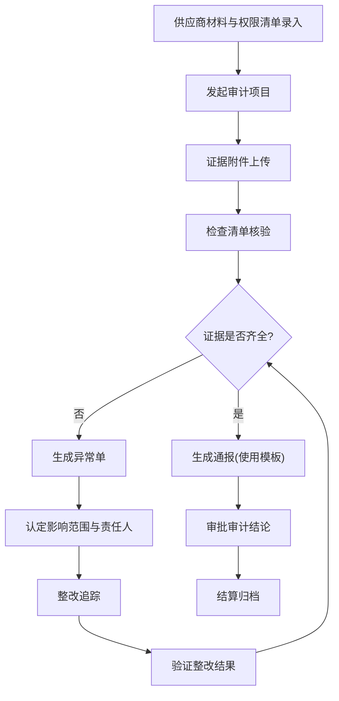

## 1. 产品概述

合规审计供应商审计结算台是面向合规审计团队的供应商全生命周期审计管理平台，解决当前供应商审计交接慢、记录散、追溯难的核心痛点。通过标准化流程串联供应商材料审核、证据收集、通报整改和验收结算全链路，实现审计过程可追溯、状态变更留痕、异常问题闭环管理。

- **核心价值**：将分散在邮件、Excel、共享盘的审计记录统一管理，审计交接从"找资料"变为"查系统"，整改完成率统计口径透明可解释
- **目标用户**：合规审计专员、审计主管、供应商对接人、质量管理人员

## 2. 核心功能

### 2.1 用户角色

| 角色 | 登录方式 | 核心权限 |
|------|----------|----------|
| 审计专员 | 企业账号登录 | 维护供应商信息、上传证据、发起审计、填写检查清单、创建异常单 |
| 审计主管 | 企业账号登录 | 审批审计结论、查看统计报表、导出审计报告、配置通报模板 |
| 系统管理员 | 企业账号登录 | 用户管理、权限配置、模板管理、系统参数设置 |

### 2.2 功能模块

1. **供应商管理台**：供应商基础信息维护、材料清单管理、访问权限配置
2. **审计工作台**：审计项目创建、证据附件管理、检查清单填写、状态流转
3. **异常单中心**：证据缺失自动预警、异常单生成与分派、整改追踪、责任认定
4. **报告与导出**：审计报告生成、整改完成率统计、口径说明导出、历史数据追溯
5. **系统配置**：通报模板管理、检查清单模板、权限角色配置

### 2.3 页面详情

| 页面名称 | 模块名称 | 功能描述 |
|----------|----------|----------|
| 首页仪表盘 | 数据概览 | 待处理审计数、异常单统计、整改完成率趋势、近期待办 |
| 供应商列表页 | 供应商管理 | 供应商搜索筛选、材料状态标签、快速查看审计历史 |
| 供应商详情页 | 供应商详情 | 基础信息、材料清单、权限配置、关联审计项目、操作日志 |
| 审计列表页 | 审计工作台 | 审计项目列表、状态筛选、批量操作、快速新建 |
| 审计详情页 | 审计详情 | 基本信息、证据附件区、检查清单区、状态时间线、通报记录 |
| 异常单列表页 | 异常单中心 | 异常单列表、优先级标签、处理状态、分派操作 |
| 异常单详情页 | 异常单详情 | 影响范围描述、责任人信息、处理过程记录、结论文件 |
| 报告导出页 | 报告与导出 | 导出条件筛选、预览、口径说明配置、下载记录 |
| 模板管理页 | 系统配置 | 通报模板CRUD、检查清单模板管理 |
| 权限管理页 | 系统配置 | 用户角色分配、供应商访问权限配置 |

## 3. 核心流程

### 3.1 供应商审计主流程

供应商材料入库 → 发起审计项目 → 上传证据附件 → 填写检查清单 → 生成通报 → 整改验证 → 审计结论 → 结算归档

每个状态变更自动记录操作人、时间、备注，形成完整审计轨迹。

### 3.2 异常单处理流程

证据缺失检测 → 自动生成异常单 → 分派责任人 → 说明影响范围 → 制定整改方案 → 整改执行 → 验证确认 → 记录处理结论 → 关闭异常单

## 4. 用户界面设计

### 4.1 设计风格

- **主色调**：专业蓝 `#1E40AF` 作为主色，代表合规与信任；辅助色用警示橙 `#F97316` 标识异常待办；成功绿 `#059669` 标识已完成；中性灰 `#64748B` 用于文本层次
- **按钮风格**：直角微圆角（2px），简洁专业，hover 有轻微浮起效果，强调操作的严肃性
- **字体**：标题使用 `Noto Sans SC` 700 粗体，正文使用 `Noto Sans SC` 400 常规，数字和统计指标使用 `JetBrains Mono` 等宽字体增强数据感
- **布局风格**：顶部导航 + 左侧菜单的经典企业后台布局，内容区采用卡片式分组，时间线组件贯穿状态流转页面
- **图标风格**：使用 Lucide 线性图标，保持简约专业，状态点使用实色圆点区分

### 4.2 页面设计概述

| 页面名称 | 模块名称 | UI 设计要点 |
|----------|----------|------------|
| 首页仪表盘 | 数据概览 | 顶部4个指标卡片（待处理、进行中、异常、整改完成率），下方折线图展示30天趋势，右侧待办列表按优先级排序 |
| 供应商详情页 | 供应商详情 | 三栏布局：左侧基础信息卡片，中间材料清单表格（带状态标签），右侧审计历史时间线 |
| 审计详情页 | 审计详情 | 顶部状态进度条（可视化当前阶段），中部标签页切换（证据/检查清单/通报/日志），底部操作区固定 |
| 异常单详情页 | 异常单详情 | 顶部红色警示条标注严重等级，左侧影响范围与责任人信息，右侧整改时间线，底部处理结论文本区 |
| 报告导出页 | 报告与导出 | 左侧筛选条件面板，右侧预览区顶部显示口径说明区块，表格展示统计数据，右上角导出按钮组 |

### 4.3 响应式设计

- 桌面优先设计，最小支持 1366px 宽度
- 平板端：左侧菜单可折叠，内容区自适应
- 移动端：顶部导航下拉菜单，卡片单列堆叠，关键操作按钮底部悬浮

### 4.4 交互与动效

- 页面加载：骨架屏占位，数据加载完成后淡入
- 状态切换：进度条平滑过渡动画（300ms ease-out）
- 表单提交：按钮 loading 状态，成功后绿色对勾反馈
- 时间线：新状态加入时从左侧滑入动画
- 异常提醒：桌面通知 + 页面红点提示 + 数字角标
