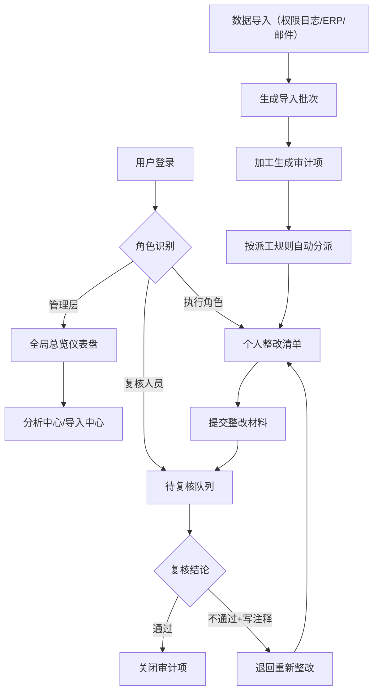

## 1. 产品概述
合规审计整改跟踪风险监测系统，用于追踪企业内部合规审计发现问题的整改进度、风险态势和处理效率。解决审计整改过程中数据分散、责任不清、进度不透明、复核无据可查的痛点。
- 目标用户：企业管理层、合规部门负责人、整改执行人员、审计复核人员
- 核心价值：打通多源数据（权限日志、ERP导出、邮件材料），实现整改全流程可追溯，风险态势可视化

## 2. 核心功能

### 2.1 用户角色
| 角色 | 注册方式 | 核心权限 |
|------|---------|---------|
| 管理层 | 管理员分配 | 查看全局总览、所有KPI指标、分析图表、全量审计项 |
| 执行角色 | 管理员分配 | 仅查看分配给自己的审计项、查看个人首次解决率、提交整改材料 |
| 复核人员 | 管理员分配 | 审核整改结果、复核不通过写注释、关闭或退回审计项 |

### 2.2 功能模块
1. **登录认证页**：基于 Supabase 的邮箱密码登录、角色权限校验
2. **总览仪表盘**：全局KPI卡片（在途数、逾期数、首次解决率、关闭率）、风险热力地图、最新动态列表
3. **数据导入中心**：权限日志导入、ERP数据导入、邮件材料导入、批次管理与回查
4. **审计项列表**：多维度筛选、状态流转、派工规则、处理时限监控
5. **审计项详情**：整改记录时间线、复核意见注释、材料附件、状态操作
6. **分析中心**：派工规则分布、处理时限漏斗、复核意见排行、关闭原因变化趋势

### 2.3 页面详情
| 页面名称 | 模块名称 | 功能描述 |
|---------|---------|---------|
| 登录页 | 登录表单 | 邮箱密码登录、角色自动识别、错误提示 |
| 总览仪表盘 | KPI卡片组 | 在途整改数、逾期风险数、平均首次解决率、整改关闭率，支持同比环比 |
| 总览仪表盘 | 风险态势条 | 按风险等级（高/中/低）展示整改数量分布 |
| 总览仪表盘 | 审计项快捷列表 | 逾期预警Top10、最新更新动态 |
| 数据导入中心 | 批次列表 | 导入批次编号、时间、数据源、导入人、记录数、状态 |
| 数据导入中心 | 批次详情 | 批次原始数据预览、导入的审计项关联列表、错误日志 |
| 数据导入中心 | 导入向导 | 三步骤：选择数据源→上传文件→字段映射→确认导入 |
| 审计项列表 | 筛选过滤 | 按状态、风险等级、部门、派工规则、处理时限、导入批次筛选 |
| 审计项列表 | 数据表格 | 支持分页、排序、批量操作、快速查看详情 |
| 审计项详情 | 基本信息 | 问题描述、风险等级、来源批次、派工规则、处理时限 |
| 审计项详情 | 整改时间线 | 状态变更记录、操作人、操作时间、附件材料 |
| 审计项详情 | 复核面板 | 复核通过/不通过、不通过时必填注释、历史复核意见 |
| 分析中心 | 派工规则分布 | 饼图展示各派工规则下审计项数量与占比 |
| 分析中心 | 处理时限漏斗 | 漏斗图展示创建→派工→整改→复核→关闭各阶段转化 |
| 分析中心 | 复核意见排行 | 横向柱状图展示高频复核不通过原因Top N |
| 分析中心 | 关闭原因变化 | 堆叠面积图展示近12周各关闭原因的变化趋势 |

## 3. 核心流程
用户登录后根据角色进入不同视图。管理层查看全局总览和分析中心，执行角色查看个人待办清单并提交整改。数据导入流程为：上传文件→系统解析→关联批次→生成审计项（含派工规则匹配）。整改流程为：派工→执行整改上传材料→复核（通过则关闭，不通过则写注释退回），全流程记入批次可回查。

## 4. 用户界面设计
### 4.1 设计风格
- 主色：深蓝 `#1e3a8a`（专业/信任），辅色：琥珀橙 `#f59e0b`（风险警示），危险色：赤红 `#dc2626`，成功色：森林绿 `#16a34a`
- 按钮风格：圆角 8px，实心主按钮带微阴影，悬停上浮 1px
- 字体：标题用 Inter SemiBold，正文用 Inter Regular，数据用 JetBrains Mono 等宽
- 布局风格：左侧固定导航 + 顶部面包屑 + 内容卡片网格，卡片带细边和极微投影
- 图标风格：Lucide React 线性图标，与文本垂直对齐

### 4.2 页面设计概述
| 页面名称 | 模块名称 | UI元素 |
|---------|---------|--------|
| 总览仪表盘 | KPI卡片 | 4列等宽网格，卡片左上大数字+趋势箭头，下方小型进度条 |
| 总览仪表盘 | 风险条 | 水平分段条，颜色按高/中/低红黄绿渐变，鼠标悬停显示Tooltip |
| 数据导入中心 | 批次表 | 斑马纹表格，批次号可点击展开详情行，导入状态用彩色Badge |
| 分析中心 | 图表卡片 | 2x2网格布局，每卡片含标题栏+Recharts图表+图例说明 |
| 审计项详情 | 时间线 | 左侧垂直色条+圆点节点，右侧操作卡片按时间倒序 |

### 4.3 响应式
桌面优先（≥1280px），中等屏（768-1279px）将KPI卡片折为2列，小屏（<768px）导航折叠为汉堡菜单、表格折为卡片列表。

### 4.4 数据可视化
- 图表库：Recharts，统一配色与主色调一致
- 动画：首次加载时数据从0向上填充（duration 800ms），卡片入场有轻量渐入
- Tooltip：统一深色半透明背景，白色文字，圆角
