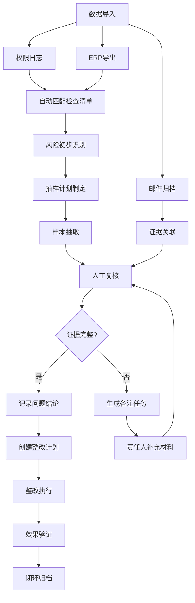

## 1. 产品概述
合规审计风险监测看板是面向企业内审、合规部门的专业审计工具，通过可视化方式复盘合规审计的制度检查问题，实现从风险发现到整改闭环的全流程追踪。
- 解决传统审计依赖静态报表、难以逐层钻取、证据链断裂的痛点
- 目标用户为内审专员、合规经理、审计负责人

## 2. 核心功能

### 2.1 用户角色
| 角色 | 注册方式 | 核心权限 |
|------|----------|----------|
| 审计专员 | 企业SSO登录 | 数据导入、查看看板、创建抽样、记录发现 |
| 合规经理 | 企业SSO登录 | 审批整改计划、查看整体风险、导出报告 |
| 系统管理员 | 本地账号 | 用户管理、系统配置、数据备份 |

### 2.2 功能模块
1. **主看板页**：风险监测热力图、核心指标卡片、趋势分析
2. **检查清单页**：制度条目分层展开、问题标记、完成度追踪
3. **抽样分析页**：抽样记录管理、覆盖度计算、样本详情
4. **整改追踪页**：整改计划管理、任务分配、进度可视化
5. **供应商分析页**：材料排行榜、绝对值/占比切换、风险分布
6. **明细追溯页**：权限日志/ERP数据钻取、邮件原始记录关联

### 2.3 页面详情
| 页面名称 | 模块名称 | 功能描述 |
|----------|----------|----------|
| 主看板 | 风险监测图 | 按部门/制度类型展示风险热力分布，支持时间范围筛选 |
| 主看板 | 指标卡片区 | 问题总数、待整改数、逾期数、抽样覆盖率、证据缺失数 |
| 主看板 | 趋势折线图 | 近6个月问题发现趋势，按严重程度分层 |
| 检查清单 | 层级树 | 制度分类→检查项→子项的可展开树形结构 |
| 检查清单 | 状态标记 | 每项标记为：符合/不符合/待验证/不适用 |
| 抽样分析 | 覆盖度仪表 | 各业务模块抽样覆盖率，目标值对比 |
| 抽样分析 | 样本详情表 | 抽样样本列表，关联原始凭证 |
| 整改追踪 | 甘特图 | 整改计划时间线，责任人、截止日期、完成状态 |
| 整改追踪 | 证据缺失告警 | 自动识别证据缺失项，生成备注任务 |
| 供应商分析 | 排行切换 | 支持按绝对值/占比两种模式展示供应商材料数量 |
| 供应商分析 | 风险分布 | 各供应商问题类型分布雷达图 |
| 明细追溯 | 数据钻取 | 从汇总数据逐层钻取至权限日志、ERP凭证 |
| 明细追溯 | 邮件关联 | 自动匹配并展示相关邮件原始记录作为审计证据 |

## 3. 核心流程
审计专员导入权限日志和ERP导出数据，系统自动匹配检查清单进行初筛。审计专员根据系统提示进行抽样，记录发现问题。对证据缺失项自动生成备注任务，推送责任人补充。整改计划关联问题项，完成后闭环验证。整个过程可从任一汇总图表钻取至最底层的邮件原始记录。

## 4. 用户界面设计

### 4.1 设计风格
- **主色调**：深蓝 #1e3a5f 作为专业基调，搭配深青 #2d6a4f 表示合规，橙红 #d62828 表示风险
- **辅助色**：琥珀 #f77f00 用于警告，灰蓝 #6c757d 用于中性信息
- **按钮风格**：微圆角 (border-radius: 4px)，边框细描边，悬停时有微妙阴影
- **字体**：标题使用思源宋体，正文使用思源黑体，数字使用等宽字体 JetBrains Mono
- **布局风格**：卡片式栅格布局，左侧导航栏固定，顶部为筛选和面包屑
- **图标风格**：线性图标，统一24px网格，避免过于卡通化

### 4.2 页面设计概述
| 页面名称 | 模块名称 | UI元素 |
|----------|----------|--------|
| 主看板 | 风险监测图 | Plotly热力图，支持悬停显示详情，点击下钻 |
| 主看板 | 指标卡片 | 大号数字+趋势箭头，背景色根据状态变化 |
| 主看板 | 趋势图 | 多系列折线图，支持图例点击筛选 |
| 检查清单 | 层级树 | 带复选框和状态标签的可展开树，缩进表示层级 |
| 抽样分析 | 覆盖度仪表 | 半圆仪表盘，指针指向当前覆盖率，刻度显示目标值 |
| 整改追踪 | 甘特图 | 横向条形图，颜色表示状态，悬停显示详情 |
| 供应商分析 | 排行切换 | 顶部切换按钮组，柱状图动画过渡 |
| 明细追溯 | 邮件卡片 | 仿邮件客户端布局，发件人/主题/时间/正文预览 |

### 4.3 响应式
桌面端优先设计，最小支持1280px宽度。平板端折叠左侧导航为图标模式，移动端转为垂直滚动布局，图表自动缩放。

### 4.4 交互动效
- 页面加载时卡片依次淡入 (staggered fade-in)
- 切换筛选条件时图表平滑过渡 (transition: all 0.4s ease)
- 风险告警项有轻微脉冲动画吸引注意
- 层级展开/折叠有滑入滑出动效
- 鼠标悬停卡片时提升z-index并添加阴影
