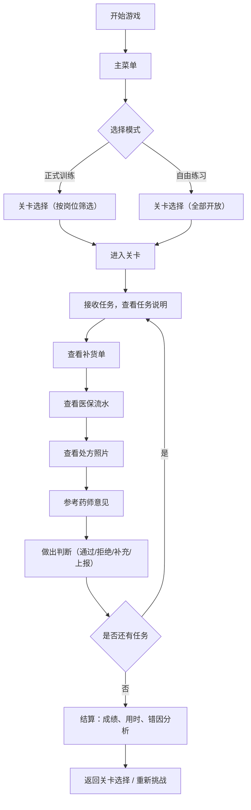

## 1. 产品概述

药店连锁处方审核经营模拟游戏，用于培训药店新员工掌握处方审核的专业技能。通过模拟真实的药店工作场景，让玩家在游戏中学习如何根据补货单、医保流水、处方照片做出正确的业务判断。

- **核心目标**：通过游戏化培训，降低新人培训成本，提高处方审核准确率
- **目标用户**：药店连锁新入职药师、营业员、审方员
- **产品价值**：沉浸式模拟真实工作场景，可量化培训效果，支持岗位差异化培训

---

## 2. 核心功能

### 2.1 用户角色与岗位

| 角色 | 说明 | 核心权限 |
|------|------|----------|
| 审方药师 | 负责处方审核的专业人员 | 可选择高难度关卡，处理处方不清等复杂情况 |
| 营业员 | 门店前台销售人员 | 侧重基础处方识别和常规业务处理 |
| 补货专员 | 负责药品库存管理 | 侧重补货单审核和库存判断 |

### 2.2 功能模块

1. **主菜单页**：模式选择入口（正式训练 / 自由练习），玩家信息展示
2. **模式选择页**：正式训练（计时评分）、自由练习（无压力练习）
3. **关卡选择页**：按岗位筛选关卡，难度分级展示，关卡详情预览
4. **游戏场景页**：Tiled地图展示药店场景，任务接收，处方审核操作
5. **结算页**：成绩展示、用时统计、错因分析、学习建议

### 2.3 页面详情

| 页面名称 | 模块名称 | 功能描述 |
|---------|---------|---------|
| 主菜单页 | 顶部信息栏 | 玩家姓名、岗位、累计训练时长、正确率 |
| 主菜单页 | 模式选择区 | 正式训练入口、自由练习入口，两个入口独立分离 |
| 关卡选择页 | 岗位筛选栏 | 按审方药师/营业员/补货专员筛选对应关卡 |
| 关卡选择页 | 难度标签 | 初级/中级/高级/挑战级（处方不清等高难场景） |
| 关卡选择页 | 关卡卡片 | 关卡名称、简介、预计时长、通过率、解锁状态 |
| 游戏场景页 | 任务面板 | 显示当前任务目标、时间限制、已完成进度 |
| 游戏场景页 | 信息查看区 | 补货单查看、医保流水查看、处方照片放大查看 |
| 游戏场景页 | 操作区 | 通过/拒绝/需补充材料/上报等操作按钮 |
| 游戏场景页 | 药师意见 | 可配置的药师参考意见，支持动态参数 |
| 结算页 | 成绩概览 | 得分、评级、用时、正确率 |
| 结算页 | 错题分析 | 逐题展示错误原因、正确答案、知识点讲解 |
| 结算页 | 统计数据 | 分类正确率统计、薄弱项分析 |

---

## 3. 核心流程



---

## 4. 用户界面设计

### 4.1 设计风格

- **主色调**：医疗蓝（#1E88E5）作为主色，代表专业和信任；辅助色为暖橙色（#FF9800）用于强调操作按钮；中性色采用深灰和白色确保可读性
- **视觉风格**：现代扁平化设计，结合医疗行业的专业感，卡片式布局，圆角8px，柔和阴影
- **字体**：中文使用"思源黑体"，数字使用"Roboto Mono"等宽字体，确保处方编号等信息清晰可辨
- **图标风格**：线性图标为主，关键操作使用填充图标增强辨识度

### 4.2 页面设计概述

| 页面名称 | 模块名称 | UI元素 |
|---------|---------|--------|
| 主菜单页 | 模式选择区 | 大卡片设计，正式训练使用蓝色渐变，自由练习使用橙色渐变，卡片悬浮动效 |
| 关卡选择页 | 关卡列表 | 网格布局，关卡卡片显示难度标签、星评、锁定状态，已完成关卡显示成绩徽章 |
| 游戏场景页 | 顶部状态栏 | 倒计时、任务进度、暂停按钮，固定在顶部 |
| 游戏场景页 | 信息面板 | 三栏式布局：左侧补货单、中间医保流水、右侧处方照片，支持点击放大 |
| 游戏场景页 | 操作按钮区 | 底部固定操作栏，四个主要操作按钮，通过（绿色）、拒绝（红色）、补充（橙色）、上报（蓝色） |
| 结算页 | 成绩展示 | 大号数字展示得分，环形进度条展示正确率，时间轴展示用时分布 |
| 结算页 | 错题列表 | 可折叠的错题卡片，展开显示详细错因和知识点 |

### 4.3 响应式设计

- 桌面端优先设计，支持1280px以上分辨率
- 游戏场景采用Tiled地图，自适应窗口大小，保持16:9比例
- 信息面板支持拖拽调整大小，双击重置
- 操作按钮在窗口过小时自动调整为垂直布局

### 4.4 Tiled场景设计

- **环境**：现代化药店内部场景，包含前台、处方审核区、药品货架、补货区
- **交互点**：玩家点击场景中的不同区域触发对应功能（前台=查看医保流水，审方区=查看处方，货架区=查看补货单）
- **视觉层次**：使用不同的图层区分地面、家具、角色、UI提示
- **动画**：角色移动动画，任务提示气泡动画，操作反馈动画

---

## 5. 关卡配置设计（核心）

### 5.1 关卡数据结构（非硬编码设计）

关卡数据完全从配置文件加载，核心逻辑不依赖具体题目内容：

```typescript
interface LevelConfig {
    id: string;
    name: string;
    description: string;
   岗位: PharmacistRole[];  // 适用岗位，用于筛选
    difficulty: 'beginner' | 'intermediate' | 'advanced' | 'challenge';
    timeLimit: number;       // 时间限制（秒）
    passingScore: number;    // 及格分数
    tasks: TaskConfig[];     // 任务列表
    pharmacistAdvice: AdviceConfig[];  // 药师意见模板
}

interface TaskConfig {
    id: string;
    description: string;
    prescription: PrescriptionData;   // 处方数据
    replenishmentOrder: ReplenishmentData;  // 补货单数据
    insuranceRecord: InsuranceData;   // 医保流水
    correctAction: TaskAction;        // 正确操作
    wrongActions: WrongActionConfig[]; // 错误操作及原因
    score: number;                    // 本题分值
}

interface AdviceConfig {
    id: string;
    condition: string;   // 触发条件（表达式）
    content: string;     // 意见内容，支持模板变量
    type: 'hint' | 'warning' | 'info';
}
```

### 5.2 处方不清挑战模式

- 处方照片添加模糊、倾斜、部分遮挡效果
- 关键信息（药品名称、剂量、签名）随机模糊
- 玩家需要根据上下文信息推断或选择"需补充材料"
- 高难度关卡可配置多重模糊效果叠加
