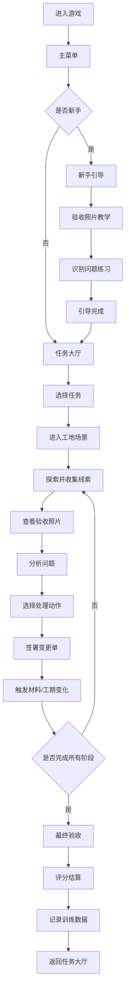

## 1. 产品概述

家装工地设计变更经营模拟游戏，玩家扮演家装工程项目经理，通过接取装修任务、分析现场线索、选择处理动作、完成验收来推进游戏。游戏核心是训练玩家识别工地问题、做出正确决策、控制工期和成本的能力。

- **目标用户**：家装行业从业者、工程项目管理者、经营模拟游戏爱好者
- **核心价值**：通过游戏化方式学习家装工地管理，理解设计变更对工期和成本的影响
- **市场定位**：兼具教育意义和娱乐性的专业模拟游戏

## 2. 核心功能

### 2.1 用户角色

| 角色 | 注册方式 | 核心权限 |
|------|---------|---------|
| 玩家 | 本地存档 / 昵称登录 | 游戏游玩、训练记录查看、排行榜浏览 |

### 2.2 功能模块

1. **主菜单**：开始游戏、继续游戏、教程、排行榜、设置
2. **任务大厅**：可接任务列表、任务详情、难度选择
3. **工地场景**：2D 俯视工地视图、线索探索、Matter.js 物理交互
4. **线索分析**：验收照片查看、问题识别、线索收集
5. **动作选择**：处理方案选择、成本/工期权衡、变更单签署
6. **验收流程**：阶段验收、最终验收、评分结算
7. **训练记录**：历史对局、得分详情、错因分析、工期偏差复盘
8. **新手引导**：验收照片引导式教学、渐进式解锁

### 2.3 页面详情

| 页面名称 | 模块名称 | 功能描述 |
|---------|---------|----------|
| 主菜单 | 标题区域 | 游戏 Logo、动态背景、开始按钮 |
| 主菜单 | 功能导航 | 继续游戏、新手教程、排行榜、设置 |
| 任务大厅 | 任务列表 | 卡片式任务展示、难度标识、奖励预览 |
| 任务大厅 | 任务详情 | 任务背景、客户需求、工期要求、预算 |
| 工地场景 | 2D 视图 | 俯视工地布局、可交互物体、工人动画 |
| 工地场景 | 线索系统 | 高亮异常区域、点击查看线索、验收照片 |
| 线索分析 | 照片面板 | 验收照片放大查看、问题标注、对比标准 |
| 线索分析 | 线索面板 | 已收集线索列表、关联关系提示 |
| 动作选择 | 方案列表 | 多种处理方案、成本/工期/风险对比 |
| 动作选择 | 变更单 | 变更内容预览、签署确认、后果提示 |
| 验收流程 | 阶段验收 | 分项工程验收、质量评分、问题整改 |
| 验收流程 | 最终结算 | 总评分、利润计算、工期偏差分析 |
| 训练记录 | 历史记录 | 对局列表、得分排序、筛选功能 |
| 训练记录 | 复盘详情 | 错因统计、材料延期记录、决策树回放 |
| 排行榜 | 排名列表 | 得分排行、关卡排行、完美通关榜 |
| 新手引导 | 照片教学 | 验收照片对比、问题识别引导、操作提示 |

## 3. 核心流程

**核心玩法说明**：
1. 玩家从任务大厅选择装修任务，每个任务有不同的户型、预算、工期和客户需求
2. 进入工地后，通过点击探索发现线索，系统会高亮异常区域
3. 验收照片是核心线索载体，玩家需要对比标准照片发现问题
4. 针对发现的问题，玩家可选择不同处理方案，每个方案影响成本、工期和质量
5. 重大变更需要签署变更单，确认后生效并触发相应后果
6. 材料延期是随机事件，会影响工期，玩家需要提前应对
7. 完成所有施工阶段后进行最终验收，根据质量、工期、成本综合评分
8. 每次训练记录得分、错因、材料延期事件，方便复盘学习

## 4. 用户界面设计

### 4.1 设计风格

**整体风格**：工业风 + 扁平化设计，强调专业性和可读性

- **主色调**：
  - 深蓝色 (#1e3a5f) - 专业、可靠
  - 橙色 (#ff6b35) - 警示、行动
  - 绿色 (#2ecc71) - 合格、通过
  - 红色 (#e74c3c) - 问题、错误

- **辅助色**：
  - 浅灰 (#f5f6fa) - 背景
  - 深灰 (#2d3436) - 文字
  - 金色 (#f1c40f) - 奖励、高分

- **按钮风格**：
  - 主按钮：圆角矩形、渐变填充、悬停上浮效果
  - 次按钮：描边样式、点击凹陷效果
  - 危险按钮：红色背景、白色文字

- **字体**：
  - 标题：思源黑体 Bold，24-32px
  - 正文：思源黑体 Regular，14-16px
  - 数字：等宽字体，强调数据可读性

- **布局风格**：
  - 卡片式布局，清晰的视觉层级
  - 工地场景采用 2D 俯视视角
  - 侧边面板展示线索、动作、变更单

- **图标风格**：
  - 线性图标，统一 2px 线条
  - 工地相关图标：安全帽、图纸、卷尺、锤子、砖块
  - 使用 emoji 增强情感表达：⚠️ 警告、✅ 合格、📝 变更单

### 4.2 页面设计概览

| 页面名称 | 模块名称 | UI 元素 |
|---------|---------|---------|
| 主菜单 | 标题区域 | 大字号游戏标题、渐变文字、动态工地背景、按钮缩放动画 |
| 任务大厅 | 任务卡片 | 悬停上浮、难度星级显示、进度条、奖励图标 |
| 工地场景 | 2D 视图 | 网格背景、房间分区、可交互物体高亮、物理效果 |
| 工地场景 | 线索提示 | 脉冲动画标记、点击放大、验收照片弹出 |
| 线索分析 | 照片对比 | 左右分屏对比、问题区域框选、标注工具 |
| 动作选择 | 方案卡片 | 三列对比布局、参数雷达图、选择动画 |
| 验收流程 | 评分面板 | 进度环、分数跳动动画、星级评价 |
| 训练记录 | 复盘图表 | 柱状图对比工期偏差、折线图显示得分趋势 |
| 新手引导 | 教学面板 | 半透明遮罩、箭头指示、分步高亮 |

### 4.3 响应式

- **桌面优先**：主分辨率 1280x720，支持 1920x1080 全屏
- **平板适配**：保持核心布局，调整面板尺寸
- **触控优化**：按钮最小尺寸 44x44px，滑动手势支持

### 4.4 游戏场景视觉指导

**工地场景环境**：
- 环境光：明亮的日间光照，清晰的阴影
- 地板：浅灰色水泥纹理，带轻微磨损
- 墙壁：白色腻子墙面，可显示施工标记
- 装饰元素：脚手架、建材堆放区、施工工具

**灯光设置**：
- 主光源：顶光，模拟日光
- 辅助光：区域补光，确保线索区域清晰可见
- 高亮光：问题区域使用橙色脉冲光吸引注意

**摄像机**：
- 固定俯视视角，可平移查看整个工地
- 缩放支持：1x - 2x，方便查看细节
- 平滑过渡动画

**交互与动画**：
- 物体悬停：轻微放大 + 描边高亮
- 线索发现：粒子特效 + 音效
- 材料堆放：Matter.js 物理效果，可拖拽堆叠
- 验收照片：快门动画 + 闪光灯效果

**后期处理**：
- 轻微 vignette 边缘暗角
- 验收照片模式：高对比度、略微泛黄的胶片质感

**性能预算**：
- 单个场景物体数量 < 100
- 物理模拟物体 < 20
- 目标帧率：60fps
