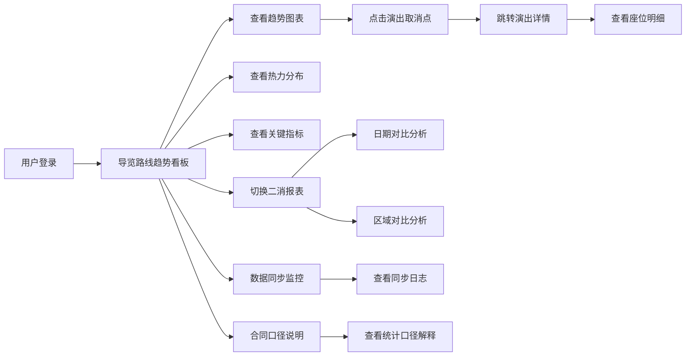

## 1. 产品概述

景区运营导览路线趋势看板是一款面向景区运营管理人员的数据可视化分析平台，用于实时监控和分析景区内导览路线的客流变化趋势，辅助运营决策。

- 核心目标：通过多维度数据融合，直观呈现景区导览路线的运营态势，支撑精细化运营决策
- 目标用户：景区运营总监、数据分析人员、景区管理团队
- 产品价值：打通商户流水、小程序订单、摄像头统计等多源数据，形成统一的导览路线运营视图

## 2. 核心功能

### 2.1 用户角色

| 角色 | 登录方式 | 核心权限 |
|------|----------|----------|
| 运营管理员 | 账号密码登录 | 查看全部看板、导出报表、查看合同口径 |
| 数据分析员 | 账号密码登录 | 查看看板、钻取明细、对比分析 |
| 普通访客 | 无需登录 | 查看公开看板概览 |

### 2.2 功能模块

1. **导览路线趋势看板**：核心主页面，展示路线客流趋势、热力分布、关键指标
2. **二消转化报表**：按日期、区域维度比较二次消费转化情况
3. **演出管理**：演出场次、座位明细、取消事件关联分析
4. **数据同步监控**：商户流水、小程序订单、摄像头统计的同步链路监控
5. **合同口径说明**：商户合同条款解释，统一数据口径

### 2.3 页面详情

| 页面名称 | 模块名称 | 功能描述 |
|----------|----------|----------|
| 导览路线趋势看板 | 趋势折线图 | 展示各导览路线的客流趋势，支持演出取消事件标记和跳转 |
| 导览路线趋势看板 | 热力点位分布 | 景区热力图，支持同环比对比 |
| 导览路线趋势看板 | 关键指标卡片 | 客流总量、二消转化率、热门路线Top5 |
| 导览路线趋势看板 | 区域对比面板 | 按景区区域分组对比客流数据 |
| 二消转化报表 | 转化漏斗图 | 展示浏览-下单-支付的转化漏斗 |
| 二消转化报表 | 日期对比图表 | 支持日/周/月维度的同环比对比 |
| 二消转化报表 | 区域对比表格 | 各区域二消金额、转化率、客单价对比 |
| 演出座位明细 | 座位热力图 | 演出座位销售热力分布 |
| 演出座位明细 | 取消事件列表 | 演出取消记录，支持跳转到对应样本数据 |
| 数据同步监控 | 同步链路图 | 三大数据源同步状态实时展示 |
| 数据同步监控 | 同步日志列表 | 每次同步的详细日志、成功/失败记录 |
| 合同口径说明 | 合同列表 | 商户合同清单及关键条款 |
| 合同口径说明 | 口径解释 | 数据统计口径说明，关联对应合同条款 |

## 3. 核心流程

### 3.1 主流程描述

用户进入看板首页，查看导览路线整体趋势；通过筛选条件切换日期、区域维度；点击图表上的演出取消标记，钻取到对应演出样本详情；在二消报表页对比不同日期/区域的转化数据；通过合同口径页了解数据统计规则。

### 3.2 核心流程图

## 4. 用户界面设计

### 4.1 设计风格

- **主色调**：深青色（#0E7490）作为主色，代表专业与信任；辅助色为暖橙色（#F97316），用于强调关键数据点
- **背景风格**：深色主题（#0F172A），搭配渐变玻璃拟态卡片，营造数据大屏的科技感
- **字体**：标题使用 JetBrains Mono 等宽字体增强数据感，正文使用 Inter 保证可读性
- **布局**：栅格化布局，左侧导航 + 右侧内容区，卡片式模块划分
- **图表风格**：使用渐变色面积图、霓虹描边效果，hover 时有发光动效

### 4.2 页面设计概览

| 页面名称 | 模块名称 | UI 元素 |
|----------|----------|---------|
| 导览路线趋势看板 | 顶部指标栏 | 6个KPI卡片，渐变背景，数字跳动动画 |
| 导览路线趋势看板 | 趋势图区域 | 大面积折线面积图，X轴日期，Y轴客流，支持多路线对比 |
| 导览路线趋势看板 | 热力图区域 | 景区地图轮廓，热力点位动画，同环比切换Tab |
| 导览路线趋势看板 | 侧边筛选栏 | 日期范围选择器、区域多选、路线选择 |
| 二消转化报表 | 漏斗图 | 垂直漏斗，每层标注转化百分比 |
| 二消转化报表 | 对比图表 | 双柱状图 + 折线组合图，同比环比切换 |
| 演出座位明细 | 座位图 | 剧院座位布局，按销售状态着色 |
| 数据同步监控 | 链路图 | 三列数据源 → 处理 → 存储的流向动画 |
| 合同口径说明 | 列表卡片 | 合同卡片悬浮展开，高亮口径相关条款 |

### 4.3 响应式设计

- 采用桌面端优先设计，最低支持 1440px 宽度
- 平板端折叠侧边栏为可展开抽屉
- 移动端单列堆叠，图表支持横向滑动

### 4.4 交互动效

- 页面加载时卡片依次淡入上移
- 数字变化时有平滑过渡动画
- 图表数据点 hover 时放大并显示 tooltip
- 演出取消标记点有呼吸灯动效提示
- 侧边筛选面板收起/展开有平滑过渡
