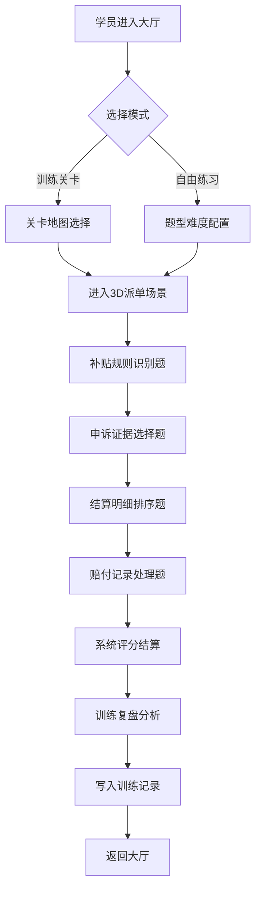

## 1. 产品概述
本产品是一款面向城市经理与本地跑腿运营岗位的3D交互式训练解谜游戏，通过模拟真实派单场景训练路线补贴判断能力。
- 解决问题：传统培训形式枯燥，难以模拟真实派单的复杂补贴规则与异常情况处理
- 目标用户：城市经理、跑腿运营、基层站长等需要掌握补贴策略的岗位人员
- 产品价值：通过游戏化沉浸训练提升补贴决策准确率，降低实际运营中的不合理支出与纠纷

## 2. 核心功能

### 2.1 用户角色
| 角色 | 说明 | 核心权限 |
|------|------|----------|
| 训练学员 | 岗位训练人员 | 进入关卡训练、自由练习、查看个人训练记录 |
| 城市经理 | 管理员角色 | 配置题目素材、管理奖励开放时间、挑选训练关卡、查看全员训练数据 |

### 2.2 功能模块
1. **首页/大厅**: 游戏模式选择、关卡导航、最近训练记录、快捷入口
2. **3D游戏主场景**: Three.js城市地图、派单节点、路线可视化、骑手移动模拟
3. **补贴规则识别玩法**: 根据订单场景选择适用补贴规则
4. **申诉证据选择玩法**: 从证据池中选择有效申诉材料
5. **结算明细排序玩法**: 按时间/金额逻辑排序结算项目
6. **赔付记录处理玩法**: 物品损坏原因分析与赔付决策
7. **训练复盘页面**: 派单时长统计、决策正确率、失分点分析
8. **配置管理页面**: 题目库、素材库、奖励配置、开放时间、训练模式设置

### 2.3 页面详情
| 页面名称 | 模块名称 | 功能描述 |
|-----------|-------------|---------------------|
| 首页/大厅 | 模式选择卡 | 训练关卡模式与自由练习模式切换，含进度条与解锁状态 |
| 首页/大厅 | 关卡地图 | 可视化关卡树，显示难度、完成度、星级评分 |
| 首页/大厅 | 训练记录概览 | 最近5次训练成绩、正确率趋势、累计积分 |
| 3D游戏场景 | 城市地图 | Three.js构建的俯视视角3D城市，含道路、建筑、订单节点 |
| 3D游戏场景 | 路线叠加层 | Rapier物理模拟骑手行驶轨迹，高亮补贴路段 |
| 3D游戏场景 | HUD操作面板 | 倒计时、当前题目、得分、提示按钮 |
| 规则识别 | 规则卡片 | 可拖拽补贴规则卡片，拖入对应订单场景槽位 |
| 证据选择 | 证据池网格 | 图片/文本证据卡片，多选后提交 |
| 明细排序 | 排序列表 | 可上下拖动的结算明细条目，确认顺序 |
| 赔付处理 | 损坏分析器 | 3D物品模型+损坏原因选项，匹配赔付金额 |
| 训练复盘 | 数据看板 | 派单时长分布、各题型正确率、时间轴回放 |
| 训练复盘 | 决策对比 | 学员选择vs标准答案，标注错误原因 |
| 配置管理 | 题目编辑器 | 增删改查题目，配置题型、难度、分值 |
| 配置管理 | 素材库 | 上传/管理3D模型、图片、音频资源 |
| 配置管理 | 奖励中心 | 积分规则、徽章体系、排行榜配置 |
| 配置管理 | 训练调度 | 开放时段、指定关卡组、参训人员范围 |

## 3. 核心流程

### 3.1 训练关卡流程
学员进入首页 → 选择"训练关卡"模式 → 从关卡树中选择解锁关卡 → 进入3D场景 → 依次通过4种玩法（规则识别→证据选择→明细排序→赔付处理） → 系统即时评分 → 生成训练记录 → 进入复盘页面 → 返回大厅或进入下一关

### 3.2 自由练习流程
学员选择"自由练习" → 可自由选择题型/难度组合 → 不限时做题 → 实时给出反馈提示 → 完成后查看练习结果（不计入正式记录）

### 3.3 管理员配置流程
城市经理进入配置页 → 选择配置模块（题目/素材/奖励/开放时间） → 编辑保存 → 预览生效 → 学员端实时更新

## 4. 用户界面设计

### 4.1 设计风格
- **主色调**: 深邃靛蓝 `#1e3a8a` 作为主色（专业可靠），活力橙 `#f97316` 作为强调色（行动提示）
- **辅助色**: 成功绿 `#10b981`，警示红 `#ef4444`，信息青 `#06b6d4`
- **背景**: 深色主题 `#0f172a`，配合细微网格纹理和渐变光晕
- **按钮风格**: 微立体圆角矩形，悬停时上浮+发光效果，关键按钮带脉冲动画
- **字体**: 标题使用"思源黑体 Heavy"，正文使用"思源黑体 Regular"，数字使用等宽字体"JetBrains Mono"
- **布局**: 卡片式模块化布局，3D场景占主区域，侧边面板展示题目与操作
- **图标风格**: Lucide线性图标，关键功能处使用彩色emoji增加亲和力

### 4.2 页面设计概述
| 页面名称 | 模块名称 | UI元素 |
|-----------|-------------|-------------|
| 首页/大厅 | 模式切换 | 大卡片倾斜悬浮，发光边框，hover时3D倾斜 |
| 首页/大厅 | 关卡地图 | SVG节点连接线，完成关卡绿色光晕，进度条流光动画 |
| 3D游戏场景 | HUD | 玻璃拟态半透明面板，顶部状态栏，底部操作栏，角落倒计时 |
| 3D游戏场景 | 城市地图 | 低多边形建筑配发光窗户，道路用Emissive材质，订单点脉冲标记 |
| 玩法交互 | 拖拽卡片 | 卡片升起阴影，目标槽位高亮边框，放置成功绿色对勾动画 |
| 训练复盘 | 数据看板 | ECharts环形图+折线图，数值带滚动动画，错误点红圈标注 |
| 配置管理 | 编辑器 | 左右分栏：左侧表单编辑，右侧实时预览卡片 |

### 4.3 响应式
- **桌面优先**: 主要适配1440×900及以上分辨率（运营岗办公环境）
- **平板适配**: 1024px断点下侧边栏折叠为抽屉，3D场景保持全屏
- **触摸优化**: 拖拽区域增大40%，按钮最小尺寸48px，支持双指缩放3D场景

### 4.4 3D场景指引
- **环境**: 使用程序化生成的深色天空盒，配合DirectionalLight模拟傍晚暖光，增加氛围雾效
- **HDRI与后期处理**: 使用`@react-three/postprocessing`添加Bloom发光、SSAO环境光遮蔽、FXAA抗锯齿
- **灯光设置**: 主光(暖黄)+补光(冷蓝)对比，建筑窗户使用自发光材质形成点光源阵列
- **相机设置**: 初始45°俯视透视相机，支持鼠标拖拽平移、滚轮缩放，点击节点时相机平滑飞行
- **构图**: 玩家视角聚焦地图中央派单区，城市边界用渐隐雾气过渡，形成视觉中心
- **交互与动画**: 骑手胶囊体沿路径移动(Rapier刚体)，路线贝塞尔曲线发光轨迹，订单生成时粒子爆炸特效
- **性能预算**: 总面数控制在10万以内，使用InstancedMesh渲染重复建筑，DRACO压缩模型资源
