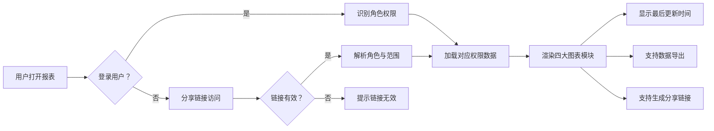

## 1. 产品概述

汽车维修工位排班漏斗报表系统，用于拆解汽车维修全流程的工位排班数据，通过多维度可视化图表呈现业务运营状况。系统接入维修工单、保险材料和配件系统数据，支持按角色权限分享报表，帮助管理层和一线人员快速了解维修效率、质量状况和资源利用率。

- **核心目标**：通过数据可视化驱动维修工位排班优化，提升运营效率
- **目标用户**：厂长、服务顾问、维修技师、配件管理员
- **核心价值**：多角色数据透视、全流程追溯、返修率量化分析

## 2. 核心功能

### 2.1 用户角色与权限

| 角色 | 访问方式 | 核心权限 |
|------|----------|----------|
| 厂长 | 系统登录 / 分享链接 | 查看全部数据、导出完整报表、管理分享链接 |
| 服务顾问 | 分享链接 | 查看报价单趋势、车辆档案明细、诊断结果 |
| 维修技师 | 分享链接 | 查看工位排班、质检照片、诊断结果异常标注 |
| 配件管理员 | 分享链接 | 查看配件使用明细、车辆档案配件追溯 |
| 外部人员 | 公开分享链接 | 仅查看脱敏汇总数据，无敏感明细访问权限 |

### 2.2 功能模块

1. **报表总览页**：核心指标卡片、四大图表模块、数据更新时间
2. **报价单趋势图**：按时间维度展示报价金额、工单数量趋势
3. **质检照片构成**：质检通过/失败比例、问题类型分布
4. **车辆档案明细**：车辆维修历史、配件追溯、保险材料关联
5. **诊断结果异常标注**：异常诊断项高亮、趋势分析、返修率关联
6. **分享链接管理**：按角色生成分享链接、设置有效期、权限控制
7. **数据导出**：导出 Excel/PDF、自动附带返修率口径说明

### 2.3 页面详情

| 页面名称 | 模块名称 | 功能描述 |
|----------|----------|----------|
| 报表总览页 | 顶部导航栏 | 标题、角色标识、分享按钮、导出按钮、最后更新时间 |
| 报表总览页 | 核心指标卡片 | 工单总量、平均维修时长、返修率、工位利用率 |
| 报表总览页 | 报价单趋势图表 | 折线图/柱状图组合、支持日/周/月切换 |
| 报表总览页 | 质检照片构成图 | 饼图展示质检通过率、柱状图展示问题类型分布 |
| 报表总览页 | 车辆档案明细 | 可筛选表格、支持配件明细追溯 |
| 报表总览页 | 诊断结果异常标注 | 异常项红色高亮、异常趋势折线图 |
| 分享链接弹窗 | 角色选择 | 选择目标角色、设置有效期 |
| 分享链接弹窗 | 链接生成 | 生成带签名的分享链接、一键复制 |

## 3. 核心流程

## 4. 用户界面设计

### 4.1 设计风格

- **主色调**：深海蓝 (#0F172A) 作为背景主色，搭配工业橙 (#F97316) 作为强调色
- **辅助色**：翡翠绿 (#10B981) 表示正常/通过，玫红 (#F43F5E) 表示异常/失败，琥珀黄 (#F59E0B) 表示警告
- **字体**：标题使用 Space Grotesk 粗体，正文使用 Inter 常规字重，数字等宽字体使用 JetBrains Mono
- **布局风格**：卡片式布局，深色主题，玻璃拟态效果，数据驱动的视觉层次
- **图标风格**：线性图标，统一 2px 描边，与文字同色
- **设计调性**：工业科技感、专业严谨、数据可视化优先

### 4.2 页面设计概览

| 页面名称 | 模块名称 | UI 元素 |
|----------|----------|---------|
| 报表总览页 | 顶部区域 | 深色渐变背景、标题文字、角色标签、操作按钮组、时间戳 |
| 报表总览页 | KPI 卡片组 | 四列等宽卡片、渐变背景、大号数字、趋势箭头、微图表 |
| 报表总览页 | 图表区 | 两列网格布局、图表卡片带标题栏、悬浮交互、数据提示 |
| 报表总览页 | 表格区 | 斑马纹表格、固定表头、异常行高亮、可展开明细 |
| 分享弹窗 | 模态框 | 半透明遮罩、圆角卡片、角色选择器、有效期设置、链接复制 |

### 4.3 响应式设计

- 桌面端（≥1280px）：四列 KPI 卡片、两列图表布局
- 平板端（768px-1279px）：两列 KPI 卡片、单列图表布局
- 移动端（<768px）：单列 KPI 卡片、单列图表、横向滚动表格

### 4.4 动效设计

- 页面加载：卡片渐入 + 位移动画， staggered 延迟
- 图表加载：数据从 0 到目标值的缓动动画
- 悬浮交互：卡片轻微上浮 + 阴影加深
- 数据更新：数字滚动动画、脉冲提示
- 弹窗：背景模糊渐入 + 弹窗缩放出现
