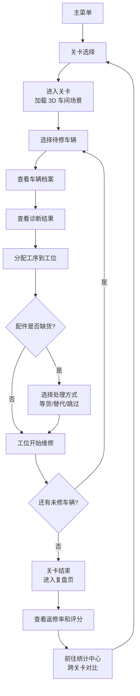

## 1. 产品概述

一款基于 3D 可视化的汽车维修工位排班调度解谜游戏。玩家扮演维修车间调度员，通过观察车辆档案、分析诊断结果、合理分配工单项目到工位，在有限时间内完成维修任务，同时控制返修率。旨在训练玩家的资源调度、时间管理和决策能力。

## 2. 核心功能

### 2.1 用户角色

| 角色 | 注册方式 | 核心权限 |
|------|---------|---------|
| 玩家 | 本地存档，无需注册 | 进行游戏、查看统计、切换关卡 |

### 2.2 功能模块

1. **主菜单页**：游戏标题、开始游戏、关卡选择、统计中心、操作说明
2. **关卡选择页**：关卡列表、解锁状态、关卡星数评分、关卡难度预览
3. **游戏主场景（3D）**：维修车间场景、车辆档案面板、诊断面板、工单位置分配面板、工位状态实时显示
4. **复盘页**：关卡结束后展示维修详情、返修原因、时间分配效率分析
5. **统计中心页**：跨关卡返修率对比、完成率趋势图、训练进度总览

### 2.3 页面详情

| 页面名称 | 模块名称 | 功能描述 |
|----------|----------|-------------|
| 主菜单页 | Hero 标题区 | 动态 3D 汽车旋转展示、游戏标题大字、霓虹工业风背景 |
| 主菜单页 | 导航按钮组 | 开始游戏、关卡选择、统计中心、操作说明四个主操作入口 |
| 关卡选择页 | 关卡卡片列表 | 卡片展示关卡编号、名称、难度、解锁状态、历史最佳星数 |
| 关卡选择页 | 关卡详情弹窗 | 关卡背景故事、目标车辆数、推荐时间、预期返修率目标 |
| 游戏主场景 | 3D 车间场景 | 俯视/平视双视角切换、工位布局、待修车辆队列、维修动画 |
| 游戏主场景 | 车辆档案面板 | 车辆品牌型号、里程数、车主描述、历史维修记录缩略 |
| 游戏主场景 | 诊断结果面板 | 故障列表、严重等级、建议配件、预估工时、关联工序依赖 |
| 游戏主场景 | 工单分配面板 | 可用工位列表、工位技能标签、拖拽/点击分配工序 |
| 游戏主场景 | 配件库存面板 | 当前库存状态、缺货预警、紧急调货按钮 |
| 游戏主场景 | HUD 状态栏 | 剩余时间、已完成工单、当前返修率、实时得分 |
| 游戏主场景 | 配件缺货弹窗 | 触发缺货时显示替代方案选择（等货/替代配件/跳过工序） |
| 复盘页 | 结算信息卡片 | 总分、完成率、返修率、时间利用率 |
| 复盘页 | 维修详情流水 | 每辆车的工序时间轴、返修车辆列表、具体返修原因 |
| 复盘页 | 星数评定 | 根据得分授予 1-3 星、解锁下一关提示 |
| 统计中心 | 返修率对比图 | 各关卡返修率柱状图、平均线参考 |
| 统计中心 | 训练趋势折线图 | 逐次游玩的返修率和完成率趋势 |
| 统计中心 | 成就徽章区 | 完成特定目标解锁的勋章展示 |

## 3. 核心流程

玩家从主菜单选择关卡，进入后依次处理多辆待修车辆：先查看车辆档案了解背景，再查看诊断结果明确故障和所需配件，然后将各工序拖拽或点击分配到合适工位（考虑工位技能匹配和时间冲突），维修过程中若触发配件缺货则临时决策处理方式，所有车辆处理完毕或时间耗尽后进入复盘页查看本次表现，最后可前往统计中心比较各关卡训练差异。

## 4. 用户界面设计

### 4.1 设计风格

- 主色调：深工业蓝 `#0F172A` 背景 + 警示橙 `#F97316` 点缀 + 机械银 `#94A3B8` 文字
- 辅助色：成功绿 `#10B981`、警告黄 `#FBBF24`、危险红 `#EF4444`
- 按钮风格：圆角矩形、轻微金属渐变边框、悬停微抬升阴影
- 字体：展示字体使用具有机械感的等宽展示字体 `JetBrains Mono` + 正文字体 `Noto Sans SC`
- 布局风格：卡片式模块化布局，深色玻璃拟态半透明面板，金属质感边框
- 图标风格：Lucide 线性图标 + 自定义汽车相关 emoji

### 4.2 页面设计总览

| 页面名称 | 模块名称 | UI 元素风格 |
|----------|----------|-------------|
| 主菜单页 | Hero 区 | 中央悬浮 3D 汽车旋转，霓虹光晕背景，打字机效果标题，淡入动画 |
| 主菜单页 | 按钮组 | 大尺寸方形按钮带图标，hover 发光动效，依次延迟入场 |
| 关卡选择页 | 卡片 | 卡片悬浮阴影，解锁态磨砂玻璃，锁定态灰度覆盖，星级角标 |
| 游戏主场景 | 3D 场景 | 顶部时间轴进度条，俯视视角网格地面，工位发光描边 |
| 游戏主场景 | 侧边面板 | 可折叠抽屉面板，标签页切换，平滑滑入动画 |
| 游戏主场景 | HUD | 顶部固定状态栏，数字跳动动画，进度条 |
| 复盘页 | 数据卡片 | 大数字展示，渐变色进度环，里程碑动画 |
| 统计中心 | 图表区 | SVG 自定义柱状图/折线图，悬浮 tooltip，渐变填充 |

### 4.3 响应式设计

- Desktop-first 设计，桌面端横屏布局为主
- 移动端自动适配，侧边面板变为底部抽屉
- 触屏支持完整触控操作（点击、长按、滑动分配工序）
- 键盘快捷键：数字键 1-5 快速选工位、WASD/方向键视角移动、空格暂停、Esc 返回
- 响应式断点：1280px / 1024px / 768px

### 4.4 3D 场景指导

- 环境：夜间车间场景，HDRI 工业仓库照明，金属反光地面
- 灯光：主方向光模拟顶灯 + 工位点光源补光 + 环境光
- 相机：初始 45° 俯视斜角，支持鼠标拖拽旋转/缩放
- 场景构成：网格地面、工位平台、简化汽车模型（低多边形）、工具架装饰
- 交互：工位悬停高亮描边、车辆选中发光、维修进度可视化光圈
- 后期处理：Bloom 发光、轻微景深、颗粒感胶片效果
- 性能预算：单场景三角形数 < 50k，Draw Call < 100
