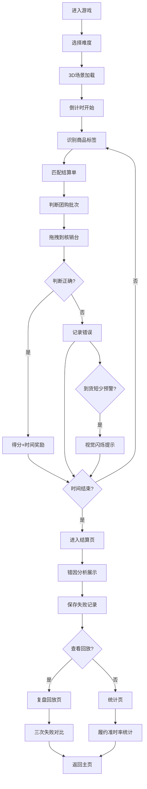

## 1. 产品概述

社区团购自提核销调度解谜游戏，将社区团购的自提核销流程转化为沉浸式3D训练游戏。通过压缩判断时间、处理商品标签、结算单和团购批次，训练玩家快速准确完成核销流程。

- 核心目标：训练社区团购自提核销人员的快速决策能力，降低到货短少等履约失败率
- 目标用户：社区团购自提点工作人员、供应链管理人员
- 产品价值：通过游戏化训练提升履约准时率，减少人工错误

## 2. 核心功能

### 2.1 用户角色
| 角色 | 注册方式 | 核心权限 |
|------|----------|----------|
| 训练者 | 无需注册 | 进行游戏训练、查看统计数据、回放失败记录 |

### 2.2 功能模块
1. **游戏主场景**：3D自提核销环境，包含货架、商品、自提柜、核销台
2. **训练模式**：限时商品标签识别、结算单匹配、团购批次判断
3. **预警系统**：到货短少出现前的视觉提示
4. **复盘回放**：失败记录保留与三次失败对比分析
5. **统计面板**：履约准时率、失败类型分析
6. **结算页**：到货清单错因拆分展示

### 2.3 页面详情
| 页面名称 | 模块名称 | 功能描述 |
|-----------|-------------|---------------------|
| 开始页 | 游戏入口 | 开始游戏、选择难度、查看历史记录入口 |
| 3D游戏场景 | 主玩法区 | 拖拽商品、匹配标签、核销批次、倒计时压力 |
| 预警系统 | 视觉提示 | 到货短少前闪烁警告、异常商品高亮 |
| 统计页 | 数据面板 | 履约准时率趋势、失败类型占比、个人成绩曲线 |
| 结算页 | 错因分析 | 到货清单明细、错误原因分类、改进建议 |
| 复盘回放页 | 记录对比 | 三次失败记录并排对比、时间轴同步播放、选择差异标注 |

## 3. 核心流程

## 4. 用户界面设计

### 4.1 设计风格
- **主色调**：物流蓝 (#165DFF) 作为主色，警告橙 (#FF7D00) 作为预警色，成功绿 (#00B42A) 作为正确反馈色
- **辅助色**：中性灰系列 (#1D2129, #4E5969, #86909C, #C9CDD4)
- **按钮风格**：3D立体按钮，圆角8px，悬停有浮起动画
- **字体**：展示字体使用 "JetBrains Mono"（等宽科技感），正文字体使用 "Noto Sans SC"
- **布局风格**：沉浸式3D场景占满屏幕，HUD信息面板悬浮四角
- **视觉风格**：赛博朋克工业风，霓虹光效，扫描线纹理，全息投影效果

### 4.2 页面设计概述
| 页面名称 | 模块名称 | UI元素 |
|-----------|-------------|-------------|
| 开始页 | 入口区 | 霓虹标题、立体开始按钮、难度选择滑块、背景粒子动画 |
| 3D游戏场景 | 主游戏区 | 3D货架网格、悬浮商品标签、倒计时HUD、核销台光效、拖拽射线 |
| 预警系统 | 提示层 | 全屏红色扫描线、异常物品脉冲发光、警告音效提示 |
| 统计页 | 数据展示 | 数据可视化图表、进度条动画、数字滚动效果 |
| 结算页 | 错因列表 | 卡片式错误项、颜色编码错因标签、展开式详情 |
| 复盘回放页 | 对比视图 | 三屏横向排列、同步时间轴、差异点高亮连线 |

### 4.3 响应式
- Desktop-first 设计，主游戏区固定16:9比例
- HUD面板自适应屏幕尺寸，移动端简化控制
- 触控设备支持手势拖拽商品

### 4.4 3D场景指引
- **环境**：仓库风格室内场景，冷色调照明，霓虹灯带勾勒货架轮廓
- **光照**：主光源为头顶工业灯，辅以LED灯带环境光，商品上方有聚光灯高亮
- **相机**：第三人称俯视45度角，可缩放旋转，平滑跟随焦点
- **构图**：核销台位于画面下方中心，货架呈网格状分布在后方
- **交互**：商品可拖拽，悬停显示全息标签，放下时有物理碰撞效果
- **后处理**：Bloom发光效果，轻微晕影，扫描线叠加，预警时增加色差
- **性能**：使用实例化渲染批量处理货架，Low-poly风格商品模型
