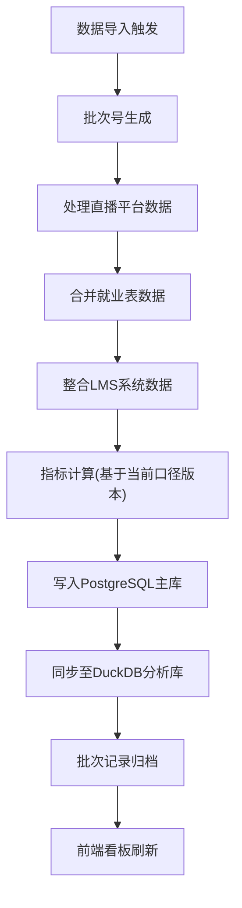
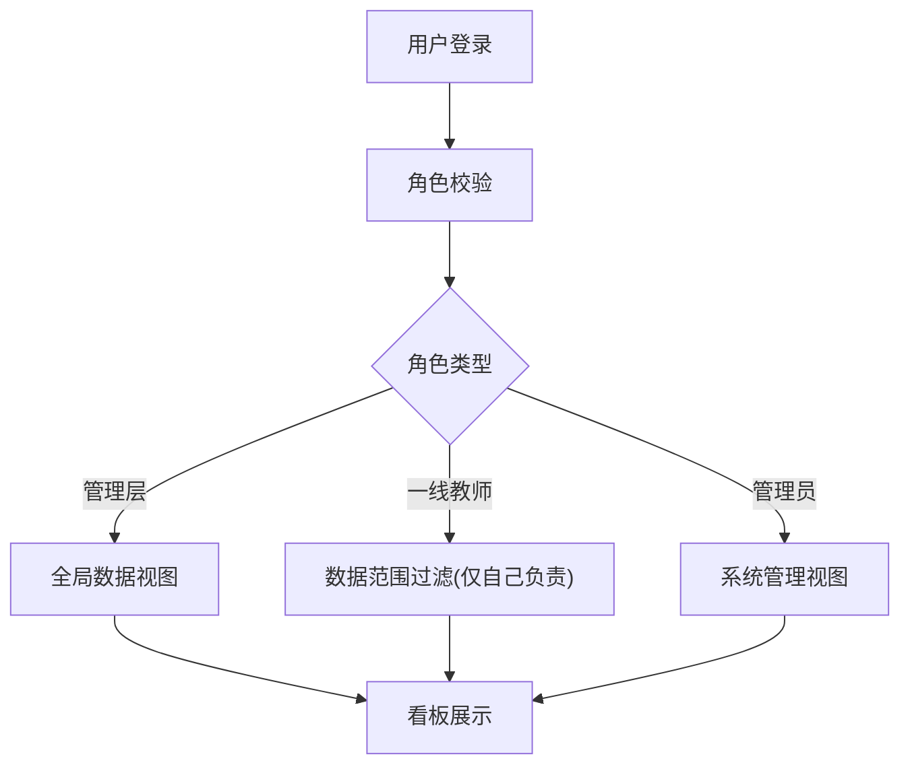

## 1. 产品概述
职业教育题库练习趋势看板，追踪职业教育学员的题库练习数据，为管理层和一线教师提供数据决策支持。通过整合直播平台、就业表和LMS系统数据，实现多维度的学习行为分析和进度追踪。

- **核心价值**：打破数据孤岛，统一学习行为指标口径，提供可追溯的数据分析能力
- **目标用户**：教育机构管理层、一线授课教师、教学运营人员
- **解决问题**：多系统数据分散、指标口径不一致、学习进度追踪困难、完成率统计无法解释变化原因

## 2. 核心功能

### 2.1 用户角色
| 角色 | 注册方式 | 核心权限 |
|------|----------|----------|
| 管理层 | 系统管理员分配 | 查看全局总览数据、所有教师和学员的完成率、口径版本管理、批次记录查询 |
| 一线教师 | 系统管理员分配 | 仅查看所教授班级/学员的完成率、分析自己负责范围的学习数据 |
| 系统管理员 | 系统初始化 | 用户管理、权限配置、数据导入管理、口径版本配置 |

### 2.2 功能模块
1. **数据总览看板**：核心指标卡片、趋势折线图、实时数据更新
2. **分析区**：课程章节分布、作业记录漏斗、题目标签排行、学习进度变化
3. **数据导入管理**：批次记录、导入状态监控、数据来源追踪
4. **完成率口径管理**：版本记录、口径说明、变更历史追溯
5. **个人工作台**：一线教师专属视图，仅显示权限范围内数据

### 2.3 页面详情
| 页面名称 | 模块名称 | 功能描述 |
|----------|----------|----------|
| 数据总览 | 核心指标卡片 | 展示总练习人数、总完成率、平均练习时长、当日活跃用户 |
| 数据总览 | 趋势折线图 | 展示近30天每日完成率变化、练习次数趋势 |
| 数据分析 | 课程章节分布 | 柱状图展示各章节题目数量分布和完成情况 |
| 数据分析 | 作业记录漏斗 | 漏斗图展示从布置→开始→提交→批改→通过的转化率 |
| 数据分析 | 题目标签排行 | 条形图展示高频标签的练习次数和正确率排行 |
| 数据分析 | 学习进度变化 | 面积图展示不同班级/学员群体的学习进度曲线 |
| 数据管理 | 导入批次记录 | 表格展示每次数据导入的批次号、时间、来源、数据量、处理状态 |
| 口径管理 | 版本列表 | 展示完成率计算口径的历史版本、生效时间、计算公式说明 |
| 个人工作台 | 我的完成率 | 教师视角，仅展示所负责学员的完成率数据和分析图表 |

## 3. 核心流程
数据处理采用分层加工模式：首先处理直播平台数据，再合并就业表数据，最后整合LMS系统数据，每轮导入都保留完整的批次记录，支持数据回溯和问题排查。

权限控制流程：

## 4. 用户界面设计

### 4.1 设计风格
- **设计方向**：专业数据可视化风格，采用深色主题，突出数据可读性
- **主色调**：深蓝 `#1e3a5f` 作为背景主色，搭配科技蓝 `#3b82f6` 作为主强调色
- **辅助色**：成功绿 `#10b981`、警告橙 `#f59e0b`、危险红 `#ef4444`
- **字体**：标题使用 `Inter` 字体，数字显示使用 `JetBrains Mono` 等宽字体确保对齐
- **布局风格**：卡片式布局，网格化排列，信息分层明确
- **图标风格**：线性图标，统一2px描边，圆角风格

### 4.2 页面设计概述
| 页面名称 | 模块名称 | UI元素 |
|----------|----------|--------|
| 数据总览 | 核心指标卡片 | 渐变背景卡片、大字号数字、趋势箭头、环比变化百分比、悬停微动效 |
| 数据总览 | 趋势折线图 | ECharts折线图、平滑曲线、渐变填充、双Y轴(完成率+练习次数)、时间范围选择器 |
| 数据分析 | 课程章节分布 | 分组柱状图、数据标签、支持按课程筛选、hover高亮 |
| 数据分析 | 作业记录漏斗 | ECharts漏斗图、渐变颜色、转化率标注、支持多维度对比 |
| 数据分析 | 题目标签排行 | 横向条形图、支持按练习次数/正确率切换排序、标签云效果 |
| 数据分析 | 学习进度变化 | 堆叠面积图、多条趋势线对比、图例交互、时间缩放 |
| 数据管理 | 批次记录 | 数据表格、状态标签、分页、搜索筛选、详情抽屉 |
| 口径管理 | 版本列表 | 时间线布局、版本标记、计算公式高亮、变更说明 |

### 4.3 响应式
- **桌面优先**：1920px为基准设计，支持1280px-2560px自适应
- **大屏适配**：支持数据看板全屏展示模式，优化4K显示效果
- **交互优化**：所有图表支持鼠标悬停查看详情、点击下钻、图例开关

## 5. 非功能需求

### 5.1 数据可追溯性
- 每轮数据导入生成唯一批次号，记录导入时间、数据来源、处理人员
- 完成率计算口径保留版本历史，变更时记录生效时间和变更原因
- 支持按批次回滚数据，确保数据问题可追溯可修复

### 5.2 权限与安全
- 基于角色的数据访问控制，一线教师数据范围严格限制
- 敏感数据脱敏展示，操作日志完整记录
- API接口鉴权，防止越权访问

### 5.3 性能要求
- 看板首屏加载时间 < 3秒
- 图表渲染时间 < 1秒
- 支持10000+学员数据的实时查询和展示
- DuckDB提供高速OLAP查询能力

### 5.4 异常处理
- 数据导入失败时保留错误日志，支持重试
- 进度落后时允许添加注释说明原因
- 看板数据异常时显示友好提示和上次成功时间
