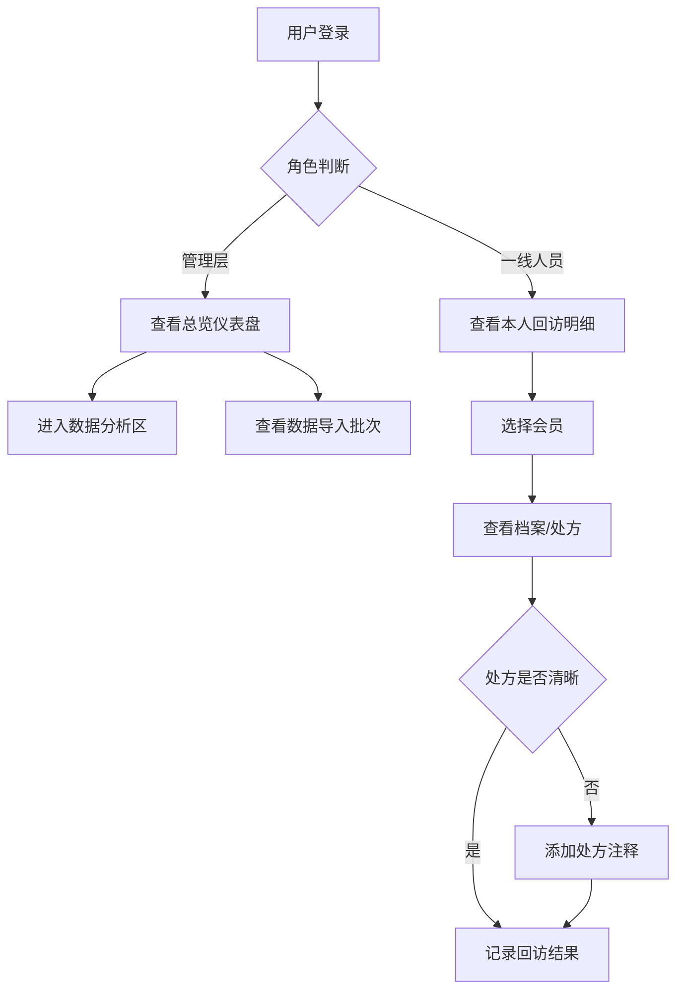

## 1. 产品概述

药店连锁会员慢病风险监测系统，用于追踪药店连锁会员的慢病健康状况，整合收银系统、会员记录、库存数据，为管理层提供总览视图，为一线人员提供回访明细管理。

- 核心目标：实现慢病会员风险可视化监测、数据批次可追溯、处方注释管理、分层权限控制
- 目标用户：药店管理层（决策分析）、一线药师/回访员（执行回访）
- 市场价值：提升慢病管理效率，降低用药风险，优化库存与医保结算

## 2. 核心功能

### 2.1 用户角色

| 角色 | 注册方式 | 核心权限 |
|------|----------|----------|
| 管理层 | 管理员分配 | 查看全门店总览、所有分析图表、所有数据批次 |
| 一线人员（药师/回访员） | 管理员分配 | 仅查看本人负责范围内的会员回访明细、添加处方注释 |
| 系统管理员 | 超级管理员创建 | 用户管理、数据导入批次管理、系统配置 |

### 2.2 功能模块

1. **登录页**：角色登录、权限认证
2. **管理层总览仪表盘**：关键指标卡片、风险概览、快捷入口
3. **回访明细管理**：会员回访列表、状态跟踪、处方注释
4. **数据分析区**：批号效期分布、会员档案漏斗、补货单排行、医保流水变化
5. **数据导入管理**：收银系统导入、会员记录合并、库存表同步、批次回查
6. **用户管理**：角色权限、门店分配

### 2.3 页面详情

| 页面名称 | 模块名称 | 功能描述 |
|-----------|-------------|---------------------|
| 登录页 | 登录表单 | 账号密码登录、角色识别、会话管理 |
| 管理层总览 | 指标卡片 | 慢病会员总数、高风险人数、回访完成率、本月医保流水 |
| 管理层总览 | 风险趋势图 | 近30天慢病风险等级变化趋势 |
| 管理层总览 | 门店排行 | 各门店回访完成率排名 |
| 回访明细 | 会员列表 | 按负责人过滤、风险等级筛选、搜索 |
| 回访明细 | 回访详情 | 会员档案、历史处方、用药记录、添加注释 |
| 数据分析 | 批号效期分布 | 近效期（30/60/90天）药品数量分布柱状图 |
| 数据分析 | 会员档案漏斗 | 注册→建档→慢病标签→回访→复购 转化漏斗图 |
| 数据分析 | 补货单排行 | Top10 高频补货药品排行条形图 |
| 数据分析 | 医保流水变化 | 近6个月医保结算金额折线图 |
| 数据导入 | 批次列表 | 导入历史、批次状态、来源系统、导入时间 |
| 数据导入 | 批次详情 | 导入记录明细、错误日志、数据预览、回查溯源 |

## 3. 核心流程

### 3.1 数据加工流程

1. 导入收银系统原始数据
2. 合并会员记录（按会员ID/手机号去重关联）
3. 关联库存表补充药品批次与效期信息
4. 生成慢病风险指标（基于购药频次、药品分类）
5. 记录导入批次号，支持全链路回查

### 3.2 用户操作流程

## 4. 用户界面设计

### 4.1 设计风格

- **主色调**：深青绿色 #0F766E（专业医药感）
- **辅助色**：琥珀橙 #F59E0B（风险警示）、天蓝色 #0EA5E9（信息提示）
- **中性色**：石板灰系列（slate-50 至 slate-900）
- **按钮风格**：圆角 8px，主色填充，hover 轻微上浮阴影
- **字体**：标题使用 Noto Sans SC Bold，正文使用 Noto Sans SC Regular
- **布局风格**：左侧导航 + 顶部面包屑 + 卡片式内容区
- **图标风格**：Lucide 线性图标，统一 20px 尺寸

### 4.2 页面设计概述

| 页面名称 | 模块名称 | UI 元素 |
|-----------|-------------|-------------|
| 登录页 | 登录表单 | 居中卡片布局、品牌 LOGO、渐变背景、输入框焦点动效 |
| 管理层总览 | 指标卡片 | 四列网格、渐变色块、数值大字展示、趋势小箭头 |
| 管理层总览 | 图表区 | 双列布局（趋势图 + 排行）、Recharts 组件、卡片阴影 |
| 回访明细 | 列表 | 表格布局、风险等级色标标签、行 hover 高亮 |
| 回访明细 | 详情抽屉 | 右侧滑出、分 Tab 展示、注释时间线 |
| 数据分析 | 图表网格 | 2×2 网格布局、每张图独立卡片、支持日期范围筛选 |
| 数据导入 | 批次列表 | 表格 + 状态徽章、展开行查看详情、错误日志折叠面板 |

### 4.3 响应式

- 桌面优先设计（≥1280px）
- 平板端（768-1279px）：四列指标卡变两列，图表双列变单列
- 移动端（<768px）：侧边栏收起为汉堡菜单，图表单列堆叠，表格横向滚动
