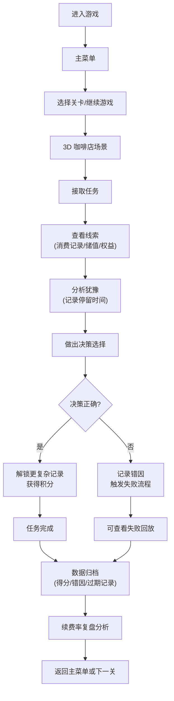

## 1. 产品概述

一款基于 3D 物理引擎的连锁咖啡会员储值调度解谜游戏，玩家扮演门店运营管理者，通过接任务、分析线索、做出决策的核心循环，解锁复杂的核销记录和退款原因，训练会员续费率运营能力。

- **目标用户**：连锁零售运营人员、会员管理从业者、解谜游戏爱好者
- **核心价值**：在沉浸式 3D 咖啡店场景中，通过游戏化方式训练会员储值管理和续费率提升的决策能力

## 2. 核心功能

### 2.1 用户角色

| 角色 | 注册方式 | 核心权限 |
|------|----------|----------|
| 玩家 | 本地存档/游客 | 游戏游玩、存档管理、查看排行榜、回看失败记录 |

### 2.2 功能模块

1. **主菜单**：开始游戏、教程、关卡选择、存档管理、排行榜
2. **游戏主场景**：3D 咖啡店环境、任务接取、线索查看、决策交互
3. **会员档案系统**：会员信息、储值记录、核销记录、退款原因、失败回放
4. **数据复盘系统**：得分统计、错因分析、权益过期触发记录、续费率复盘
5. **配置管理**：关卡配置、素材配置、教程配置独立管理

### 2.3 页面详情

| 页面名称 | 模块名称 | 功能描述 |
|----------|----------|----------|
| 主菜单 | 导航区 | 开始游戏、继续游戏、教程、关卡选择、排行榜按钮 |
| 主菜单 | 玩家信息 | 当前存档、总得分、历史最高记录展示 |
| 游戏场景 | 3D 咖啡店 | 可交互的咖啡店环境，包含吧台、座位区、会员档案柜 |
| 游戏场景 | 任务面板 | 显示当前任务、任务目标、时间限制 |
| 游戏场景 | 线索面板 | 展示收集到的线索、会员消费数据、异常记录 |
| 游戏场景 | 决策面板 | 提供多个选项，玩家做出选择后触发结果 |
| 会员档案 | 信息卡片 | 会员基本信息、储值余额、消费频次 |
| 会员档案 | 记录列表 | 核销记录、退款申请、权益过期记录 |
| 会员档案 | 失败回放 | 保留最近 3 次失败记录，回放显示犹豫点（决策停留时间） |
| 复盘中心 | 得分统计 | 单局得分、总得分、正确率、平均决策时间 |
| 复盘中心 | 错因分析 | 按错误类型分类统计、常见错误提示 |
| 复盘中心 | 权益过期 | 触发记录、时间线展示、影响分析 |
| 排行榜 | 排名列表 | 本地排名、得分、完成关卡数、续费率指标 |

## 3. 核心流程

玩家进入游戏后，在 3D 咖啡店场景中接取会员管理任务，通过查看线索（消费记录、储值余额、权益有效期）进行分析，做出最优决策（是否推荐续充、如何处理退款、如何挽回即将过期的权益），正确决策解锁更复杂的案例，错误则记录错因并可回放。每次训练的得分、错因、权益过期触发记录都会保存，用于围绕续费率进行复盘分析。

## 4. 界面设计

### 4.1 设计风格

- **主色调**：深咖啡色 `#3E2723` 搭配奶白色 `#FFF8E1`，点缀焦糖色 `#FF8F00`
- **按钮风格**：圆角矩形，3D 微立体效果，悬停时有轻微上浮动画
- **字体**：标题使用「悠哉字体」或类似手写风格咖啡字体，正文使用清晰易读的无衬线字体
- **布局风格**：卡片式布局，玻璃拟态效果，半透明面板配合毛玻璃背景
- **图标风格**：线性图标配合咖啡主题元素（咖啡豆、咖啡杯、会员卡、钱包）

### 4.2 页面设计概览

| 页面名称 | 模块名称 | UI 元素 |
|----------|----------|----------|
| 主菜单 | 导航区 | 大标题、渐入动画、卡片式按钮、咖啡豆粒子背景 |
| 游戏场景 | 3D 环境 | 暖色调咖啡店、动态光影、可交互的物理对象、漂浮的线索卡片 |
| 游戏场景 | 信息面板 | 半透明玻璃面板、左侧任务、中间线索、右侧决策 |
| 会员档案 | 档案卡片 | 3D 旋转卡片效果、标签页切换、时间轴记录 |
| 会员档案 | 失败回放 | 进度条带犹豫点标记、倍速控制、关键决策节点高亮 |
| 复盘中心 | 统计图表 | 柱状图显示得分、饼图显示错因、折线图显示续费率趋势 |
| 排行榜 | 排名列表 | 金色/银色/铜牌图标、动画排名变化、玩家头像 |

### 4.3 响应式

- **桌面优先**：1920×1080 为基准设计，3D 场景占主要视口
- **平板适配**：信息面板可折叠，按钮尺寸适配触摸
- **移动适配**：简化 3D 场景复杂度，采用垂直布局，优化触摸交互

### 4.4 3D 场景指引

- **环境/HDRI**：温暖的室内咖啡厅环境，使用咖啡厅 HDRI 贴图，营造舒适的午后氛围
- **光照设置**：主光源模拟午后阳光从窗户射入，配合环境光和点光源照亮吧台和座位区，柔和阴影
- **相机设置**：第三人称视角，可围绕咖啡店旋转缩放，进入档案柜时切换到第一人称近距离视角
- **构图**：吧台为视觉中心，左侧是会员档案柜（可交互），右侧是座位区，前景有咖啡杯和点心装饰
- **交互与动画**：线索卡片从档案柜飘出，选择时有物理碰撞效果，正确决策有咖啡拉花成功动画，错误时有咖啡溢出效果
- **后处理效果**：Bloom 泛光、轻微色差、胶片颗粒，营造温暖复古的电影感
- **资源与性能**：使用低多边形模型，单场景面数控制在 5 万以内，物理对象控制在 20 个以内，目标帧率 60fps
