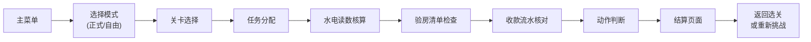

## 1. 产品概述

长租公寓退租验房经营模拟游戏，用于长租公寓运营岗位新人培训。通过模拟真实退租验房场景，让新人掌握水电读数核算、验房清单检查、收款流水核对等核心技能，提升退租处理效率和准确率。

- 目标用户：长租公寓运营岗位新员工
- 核心价值：沉浸式模拟培训，降低试错成本，标准化退租验房流程

## 2. 核心功能

### 2.1 用户角色

| 角色 | 登录方式 | 核心权限 |
|------|----------|----------|
| 培训学员 | 无需登录 | 进行正式训练和自由练习，查看个人成绩 |

### 2.2 功能模块

1. **主菜单**：正式训练入口、自由练习入口、游戏说明
2. **关卡选择**：按岗位/难度分类的关卡列表，显示关卡信息
3. **游戏场景**：任务分配、水电读数、验房清单、收款流水、动作判断
4. **结算页面**：得分统计、用时记录、错误原因分析
5. **关卡数据系统**：可配置的投诉标签和关卡参数，支持扩展

### 2.3 页面详情

| 页面名称 | 模块名称 | 功能描述 |
|---------|---------|----------|
| 主菜单 | 入口选择 | 正式训练、自由练习两个独立入口，游戏说明按钮 |
| 关卡选择 | 关卡列表 | 按难度分级展示关卡，显示关卡名称、投诉标签、预计时长 |
| 游戏场景 | 任务分配 | 展示退租任务信息（房间号、租客信息、退租日期） |
| 游戏场景 | 水电读数 | 显示期初/期末水电表读数，计算费用 |
| 游戏场景 | 验房清单 | 逐项检查房间设施状态，标记损坏/缺失 |
| 游戏场景 | 收款流水 | 查看历史收款记录，判断是否有逾期/欠费 |
| 游戏场景 | 动作判断 | 玩家选择下一步动作（正常退押金、部分扣除、全额扣除、上报） |
| 结算页面 | 成绩展示 | 最终得分、用时、正确率 |
| 结算页面 | 错误分析 | 列出每个错误项的原因和正确答案 |

## 3. 核心流程

### 3.1 游戏主流程

玩家选择模式 → 选择关卡 → 接收任务 → 查看水电读数 → 检查验房清单 → 核对收款流水 → 判断下一步动作 → 查看结算结果

### 3.2 评分规则

- 每关基础分 100 分
- 水电读数判断错误 -20 分
- 验房清单漏判/误判 每项 -10 分
- 收款流水识别错误 -20 分
- 最终动作判断错误 -30 分
- 用时越短，时间加成越高（最多 +20 分）

## 4. 用户界面设计

### 4.1 设计风格

- **主色调**：深蓝 #1e3a5f（专业稳重）+ 琥珀橙 #f59e0b（警示高亮）
- **辅助色**：绿色 #10b981（正常）、红色 #ef4444（异常）、灰色 #6b7280（次要信息）
- **视觉风格**：现代简约卡片式布局，模拟真实办公系统界面
- **字体**：标题使用思源黑体 Bold，正文使用思源黑体 Regular
- **动效**：卡片淡入、按钮悬浮反馈、错误项抖动提示

### 4.2 页面设计概览

| 页面名称 | 模块名称 | UI 元素 |
|---------|---------|---------|
| 主菜单 | 入口选择 | 大卡片式入口按钮，渐变色背景，图标+文字组合 |
| 关卡选择 | 关卡列表 | 瀑布流卡片布局，难度标签色区分，悬停放大效果 |
| 游戏场景 | 信息面板 | 三栏布局：左侧水电/验房、中间房间示意图、右侧流水/动作选择 |
| 游戏场景 | 进度指示 | 顶部步骤条，显示当前阶段和总进度 |
| 结算页面 | 成绩展示 | 大数字得分，环形进度图，时间统计卡片 |
| 结算页面 | 错误分析 | 折叠式错误列表，展开显示详细原因 |

### 4.3 响应式

- 桌面端优先设计，最小支持 1280px 宽度
- 平板自适应布局，三栏可变为两栏堆叠
- 不做移动端优化（培训场景以桌面端为主）

### 4.4 游戏场景交互

- 水电表：可点击放大查看细节，数字滚动动画
- 验房清单：可勾选/取消，异常项高亮标记
- 收款流水：时间线布局，可筛选查看
- 动作选择：四象限按钮布局，确认前有二次提示
