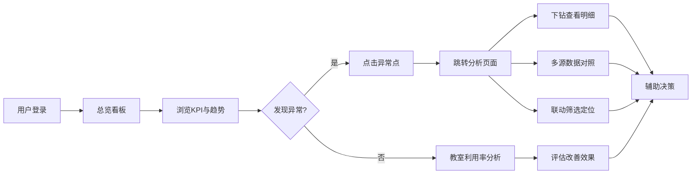

## 1. 产品概述

高校教务成绩复核趋势看板是面向高校教务管理部门的数据可视化分析平台，整合成绩复核申请、一卡通数据、教务库数据等多源数据，提供复核趋势分析、教室利用率复盘、学生申请全链路追踪等核心功能。

- 解决问题：多源数据口径不一致导致的核对困难、材料缺失风险难以预警、教室利用率改善效果缺乏量化评估
- 目标用户：教务处管理人员、教学质量监控人员、学院教学秘书
- 产品价值：提升成绩复核工作效率，降低运营手工计算量，数据驱动教学资源优化决策

## 2. 核心功能

### 2.1 用户角色

| 角色 | 登录方式 | 核心权限 |
|------|----------|----------|
| 教务处管理员 | 统一身份认证 | 全部数据查看、导出、系统配置 |
| 教学质量监控员 | 统一身份认证 | 复核趋势分析、教室利用率分析 |
| 学院教学秘书 | 统一身份认证 | 本院学生数据查看、材料状态追踪 |

### 2.2 功能模块

1. **总览看板**：核心指标卡片、复核趋势概览、异常预警
2. **成绩复核分析**：复核趋势图表、多源数据对照、材料缺失缺口提示
3. **教室利用率分析**：同比/环比/目标值对比、改善效果复盘
4. **学生名单总览**：学生申请列表、成绩单与申请材料联动筛选
5. **异常点分析**：基于导师名额的异常点解释、数据下钻

### 2.3 页面详情

| 页面名称 | 模块名称 | 功能描述 |
|----------|----------|----------|
| 总览看板 | KPI指标卡 | 展示复核申请数、通过数、材料缺失数、教室利用率等核心指标 |
| 总览看板 | 趋势概览 | 近12个月复核申请趋势折线图，标注材料缺失缺口 |
| 总览看板 | 异常预警 | 高亮显示异常数据点，关联导师名额解释 |
| 成绩复核分析 | 多源数据对照 | 学生申请表、一卡通版本、教务库口径并列展示，不一致项标红 |
| 成绩复核分析 | 材料缺失分析 | 柱状图标注材料缺失造成的申请缺口，可下钻查看具体学生 |
| 成绩复核分析 | 复核原因分布 | 饼图展示复核原因占比 |
| 教室利用率分析 | 多维度对比 | 同比、环比、目标值三线对比图 |
| 教室利用率分析 | 改善效果复盘 | 按学期展示利用率变化趋势，标注改善措施节点 |
| 教室利用率分析 | 教室排名 | 利用率高低排名，支持按学院、楼栋筛选 |
| 学生名单总览 | 学生列表 | 分页展示学生基本信息、申请状态、复核结果 |
| 学生名单总览 | 联动筛选 | 成绩单成绩范围与申请材料状态组合筛选 |
| 学生名单总览 | 详情抽屉 | 展示学生完整申请材料、成绩单、复核记录 |
| 异常点分析 | 异常点标注 | 在趋势图上标注异常点，点击显示导师名额等解释信息 |
| 异常点分析 | 数据下钻 | 从汇总数据逐层下钻至明细记录 |

## 3. 核心流程

用户登录后进入总览看板，浏览核心指标和趋势概览。关注到异常数据点后，可点击跳转至对应分析页面进行深度分析。通过多源数据对照功能核对数据一致性，使用联动筛选定位特定学生群体。最后通过教室利用率分析评估改善效果，辅助决策。

## 4. 用户界面设计

### 4.1 设计风格

- **主色调**：深邃藏蓝 `#1e3a5f`（代表专业、权威），搭配沉稳青蓝 `#2d5a87`
- **辅助色**：数据绿 `#10b981`（正常）、警示橙 `#f59e0b`（预警）、错误红 `#ef4444`（异常）
- **中性色**：灰白阶梯 `#f8fafc` `#e2e8f0` `#64748b` `#1e293b`
- **字体**：标题使用 Noto Serif SC（人文气息），正文使用 Inter（清晰易读），数字使用 JetBrains Mono（等宽对齐）
- **布局风格**：卡片式布局，适度留白，关键数据突出显示
- **按钮风格**：直角微圆角（4px），悬停时轻微上浮+阴影变化
- **图标风格**：线性图标，统一2px描边，颜色与主题一致
- **装饰元素**：细微网格背景、数据渐变填充、指标卡片悬浮阴影

### 4.2 页面设计概述

| 页面名称 | 模块名称 | UI元素 |
|----------|----------|--------|
| 总览看板 | KPI指标卡 | 渐变背景卡片，大字号数字，趋势箭头，同比环比小标签 |
| 总览看板 | 趋势概览 | 平滑曲线折线图，区域渐变填充，材料缺失缺口用红色阴影区域标注 |
| 总览看板 | 异常预警 | 时间线式预警列表，异常点脉冲动画 |
| 成绩复核分析 | 多源数据对照 | 三列并排表格，不一致单元格红色背景闪烁提示 |
| 成绩复核分析 | 材料缺失分析 | 堆叠柱状图，缺口部分用斜纹填充 |
| 教室利用率分析 | 多维度对比 | 三线图，目标值虚线，达成区域绿色填充 |
| 教室利用率分析 | 改善效果复盘 | 面积图，改善措施节点用垂直虚线+图标标注 |
| 学生名单总览 | 学生列表 | 斑马纹表格，悬停高亮，状态标签胶囊样式 |
| 学生名单总览 | 联动筛选 | 顶部筛选栏，滑块+标签组合，筛选条件即时生效 |
| 学生名单总览 | 详情抽屉 | 右侧滑入，多层信息分组，材料预览缩略图 |

### 4.3 响应式设计

- **桌面端优先**：1280px及以上为完整布局，4列指标卡，主图表占2/3宽度
- **平板适配**：768px-1279px，2列指标卡，图表改为单列堆叠
- **移动端**：768px以下，1列布局，横向滚动表格，简化图表展示
- **交互优化**：移动端支持触摸滑动筛选，点击区域放大至44x44px

### 4.4 动效设计

- **页面加载**：指标卡片按顺序淡入上浮（stagger 100ms）
- **数据更新**：数字滚动动画（countUp），图表线条从左到右绘制
- **交互反馈**：卡片hover轻微上浮（translateY -4px）+ 阴影加深
- **异常提示**：预警点呼吸动画（opacity 0.6-1循环）
- **抽屉过渡**：右侧滑入（translateX 100% → 0，300ms ease-out）
