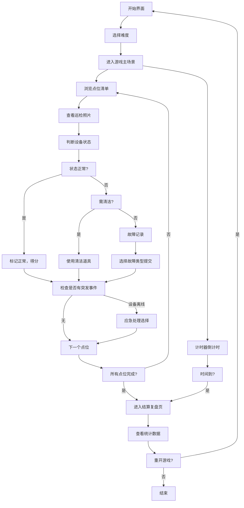

## 1. 产品概述

连锁咖啡设备清洁经营模拟游戏，玩家扮演咖啡设备运维工程师，需要在规定时间内完成多家门店的设备巡检与清洁任务，通过判断巡检照片中的设备状态来决定是否需要清洁或报修，训练设备清洁判断能力。

- **核心目的**：练习设备清洁判断能力，熟悉连锁门店设备运维流程
- **目标用户**：咖啡门店运营人员、设备维护培训学员
- **市场价值**：将枯燥的设备维护培训转化为互动性强的游戏化学习体验

## 2. 核心功能

### 2.1 功能模块
1. **开始界面**：游戏标题、难度选择、配置入口、开始游戏
2. **游戏主场景**：点位清单、巡检照片区、计时器、任务进度、道具栏
3. **设备巡检界面**：放大查看照片、状态判断、故障记录
4. **突发事件界面**：设备离线提示、应急处理选项
5. **结算/复盘页**：巡检合格率、完成时间、玩家卡点分析、重开按钮

### 2.2 页面详情

| 页面名称 | 模块名称 | 功能描述 |
|---------|---------|---------|
| 开始界面 | 难度选择 | 简单/普通/困难三档，影响时间限制、故障频率、点数数量 |
| 开始界面 | 配置入口 | 打开配置面板，调整难度曲线、道具冷却、埋点规则 |
| 游戏主场景 | 点位清单 | 可拖拽滚动的门店设备列表，支持触屏和键盘操作 |
| 游戏主场景 | 巡检照片区 | 动态展示设备照片，随机出现正常/需清洁/故障三种状态 |
| 游戏主场景 | 计时器 | 倒计时显示，超时则游戏失败 |
| 游戏主场景 | 道具栏 | 清洁工具、报修按钮、暂停道具，各自有冷却时间 |
| 游戏主场景 | 任务进度 | 已完成/总任务数、当前得分 |
| 设备巡检界面 | 照片详情 | 放大显示设备照片，可拖拽查看细节 |
| 设备巡检界面 | 状态判断 | 三个选项：正常/需清洁/故障，需在时限内做出选择 |
| 设备巡检界面 | 故障记录 | 选择故障类型，填写备注，提交记录 |
| 突发事件界面 | 设备离线 | 随机触发，需要选择处理方式（远程重启/现场处理/忽略） |
| 复盘页 | 统计数据 | 巡检合格率、平均判断时间、完成时间 |
| 复盘页 | 卡点分析 | 标记玩家犹豫不决的点位、判断错误的点位 |
| 复盘页 | 重开功能 | 失败或完成后可立即重新开始游戏 |

## 3. 核心流程

玩家从开始界面选择难度，进入游戏后主场景显示可拖拽的点位清单和巡检照片。玩家需要逐个检查点位的照片，判断设备状态（正常/需清洁/故障），做出对应操作。过程中会随机出现设备离线突发事件，需要应急处理。完成所有点位或超时后进入结算页，展示统计数据和复盘分析，可选择重开。

## 4. 用户界面设计

### 4.1 设计风格
- **主色调**：深咖啡色 (#3E2723) 搭配暖橙色 (#FF6F00) 作为强调色
- **辅助色**：奶油白 (#FFF8E1)、抹茶绿 (#558B2F)、警示红 (#D32F2F)
- **按钮风格**：圆角矩形，带有微浮雕效果，悬停时有轻微上浮动画
- **字体**：标题使用 "Bebas Neue" 等粗体无衬线字体，正文使用 "Inter" 提升可读性
- **整体风格**：工业风 + 咖啡温暖感，结合设备维护的专业感和咖啡店的舒适感
- **图标风格**：线性图标，统一使用 2px 描边，圆角端点

### 4.2 页面设计概述

| 页面名称 | 模块名称 | UI 元素 |
|---------|---------|---------|
| 开始界面 | 主标题区 | 大字号标题，咖啡豆装饰图案，渐变背景 |
| 开始界面 | 难度选择 | 三个卡片式按钮，选中态有橙色边框高亮 |
| 开始界面 | 配置按钮 | 右下角齿轮图标，点击弹出半透明配置面板 |
| 游戏主场景 | 点位清单 | 左侧可拖拽滚动列表，每个点位显示设备名称、状态图标、完成状态 |
| 游戏主场景 | 巡检照片区 | 中间大区域显示当前点位照片，带有扫描线动画效果 |
| 游戏主场景 | 顶部信息栏 | 计时器（大号数字）、得分、任务进度条 |
| 游戏主场景 | 道具栏 | 底部横向排列，每个道具显示图标、名称、冷却进度圈 |
| 设备巡检界面 | 照片查看区 | 全屏半透明遮罩，照片可拖拽放大，细节处有高亮提示 |
| 设备巡检界面 | 判断按钮 | 三个大按钮横向排列：绿色正常、橙色清洁、红色故障 |
| 突发事件界面 | 弹窗 | 红色边框警示弹窗，闪烁动画，三个处理选项 |
| 复盘页 | 统计区 | 大号数字展示合格率、完成时间，环形进度图 |
| 复盘页 | 卡点分析 | 时间轴可视化，标记错误点和犹豫点 |
| 复盘页 | 操作按钮 | 重开按钮（橙色渐变）、返回主页按钮 |

### 4.3 交互细节
- **点位清单拖拽**：支持鼠标拖拽滚动、触屏滑动、键盘上下键导航、回车选中
- **照片查看**：鼠标滚轮缩放、双指捏合缩放、拖拽平移
- **按钮反馈**：点击时有缩放动画（0.95→1），颜色加深
- **状态变化**：设备状态变化时有粒子效果，正确判断有绿色加分动画，错误有红色抖动
- **冷却动画**：道具冷却使用 SVG 环形进度条，倒计时数字显示在中心

### 4.4 响应式设计
- **桌面端优先**：1280px 以上宽屏，点位清单在左（300px），照片区在中（自适应），信息栏顶部，道具栏底部
- **平板端**：768px-1279px，点位清单可折叠为侧边抽屉，照片区占满
- **移动端**：小于 768px，点位清单改为底部横向滚动，照片区在上，信息栏覆盖在照片顶部
- **触屏优化**：所有可点击元素最小尺寸 44x44px，增加触摸反馈波纹效果

## 5. 配置系统

### 5.1 难度曲线配置
| 参数 | 简单 | 普通 | 困难 |
|-----|-----|-----|-----|
| 总时间 | 10 分钟 | 7 分钟 | 5 分钟 |
| 点位数量 | 8 个 | 12 个 | 16 个 |
| 故障概率 | 15% | 25% | 40% |
| 需清洁概率 | 25% | 35% | 45% |
| 判断时限 | 15 秒 | 10 秒 | 7 秒 |
| 突发事件频率 | 1 次 | 2 次 | 3 次 |

### 5.2 道具冷却配置
| 道具 | 冷却时间 | 效果 |
|-----|---------|-----|
| 清洁工具 | 30 秒 | 标记设备为已清洁，消除清洁需求 |
| 报修按钮 | 60 秒 | 直接提交故障记录，无需选择类型 |
| 暂停道具 | 120 秒 | 暂停倒计时 10 秒 |
| 提示道具 | 45 秒 | 高亮显示正确判断选项 |

### 5.3 埋点规则配置
- **判断时间埋点**：记录每个点位的判断耗时，超过阈值标记为"卡点"
- **错误类型埋点**：记录将正常判断为故障、将故障判断为正常等错误类型
- **操作路径埋点**：记录玩家查看点位的顺序、切换频率
- **道具使用埋点**：记录道具使用时机、使用后的效果
- **突发事件埋点**：记录突发事件处理选择、处理耗时
