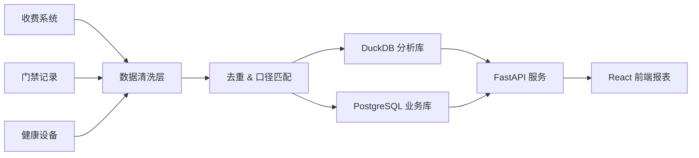
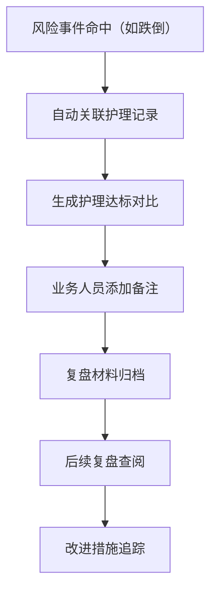

## 1. 产品概述

养老护理床位排班漏斗报表系统，专门用于复盘养老护理的床位排班质量与护理达标情况。系统整合收费系统、门禁记录和健康设备三类数据源，通过数据清洗和口径匹配后，以多维度图表独立呈现活动签到、风险事件和老人档案，支持业务人员自定义预警阈值，并针对跌倒等风险事件形成完整的复盘材料链。

- **核心价值**：通过数据驱动的排班复盘，提升护理质量，降低风险事件发生率
- **目标用户**：养老机构护理主管、质量管控人员、运营管理者
- **解决问题**：数据分散、指标混杂、风险事件复盘不完整、预警阈值僵化

## 2. 核心功能

### 2.1 用户角色

| 角色 | 注册方式 | 核心权限 |
|------|---------|---------|
| 护理主管 | 系统分配 | 查看全部报表、调整预警阈值、填写风险事件备注 |
| 质量管控 | 系统分配 | 查看复盘材料、导出报表、审核风险备注 |
| 运营管理者 | 系统分配 | 全局数据概览、多维度对比分析 |

### 2.2 功能模块

1. **数据看板首页**：床位排班漏斗概览、核心指标卡片、风险事件提醒
2. **活动签到分析**：活动参与率趋势、签到时段分布、床位关联分析
3. **风险事件分析**：风险类型分布、时间趋势、异常点标注与备注
4. **老人档案分析**：床位利用率、老人画像、护理等级分布
5. **预警阈值配置**：自定义各指标预警阈值、阈值生效记录
6. **跌倒事件复盘**：围绕跌倒事件的护理达标复盘材料链

### 2.3 页面详情

| 页面名称 | 模块名称 | 功能描述 |
|---------|---------|---------|
| 数据看板 | 漏斗概览 | 床位排班→护理执行→活动参与→风险预警的漏斗图 |
| 数据看板 | 核心指标 | 在床人数、护理达标率、风险事件数、活动参与率 |
| 数据看板 | 风险提醒 | 最新风险事件列表，点击跳转详情 |
| 活动签到 | 趋势图表 | 日/周/月活动参与率趋势折线图 |
| 活动签到 | 时段分布 | 各时段签到人数柱状图 |
| 活动签到 | 床位关联 | 不同床位区域活动参与率对比 |
| 风险事件 | 类型分布 | 跌倒、压疮、走失等风险类型饼图 |
| 风险事件 | 时间趋势 | 风险事件发生趋势，支持异常点点击添加备注 |
| 风险事件 | 事件列表 | 风险事件明细表，支持筛选和备注查看 |
| 老人档案 | 床位利用 | 床位利用率、空置率、周转分析 |
| 老人档案 | 画像分布 | 年龄、护理等级、疾病类型分布 |
| 阈值配置 | 阈值列表 | 各指标当前阈值、可编辑调整 |
| 阈值配置 | 变更记录 | 阈值调整历史记录与生效时间 |
| 跌倒复盘 | 事件总览 | 跌倒事件基本信息与发生时间线 |
| 跌倒复盘 | 护理达标 | 事件前后护理执行情况对比分析 |
| 跌倒复盘 | 备注回顾 | 当时的判断备注与后续改进措施 |

## 3. 核心流程

### 3.1 数据处理流程
数据从收费系统、门禁记录、健康设备三个来源接入，经过清洗、去重、口径匹配后存入数据仓库，再通过 DuckDB 进行快速分析查询，最终在前端以多维度图表呈现。

### 3.2 风险事件复盘流程
风险事件触发后，系统自动关联护理记录形成复盘材料，业务人员可添加备注，后续复盘时可追溯当时判断。

## 4. 用户界面设计

### 4.1 设计风格
- **主色调**：深青色（#0D9488）作为主色，传递专业、关怀、可信赖的感觉
- **辅助色**：琥珀色（#F59E0B）用于预警提醒，红色（#EF4444）用于高风险标识
- **中性色**：以 slate 灰色系为主，保证数据可读性
- **按钮风格**：圆角 8px，轻微阴影，hover 状态有上浮效果
- **字体**：使用现代无衬线字体，标题清晰醒目，正文易读性强
- **布局风格**：卡片式布局，各图表模块独立分区，信息层级分明
- **图标风格**：线性图标，统一 24px 网格，保持简洁专业

### 4.2 页面设计概述

| 页面名称 | 模块名称 | UI 元素 |
|---------|---------|---------|
| 数据看板 | 顶部导航 | Logo、模块切换、用户信息、日期筛选 |
| 数据看板 | 指标卡片 | 四列卡片网格，含数值、环比、趋势小图 |
| 数据看板 | 漏斗图 | 居中大面积漏斗图，支持悬停查看详情 |
| 数据看板 | 风险列表 | 右侧侧边栏，最新风险事件滚动列表 |
| 活动签到 | 图表区 | 上下布局，趋势图在上，分布图在下 |
| 活动签到 | 筛选区 | 时间范围、活动类型、床位区域筛选 |
| 风险事件 | 图表区 | 左右布局，饼图在左，趋势图在右 |
| 风险事件 | 事件列表 | 下方表格，支持点击行查看/添加备注 |
| 老人档案 | 画像区 | 多维度分布图组合，网格布局 |
| 老人档案 | 床位热力图 | 床位区域利用率热力图 |
| 阈值配置 | 配置表单 | 卡片式表单，每个指标独立配置项 |
| 阈值配置 | 历史记录 | 时间线式变更记录展示 |
| 跌倒复盘 | 时间线 | 左侧事件时间线，右侧详情面板 |
| 跌倒复盘 | 护理对比 | 前后护理达标率对比柱状图 |

### 4.3 响应式
- 采用桌面端优先设计，主适用于 1440px 及以上宽度
- 支持 1024px 平板端自适应，图表可缩放
- 关键数据卡片和图表支持独立滚动查看

### 4.4 交互动效
- 页面加载时图表依次淡入，有轻微的错峰延迟
- 卡片 hover 时有轻微上浮和阴影加深
- 数据更新时有平滑的数值过渡动画
- 风险事件闪烁提示，重要信息呼吸灯效果
