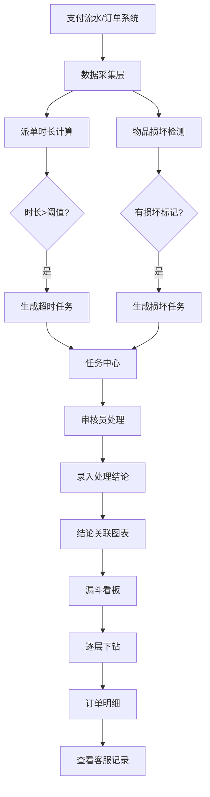

## 1. 产品概述
本地跑腿路线补贴漏斗报表系统，用于复盘和管理跑腿业务的路线补贴问题。通过支付流水和订单系统的数据入口，实现从补贴规则到申诉证据再到结算明细的全链路可视化追踪，重点监控派单时长，自动识别异常并生成处理任务。

- **核心价值**：通过漏斗分析定位补贴流失环节，关联客服原始记录还原问题真相，处理结论与图表联动避免信息割裂
- **目标用户**：运营分析师、补贴审核员、客服主管
- **市场价值**：提升补贴审核效率30%，减少不合理补贴支出，建立可追溯的补贴审核闭环

## 2. 核心 Features

### 2.1 用户角色

| 角色 | 注册方式 | 核心权限 |
|------|----------|----------|
| 运营分析师 | Supabase邮箱登录 | 查看所有报表、导出数据、配置阈值 |
| 补贴审核员 | Supabase邮箱登录 | 处理备注任务、录入处理结论 |
| 客服主管 | Supabase邮箱登录 | 查看关联客服记录、补充证据 |

### 2.2 Feature 模块
1. **漏斗报表看板**：补贴规则→申诉证据→结算明细三层漏斗，支持逐层下钻
2. **订单明细页**：展示订单完整信息，关联跳转客服原始记录
3. **派单时长监控**：实时监控派单时长，超阈值自动告警并生成任务
4. **备注任务系统**：物品损坏/派单超时自动生成任务，任务状态流转
5. **处理结论面板**：与图表联动展示，结论永久留存图表旁

### 2.3 页面详情

| 页面名称 | 模块名称 | 功能描述 |
|-----------|-------------|---------------------|
| 漏斗报表看板 | 补贴规则层 | 展示各路线补贴规则、预算总额、预计补贴笔数，支持按时间/路线筛选 |
| 漏斗报表看板 | 申诉证据层 | 展示申诉订单数、申诉通过率、证据上传情况，点击下钻到具体订单 |
| 漏斗报表看板 | 结算明细层 | 展示实际结算金额、异常扣减、最终补贴，支持导出明细 |
| 漏斗报表看板 | 派单时长趋势 | 折线图展示派单时长变化，阈值线标记，超阈值点高亮 |
| 漏斗报表看板 | 处理结论面板 | 悬浮/侧滑展示，与图表数据点关联，显示历史处理记录 |
| 订单明细页 | 订单基本信息 | 展示订单号、金额、物品信息、配送路线 |
| 订单明细页 | 支付流水信息 | 关联支付记录、补贴金额、结算状态 |
| 订单明细页 | 客服记录关联 | 跳转/内嵌展示客服原始聊天记录、工单记录 |
| 订单明细页 | 申诉证据展示 | 展示图片证据、文字说明、审核意见 |
| 任务中心 | 待处理任务列表 | 展示物品损坏/派单超时任务，支持筛选、搜索 |
| 任务中心 | 任务处理页 | 录入处理结论、上传凭证、关联订单 |
| 系统配置 | 阈值配置 | 设置派单时长告警阈值、补贴异常判定规则 |
| 系统配置 | 规则管理 | 配置各路线补贴规则、计算公式 |

## 3. 核心流程

### 3.1 补贴审核流程
运营分析师从漏斗看板发现某路线补贴转化率异常 → 点击下钻到申诉证据层查看具体申诉订单 → 选择异常订单进入明细页 → 查看关联的客服原始记录核实情况 → 若存在物品损坏或派单超时，系统已自动生成备注任务 → 审核员处理任务并录入结论 → 结论同步展示在图表旁供后续参考

### 3.2 异常任务生成流程
订单系统推送新订单 → 系统计算派单时长（从接单到骑手取货时间）→ 若派单时长>阈值 → 自动生成"派单超时"备注任务 → 若订单标记物品损坏 → 自动生成"物品损坏"备注任务 → 任务进入待处理队列 → 审核员处理后结论与订单永久关联

### 3.3 Mermaid 流程图

## 4. 用户界面设计

### 4.1 设计风格
- **设计理念**：数据驱动的专业运营工具，采用高端金融科技风格，强调数据清晰度和操作效率
- **主色调**：深邃藏蓝 #0F172A 作为背景，营造专业感；青绿色 #10B981 作为正常状态；琥珀橙 #F59E0B 作为预警；玫红 #EF4444 作为异常
- **字体**：标题使用 Space Grotesk 粗体，数据展示使用 JetBrains Mono 等宽字体，正文使用 Inter 保证可读性
- **布局风格**：卡片式布局配合大面积留白，关键数据采用大字号突出，支持深色/浅色主题切换
- **动效**：数据加载采用骨架屏，图表切换使用淡入淡出，下钻时使用缩放过渡动画

### 4.2 页面设计概述

| 页面名称 | 模块名称 | UI 元素 |
|-----------|-------------|-------------|
| 漏斗报表看板 | 顶部导航 | 深色导航栏，Logo、用户信息、主题切换、面包屑 |
| 漏斗报表看板 | 筛选区域 | 时间范围选择器、路线下拉框、状态筛选标签 |
| 漏斗报表看板 | 漏斗图区域 | 三层漏斗图，每层显示数值和转化率，点击可下钻 |
| 漏斗报表看板 | 派单时长趋势图 | 折线图带面积填充，阈值虚线标记，异常点红点高亮 |
| 漏斗报表看板 | 异常告警列表 | 卡片式展示最新异常，显示超时时长/损坏程度 |
| 漏斗报表看板 | 处理结论面板 | 点击图表数据点侧滑出现，展示该节点所有处理记录 |
| 订单明细页 | 头部信息 | 订单号、状态标签、核心指标卡片组 |
| 订单明细页 | 时间线 | 订单全流程时间轴，标记关键节点和耗时 |
| 订单明细页 | 关联记录 | Tab切换：支付流水、客服记录、申诉证据 |
| 任务中心 | 任务列表 | 表格展示，支持批量操作、状态标签、优先级标记 |
| 任务中心 | 任务详情抽屉 | 右侧抽屉展示任务详情、处理表单、历史记录 |

### 4.3 响应式设计
- **桌面优先**：1440px 基准设计，优化 1920px 大屏展示
- **平板适配**：1024px 时侧边栏可收起，图表自适应宽度
- **移动适配**：768px 以下采用单列布局，关键数据优先展示，复杂图表简化为数值卡片

### 4.4 交互体验
- 漏斗图每层hover显示详细数据tooltip，点击下钻时有平滑过渡动画
- 派单时长图中超阈值点点击可直接查看处理结论或快速创建任务
- 处理结论采用时间线展示，最新结论高亮，支持@提及和评论功能
- 所有表格支持列宽拖拽、排序、筛选，数据可导出为CSV
