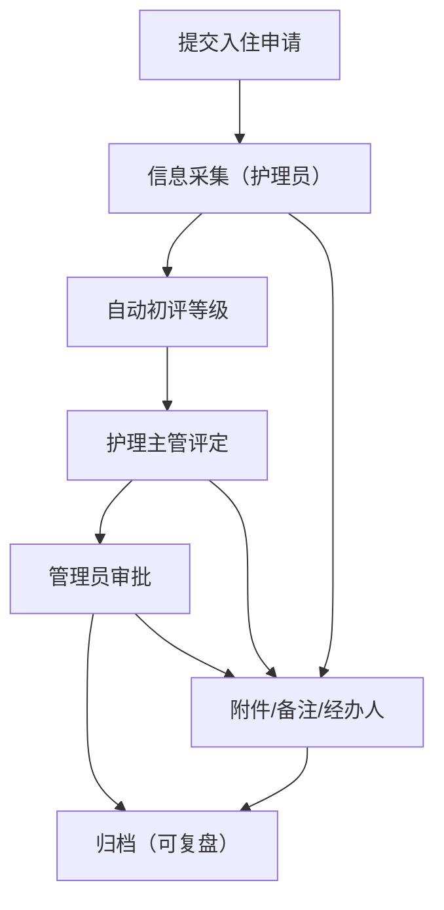
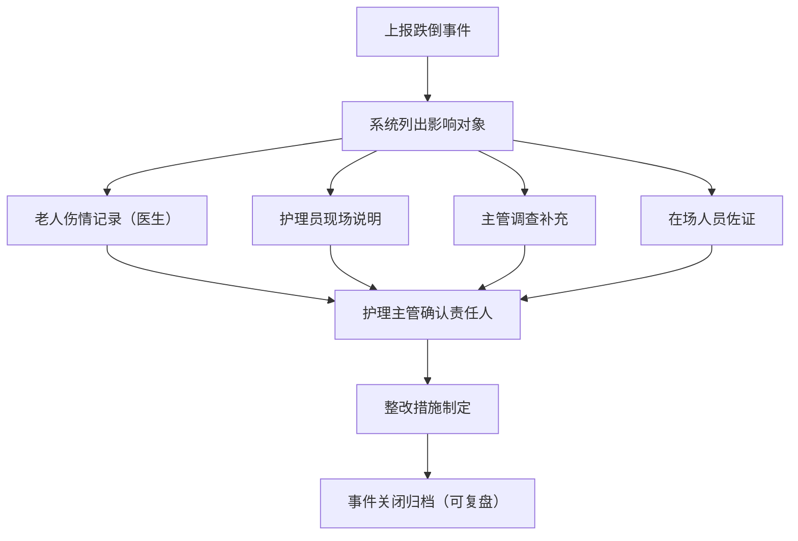

## 1. 产品概述

养老护理入住评估协同台是面向养老机构的数字化协同平台，旨在规范化管理老人入住评估全流程，支持护理等级评定、用药管理、探访记录追踪，并为跌倒等突发事件提供响应式处置链路。业务记录支持关闭后的复盘追溯，兼顾移动端现场处理与桌面端分析决策。

- 主要目标：解决养老评估流程纸质化、信息割裂、事件处置低效、复盘无据可依的痛点
- 目标用户：机构管理员、护理主管、一线护理员、医生、家属联络员
- 产品价值：构建可追溯、可协同、可分析的养老评估数字化体系

## 2. 核心功能

### 2.1 用户角色

| 角色 | 注册方式 | 核心权限 |
|------|----------|----------|
| 机构管理员 | 后台创建 | 全功能管理、用户与角色配置、数据导出、达标分析 |
| 护理主管 | 后台创建 | 评估审核、护理等级评定、跌倒事件责任人确认、批量操作 |
| 护理员 | 后台创建 | 老人档案查看、日常护理记录、探访登记、移动端现场处理 |
| 驻院医生 | 后台创建 | 用药清单维护、跌倒伤情评估、医学补充说明 |
| 家属联络员 | 邀请注册 | 查看老人基础档案、探访预约、接收通知 |

### 2.2 功能模块

1. **工作台首页**：待办事项、今日动态、核心指标卡片、快速入口
2. **老人档案管理**：基础信息、健康档案、联系人、入住状态
3. **入住评估流程**：评估申请 → 信息采集 → 护理等级评定 → 审批 → 归档
4. **护理等级管理**：等级标准、评定记录、等级调整历史
5. **用药清单**：药品管理、用药计划、执行记录、过敏警示
6. **探访记录**：探访登记、家属预约、探访历史、异常记录
7. **跌倒事件处置**：影响对象清单 → 角色补充说明 → 责任人确认 → 事件关闭 → 复盘
8. **状态流转中心**：附件、备注、经办人信息全程跟随
9. **数据分析**：护理达标率、跌倒事件统计、评估效率、导出报表
10. **系统设置**：用户管理、角色权限、机构配置、字典维护

### 2.3 页面详情

| 页面名称 | 模块名称 | 功能描述 |
|----------|----------|----------|
| 工作台 | 待办事项卡 | 展示待我处理、待审核、待确认类任务列表 |
| 工作台 | 今日动态流 | 按时间线展示今日评估、用药、探访、事件动态 |
| 工作台 | 核心指标 | 在院老人数、今日评估数、活跃跌倒事件、达标率 |
| 工作台 | 快速入口 | 常用操作快捷按钮 |
| 老人档案列表 | 筛选区域 | 按姓名、性别、年龄段、护理等级、入住状态多条件筛选 |
| 老人档案列表 | 列表/卡片视图 | 支持双视图切换，关键信息展示 |
| 老人档案详情 | 基础信息区 | 个人信息、照片、入住日期、房间号 |
| 老人档案详情 | 健康档案区 | 病史、过敏史、体重血压趋势 |
| 老人档案详情 | 联系人区 | 紧急联系人、家属信息 |
| 入住评估列表 | 流程状态标签 | 申请/采集中/评定中/审批中/已归档/已关闭 |
| 入住评估详情 | 评估表单 | ADL、认知、情绪、社会支持多维度评估项 |
| 入住评估详情 | 流程时间线 | 各节点状态、经办人、时间、附件备注 |
| 护理等级配置 | 等级列表 | 等级名称、分值范围、护理内容、适用说明 |
| 护理等级评定 | 评定结果卡 | 分数、建议等级、依据说明、人工调整 |
| 用药清单 | 药品列表 | 名称、剂量、频次、给药方式、起止时间 |
| 用药清单 | 执行记录 | 执行人、执行时间、签名、异常标记 |
| 探访记录 | 探访日历 | 月度探访可视化、预约标记 |
| 探访记录 | 探访登记表 | 探访人、关系、时间、陪同老人、备注 |
| 跌倒事件工作台 | 影响对象清单 | 老人、护理员、值班主管、在场人员列表 |
| 跌倒事件详情 | 角色补充卡 | 各角色独立填写区，未完成/已完成状态 |
| 跌倒事件详情 | 责任确认区 | 直接/间接责任人标注、确认签字 |
| 跌倒事件详情 | 复盘归档 | 事件总结、整改措施、关闭时间 |
| 数据分析 | 达标分析仪表盘 | 护理达标趋势、等级分布、事件类型占比 |
| 数据分析 | 批量导出 | 支持多维度筛选后导出 Excel/PDF |
| 移动端首页 | 底部导航 | 首页/老人/事件/我的 |
| 移动端事件处理 | 表单简化 | 适配触屏操作的简洁表单、拍照上传 |
| 个人中心 | 账号信息 | 个人资料、密码修改、角色查看 |
| 系统设置 | 用户角色 | 用户增删改、角色分配、权限矩阵 |

## 3. 核心流程

### 3.1 入住评估主流程

新老人提交入住申请后，护理员采集基础信息和健康数据，系统自动计算初步护理等级，由护理主管进行人工评定和调整，管理员审批后完成归档，全程支持附件上传和备注追加，业务关闭后仍可随时查看复盘。

### 3.2 跌倒事件处置流程

事件上报后系统自动列出所有影响对象（老人、护理员、主管、在场人员），各角色分别独立补充说明材料，最后由护理主管确认责任人并完成事件关闭归档，支持后续复盘追溯。

## 4. 用户界面设计

### 4.1 设计风格

- **主色调**：深海青蓝 `#1a5f7a`（专业信任） + 暖珊瑚橙 `#ff7f50`（关怀温度）
- **辅助色**：薄荷绿 `#98d8c8`（健康）、警示红 `#e63946`（异常）、琥珀黄 `#f4a261`（待处理）
- **背景色系**：象牙米白 `#faf8f5`、柔和灰蓝 `#e8ecef`、卡片纯白 `#ffffff`
- **按钮风格**：圆角 10px，主按钮实色填充带细微阴影，次按钮描边浅填充
- **字体选择**：标题使用 Noto Serif SC（人文气息衬线体），正文使用 Noto Sans SC（清晰易读无衬线）
- **布局风格**：卡片式模块化布局，左侧导航 + 顶部状态栏 + 内容区三段式
- **图标风格**：Lucide 线性图标，统一 20px 尺寸，柔和圆角线条

### 4.2 页面设计概述

| 页面名称 | 模块名称 | UI 元素 |
|----------|----------|---------|
| 工作台 | 指标卡 | 圆角卡片，渐变色顶部条，大号数字+小字说明，悬停微上浮 |
| 工作台 | 动态时间线 | 左侧圆点时间轴，右侧卡片内容，状态色区分 |
| 老人档案详情 | 信息分栏 | 左侧照片+基本信息卡，右侧 Tab 切换健康/用药/探访/事件 |
| 入住评估详情 | 流程步骤条 | 横向步骤条，已完成打勾、进行中脉冲动画、待处理灰显 |
| 跌倒事件详情 | 角色补充区 | 垂直排列的角色卡片，未完成显示红色警示边，已完成绿色勾选 |
| 数据分析 | 图表区 | ECharts 折线/柱状/饼图，响应式自适应，配色与主题一致 |
| 移动端首页 | 卡片流 | 单列纵向滚动卡片，触摸友好的大间距和触控热区 |

### 4.3 响应式设计

- 桌面端（≥1024px）：完整三栏布局，侧导航展开，批量操作工具栏常驻，支持数据透视
- 平板端（768-1023px）：侧导航收起为图标，核心功能保留，批量功能可用
- 移动端（<768px）：底部导航栏，简化列表为卡片流，聚焦现场处理核心操作，隐藏批量/分析功能
- 触控优化：移动端触控热区 ≥44px，重要操作按钮高度 ≥48px，表单元素大字号
