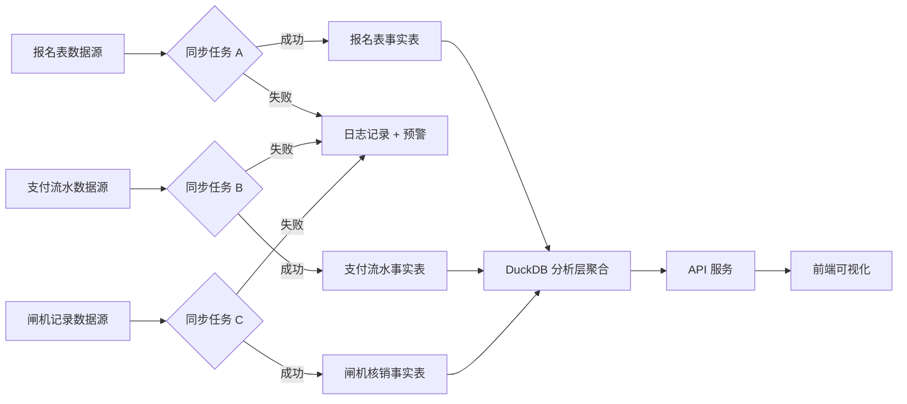

## 1. 产品概述

活动票务赞助权益风险监测系统是面向活动运营方的数据分析平台，用于实时监控票务销售、赞助权益兑现、入场核销全链路数据，及时发现异常风险。

- **核心目标**：通过可视化图表将赞助权益变化、核销效率、退票争议等关键指标直观呈现，辅助运营决策
- **目标用户**：活动运营经理、财务分析人员、赞助合作对接人
- **市场价值**：解决活动票务数据分散、赞助权益难以追踪、退票争议无据可查的行业痛点

## 2. 核心功能

### 2.1 功能模块划分

1. **总览看板**：核心指标卡片、赞助权益风险趋势、同环比概览
2. **取数链路监控**：报名表/支付流水/闸机记录同步状态、同步日志查看
3. **座位图分析**：区域座位热力、同环比对比、票种分布
4. **赞助权益监测**：赞助权益清单、权益兑现进度、点击跳转明细
5. **核销报表**：按核销效率/日期/区域多维度对比、核销口径说明
6. **票种规则排行**：票种销量排行、支持绝对值/占比切换
7. **退票争议中心**：退票样本跳转、争议详情、关联交易证据

### 2.2 页面详情

| 页面名称 | 模块名称 | 功能描述 |
|---------|---------|---------|
| 总览看板 | 核心指标卡片 | 总票量、已售率、核销率、赞助完成率、退票率 5 大 KPI，含环比箭头 |
| 总览看板 | 权益风险趋势图 | 近 30 天赞助权益兑现率与异常预警面积图 |
| 总览看板 | 实时同步链路 | 三个数据源节点 + 箭头流转动画 + 同步状态灯 |
| 取数链路监控 | 同步状态表 | 报名表/支付流水/闸机记录最近同步时间、记录数、延迟、状态 |
| 取数链路监控 | 同步日志抽屉 | 点击任务展开日志详情、支持按级别筛选 |
| 座位图分析 | 座位热力图 | 场馆分区域座位销售热力，颜色深浅代表销售率 |
| 座位图分析 | 同环比切换 | 可切换同比/环比视图，差异区域高亮标注 |
| 座位图分析 | 签到码趋势 | 签到码生成与核销折线图，同环比双轴 |
| 赞助权益监测 | 赞助清单表格 | 赞助商、权益类型、合同数量、已兑现、完成率、风险标签 |
| 赞助权益监测 | 明细跳转 | 点击赞助行跳转至权益明细页，展示每笔兑现记录 |
| 核销报表 | 效率对比柱图 | 各通道核销效率对比，支持按天/周聚合 |
| 核销报表 | 日期趋势 | 核销数量、核销率按日期变化折线图 |
| 核销报表 | 区域对比 | 场馆各区域核销率横向条形图 |
| 核销报表 | 口径说明面板 | 核销计算公式、数据来源、异常处理规则 |
| 票种规则排行 | 排行切换 | 绝对值/占比切换按钮，柱图/饼图联动切换 |
| 票种规则排行 | 票种详情 | 点击柱条展开票种规则、限购、价格区间 |
| 退票争议中心 | 退票分布图 | 退票量按日期分布，标注争议点（红色标记） |
| 退票争议中心 | 样本跳转 | 点击争议点直接跳转至该笔退票样本详情 |
| 退票争议中心 | 争议详情抽屉 | 报名信息、支付流水、闸机记录、操作日志全链路证据 |

## 3. 核心流程

### 3.1 数据同步流程

运营方每日定时同步三个数据源：报名表 → 支付流水 → 闸机记录，每一步记录同步日志，异常时触发预警标记。

### 3.2 退票争议排查流程

用户点击退票分布图上的争议标记 → 系统加载该笔退票关联的报名、支付、闸机、操作全链路数据 → 运营方核对证据链 → 标记争议处理状态。

## 4. 用户界面设计

### 4.1 设计风格

- **主色调**：深海蓝 `#0B1E3F` 作为数据大屏背景，搭配青蓝 `#00D4FF` 主数据色，橙色 `#FF8A00` 预警色，红色 `#FF3D57` 风险色
- **辅助色**：薄荷绿 `#00E396` 代表成功/正常，紫色 `#8B5CF6` 用于赞助权益模块
- **字体**：标题使用 `Chakra Petch` 科技感等宽字体，正文使用 `Inter` 无衬线字体
- **布局风格**：卡片式分区布局，带 1px 发光描边，深色毛玻璃背景，营造数据驾驶舱氛围
- **按钮样式**：4px 圆角，渐变背景，hover 时发光 + 轻微上浮
- **图标风格**：线性填充混合，统一 2px 描边，匹配 lucide-react 风格

### 4.2 页面设计概览

| 页面名称 | 模块名称 | UI 元素 |
|---------|---------|---------|
| 总览看板 | KPI 卡片 | 深色渐变背景 + 发光数字 + 环比小箭头 + 迷你趋势线 |
| 总览看板 | 同步链路 | 节点发光脉冲 + 连线流动粒子动画 + 状态标签 |
| 座位图分析 | 热力图 | SVG 多边形区域 + 颜色映射 + hover 浮动详情 |
| 核销报表 | 多图联动 | 柱图点击过滤其他图表 + 筛选器 chips |
| 退票争议中心 | 争议点 | 散点红色脉冲动画 + 点击展开抽屉滑入 |
| 全局 | 侧边导航 | 折叠式图标导航 + 激活项左侧发光竖条 |

### 4.3 响应式

- Desktop First 设计，最小支持宽度 1440px
- 1920px 以上适配更高分辨率图表布局
- 侧边栏在 1280px 以下折叠为图标模式
