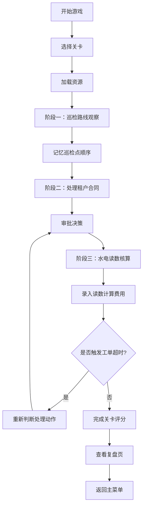

## 1. 产品概述

物业园区招商租户经营模拟游戏是一款面向物业管理人员培训的交互式教学游戏。玩家通过模拟处理园区巡检、租户合同审批、水电读数核算等真实业务场景，提升物业管理决策能力。

- 核心目标：通过游戏化方式培训物业管理人员的业务处理能力和决策判断力
- 目标用户：物业管理人员、招商人员、后勤行政人员
- 市场价值：降低培训成本，提高培训效率，提供可量化的能力评估

## 2. 核心功能

### 2.1 用户角色

| 角色 | 注册方式 | 核心权限 |
|------|----------|----------|
| 学员玩家 | 游戏启动直接进入 | 关卡挑战、成绩查看、复盘分析 |

### 2.2 功能模块

1. **主菜单页**：关卡选择、游戏设置、帮助说明
2. **加载页**：资源加载进度展示、操作提示
3. **巡检观察场景**：2D 园区地图、巡检路线展示、记忆挑战
4. **合同审批场景**：租户信息面板、合同条款、审批决策
5. **水电核算场景**：仪表读数、费用计算、评分系统
6. **工单处理系统**：报修工单、超时机制、重判逻辑
7. **复盘页**：历史决策记录、响应时间分析、成绩对比

### 2.3 页面详情

| 页面名称 | 模块名称 | 功能描述 |
|---------|---------|----------|
| 主菜单页 | 关卡列表 | 展示可用关卡，显示关卡难度和通关状态 |
| 主菜单页 | 设置面板 | 音效开关、操作方式选择（触屏/键盘）、难度设置 |
| 加载页 | 进度条 | 实时显示资源加载百分比，显示提示信息 |
| 巡检观察场景 | 园区地图 | 2D 俯视视角，展示建筑物、巡检点、路线动画 |
| 巡检观察场景 | 记忆测试 | 巡检路线隐藏后，玩家标记巡检点顺序 |
| 合同审批场景 | 租户卡片 | 展示租户类型、经营面积、租金报价、合同期限 |
| 合同审批场景 | 审批意见 | 预设审批选项，支持填写意见，记录决策时间 |
| 水电核算场景 | 仪表界面 | 模拟水电表读数，支持键盘和触屏输入 |
| 水电核算场景 | 评分面板 | 实时计算得分，显示准确度和效率评分 |
| 工单系统 | 工单弹窗 | 显示报修内容、剩余时间、紧急程度 |
| 工单系统 | 超时重判 | 超时后重置状态，需重新选择处理方案 |
| 复盘页 | 时间线 | 展示所有决策的时间节点和响应时长 |
| 复盘页 | 数据分析 | 报修响应变化趋势图、得分详情、改进建议 |

## 3. 核心流程

## 4. 用户界面设计

### 4.1 设计风格

- 主色调：深蓝色 (#1e3a5f) 作为主色，代表专业和可靠；橙色 (#ff6b35) 作为强调色，用于重要操作和提醒
- 中性色：深灰 (#2d3748)、中灰 (#718096)、浅灰 (#e2e8f0)、白色 (#ffffff)
- 按钮风格：圆角 8px，带有微妙阴影，悬停时有缩放和颜色加深效果
- 字体：标题使用 "Noto Sans SC" 粗体，正文使用 "Noto Sans SC" 常规
- 布局风格：卡片式布局，清晰的视觉层次，充足的留白
- 图标风格：线性图标，统一 24px 网格，颜色与主色调一致

### 4.2 页面设计概述

| 页面名称 | 模块名称 | UI 元素 |
|---------|---------|----------|
| 主菜单页 | 关卡列表 | 卡片式布局，每张卡片含关卡图标、名称、难度星级、完成状态 |
| 主菜单页 | 顶部导航 | Logo、设置按钮、帮助按钮 |
| 加载页 | 进度条 | 底部渐变色进度条，上方动态提示文字，背景园区剪影 |
| 巡检观察场景 | 地图区域 | 居中 2D 园区地图，建筑物使用不同颜色区分，巡检点闪烁动画 |
| 巡检观察场景 | 状态面板 | 右上角显示当前阶段、剩余时间、得分 |
| 合同审批场景 | 信息面板 | 左侧租户信息卡片，右侧合同条款滚动区，底部审批按钮组 |
| 水电核算场景 | 仪表组件 | 拟真水电表表盘，指针动画，数字输入框 |
| 工单系统 | 弹窗 | 侧边滑入式面板，倒计时进度条，紧急程度颜色标识 |
| 复盘页 | 时间线 | 垂直时间线，节点可点击展开详情，数据可视化图表 |

### 4.3 响应性

- 设计原则：桌面优先，移动端自适应
- 触屏优化：按钮最小尺寸 48x48px，增加触控反馈动画，支持手势操作
- 键盘支持：Tab 键导航、Enter 确认、方向键选择、数字键快捷输入
- 断点设计：
  - 桌面端 (≥1280px)：三栏布局
  - 平板端 (768px-1279px)：两栏布局
  - 移动端 (<768px)：单栏堆叠布局

### 4.4 2D 游戏场景设计

- 环境风格：现代简约商务园区风格，整洁的道路、绿化、办公楼宇
- 光照设置：顶部柔和光照，建筑物带有微妙阴影
- 摄像机设置：固定俯视视角，支持边界内平滑移动
- 动画效果：巡检点脉冲动画、路线绘制动画、人物行走动画
- 交互反馈：选中高亮、按钮按压效果、状态变化过渡动画
- 性能预算：单场景精灵数量控制在 200 以内，目标帧率 60fps
