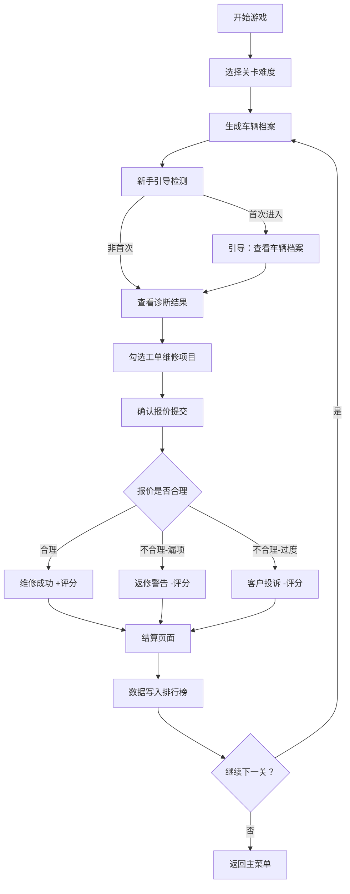

## 1. 产品概述

汽车维修报价经营模拟游戏 —— 一款用于演练汽车维修报价流程的经营模拟游戏。玩家扮演汽修店老板，通过诊断车辆故障、选择维修项目、合理报价来完成工单，平衡速度与质量，追求低返修率和高效率。

- **核心价值**：以游戏化方式训练汽车维修报价决策能力
- **目标用户**：汽修从业人员培训、汽车专业学生、汽修爱好者
- **市场定位**：专业培训类严肃游戏（Serious Game）

---

## 2. 核心功能

### 2.1 用户角色

| 角色 | 注册方式 | 核心权限 |
|------|----------|----------|
| 玩家 | 无需注册，本地存档 | 游戏进行、排行榜查看、数据保存 |

### 2.2 功能模块

1. **主菜单场景**：开始游戏、排行榜、新手引导、关卡选择
2. **游戏主场景**：车辆档案卡片、诊断结果面板、工单任务列表、报价操作区、结果即时反馈
3. **新手引导系统**：围绕车辆档案的分步引导、高亮提示、操作演示
4. **排行榜场景**：返修率排行榜、完成时间排行榜、玩家历史成绩
5. **结算场景**：单局评分、返修率统计、用时统计、奖励反馈

### 2.3 页面详情

| 页面名称 | 模块名称 | 功能描述 |
|----------|----------|----------|
| 主菜单 | 标题区 | 游戏 Logo、副标题、动态装饰动画 |
| 主菜单 | 功能按钮 | 开始游戏、排行榜、新手引导、重新开始 |
| 主菜单 | 关卡选择 | 难度等级选择、关卡进度展示 |
| 游戏主场景 | 车辆档案卡片 | 车辆信息展示（品牌、型号、里程、故障码、车主描述），支持键盘/触屏操作 |
| 游戏主场景 | 诊断结果状态 | 故障诊断进度、已确认故障项、待排查项 |
| 游戏主场景 | 工单项目任务 | 可勾选的维修项目列表、单项价格、工时、零件费用 |
| 游戏主场景 | 报价操作区 | 总价显示、提交报价按钮、返回修改 |
| 游戏主场景 | 结果即时反馈 | 报价通过/失败弹窗、返修警告、评分细则 |
| 游戏主场景 | 计时系统 | 关卡倒计时、用时统计 |
| 新手引导 | 引导遮罩 | 半透明遮罩 + 高亮目标区域 |
| 新手引导 | 引导提示 | 分步文字说明、箭头指示、操作确认 |
| 排行榜 | 返修率排行 | 按返修率从低到高排序、玩家名、成绩 |
| 排行榜 | 完成时间排行 | 按用时从短到长排序、玩家名、成绩 |
| 排行榜 | 个人记录 | 玩家历史最佳成绩展示 |
| 结算场景 | 评分面板 | 星级评分、费用准确度、返修预警、效率评分 |

---

## 3. 核心流程

### 3.1 游戏主流程

玩家进入游戏后，从主菜单选择关卡 → 系统随机生成车辆档案 → 玩家查看车辆档案 → 根据故障描述选择诊断项目 → 查看诊断结果 → 在工单列表中勾选必要的维修项目 → 系统自动计算报价 → 玩家确认提交 → 系统即时反馈结果（报价合理性、是否返修、得分）→ 完成后进入结算 → 数据写入排行榜。

### 3.2 流程图

---

## 4. 用户界面设计

### 4.1 设计风格

- **主色调**：深工业蓝 `#1E3A5F` 作为主色，橙红警示 `#E85D04` 作为强调色，金属灰 `#6B7280` 作为辅助色
- **按钮风格**：工业风圆角按钮，带有轻微 3D 立体效果和按压反馈
- **字体**：标题使用 `Orbitron`（科技感），正文使用 `Noto Sans SC`（可读性）
- **布局风格**：卡片式布局，左右分栏（左侧车辆档案+诊断，右侧工单+报价）
- **图标风格**：Lucide 线性图标，汽修主题（扳手、汽车、仪表盘、时钟等）

### 4.2 页面设计概览

| 页面名称 | 模块名称 | UI 元素 |
|----------|----------|---------|
| 主菜单 | 标题区 | 大号 Orbitron 字体，渐变发光效果，背景有齿轮缓慢旋转动画 |
| 主菜单 | 功能按钮 | 竖向排列大按钮，hover 时橙色发光，点击有压缩动画 |
| 游戏主场景 | 车辆档案卡片 | 深色金属质感卡片，左侧车辆图标，右侧信息网格，选中时有橙色描边脉冲动画 |
| 游戏主场景 | 诊断结果状态 | 进度条式展示，已确认项打勾（绿色），待排查项问号（闪烁） |
| 游戏主场景 | 工单任务列表 | 可勾选复选框列表，每项显示名称、价格、工时，hover 高亮 |
| 游戏主场景 | 报价区 | 大数字显示总价，提交按钮为醒目橙红色 |
| 游戏主场景 | 反馈弹窗 | 中心弹出，成功为绿色背景+对勾动画，失败为红色背景+警示图标 |
| 排行榜 | 排行列表 | 金银铜奖牌图标，前三名特殊高亮，滚动列表 |
| 结算场景 | 评分面板 | 星级动画展示，分项评分进度条，数据可视化 |

### 4.3 响应式

- **桌面优先**：主布局为左右双栏（车辆信息左，工单报价右）
- **平板适配**：上下堆叠布局，触控目标 ≥ 48px
- **触屏优化**：所有可交互元素支持点击/滑动，车辆档案卡片支持左右滑动切换
- **键盘支持**：Tab 切换焦点、Enter 确认、方向键选择项目、数字键快速勾选

### 4.4 物理场景设计（Matter.js）

- **环境氛围**：汽修车间背景，工具散落桌面，使用 Matter.js 实现物理交互
- **物理元素**：扳手、螺丝、齿轮等小物件可拖拽，具有真实物理碰撞效果
- **动画效果**：
  - 车辆档案卡片出现时有下落弹跳效果
  - 提交报价成功时有零件飞散的庆祝动画
  - 返修警告时有屏幕震动效果
- **交互设计**：拖拽维修零件到工单区域可快速添加项目
