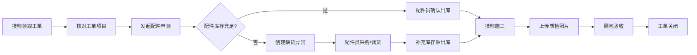
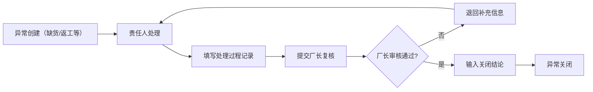

# 汽车维修保养提醒协同台 - 产品需求文档

## 1. 产品概述

汽车维修保养提醒协同台是面向汽修门店的一站式协同作业平台，整合保养提醒、工单管理、配件库存、报价核算、质检留痕、异常处理与经营统计于一体，消除微信群消息导致的状态确认滞后与信息断层问题。

- 目标用户：汽修门店的顾问、技师、配件员、厂长四类角色
- 核心价值：用系统状态流转替代人工群聊确认，让每一条工单、每一件配件、每一次异常都有明确的责任人与可追溯链路

---

## 2. 核心功能

### 2.1 用户角色与权限

| 角色 | 注册方式 | 核心权限 |
|------|----------|----------|
| 顾问 | 厂长创建账号 | 新建/编辑工单、录入客户与车辆、生成报价单、上传质检照片、查看统计看板、处理保养提醒 |
| 技师 | 厂长创建账号 | 领取/完成施工、核对工单项目、上传施工照片、标记配件需求、查看分配给自己的工单 |
| 配件员 | 厂长创建账号 | 管理配件库存、出入库登记、缺货异常登记、采购入库、复核材料来源 |
| 厂长 | 初始账号/自建 | 全功能权限、用户管理、返修率与经营统计、异常复核与关闭、系统配置 |

### 2.2 功能模块总览

1. **登录页**：账号密码登录、角色识别
2. **工作台（首页）**：今日工单概览、待办事项、保养提醒日历、异常状态速览、快捷入口
3. **工单管理**：工单列表（筛选/搜索/批量操作）、工单详情（项目/配件/照片/流转日志）、新建工单
4. **配件库存**：库存列表、出入库登记、低库存预警、缺货异常列表
5. **报价单**：报价列表、新建报价、关联工单、客户确认状态
6. **质检中心**：质检照片归档、按工单/时间浏览、质检通过标记
7. **异常管理**：异常列表（配件缺货等）、新建异常、处理过程记录、复核与关闭
8. **统计报表**：返修率趋势、工单完成率、配件周转率、从数据钻取到具体单据
9. **个人中心**：修改密码、个人信息

### 2.3 页面详情

| 页面名称 | 模块名称 | 功能描述 |
|----------|----------|----------|
| 登录页 | 登录表单 | 账号密码输入、登录按钮、错误提示 |
| 工作台 | 顶部导航 | 品牌 Logo、角色切换标识、全局搜索、消息通知、用户头像菜单 |
| 工作台 | 数据卡片 | 今日待处理工单数、待取件车辆数、未关闭异常数、本月返修率（带趋势箭头） |
| 工作台 | 保养提醒日历 | 月视图日历，标记保养到期车辆，点击查看详情与一键发送提醒 |
| 工作台 | 我的待办 | 按角色展示待办列表，可一键跳转处理 |
| 工作台 | 异常速览 | 展示 Top 5 未关闭异常，点击进入异常详情 |
| 工单列表 | 筛选栏 | 按状态/时间/顾问/技师/车牌号筛选 + 关键词搜索 |
| 工单列表 | 工单表格 | 行内展示关键信息，支持多选批量分配/批量改状态 |
| 工单列表 | 批量操作 | 批量分配技师、批量标记完成、批量导出 |
| 工单详情 | 基础信息 | 客户/车辆/顾问/技师/状态时间线 |
| 工单详情 | 工单项目 | 施工项目清单，带单价/工时/状态，支持逐项勾选完成 |
| 工单详情 | 配件清单 | 关联配件、数量、出库状态，缺货自动标红 |
| 工单详情 | 附件上传区 | 直接内嵌上传质检照片/施工凭证，拖拽上传，支持预览 |
| 工单详情 | 流转日志 | 完整操作记录（谁、什么时候、做了什么） |
| 配件库存 | 库存列表 | 配件名称/编码/分类/库存数/安全库存/单位，低库存高亮 |
| 配件库存 | 出入库登记 | 弹窗表单：选择配件 + 数量 + 来源/去向 + 关联工单 |
| 报价单 | 报价列表 | 客户/车辆/金额/状态（草稿/待确认/已确认/已作废） |
| 报价单 | 报价编辑 | 项目 + 配件明细自动算价，支持折扣，一键生成 PDF |
| 质检中心 | 照片墙 | 按工单分组，瀑布流展示质检照片，支持放大与下载 |
| 异常管理 | 异常列表 | 状态标签（待处理/处理中/待复核/已关闭）、类型（缺货/返工/客诉） |
| 异常管理 | 异常详情 | 材料来源、处理过程时间线、复核意见、关闭结论 |
| 统计报表 | 返修率分析 | 折线图（按月）+ 技师维度对比 + 下钻到具体返修工单列表 |
| 统计报表 | 经营概览 | 工单量/营业额/平均客单价 按月趋势 |
| 统计报表 | 配件排行 | 出库量 Top 10、缺货次数统计 |

---

## 3. 核心流程

### 3.1 保养提醒与工单创建流程

顾问在工作台看到保养提醒 → 联系客户确认到店 → 创建工单（录入客户/车辆/项目）→ 生成报价单 → 客户确认 → 分配技师 → 进入施工流程

### 3.2 工单执行与配件流程

技师领取工单 → 核对施工项目 → 需要配件时发起申领 → 配件员出库（或登记缺货异常）→ 完成施工 → 上传质检照片 → 顾问验收 → 工单关闭

### 3.3 异常复核流程

异常发生 → 责任角色处理 → 记录处理过程 → 厂长复核 → 输入关闭结论 → 异常关闭

---

## 4. 用户界面设计

### 4.1 设计风格

- **设计定位**：工业风 + 专业信任感，适合汽修门店高强度作业场景
- **主色调**：深蓝 `#1E3A5F`（专业稳重）+ 橙红 `#E85D28`（提醒/警示/行动）
- **辅助色**：松石绿 `#14B8A6`（成功/通过）、琥珀黄 `#F59E0B`（警告/待处理）、中性灰 `#64748B`
- **按钮风格**：方中带圆（圆角 6px），主按钮实底橙红配白字，次按钮描边
- **字体**：标题用 `Space Grotesk`（工业感几何字体），正文用 `Inter`，数字用 `JetBrains Mono`（等宽，工单编号/金额对齐）
- **布局风格**：左侧固定导航栏 + 顶部面包屑 + 主内容卡片式布局，数据密集区用紧凑表格
- **图标**：Lucide 图标库，统一 18px 线宽，悬停有轻微放大动画

### 4.2 页面设计概要

| 页面名称 | 模块名称 | UI 元素与风格 |
|----------|----------|---------------|
| 工作台 | 数据卡片 | 4 卡片横向排开，每张带标题 + 大号数字 + 趋势小箭头 + 迷你折线背景，深蓝渐变底 |
| 工作台 | 保养提醒日历 | 月历格子，到期车辆用橙红点标记，悬停浮层展示车辆/客户/电话，一键提醒按钮 |
| 工单列表 | 筛选栏 | 顶部横向排列，筛选项之间用竖线分隔，搜索框带放大镜图标 |
| 工单列表 | 工单表格 | 斑马纹行，状态用彩色胶囊标签，行悬停浅蓝底，行末更多操作下拉 |
| 工单详情 | 时间线 | 左侧竖线节点，右侧事件描述，不同状态节点用不同颜色圆点 |
| 工单详情 | 附件上传区 | 虚线圆角边框，拖拽进入变实边 + 浅蓝底，已上传图片 3 列网格缩略图 |
| 异常管理 | 异常卡片 | 彩色左侧边条（橙红=缺货/琥珀=返工），卡片内标题 + 状态标签 + 责任人 + 创建时间 |
| 统计报表 | 图表区 | ECharts 折线/柱状图，带图表标题 + 图例 + 数据点点击钻取 |
| 登录页 | 登录区 | 左侧深蓝品牌形象区（汽车线稿插画 + 标语），右侧白色登录表单区，居中 1:1 分割 |

### 4.3 响应式设计

- **桌面优先**：主设计面向 1440px 及以上屏幕，左侧导航 240px 固定宽度
- **平板适配**（1024px）：左侧导航折叠为图标栏（64px），表格支持横向滚动
- **移动适配**（< 768px）：顶部汉堡菜单展开导航，表格改为卡片列表，日历简化为列表视图
- **触摸优化**：移动端按钮最小高度 44px，点击区域充足

---
