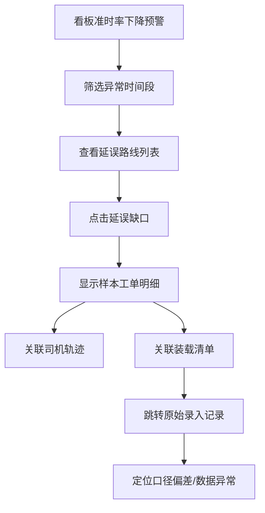

## 1. 产品概述

长租公寓维修派单趋势看板是一套面向长租公寓运营管理团队的数据分析系统，用于可视化维修派单全流程数据，支持运营复盘、准时率监控、异常追溯。系统通过整合CRM、支付流水、抄表数据、司机签到、轨迹回放等多源数据，提供口径差异明细对比、延误缺口回溯、异常点钻取等能力。

- 核心价值：数据驱动运营决策，提升维修派单准时率，减少口径偏差导致的运营风险
- 目标用户：运营总监、调度经理、数据分析团队、一线维修主管

## 2. 核心功能

### 2.1 用户角色

| 角色 | 登录方式 | 核心权限 |
|------|----------|----------|
| 运营管理员 | SSO账号登录 | 全功能访问，数据导出，异常处理 |
| 数据分析师 | SSO账号登录 | 数据查询，趋势分析，差异明细对比 |
| 维修调度 | SSO账号登录 | 路线计划查看，司机签到监控，装载清单管理 |

### 2.2 功能模块

1. **维修派单趋势总览**：派单量趋势、准时率趋势、异常类型分布、多维度筛选
2. **数据口径差异对比**：CRM与抄表数据差异明细、支付流水版本对比、冲突记录钻取
3. **路线计划与执行总览**：路线列表、计划 vs 实际对比、延误缺口高亮
4. **司机签到与轨迹回放**：签到状态监控、地图轨迹回放、时间点联动筛选
5. **装载清单与异常追溯**：装载清单明细、异常点标注、原始记录跳转

### 2.3 页面详情

| 页面名称 | 模块名称 | 功能描述 |
|-----------|-------------|---------------------|
| 趋势看板首页 | KPI指标卡片 | 显示今日派单量、准时率、延误数、异常数，支持同比环比 |
| 趋势看板首页 | 派单趋势图 | 按日/周/月展示派单量与准时率趋势，Recharts实现 |
| 趋势看板首页 | 异常类型分布 | 饼图展示各类异常占比（延误、取消、改派等） |
| 趋势看板首页 | 筛选器 | 时间范围、区域、维修类型、司机等多维筛选 |
| 数据对比页 | 口径差异总览 | CRM与抄表数据的差异数量、金额、涉及工单统计 |
| 数据对比页 | 差异明细表 | 逐条列出冲突记录，高亮差异字段，支持导出 |
| 数据对比页 | 支付流水版本 | 展示同一工单的多次支付记录变更历史 |
| 路线总览页 | 路线列表 | 按日期展示所有路线，计划与实际完成时间对比 |
| 路线总览页 | 延误缺口分析 | 标记延误路线，展示延误时间分布，可下钻到样本明细 |
| 路线总览页 | 准时率复盘 | 周/月准时率趋势对比，改善幅度可视化 |
| 司机轨迹页 | 签到状态面板 | 实时显示司机签到状态（已签到/未签到/异常） |
| 司机轨迹页 | 轨迹回放 | 地图轨迹播放，支持时间点联动筛选路线 |
| 装载清单页 | 装载清单列表 | 按路线展示物料装载明细 |
| 装载清单页 | 异常点解释 | 关联异常工单与装载清单的关系 |
| 装载清单页 | 原始记录跳转 | 每条明细可跳转至原始录入记录，排查口径偏差 |

## 3. 核心流程

### 3.1 主流程图

### 3.2 异常追溯流程

## 4. 用户界面设计

### 4.1 设计风格

- **主色调**：深邃蓝 (#0A1628) 作为背景基调，搭配科技青 (#00D4FF) 作为主强调色，琥珀橙 (#FFB020) 用于异常预警
- **辅助色**：成功绿 (#00C48C)、警告黄 (#FFD93D)、危险红 (#FF5C7A)
- **字体**：标题使用 Space Grotesk，正文字体使用 IBM Plex Mono（等宽数字便于数据阅读）
- **按钮样式**：扁平化设计，轻微圆角 (6px)，悬停时背景透明度变化 + 发光效果
- **布局风格**：仪表盘布局，左侧导航栏 + 顶部状态栏 + 主内容区卡片网格
- **图表风格**：深色背景，渐变填充，数据点发光效果，网格线半透明

### 4.2 页面设计概览

| 页面名称 | 模块名称 | UI 元素 |
|-----------|-------------|-------------|
| 趋势看板首页 | KPI 卡片 | 深色玻璃拟态卡片，渐变边框，数值动效 |
| 趋势看板首页 | 趋势图表 | 折线图叠加面积图，多系列对比，Tooltip 详情 |
| 趋势看板首页 | 分布饼图 | 环形图，中心显示总数，扇区悬停发光 |
| 数据对比页 | 差异表格 | 斑马纹行，差异单元格红色高亮，行悬停展开详情 |
| 路线总览页 | 甘特式时间条 | 计划时间灰色背景条，实际时间彩色条，重叠区域标注 |
| 司机轨迹页 | 地图面板 | 暗色底图，轨迹线渐变，签到点脉冲动画 |
| 装载清单页 | 明细表 | 可展开行，行内跳转链接，异常徽章 |

### 4.3 响应式设计

- 桌面端优先设计（1440px+）
- 1280px-1440px：紧凑布局，减少卡片间距
- 1024px-1280px：双列卡片，导航栏可折叠
- 移动端：单列布局，侧边栏收起为底部 Tab 栏

### 4.4 动效与交互

- 页面加载：卡片渐进式淡入（stagger 50ms）
- 图表数据：数值从 0 滚动到目标值（500ms）
- 悬停效果：卡片轻微上浮 + 发光边框
- 数据钻取：点击后平滑展开详情区域
- 轨迹回放：播放按钮脉冲，轨迹线渐进式绘制
