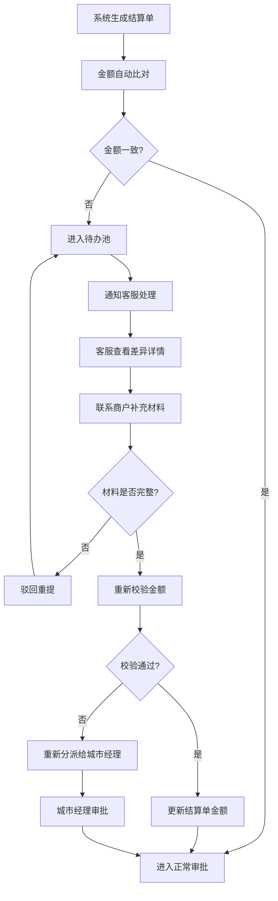

## 1. 产品概述

本地跑腿商户结算台是面向本地跑腿业务的专业化商户结算管理系统，旨在沉淀和管理商户结算数据，解决对账差异处理、合同附件管理、单据明细追溯等核心业务痛点。系统支持多级角色权限控制，实现从对账到审批再到回款的全流程数字化管理。

- **核心价值**：将分散的结算数据统一沉淀，实现对账差异自动化处理、审批流程可配置、操作留痕可追溯
- **目标用户**：商户、骑手、客服人员、城市经理，各角色拥有独立入口和差异化字段权限

## 2. 核心功能

### 2.1 用户角色

| 角色 | 登录方式 | 核心权限 |
|------|----------|----------|
| 商户 | 手机号+验证码 | 查看结算单、上传合同附件、补充差异材料、确认结算 |
| 骑手 | 手机号+验证码 | 查看个人配送单据、核对配送金额、提交异议 |
| 客服 | 工号+密码 | 处理对账差异、分派待办、驳回重提、金额校验留痕 |
| 城市经理 | 工号+密码 | 审批节点配置、查看全量报表、金额调整审批、人员权限管理 |

### 2.2 功能模块

1. **结算台首页**：数据概览卡片、待办池入口、快捷操作区
2. **对账差异中心**：差异列表、差异详情、金额对比、补充材料上传
3. **合同附件管理**：附件列表、上传下载、版本历史、关联单据
4. **单据明细查询**：单据列表、多维度筛选、明细导出、关联追溯
5. **审批节点配置**：流程可视化、节点配置、条件设置、角色分配
6. **金额校验留痕**：校验记录、修改前后对比、操作人、时间戳
7. **待办池管理**：待办列表、补充材料、驳回重提、重新分派
8. **报表中心**：回款周期报表、日期维度报表、负责人维度报表、下钻分析

### 2.3 页面详情

| 页面名称 | 模块名称 | 功能描述 |
|---------|----------|----------|
| 结算台首页 | 数据概览 | 展示待处理差异数、今日结算额、本月回款率、异常预警 |
| 结算台首页 | 待办池入口 | 按优先级展示待办事项，支持一键处理 |
| 对账差异中心 | 差异列表 | 分页展示差异记录，支持状态、金额、日期筛选 |
| 对账差异中心 | 差异详情 | 展示系统金额 vs 商户金额对比，差异原因标注 |
| 对账差异中心 | 金额不一致处理 | 自动进入待办池，而非仅弹窗提示 |
| 合同附件管理 | 附件列表 | 展示商户合同、协议文件，支持搜索和分类 |
| 合同附件管理 | 附件上传 | 拖拽上传，支持 PDF/图片格式，自动关联商户 |
| 单据明细查询 | 单据列表 | 展示订单、配送、结算单据，支持多条件筛选 |
| 单据明细查询 | 常用筛选 | 保存筛选条件，一键复用 |
| 审批节点配置 | 流程配置 | 可视化拖拽配置审批流程，设置条件分支 |
| 金额校验留痕 | 校验记录 | 记录所有金额修改操作，展示前后对比和操作人 |
| 待办池管理 | 待办处理 | 支持补充材料、驳回重提、重新分派操作 |
| 报表中心 | 多维度报表 | 按回款周期、日期、负责人下钻分析，支持导出 |

## 3. 核心流程

### 3.1 对账差异处理流程

### 3.2 审批流程

## 4. 用户界面设计

### 4.1 设计风格

- **主色调**：深邃藏蓝 `#1e3a5f`，代表专业和信任
- **辅助色**：警示橙 `#f59e0b`（差异提醒）、成功绿 `#10b981`（正常）、错误红 `#ef4444`（异常）
- **中性色**：冷灰系列 `#f8fafc` / `#e2e8f0` / `#64748b` / `#1e293b`
- **按钮风格**：微圆角（4px），悬停时背景加深 + 轻微上浮动效
- **字体**：标题使用 Noto Serif SC（稳重专业），正文使用 Noto Sans SC（清晰易读）
- **布局风格**：三栏式布局（左侧导航 + 中间主操作区 + 右侧配置栏）
- **图标**：lucide 线性图标，保持 16px/20px 两个标准尺寸

### 4.2 页面设计概述

| 页面名称 | 模块名称 | UI 元素 |
|---------|----------|---------|
| 结算台首页 | 数据概览 | 卡片式布局，渐变背景，数字微动效，状态指示灯 |
| 结算台首页 | 待办列表 | 表格展示，行悬停高亮，优先级标签颜色区分 |
| 对账差异中心 | 差异对比 | 左右分栏金额对比，差异部分红色高亮标注 |
| 对账差异中心 | 操作区 | 固定底部操作栏，主操作按钮突出 |
| 合同附件管理 | 附件卡片 | 网格布局，文件类型图标，悬停预览 |
| 单据明细查询 | 筛选栏 | 可折叠高级筛选，标签式常用筛选 |
| 审批节点配置 | 流程画布 | 可视化拖拽，节点连线，条件分支高亮 |
| 金额校验留痕 | 时间轴 | 纵向时间轴，对比卡片，操作人头像 |
| 待办池管理 | 待办卡片 | 状态标签，截止日期倒计时，操作按钮组 |
| 报表中心 | 图表区 | ECharts 柱状图/折线图组合，点击下钻动画 |

### 4.3 响应式设计

- **桌面优先**：最小支持 1366px 宽度，标准设计宽度 1920px
- **平板适配**：右侧配置栏可收起，中间操作区自适应
- **交互优化**：表格支持横向滚动，筛选条件支持移动端触控选择

### 4.4 视觉细节

- **背景纹理**：极细微噪点纹理叠加在浅色背景上，避免单调
- **卡片阴影**：多层阴影营造层次感，`box-shadow: 0 1px 2px rgba(0,0,0,0.04), 0 4px 12px rgba(0,0,0,0.06)`
- **微动效**：页面加载时元素错峰淡入（staggered reveal），表格行 hover 时轻微上浮
- **数据可视化**：金额差异使用红色渐变条直观展示差异幅度
