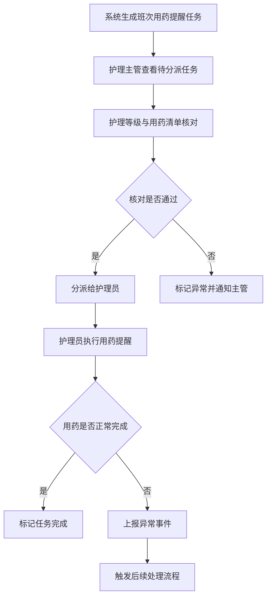
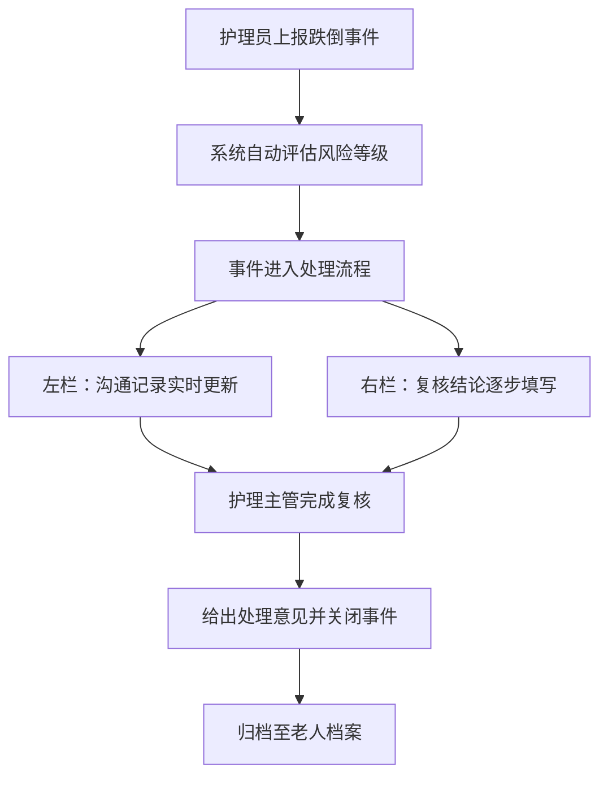

## 1. 产品概述

养老护理用药提醒任务分派台——面向养老机构的综合护理管理平台，核心解决老人用药提醒任务分派与追踪问题，同时覆盖老人档案管理、护理等级评定、探访记录、活动签到、跌倒事件处理及护理达标趋势分析等全流程场景。

- 目标用户：养老机构护理主管、一线护理员、管理层
- 核心价值：减少用药遗漏、规范护理流程、提升风险响应速度、量化护理达标率

## 2. 核心功能

### 2.1 用户角色

| 角色 | 注册方式 | 核心权限 |
|------|----------|----------|
| 护理主管 | 管理员分配账号 | 任务分派、护理等级评定、跌倒事件复核、趋势看板 |
| 护理员 | 管理员分配账号 | 执行用药提醒、探访记录、活动签到、跌倒上报 |
| 管理层 | 管理员分配账号 | 护理达标趋势、统计报表、风险概览 |

### 2.2 功能模块

1. **任务分派台（首页）**：按日常处理节奏（早班/午班/晚班）排列待办任务，用药提醒优先展示，支持快速操作
2. **老人档案管理**：老人基本信息、健康档案、护理等级、过敏史、紧急联系人
3. **用药提醒与核对**：用药清单管理、定时提醒触发、护理等级与用药清单交叉核对
4. **探访记录**：家属探访登记、探访频次统计
5. **活动签到**：老人日常活动参与签到、活动记录
6. **跌倒事件处理**：跌倒上报、风险等级标注、沟通记录与复核结论联动展示
7. **护理达标趋势看板**：护理达标率趋势图、各维度达标分析、异常预警

### 2.3 页面详情

| 页面名称 | 模块名称 | 功能描述 |
|----------|----------|----------|
| 任务分派台 | 班次任务列表 | 按早/午/晚班排列用药提醒任务，显示老人姓名、药品、时间、状态 |
| 任务分派台 | 快捷操作栏 | 一键完成用药确认、标记异常、快速跳转详情 |
| 老人档案列表 | 档案卡片列表 | 展示老人基本信息、护理等级徽标、风险等级标签（跌倒高危红色标注） |
| 老人档案详情 | 基本信息/健康档案/用药清单 | 分 Tab 展示老人完整信息，护理等级与用药清单核对区域 |
| 用药提醒管理 | 提醒列表 | 按时间线展示当日所有用药提醒，支持筛选与批量操作 |
| 用药提醒管理 | 核对面板 | 护理等级与用药清单交叉核对，标注不匹配项 |
| 探访记录 | 探访列表 | 家属探访记录列表，支持新增与查看详情 |
| 活动签到 | 签到面板 | 活动列表与老人签到状态，支持批量签到 |
| 跌倒事件列表 | 事件列表 | 跌倒事件列表，每条显示风险等级标签（高/中/低，红色/橙色/黄色） |
| 跌倒事件详情 | 沟通与复核双栏 | 左栏沟通记录（实时对话/备注），右栏复核结论（审核状态、处理意见） |
| 趋势看板 | 达标趋势图 | 折线图展示护理达标率周/月趋势，按维度拆解 |
| 趋势看板 | 异常预警 | 达标率下降预警、风险老人高亮 |

## 3. 核心流程

### 3.1 日常用药提醒分派流程

1. 系统按班次（早/午/晚）自动生成用药提醒任务
2. 护理主管在任务分派台查看待分派任务
3. 按护理等级和用药清单核对，确认无误后分派给护理员
4. 护理员执行用药提醒，记录完成状态
5. 异常情况（拒服、不良反应）上报，触发后续处理

### 3.2 跌倒事件处理流程

1. 护理员发现跌倒事件，立即上报
2. 系统自动标注风险等级（根据老人历史数据评估）
3. 进入事件详情页，左栏沟通记录实时更新，右栏复核结论逐步填写
4. 护理主管完成复核，给出处理意见
5. 事件关闭，归档至老人档案

## 4. 用户界面设计

### 4.1 设计风格

- 主色调：深青色（#0F766E）+ 暖灰色底（#F8FAFC），传递专业与关怀感
- 辅助色：风险等级使用红（#DC2626）/橙（#EA580C）/黄（#CA8A04）三色标注
- 按钮风格：圆角药丸型（rounded-full），主操作实色填充，次操作描边
- 字体：标题用 Noto Sans SC Bold，正文用 Noto Sans SC Regular，数据用 JetBrains Mono
- 布局：左侧固定导航栏 + 右侧内容区，卡片式布局，信息密度适中
- 图标：lucide-react 线性图标，统一 20px 尺寸

### 4.2 页面设计概览

| 页面名称 | 模块名称 | UI 元素 |
|----------|----------|---------|
| 任务分派台 | 班次任务列表 | 班次 Tab 切换，任务卡片（左老人头像+姓名，中药品+时间，右状态徽标），滚动列表 |
| 任务分派台 | 快捷操作栏 | 底部固定操作栏，完成/异常/跳转三个药丸按钮 |
| 老人档案列表 | 档案卡片 | 头像+姓名+年龄，护理等级彩色徽标，风险等级红色标签，卡片 hover 阴影提升 |
| 老人档案详情 | Tab 面板 | 三个 Tab（基本信息/健康档案/用药清单），信息分组卡片，核对区域高亮差异 |
| 用药提醒管理 | 时间线 | 垂直时间线，时间节点+任务卡片，状态色彩编码（待执行灰/进行中青/完成绿/异常红） |
| 跌倒事件列表 | 风险标签 | 列表行右侧风险等级色块标签，高危行左侧红色竖条 |
| 跌倒事件详情 | 双栏布局 | 左 55%沟通记录（气泡样式），右 45%复核结论（表单+审核流） |
| 趋势看板 | 图表区 | 折线图主图+维度筛选器，达标率数字大字展示，预警卡片悬浮 |

### 4.3 响应式设计

- 桌面优先（1440px 基准），支持 1280px 以上完整体验
- 平板端（768px-1280px）侧边栏收起为图标模式
- 移动端（<768px）底部导航替代侧边栏，卡片单列布局

### 4.4 动效设计

- 任务卡片进入：staggered fade-in + slide-up，animation-delay 递增 50ms
- 班次切换：Tab 内容区 cross-fade 过渡
- 风险标签：高危脉冲动画（pulse），中危呼吸动画
- 趋势图：数据点逐帧绘制动画
- 卡片 Hover：translateY(-2px) + shadow 扩展
