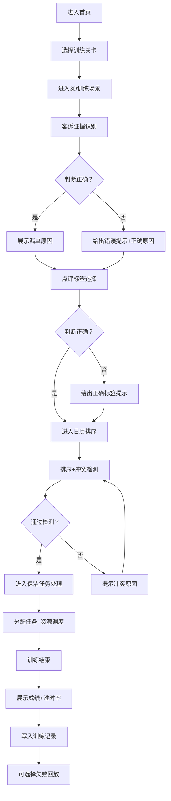

## 1. 产品概述

一款面向旅游民宿运营岗位培训的3D交互式解谜游戏，通过模拟真实的民宿保洁排班调度场景，训练学员的客诉处理、点评分析、日历排程和任务调度能力。学员在游戏中通过识别证据、选择标签、排序日历、处理任务来完成保洁调度，系统实时反馈漏单原因并记录训练成绩，支持失败回放复盘。

## 2. 核心功能

### 2.1 用户角色
| 角色 | 注册方式 | 核心权限 |
|------|----------|----------|
| 学员 | 系统分配账号 | 参与训练、查看成绩、回放复盘 |
| 管理员 | 系统分配账号 | 配置题目、素材、奖励、开放时间、训练模式 |

### 2.2 功能模块
1. **首页大厅**：训练入口、训练记录、排行榜、3D民宿场景预览
2. **训练关卡**：客诉证据识别、点评标签选择、房源日历排序、保洁任务处理
3. **训练记录**：成绩展示、准时率统计、错题复盘
4. **失败回放**：最近三次失败回放、犹豫点标记展示
5. **配置中心**：题目管理、素材管理、奖励配置、开放时间、训练模式

### 2.3 页面详情
| 页面名称 | 模块名称 | 功能描述 |
|----------|----------|----------|
| 首页大厅 | 3D场景预览 | 可交互的民宿3D场景，展示房源、保洁员、日历等元素 |
| 首页大厅 | 训练入口 | 展示可用训练关卡，显示难度、开放时间、奖励 |
| 首页大厅 | 训练记录 | 最近训练成绩、总体准时率、完成关卡数 |
| 客诉识别关卡 | 证据展示区 | 3D房间场景中展示客诉相关证据（污渍、破损、异味等） |
| 客诉识别关卡 | 证据选择 | 点击识别证据，判断是否为保洁漏单原因 |
| 客诉识别关卡 | 原因反馈 | 选择后系统给出正确/错误反馈及漏单原因解释 |
| 点评标签关卡 | 点评展示 | 展示住客点评文本，高亮关键词 |
| 点评标签关卡 | 标签选择 | 从预设标签中选择匹配的保洁问题标签 |
| 日历排序关卡 | 3D日历视图 | 房源日历3D可视化，展示入住/退房/保洁时间块 |
| 日历排序关卡 | 拖拽排序 | 拖拽保洁任务卡，按优先级和时间约束排序 |
| 日历排序关卡 | 冲突检测 | 实时检测时间冲突、人员冲突、准备时间不足 |
| 任务处理关卡 | 任务看板 | 展示待处理保洁任务列表（含优先级、时限、房源） |
| 任务处理关卡 | 3D房源导航 | 在3D场景中导航查看房源状态和保洁进度 |
| 任务处理关卡 | 任务分配 | 分配保洁员、设定优先级、处理突发任务 |
| 训练记录页 | 成绩概览 | 各关卡得分、总分、排名 |
| 训练记录页 | 准时率分析 | 保洁准时率趋势图、各维度准时率对比 |
| 失败回放页 | 回放列表 | 最近三次失败记录，展示失败时间、关卡、分数 |
| 失败回放页 | 回放播放器 | 逐步回放操作过程，标记犹豫点（停留时间>阈值） |
| 失败回放页 | 犹豫点分析 | 高亮犹豫决策点，提供正确解法提示 |
| 配置中心-题目 | 题库管理 | CRUD题目（客诉题、点评题、日历题、任务题），设置难度、分值 |
| 配置中心-素材 | 素材管理 | 上传3D模型、图片、音频素材，关联到题目 |
| 配置中心-奖励 | 奖励配置 | 设置积分、徽章、等级奖励规则 |
| 配置中心-时间 | 开放时间 | 设置各训练关卡的开放时间段、每日训练次数限制 |
| 配置中心-模式 | 训练模式 | 配置闯关模式、自由练习模式、模拟考核模式参数 |

## 3. 核心流程

### 3.1 训练流程
学员进入首页 → 选择训练关卡 → 进入3D训练场景 → 完成四类题目（证据识别→标签选择→日历排序→任务处理）→ 系统即时反馈对错与漏单原因 → 训练结束展示成绩 → 写入训练记录 → 可进入回放复盘。

### 3.2 配置流程
管理员登录 → 进入配置中心 → 选择配置模块（题目/素材/奖励/时间/模式）→ 编辑保存 → 即时生效。

## 4. 用户界面设计

### 4.1 设计风格
- **主色调**：深青色 `#0D4F4F`（专业、沉稳）+ 琥珀金 `#D4A24C`（高端、奖励）
- **辅助色**：薄荷绿 `#4CAF82`（成功/准时）、珊瑚红 `#E06C5C`（失败/延迟）
- **中性色**：暖灰白 `#F5F1EA`、炭灰 `#2A2A2A`
- **按钮风格**：圆角矩形（12px），微立体阴影，hover状态有发光描边
- **字体**：标题使用「思源宋体」（文化感），正文使用「思源黑体」（可读性）
- **布局风格**：左侧导航栏 + 主内容区，3D场景占主视觉，面板悬浮叠加
- **图标风格**：线性图标为主，搭配民宿主题emoji（🏠、🧹、📅、⭐）
- **整体美学**：新中式轻奢风，融合民宿温暖质感与专业训练工具的严谨感

### 4.2 页面设计概览
| 页面名称 | 模块名称 | UI元素 |
|----------|----------|--------|
| 首页大厅 | 3D场景预览 | 全幅3D民宿场景，相机缓慢环绕，鼠标悬停高亮交互点，暖色HDRI环境光 |
| 首页大厅 | 训练入口卡片 | 卡片式布局，左侧缩略3D场景，右侧关卡信息（名称、难度、奖励、开放状态），进度条 |
| 首页大厅 | 数据仪表盘 | 半透明玻璃态面板，大字展示准时率、训练次数、排名，环形进度图 |
| 训练关卡 | 3D场景区 | 占据屏幕2/3，可第一人称/第三人称切换，房间内证据点闪烁提示，点击放大 |
| 训练关卡 | 操作面板 | 右侧悬浮面板，题目描述、选项卡（证据/标签/日历/任务）、倒计时、提交按钮 |
| 训练关卡 | 反馈弹窗 | 居中模态框，成功/失败图标动画，原因解释文字，"继续"按钮 |
| 训练记录 | 统计图表 | ECharts折线图（准时率趋势）、柱状图（各维度对比）、雷达图（能力模型） |
| 失败回放 | 时间轴 | 底部时间轴拖动条，标记犹豫点为橙色圆点，播放/暂停/倍速控制 |
| 失败回放 | 犹豫点标签 | 场景内悬浮标签，显示"犹豫 3.2秒"，点击展开正确解法 |
| 配置中心 | 表单区域 | 左侧树形导航，右侧Tab表单，支持批量操作、预览模式 |

### 4.3 响应式
- **Desktop-first**：优先适配 1920×1080 和 1440×900 分辨率
- **平板适配**：1024px 断点，3D场景与操作面板上下布局
- **触控优化**：拖拽区域增大触控热区，按钮最小 44×44px

### 4.4 3D场景指引
- **环境/HDRI**：使用温暖室内HDRI，模拟午后阳光从窗户射入的效果，营造民宿氛围
- **灯光**：主光源DirectionalLight模拟阳光，PointLight模拟台灯，AmbientLight填充环境光，整体色温偏暖（3200K）
- **相机设置**：默认PerspectiveCamera，fov=50，首页为环绕轨道相机（OrbitControls），训练中可切换第一人称（PointerLockControls）
- **场景构图**：中心为房源3D模型（客厅+卧室+卫生间），背景虚化，焦点在证据点和任务交互区
- **交互动画**：证据点使用脉冲发光（emissive动画），正确选择时播放绿光+粒子效果，错误时红光抖动
- **后处理效果**：Bloom（发光效果）、SSAO（环境光遮蔽增强立体感）、Vignette（暗角聚焦）、FXAA抗锯齿
- **物理引擎**：Rapier用于保洁员角色碰撞检测、物体拾取、任务卡拖拽物理效果
- **素材来源**：使用程序化生成的低多边形3D模型（Box/Cylinder组合），外部贴图使用纯色+渐变纹理，性能预算单场景<5万面，draw call<100
