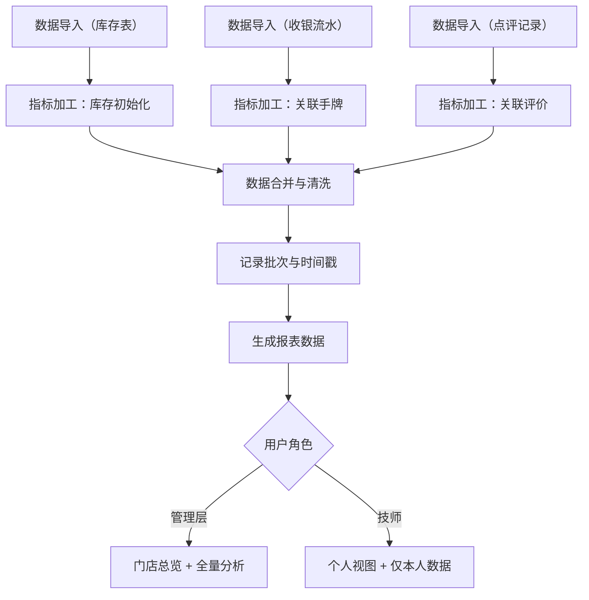

## 1. 产品概述

美业门店员工手牌漏斗报表系统，用于追踪美业门店的员工手牌流转和业绩数据。通过整合库存、收银流水、点评记录等多维度数据，为管理层提供全局总览，为技师提供个人产值视图，助力门店精细化运营和绩效分析。

- 解决美业门店员工绩效追踪不透明、库存与业绩脱节、客户反馈难以关联的问题
- 目标用户包括门店管理层（店长、老板）和一线服务技师

## 2. 核心功能

### 2.1 用户角色

| 角色 | 注册方式 | 核心权限 |
|------|----------|----------|
| 管理层 | 管理员账号创建 | 查看门店总览报表、所有技师数据、数据分析、数据导入管理 |
| 技师 | 管理员账号创建 | 仅查看个人负责的手牌和产值数据、添加耗材异常注释 |

### 2.2 功能模块

1. **登录页**：用户身份认证、角色识别
2. **管理层总览仪表盘**：门店整体业绩、技师排名、核心指标卡片
3. **个人技师视图**：个人手牌记录、产值统计、服务详情
4. **数据分析区**：消费记录分布、效果照片漏斗、库存领用排行、回访话术变化
5. **数据导入管理**：批次导入、导入历史、异常处理
6. **手牌漏斗追踪**：手牌从开单到完成的全流程追踪

### 2.3 页面详情

| 页面名称 | 模块名称 | 功能描述 |
|----------|----------|----------|
| 登录页 | 认证模块 | 账号密码登录、角色自动识别、会话管理 |
| 管理层总览 | 指标卡片 | 展示今日营收、服务人次、客单价、手牌完成率 |
| 管理层总览 | 技师排行 | 按产值、服务量、好评率排行的技师列表 |
| 管理层总览 | 手牌漏斗 | 从开单→服务中→已完成→已点评的转化漏斗 |
| 个人视图 | 我的产值 | 个人业绩统计、手牌列表、服务项目明细 |
| 个人视图 | 耗材异常 | 查看领用耗材、标记异常、添加备注 |
| 数据分析 | 消费分布 | 按项目、金额、时段的消费记录分布图表 |
| 数据分析 | 效果照片 | 服务前后照片上传与对比的转化漏斗 |
| 数据分析 | 库存排行 | 耗材领用排行、异常率统计 |
| 数据分析 | 回访话术 | 不同话术版本的客户响应率变化趋势 |
| 数据导入 | 批次管理 | 导入库存表、收银流水、点评记录，记录批次信息 |
| 数据导入 | 导入历史 | 查看历史导入批次、导入时间、数据量统计 |

## 3. 核心流程

数据加工流程：先处理库存表建立耗材基准，再合并收银流水关联服务项目，最后关联点评记录形成完整数据链路。每次数据导入记录批次号和时间戳，支持溯源。

手牌流转流程：

## 4. 用户界面设计

### 4.1 设计风格

- **主色调**：玫瑰金渐变（#B76E79 → #E8B4B8），体现美业优雅精致的品牌调性
- **辅助色**：深紫色（#2D1B33）用于文字和导航，暖金色（#C9A961）用于强调数据
- **背景色**：奶白色（#FDF8F5）搭配柔和的米色渐变，营造高端舒适感
- **按钮风格**：圆角矩形（12px），轻微阴影，hover 时有微妙的上浮动效
- **字体**：标题使用 Playfair Display（优雅衬线体），正文使用 Noto Sans SC（清晰易读）
- **布局风格**：卡片式布局，圆角边缘，柔和阴影，数据看板采用网格系统
- **图标风格**：线性图标，细线条，玫瑰金色调，与整体风格统一

### 4.2 页面设计概述

| 页面名称 | 模块名称 | UI 元素 |
|----------|----------|----------|
| 登录页 | 认证模块 | 玫瑰金渐变背景、玻璃态登录卡片、优雅的品牌标题、流畅的表单动效 |
| 管理层总览 | 指标卡片 | 四个核心指标卡片、数字动画增长、趋势箭头指示、悬浮显示详情 |
| 管理层总览 | 漏斗图 | 彩色分层漏斗、每段显示转化数值和百分比、hover 高亮效果 |
| 管理层总览 | 技师排行 | 排行榜样式、前三名特殊徽章、可切换排序维度 |
| 个人视图 | 我的产值 | 日历选择器、产值曲线图、手牌列表卡片、可展开详情 |
| 个人视图 | 耗材异常 | 耗材列表、异常标记按钮、注释输入框、时间线展示 |
| 数据分析 | 消费分布 | 环形图+柱状图组合、可筛选维度、交互式 tooltip |
| 数据分析 | 效果照片 | 漏斗图+照片缩略图、上传状态标识、转化率标注 |
| 数据分析 | 库存排行 | 横向条形图、异常率红色标记、可点击查看详情 |
| 数据分析 | 回访话术 | 多折线对比图、话术版本标签、趋势标注 |
| 数据导入 | 批次管理 | 拖拽上传区域、文件类型标签、导入进度条、批次编号生成 |
| 数据导入 | 导入历史 | 时间轴布局、批次卡片、数据量统计、状态标识 |

### 4.3 响应式设计

- **桌面优先**：针对 1440px 及以上屏幕优化，采用 12 列网格布局
- **平板适配**：1024px 断点，侧边栏折叠为图标导航，卡片重新排列
- **移动端**：768px 断点，底部 Tab 导航，卡片单列布局，图表简化展示
- **触控优化**：所有可点击元素最小 44x44px，支持手势滑动切换时间范围

### 4.4 动效设计

- 页面加载：卡片依次淡入（staggered animation），数字从 0 滚动到目标值
- 数据切换：图表平滑过渡，折线重新绘制动画时长 500ms
- 交互反馈：按钮点击有轻微缩放效果（scale: 0.98），卡片 hover 时轻微上浮
- 漏斗动画：每层依次填充，从下到上有微妙的渐变光效
