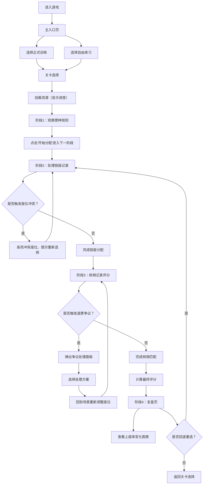

## 1. 产品概述

活动票务座位分配调度解谜游戏——通过模拟真实场馆票务运营场景，训练场馆经理进行座位资源优化配置的能力。玩家需按票种规则合理分配座位，处理锁座冲突与退票争议，最终达成最优上座率与收益目标。

- **核心目标**：以游戏化方式提升票务运营决策能力，涵盖票种规则理解、锁座冲突处理、核销评分复盘全流程
- **目标用户**：场馆运营经理、票务调度人员、活动管理从业者

## 2. 核心功能

### 2.1 用户角色

| 角色 | 注册方式 | 核心权限 |
|------|----------|----------|
| 场馆经理 | 本地访客（无需注册） | 选择训练模式、挑选关卡、进行游戏、查看复盘 |

### 2.2 功能模块

1. **主入口页面**：模式选择（正式训练/自由练习）、游戏介绍、操作指引
2. **关卡选择页面**：关卡列表、难度标识、解锁进度、最佳成绩
3. **票种规则阶段**：3D场馆可视化、票种分区规则说明、座位类型分布
4. **锁座处理阶段**：锁座记录列表、座位选择交互、冲突检测提示
5. **核销评分阶段**：核销记录匹配、实时分数计算、退票争议触发
6. **复盘页面**：上座率变化曲线、得分明细、可回退重选机制
7. **全局功能**：素材加载进度、触屏/键盘双操作支持、暂停菜单

### 2.3 页面详情

| 页面名称 | 模块名称 | 功能描述 |
|----------|----------|----------|
| 主入口页 | 模式选择卡片 | 大尺寸双卡片并排，正式训练（带评分/排名）和自由练习（可自定义参数）入口分离 |
| 主入口页 | 操作指引区 | 键盘快捷键列表、触屏手势说明、3D视角控制演示 |
| 关卡选择页 | 关卡网格 | 卡片式布局，展示关卡名称、难度星级、场景缩略图、历史最高分 |
| 关卡选择页 | 筛选工具栏 | 按难度筛选、按完成状态筛选、搜索框 |
| 游戏场景页 | 加载进度 | 百分比进度条+资源列表，展示3D模型/纹理加载状态 |
| 游戏场景页 | 3D场馆视图 | Three.js渲染的立体场馆，支持旋转/缩放/平移、座位颜色按票种区分 |
| 游戏场景页 | 阶段指示器 | 顶部横向步骤条：规则→锁座→核销→复盘，当前阶段高亮 |
| 游戏场景页 | 票种规则面板 | 左侧抽屉，展示票种名称、价格、座位区域、数量限制、特殊规则 |
| 游戏场景页 | 锁座记录面板 | 右侧列表，每条记录含订单号、票种、座位数、时间戳，点击可分配 |
| 游戏场景页 | 核销记录面板 | 右侧列表，含核销码、应到人数、实到座位，拖拽匹配评分 |
| 游戏场景页 | 退票争议弹窗 | 模态对话框，展示争议原因、受影响座位、可选择的处理方案 |
| 游戏场景页 | 评分HUD | 右上角实时分数、目标分数、已上座率、预计收益 |
| 复盘页面 | 上座率图表 | 时间轴折线图，展示各阶段上座率变化与最优解对比 |
| 复盘页面 | 得分明细 | 表格列出每个决策的得分/扣分点，支持点击回退重选 |
| 复盘页面 | 统计卡片 | 总上座率、收益达成率、冲突处理次数、退票率 |

## 3. 核心流程

## 4. 用户界面设计

### 4.1 设计风格

- **主色调**：深邃午夜蓝（#0F172A）为主背景，搭配琥珀金（#F59E0B）为强调色，营造高端场馆运营氛围
- **辅助色**：翡翠绿（#10B981）表示已售出/已核销，玫红（#F43F5E）表示冲突/退票，冷灰（#64748B）为中性状态
- **按钮风格**：微立体卡片式按钮，圆角 12px，悬停时上浮 2px + 柔光阴影，激活状态带琥珀色内发光
- **字体**：标题使用 "Space Grotesk" 无衬线粗体，正文使用 "JetBrains Mono" 等宽字体增强数据感
- **布局风格**：三栏式（左侧规则 | 中间3D场景 | 右侧操作面板），顶部阶段导航条 + 底部状态栏
- **图标风格**：Lucide 线性图标，与琥珀金强调色统一

### 4.2 页面设计概览

| 页面名称 | 模块名称 | UI 元素 |
|----------|----------|----------|
| 主入口页 | Hero 区域 | 深色渐变背景 + 3D场馆缩略图悬浮动画，大标题带打字机效果，双模式卡片带入场交错动画 |
| 主入口页 | 操作指引 | 折叠式卡片，键盘图标 + 快捷键文本，触屏手势用 SVG 示意图展示 |
| 关卡选择页 | 关卡网格 | 20px 间距的响应式网格，关卡卡片悬停时 3D 倾斜 + 光晕边框，已通关卡片带金色对勾徽章 |
| 关卡选择页 | 筛选栏 | 胶囊式筛选按钮组，搜索框带琥珀色聚焦边框 |
| 游戏场景页 | 加载界面 | 全屏深色遮罩，居中大百分比数字动态变化，下方资源列表逐条淡入完成标记 |
| 游戏场景页 | 3D 场景 | 场馆模型使用 PBR 材质，座位用 InstancedMesh 优化性能，选中座位有外发光 + 轻微上浮动画 |
| 游戏场景页 | 阶段条 | 顶部固定横向步骤条，节点用圆形徽章，连接线使用动画流光效果指示进度 |
| 游戏场景页 | 侧边面板 | 毛玻璃背景（backdrop-blur）+ 半透明深蓝边框，滑入/滑出动画，面板内卡片带分区阴影 |
| 游戏场景页 | 退票弹窗 | 居中模态框 + 背景模糊，标题带警告图标，选项卡片悬停高亮，确认按钮琥珀色脉冲动画 |
| 游戏场景页 | 评分 HUD | 右上角浮动卡片，数字使用动态计数动画，达标时边框变绿闪烁 |
| 复盘页面 | 图表区 | 折线图使用渐变填充，关键节点带圆形标记，悬停显示 tooltip，对比线用虚线表示最优解 |
| 复盘页面 | 明细区 | 斑马纹表格，错误行标红背景，可点击行高亮 + "回退至此"按钮淡入 |
| 复盘页面 | 统计卡片 | 四个数值卡片横向排列，大数字 + 趋势小箭头，达标数值带绿色光环 |

### 4.3 响应式设计

- **桌面端（≥1024px）**：三栏布局（左22% | 中56% | 右22%），侧边面板固定宽度，3D场景自适应
- **平板端（768px-1024px）**：左右面板改为可折叠抽屉，3D场景占满，通过底部标签栏切换面板
- **移动端（<768px）**：纵向流式布局，3D场景在上占60vh，面板通过底部Tab切换，触摸手势优化：双指缩放、单指旋转、长按选中
- **触屏操作**：点击座位选中，滑动旋转视角，捏合缩放，双击重置视角；长按弹出座位详情
- **键盘操作**：WASD/方向键平移，Q/E旋转，+/-缩放，Space确认，Esc取消，Tab切换面板，1-4数字键快速跳转阶段

### 4.4 3D 场景指导

- **环境与氛围**：HDRI 环境贴图使用室内暖光氛围，场馆内部使用聚光灯模拟舞台灯效果，观众席用柔和区域光
- **光照设置**：AmbientLight（强度0.4）+ DirectionalLight（主光，带阴影）+ 若干 SpotLight 模拟区域照明，阴影贴图分辨率 2048
- **相机设置**：初始使用 PerspectiveCamera（fov 50），位置在场馆后方偏上俯视角度；OrbitControls 启用阻尼效果，限制最大俯仰角避免穿模
- **场景构成**：
  - 舞台区： elevated 平台 + 红色幕布装饰
  - 观众席：分多层阶梯排列，使用 InstancedMesh 批量渲染座位（每个座位含椅面、椅背几何体）
  - 过道：深灰色材质，带发光指示线
  - 墙面：磨砂金属 + 吸音板纹理
- **交互与动画**：
  - 座位悬停：颜色轻微变亮 + 垂直上浮 3px
  - 座位选中：琥珀色外发光（Emissive材质）+ 持续呼吸动画
  - 冲突座位：红色闪烁 + 震动动画（position轻微抖动）
  - 视角切换：阶段切换时相机平滑飞行到预设观察点
- **后期效果**：Bloom 发光效果（座位选中发光）+ 轻微 Vignette 暗角 + ACES 色调映射
- **资源来源**：使用程序化几何体生成座位和场馆结构，无需外部模型资源；纹理使用 Canvas 程序化生成；性能预算：Draw Call < 100，Triangle < 200k
