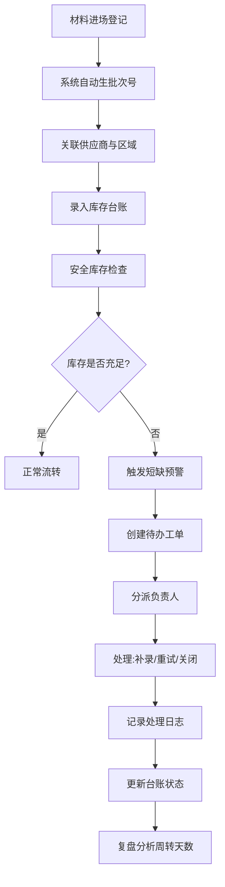

## 1. 产品概述

家装工地材料进场跟进台是面向家装行业的专业材料管理系统，解决工地材料进场混乱、库存不清、短缺追溯难等痛点。通过系统化管理供应商、库存、领用、盘点全流程，实现材料全生命周期可追溯。

- 目标用户：家装公司管理人员（配置规则）、工地一线人员（处理库存）、项目经理（复盘分析）
- 核心价值：提升材料周转效率、降低损耗、短缺可追溯、数据驱动决策

## 2. 核心特性

### 2.1 用户角色

| 角色 | 登录方式 | 核心权限 |
|------|----------|----------|
| 管理人员 | 账号密码登录 | 供应商字典维护、领用规则配置、盘点差异阈值设置、全局数据查看 |
| 一线人员 | 账号密码登录 | 安全库存管理、库存台账操作、材料领用登记、批次短缺处理 |
| 项目经理 | 账号密码登录 | 周转天数分析、数据复盘、处理记录回溯、报表导出 |

### 2.2 功能模块

1. **工作台仪表盘**：库存概览、待办短缺、周转效率、异常预警
2. **库存台账**：材料入库/出库/调拨全记录、批次追溯、组合查询
3. **安全库存管理**：库存预警线设置、实时库存监控、补货提醒
4. **供应商管理**：供应商信息字典、联系人、材料品类、评价等级
5. **规则配置中心**：领用记录规则、盘点差异阈值、审批流程配置
6. **批次短缺待办**：短缺触发自动分派、处理记录、补录/重试/关闭回溯
7. **复盘分析**：周转天数分析、区域对比、负责人KPI、趋势图表

### 2.3 页面详情

| 页面名称 | 模块名称 | 功能描述 |
|-----------|-------------|---------------------|
| 工作台 | 数据概览卡片 | 库存总览、在途批次、待办短缺数、周转天数均值、异常预警列表 |
| 工作台 | 快捷操作区 | 快速入库、快速领用、短缺上报入口 |
| 库存台账 | 高级筛选区 | 状态、日期范围、区域、负责人、材料品类多条件组合查询 |
| 库存台账 | 台账列表 | 批次号、材料名称、规格、数量、区域、负责人、状态、出入库时间 |
| 库存台账 | 批次详情 | 批次全链路追踪：入库→领用→盘点→短缺处理时间线 |
| 安全库存 | 库存监控看板 | 各区域各材料实时库存、预警线标识、补货倒计时 |
| 安全库存 | 补货建议 | 基于消耗速率自动计算补货量和补货时间 |
| 供应商管理 | 供应商列表 | 供应商基础信息、供应品类、合作等级、联系人信息 |
| 供应商管理 | 供应商详情 | 合作历史、交付准时率、材料质量评分 |
| 规则配置 | 领用规则 | 领用限额、审批层级、特殊材料领用要求 |
| 规则配置 | 差异阈值 | 盘点允许误差范围、超额预警阈值 |
| 短缺待办 | 待办列表 | 按优先级排序的短缺任务、分派状态、处理时限 |
| 短缺待办 | 处理记录 | 补录、重试、关闭等操作的完整审计日志 |
| 复盘分析 | 周转天数分析 | 按材料/区域/负责人维度的周转天数统计与对比 |
| 复盘分析 | 趋势图表 | 月度周转趋势、短缺频次趋势、库存利用率趋势 |

## 3. 核心流程

### 3.1 材料进场流程

材料进场→扫码登记批次→关联供应商→分配区域→录入数量/规格/负责人→系统自动计算预计周转天数→库存台账更新→触发安全库存检查

### 3.2 批次短缺处理流程

库存盘点/领用检查→发现批次短缺→系统自动创建短缺工单→分派负责人→推送待办通知→负责人处理（补录/重试/关闭）→记录处理过程→更新台账状态→复盘分析

## 4. 用户界面设计

### 4.1 设计风格

- **主色调**：工业蓝 `#1e40af`（专业可靠），警示橙 `#ea580c`（短缺预警），成功绿 `#059669`（正常状态）
- **中性色**：深灰 `#1f2937` 作为主文字，中灰 `#6b7280` 辅助文字，浅灰 `#f3f4f6` 背景
- **按钮风格**：直角硬朗风格，4px圆角，hover时上浮+阴影增强，强调工业感
- **字体**：显示字体用 "Space Grotesk" 突出数据感，正文字体用 "Inter" 保证可读性
- **布局风格**：卡片式布局，数据网格为主，左侧固定导航栏，顶部状态栏
- **图标风格**：lucide-react 线性图标，保持简洁专业

### 4.2 页面设计概述

| 页面名称 | 模块名称 | UI元素 |
|-----------|-------------|-------------|
| 工作台 | 数据概览卡片 | 渐变背景卡片、大数字指标、趋势小图表、状态徽章、动画数字滚动 |
| 库存台账 | 高级筛选区 | 标签式筛选器、日期范围选择器、下拉多选、折叠/展开、保存筛选方案 |
| 库存台账 | 台账列表 | 斑马纹表格、固定表头、可排序列、行悬停高亮、状态标签颜色区分 |
| 批次详情 | 时间线追踪 | 垂直时间线、节点状态图标、操作人信息、时间戳、操作备注 |
| 短缺待办 | 待办列表 | 卡片式待办、优先级角标、倒计时、处理操作按钮、展开式详情 |
| 复盘分析 | 图表区域 | ECharts折线图/柱状图、可切换维度、数据钻取、导出功能 |

### 4.3 响应式设计

- 桌面端优先设计（1280px+），侧边栏固定260px
- 平板端（768px-1279px）：侧边栏可折叠，表格横向滚动
- 移动端（<768px）：底部导航，卡片式列表，筛选抽屉

### 4.4 动效设计

- 页面加载：卡片渐入+轻微上移，staggered动画延迟
- 数据更新：数字滚动动画，状态变化闪烁提示
- 短缺预警：脉冲动画提醒，红色呼吸灯效果
- 表格行：悬停时背景色渐变过渡，展开详情平滑过渡
- 时间线：节点状态变更时的打点动画
