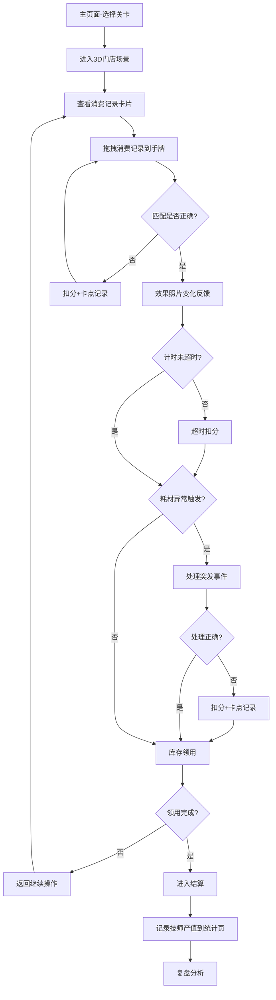

## 1. 产品概述

美业门店员工手牌调度解谜游戏——一款面向美容美发门店管理者和员工的3D交互式培训工具，通过模拟真实门店场景中的手牌调度、消费记录分配、库存领用与耗材异常处理，帮助玩家训练手牌判断与决策能力。

- 核心目标：将门店手牌调度流程游戏化，通过关卡训练提升技师排班、消费匹配与突发事件应对能力
- 目标用户：美容美发连锁门店店长、前台调度、新入职技师

## 2. 核心功能

### 2.1 用户角色

| 角色 | 进入方式 | 核心权限 |
|------|----------|----------|
| 玩家（学员） | 直接进入 | 闯关游玩、查看个人统计与复盘 |
| 管理员 | 密码进入 | 配置关卡难度/道具冷却/成就规则、查看全员数据 |

### 2.2 功能模块

1. **主页面**：3D门店场景入口、关卡选择、成就展示
2. **游戏页面**：3D交互场景（拖拽消费记录、效果照片变化、计时任务、库存领用、突发事件）
3. **结算页面**：关卡完成结算、得分与评级
4. **统计页面**：技师产值汇总、训练数据总览
5. **复盘页面**：按关卡比较训练结果、卡点分析、技师产值对比

### 2.3 页面详情

| 页面名称 | 模块名称 | 功能描述 |
|----------|----------|----------|
| 主页面 | 关卡选择 | 展示可用关卡列表，难度标签，锁定/解锁状态 |
| 主页面 | 成就展示 | 已获得成就徽章，进度条 |
| 主页面 | 快速入口 | 进入上次关卡、查看统计、管理配置 |
| 游戏页面 | 3D门店场景 | 可旋转/缩放的3D门店，包含工位、手牌架、库存柜 |
| 游戏页面 | 消费记录拖拽 | 3D空间中可拖拽的消费卡片，拖到对应技师手牌上完成匹配 |
| 游戏页面 | 效果照片变化 | 匹配后效果照片动态变化（如护理前后对比），提供视觉反馈 |
| 游戏页面 | 计时任务 | 倒计时进度条，超时扣分，紧急任务加急提示 |
| 游戏页面 | 库存领用 | 从库存柜中选取耗材，拖到技师工位，完成领用后进入结算 |
| 游戏页面 | 耗材异常事件 | 随机触发突发事件（耗材过期、库存不足、型号错误），需快速处理 |
| 游戏页面 | 道具系统 | 提示卡、时间冻结、自动匹配等道具，有冷却时间 |
| 结算页面 | 得分评级 | 星级评定、用时、准确率、异常处理得分 |
| 结算页面 | 产值记录 | 将技师产值写入统计页 |
| 统计页面 | 技师产值 | 各技师在各关卡的产值数据表/图 |
| 统计页面 | 训练总览 | 总完成关卡数、平均用时、平均准确率 |
| 复盘页面 | 关卡对比 | 选择多个关卡，对比训练结果（产值、用时、卡点） |
| 复盘页面 | 卡点分析 | 标记玩家在哪些环节犹豫/犯错最多，可视化展示 |
| 复盘页面 | 技师产值对比 | 柱状图/雷达图对比不同技师在各关卡的表现 |

## 3. 核心流程

玩家从主页面选择关卡进入3D门店场景，在场景中完成以下流程：
1. 查看待分配的消费记录卡片
2. 拖拽消费记录到对应技师的手牌上（手牌判断训练）
3. 观察效果照片变化，确认匹配正确性
4. 在计时限制内完成所有消费记录分配
5. 处理随机出现的耗材异常突发事件
6. 完成库存领用操作
7. 进入结算，获得评分与技师产值记录
8. 在复盘页面分析训练结果

## 4. 用户界面设计

### 4.1 设计风格

- **主色调**：玫瑰金 #B76E79 + 深棕 #3E2723，营造高端美业氛围
- **辅助色**：象牙白 #FFFFF0、翡翠绿 #50C878（成功反馈）、琥珀橙 #FFBF00（警告/计时）
- **按钮风格**：圆角胶囊按钮，带微光投影，hover时轻微浮起
- **字体**：标题用 Playfair Display（衬线、优雅），正文用 Noto Sans SC（中文清晰）
- **布局风格**：左侧3D主场景，右侧半透明面板叠层显示任务/道具/计时
- **图标风格**：线性图标 + 微渐变填充，尺寸24px

### 4.2 页面设计概览

| 页面名称 | 模块名称 | UI要素 |
|----------|----------|--------|
| 主页面 | 关卡选择 | 深色背景，关卡卡片带发光边框，锁定关卡灰度化，横向滚动 |
| 主页面 | 成就展示 | 网格排列成就徽章，已获得金色高亮，未获得灰色轮廓 |
| 游戏页面 | 3D门店场景 | 中央3D视口，暖色点光源，HDRI环境贴图，可旋转/缩放 |
| 游戏页面 | 消费记录 | 3D浮动卡片，圆角矩形，半透明磨砂材质，可拖拽带轨迹 |
| 游戏页面 | 效果照片 | 匹配成功后2D面板淡入，左右对比（前/后），3秒自动消失 |
| 游戏页面 | 计时进度条 | 顶部横条，渐变色从绿→黄→红，最后10秒脉冲闪烁 |
| 游戏页面 | 库存柜 | 3D柜体模型，抽屉可点击打开，拖出耗材到工位 |
| 游戏页面 | 突发事件弹窗 | 红色边框半透明面板，从右侧滑入，倒计时紧迫感 |
| 游戏页面 | 道具栏 | 底部横向排列，道具图标+冷却遮罩动画，点击激活 |
| 结算页面 | 星级评定 | 大号星星图标（1-3星），金色动画填充 |
| 统计页面 | 产值图表 | 柱状图/折线图，配色与主题一致 |
| 复盘页面 | 卡点热力图 | 时间轴热力图，红色标记犹豫/错误时段 |
| 复盘页面 | 关卡对比 | 雷达图对比多个维度（速度、准确率、产值、异常处理） |

### 4.3 响应式设计

- 桌面优先设计，3D场景在大屏展示完整交互
- 平板适配：右侧面板收折为底部抽屉
- 不支持移动端（3D拖拽交互需要精确指针）

### 4.4 3D场景指导

- **环境/HDRI**：室内暖色调环境贴图，模拟高端美容院灯光氛围
- **灯光设置**：主方向光（暖白，强度1.2）+ 4个点光源（壁灯效果，暖黄）+ 环境光（低强度填充）
- **相机设置**：透视相机，FOV 50°，初始俯视45°角，OrbitControls限制极角
- **构图与焦点**：中心为手牌架/工位区域，消费卡片浮动在前景，库存柜在背景
- **交互与动画**：卡片拖拽带弹性跟随，匹配成功粒子爆发效果，手牌发光脉冲
- **后处理效果**：Bloom（手牌高光）、Vignette（聚焦中心）、SSAO（场景深度感）
- **资源与性能**：目标60fps，几何体面数<5000/物体，纹理最大512px，使用实例化渲染重复物体
