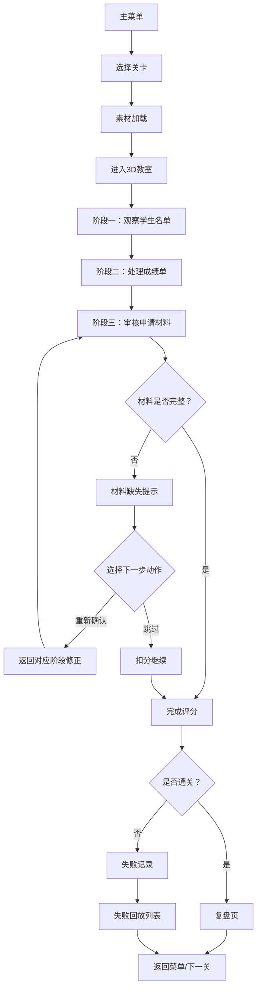

## 1. 产品概述

高校教务成绩复核调度解谜游戏是一款以大学教务工作为背景的 3D 解谜游戏。玩家扮演教务助理，需要在规定时间内完成学生成绩复核工作，通过观察学生名单、处理成绩单、审核申请材料三个阶段完成关卡，触发材料缺失时需重新规划动作，最终在复盘页查看教室利用率变化。

- **目标用户**：高校教务人员培训、解谜游戏爱好者
- **核心价值**：在沉浸式 3D 环境中体验教务工作流程，锻炼逻辑调度能力
- **游戏定位**：严肃游戏 + 解谜玩法，兼具教育性与娱乐性

## 2. 核心功能

### 2.1 用户角色

| 角色 | 进入方式 | 核心权限 |
|------|----------|----------|
| 玩家 | 直接进入游戏 | 体验全部关卡、查看复盘数据、回放失败记录 |

### 2.2 功能模块

1. **主菜单**：开始游戏、关卡选择、设置、关于
2. **游戏关卡**：3D 教室场景 + 成绩复核流程
3. **加载进度**：素材加载可视化进度条
4. **复盘页面**：教室利用率变化图表、操作记录回顾
5. **失败回放**：保留最近三次失败记录，可回放查看卡点

### 2.3 页面详情

| 页面名称 | 模块名称 | 功能描述 |
|-----------|-------------|---------------------|
| 主菜单页 | 标题与背景 | 3D 教室预览背景，游戏标题动效 |
| 主菜单页 | 功能按钮 | 开始游戏、关卡选择、设置、操作说明 |
| 加载页 | 进度条 | 素材加载百分比、加载提示文字 |
| 游戏页 | 3D 场景 | 可交互教室环境、课桌椅、讲台 |
| 游戏页 | 学生名单 | 第一阶段：浏览学生基本信息 |
| 游戏页 | 成绩单 | 第二阶段：匹配学生与成绩数据 |
| 游戏页 | 申请材料 | 第三阶段：审核材料完整性 |
| 游戏页 | HUD 界面 | 计时器、得分、当前阶段、操作提示 |
| 游戏页 | 材料缺失提示 | 弹窗提示缺失材料，选择下一步动作 |
| 复盘页 | 利用率图表 | 教室利用率随时间变化曲线 |
| 复盘页 | 操作记录 | 玩家所有操作的时间线记录 |
| 失败回放页 | 回放列表 | 最近三次失败记录卡片 |
| 失败回放页 | 回放播放 | 逐帧/倍速回放失败过程，标注卡点 |
| 设置页 | 操作设置 | 键盘/触屏操作方式切换、灵敏度调节 |

## 3. 核心流程

玩家进入游戏后，选择关卡开始。首先加载 3D 素材并显示进度。进入教室场景后，按顺序经历三个阶段：观察学生名单 → 处理成绩单 → 审核申请材料。每个阶段需在限定时间内完成正确操作，触发材料缺失时需选择正确的应对方式。关卡结束后进入复盘页查看数据，失败则记录并可回放。

## 4. 界面设计

### 4.1 设计风格

- **设计方向**：学术复古 + 现代简约，木质教室纹理配合扁平化 UI
- **主色调**：深木棕 `#5D4037`、象牙白 `#FAFAFA`、墨绿 `#2E7D32`、金黄 `#F9A825`
- **辅助色**：天蓝 `#1976D2`（提示）、砖红 `#C62828`（警告/错误）
- **字体**：标题使用 Lora（衬线字体，学术感），正文使用 Inter（清晰易读）
- **按钮风格**：微立体圆角按钮，悬停有微妙上浮动效
- **图标风格**：线性 + 填充混合，学院风格图标

### 4.2 页面设计概览

| 页面名称 | 模块名称 | UI 元素 |
|-----------|-------------|-------------|
| 主菜单页 | 标题区 | 大字号衬线标题、副标题淡入动画 |
| 主菜单页 | 按钮区 | 垂直排列的木纹按钮，悬停发光效果 |
| 加载页 | 进度区 | 木质进度条、羊皮纸风格加载提示 |
| 游戏页 | 3D 场景 | 第一人称视角教室，可环视和移动 |
| 游戏页 | HUD | 顶部状态栏（时间/分数）、底部操作栏 |
| 游戏页 | 面板 | 可展开/收起的半透明毛玻璃面板 |
| 复盘页 | 图表区 | 折线图 + 数据卡片网格 |
| 失败回放页 | 时间轴 | 可拖动的时间轴滑块，卡点标记 |

### 4.3 响应式设计

- **桌面端优先**：完整 3D 场景 + 键鼠操作
- **平板适配**：保留 3D 场景，UI 元素放大，虚拟摇杆控制
- **手机适配**：简化 3D 视角为固定视角，触屏点击交互为主
- **触屏优化**：按钮最小触控区域 48x48px，支持手势滑动切换面板

### 4.4 3D 场景指引

- **环境**：典型大学教室，阳光从左侧窗户照入，空气中有微尘
- **光照**：主光（方向光模拟阳光）+ 环境光 + 补光，营造温暖下午氛围
- **相机**：第一人称视角，可水平旋转 360°，俯仰 ±60°，有限移动范围
- **构图**：讲台在前方中央，学生课桌椅成排排列，两侧有窗户和公告栏
- **交互**：可点击课桌查看学生信息，可拿起/放下文件，按钮式交互
- **后处理**：轻微泛光、色彩校正、环境光遮蔽，提升沉浸感
- **素材**：低多边形风格 3D 模型，压缩纹理，控制加载体积
