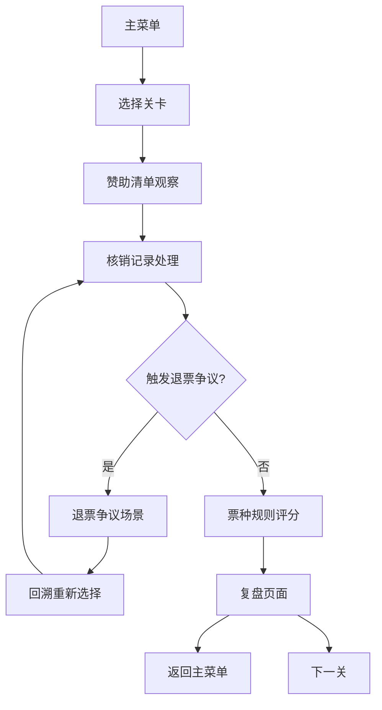
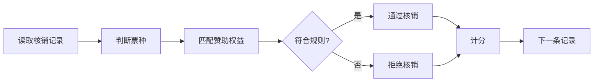

## 1. 产品概述

活动票务赞助权益经营模拟游戏是一款以票务核销与赞助权益管理为核心玩法的模拟经营类游戏。玩家扮演活动运营经理，通过观察赞助清单、处理核销记录、应用票种规则来完成关卡挑战，在退票争议中做出决策，并在复盘中优化核销效率。

- 核心目标：通过合理的票务核销与赞助权益管理，达成高效的运营指标
- 目标用户：对运营管理、模拟经营类游戏感兴趣的玩家
- 产品价值：在游戏中学习票务运营与赞助权益管理的基本逻辑

## 2. 核心特性

### 2.1 用户角色

| 角色 | 描述 | 核心权限 |
|------|------|----------|
| 玩家 | 活动运营经理 | 观察赞助清单、处理核销、票种评分、退票争议决策 |

### 2.2 功能模块

1. **加载场景**：资源预加载，动态进度条与加载动画
2. **主菜单**：关卡选择、游戏设置、关于
3. **赞助清单观察**：查看赞助商、权益类型、票种信息
4. **核销记录处理**：逐条处理票务核销记录，判断是否通过
5. **票种规则评分**：根据票种规则对核销结果进行评分
6. **退票争议**：处理退票争议，回溯场景重新选择
7. **复盘页面**：查看核销效率变化、得分详情、关卡统计
8. **配置系统**：关卡参数、场景、票种规则配置化维护

### 2.3 场景详情

| 场景名称 | 模块名称 | 功能描述 |
|----------|----------|----------|
| 加载场景 | 进度条模块 | 显示资源加载进度，伴随动画效果，避免空等 |
| 加载场景 | 提示模块 | 游戏小知识、操作提示滚动展示 |
| 主菜单场景 | 关卡选择 | 展示所有可用关卡，显示完成状态与评分 |
| 主菜单场景 | 设置面板 | 音效、音量、操作方式设置 |
| 赞助清单场景 | 赞助商列表 | 展示本关所有赞助商及权益信息 |
| 赞助清单场景 | 票种规则 | 展示各类票种的核销规则与权益 |
| 赞助清单场景 | 目标提示 | 显示本关目标分数与特殊要求 |
| 核销记录场景 | 记录列表 | 待核销票务记录，支持滑动浏览 |
| 核销记录场景 | 核销操作 | 通过/拒绝核销，支持键盘与触屏操作 |
| 核销记录场景 | 争议触发 | 异常记录触发退票争议事件 |
| 票种评分场景 | 规则匹配 | 根据票种规则自动计算得分 |
| 票种评分场景 | 得分展示 | 动态展示本关得分与评级 |
| 退票争议场景 | 争议详情 | 展示争议原因与相关记录 |
| 退票争议场景 | 回溯选择 | 回到核销场景重新处理争议记录 |
| 复盘场景 | 效率图表 | 展示核销效率变化趋势 |
| 复盘场景 | 详细统计 | 正确数、错误数、争议数、用时等 |
| 复盘场景 | 星级评价 | 根据得分给予星级评价 |

## 3. 核心流程

### 3.1 游戏主流程

玩家从主菜单选择关卡，进入赞助清单观察阶段，了解赞助商与票种规则后，进入核销记录处理阶段。在核销过程中可能触发退票争议，玩家需要回溯场景重新选择。核销完成后进入票种规则评分，最后在复盘页查看核销效率与得分。

### 3.2 核销操作流程

## 4. 用户界面设计

### 4.1 设计风格

- **整体风格**：现代简约商务风，融合游戏化元素
- **主色调**：深海蓝 (#0F3460) 作为主色，金色 (#E9B824) 作为强调色
- **辅助色**：青色 (#219C90) 表示通过，珊瑚红 (#D83F31) 表示拒绝/争议
- **中性色**：深灰 (#1A1A2E)、中灰 (#535C68)、浅灰 (#F5F5F5)、白色 (#FFFFFF)
- **按钮风格**：圆角矩形，微立体效果，悬停有缩放与光晕
- **字体**：标题使用有衬线字体体现专业感，正文使用无衬线字体保证可读性
- **布局风格**：卡片式布局，清晰的信息层级，适度的阴影与间距
- **图标风格**：线性图标，统一 2px 描边，圆角端点

### 4.2 场景设计概览

| 场景名称 | 模块名称 | UI 元素 |
|----------|----------|---------|
| 加载场景 | 进度条 | 渐变进度条、粒子效果、品牌 Logo 淡入 |
| 加载场景 | 提示文字 | 滚动式游戏小知识，打字机效果 |
| 主菜单 | 标题区 | 大标题渐变文字，副标题，装饰性几何图形 |
| 主菜单 | 关卡列表 | 卡片式布局，星级显示，锁定/解锁状态 |
| 赞助清单 | 赞助商卡片 | 品牌 Logo、名称、权益列表、票种标签 |
| 赞助清单 | 规则面板 | 可折叠规则列表，图标+文字说明 |
| 核销记录 | 记录卡片 | 票种图标、姓名、时间、状态指示灯 |
| 核销记录 | 操作按钮 | 左右两侧大按钮，通过（绿）/拒绝（红） |
| 票种评分 | 分数展示 | 大数字滚动动画，进度环，星级弹出 |
| 退票争议 | 争议弹窗 | 警示图标，争议详情，操作选项 |
| 复盘页面 | 效率图表 | 折线图展示效率变化，数据点标注 |
| 复盘页面 | 统计卡片 | 网格布局，图标+数值+标签 |

### 4.3 响应式与操作

- **设计优先级**：桌面端优先，移动端适配
- **触屏操作**：大尺寸点击区域（≥ 48px），滑动手势支持，触觉反馈
- **键盘操作**：方向键导航，空格/回车确认，ESC 返回，数字快捷键
- **操作提示**：首次进入场景时显示操作引导，可随时查看帮助
- **屏幕适配**：16:9 基准比例，自适应缩放，支持全屏

### 4.4 动效与反馈

- **转场动画**：场景切换使用淡入淡出+滑动过渡
- **微交互**：按钮悬停缩放、卡片抬起阴影、数字滚动、粒子特效
- **反馈机制**：操作成功有绿色光晕与音效，错误有红色震动与提示音
- **加载体验**：进度条平滑增长，背景有 subtle 动画，绝不黑屏空等
