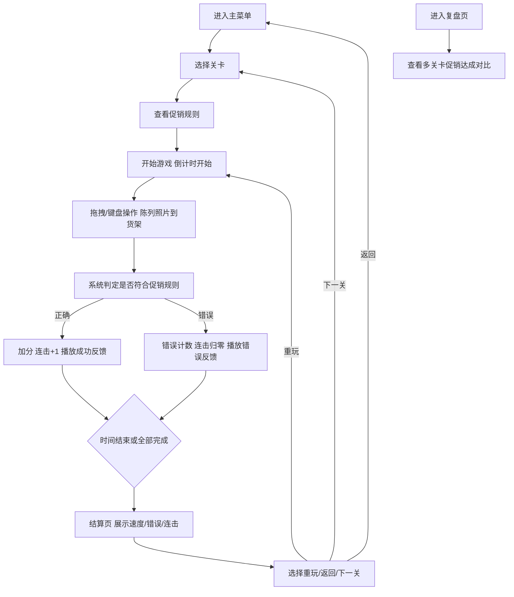

## 1. 产品概述
药店连锁促销陈列经营模拟游戏，训练玩家在限时内根据促销规则正确摆放药品陈列照片到门店货架上，提升陈列执行效率和准确率。

- **核心价值**：通过游戏化方式培训药店员工掌握促销陈列规范，可在办公环境进行无声训练
- **目标用户**：药店连锁门店员工、陈列督导、运营管理人员

## 2. 核心功能

### 2.1 功能模块
1. **主菜单场景**：关卡选择、开始游戏、设置入口、复盘入口
2. **游戏场景**：限时陈列挑战、促销规则展示、货架区域、陈列照片拖拽区
3. **结算场景**：速度评分、错误次数、连续正确数统计、总分展示
4. **复盘场景**：多关卡促销达成率对比图表、历史记录
5. **设置场景**：音效、动画、震动独立开关

### 2.2 页面详情

| 页面名称 | 模块名称 | 功能描述 |
|-----------|-------------|---------------------|
| 主菜单 | 关卡列表 | 展示不同难度关卡，显示完成状态和最佳成绩 |
| 主菜单 | 功能按钮 | 开始游戏、设置、复盘、快速重玩上次关卡 |
| 游戏场景 | 计时器 | 倒计时显示，时间结束自动结算 |
| 游戏场景 | 促销规则栏 | 显示当前关卡促销规则（如：感冒药堆头、买二赠一标识位置） |
| 游戏场景 | 陈列照片区 | 待摆放的药品陈列照片，支持拖拽和键盘操作 |
| 游戏场景 | 货架区域 | 货架格子，检测摆放是否符合规则，使用Matter.js物理引擎实现吸附效果 |
| 游戏场景 | 实时反馈 | 正确/错误即时提示，连击计数显示 |
| 结算场景 | 速度评分 | 根据平均摆放时间计算速度得分 |
| 结算场景 | 错误统计 | 显示错误次数及错误类型 |
| 结算场景 | 连击统计 | 最高连续正确数和当前连击数 |
| 结算场景 | 操作按钮 | 重玩本关、返回菜单、下一关 |
| 复盘场景 | 对比图表 | 各关卡促销达成率柱状图对比 |
| 复盘场景 | 历史记录 | 每次游戏的详细数据记录 |
| 设置场景 | 音效开关 | 独立控制背景音乐和音效 |
| 设置场景 | 动画开关 | 独立控制界面动画效果 |
| 设置场景 | 震动开关 | 独立控制设备震动反馈 |

## 3. 核心流程

## 4. 用户界面设计

### 4.1 设计风格
- **设计理念**：专业、简洁、医疗感，突出药店行业特征
- **主色调**：#1E88E5 医药蓝（专业可靠）
- **辅助色**：#43A047 健康绿（正确/通过）、#E53935 警示红（错误/提醒）、#FFA000 活力橙（促销/强调）
- **中性色**：#FAFAFA 背景、#333333 正文、#757575 辅助文字
- **字体**：标题使用 "Noto Sans SC" 粗体，正文使用 "Noto Sans SC" 常规
- **按钮风格**：圆角8px，微立体阴影，hover状态有轻微放大效果
- **布局风格**：卡片式布局，清晰的视觉层级，重要信息突出显示

### 4.2 页面设计概览

| 页面名称 | 模块名称 | UI元素 |
|-----------|-------------|-------------|
| 主菜单 | 关卡卡片 | 渐变背景、关卡名称、星级评分、最佳成绩标签、悬停上浮动画 |
| 主菜单 | 顶部标题 | 大字号品牌名称，医药十字图标装饰 |
| 游戏场景 | 规则横幅 | 顶部固定横幅，促销规则图标+文字，动态切换效果 |
| 游戏场景 | 货架网格 | 深木色纹理背景，白色分隔线，悬停高亮，正确绿色边框/错误红色边框 |
| 游戏场景 | 陈列照片 | 圆角卡片，药品缩略图+名称，拖拽时半透明，吸附动画 |
| 游戏场景 | 状态栏 | 顶部固定，包含倒计时（大号数字）、当前分数、连击数徽章 |
| 结算场景 | 数据卡片 | 三个数据卡片并列，速度/错误/连击各一，图标+数字+描述 |
| 结算场景 | 总分展示 | 大号渐变数字，星级评价，庆祝动画 |
| 复盘场景 | 对比图表 | 彩色柱状图，X轴为关卡名称，Y轴为达成率，支持hover显示详情 |
| 设置场景 | 开关列表 | 左侧图标+文字，右侧滑动开关，每项独立说明 |

### 4.3 响应式设计
- **桌面优先**：1280px以上完美展示，游戏区域居中
- **平板适配**：768px-1280px，货架网格自动调整列数
- **移动适配**：375px-768px，单列布局，放大触控区域
- **触控优化**：所有可交互元素最小44x44px触控区域，拖拽操作支持多指
- **键盘支持**：Tab键切换聚焦，方向键移动选中照片，Enter/Space确认摆放，Esc暂停

### 4.4 动画与反馈
- **页面切换**：淡入淡出+轻微滑动，时长300ms
- **拖拽吸附**：Matter.js物理引擎实现平滑吸附到正确位置
- **正确反馈**：绿色闪光+轻微放大+向上浮动粒子
- **错误反馈**：红色边框抖动+左右轻微摇晃
- **连击效果**：数字跳动+渐变光环，连击越高光环越大
- **倒计时紧张感**：最后10秒数字变红，每秒脉动动画
