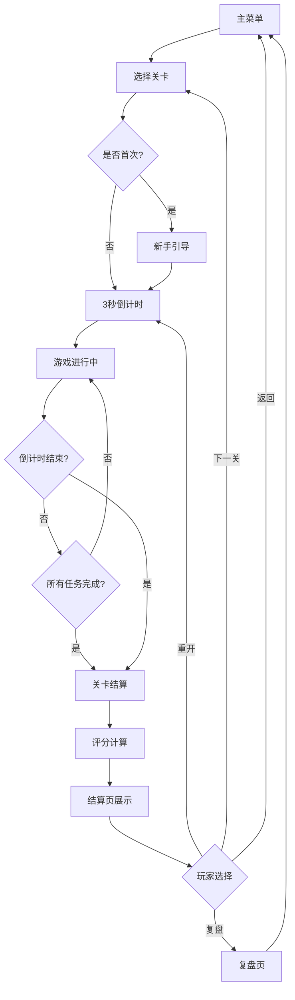
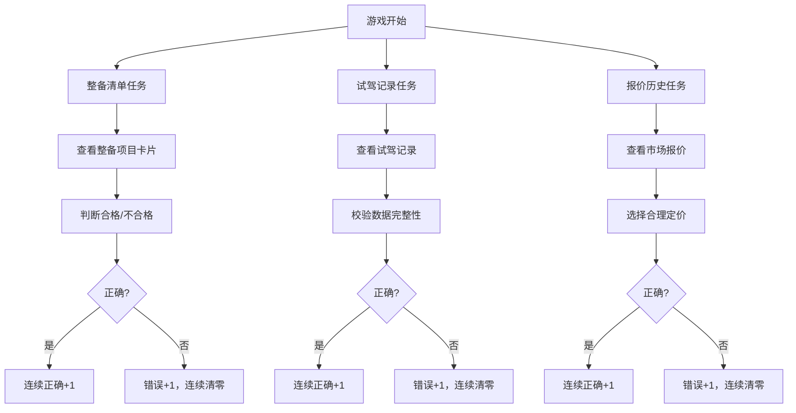

## 1. 产品概述

二手车门店车源上架经营模拟游戏——一款面向二手车门店从业者的训练模拟游戏。玩家在倒计时内完成整备清单审核、试驾记录校验和报价历史评估三大任务，系统根据处理速度、错误次数和连续正确数进行综合评分。游戏支持声音、震动和动画强度开关，适配办公环境训练场景，并提供关卡复盘页按库存周转率比较不同关卡表现。

- 目标用户：二手车门店销售、评估师、店长等从业者
- 核心价值：通过游戏化训练提升车源上架效率和准确率，降低实际工作中出错成本

## 2. 核心功能

### 2.1 用户角色

| 角色 | 说明 |
|------|------|
| 玩家 | 单人模式，无需注册，本地存储进度 |

### 2.2 功能模块

1. **主菜单页**：开始游戏、继续游戏、设置、关卡选择
2. **游戏主界面**：倒计时、三大任务面板（整备清单/试驾记录/报价历史）、评分实时显示
3. **关卡结算页**：本关得分、星级评定、库存周转率、重开按钮
4. **复盘页**：多关卡库存周转率对比图表、历史成绩趋势
5. **设置页**：音效/震动/动画强度开关
6. **新手引导**：首次进入游戏的整备清单引导流程

### 2.3 页面详情

| 页面名称 | 模块名称 | 功能描述 |
|----------|----------|----------|
| 主菜单页 | Hero 区域 | 游戏标题、车型动画背景、开始按钮 |
| 主菜单页 | 导航区 | 关卡选择、设置入口、继续游戏 |
| 游戏主界面 | 倒计时栏 | 顶部倒计时进度条，剩余时间变色预警 |
| 游戏主界面 | 整备清单面板 | 显示待审核整备项目卡片，玩家判断合格/不合格 |
| 游戏主界面 | 试驾记录面板 | 显示试驾记录条目，玩家校验数据完整性 |
| 游戏主界面 | 报价历史面板 | 显示市场报价对比，玩家选择合理定价 |
| 游戏主界面 | 实时评分栏 | 当前速度、错误次数、连续正确数、总分 |
| 关卡结算页 | 得分展示 | 星级评定动画、各项分数明细 |
| 关卡结算页 | 库存周转率 | 本关库存周转天数计算与展示 |
| 关卡结算页 | 操作按钮 | 重开本关、下一关、返回主菜单 |
| 复盘页 | 对比图表 | 多关卡库存周转率柱状对比图 |
| 复盘页 | 趋势图 | 历史得分趋势折线图 |
| 设置页 | 音效开关 | 音效开启/关闭 |
| 设置页 | 震动开关 | 震动反馈开启/关闭 |
| 设置页 | 动画强度 | 低/中/高三档动画强度 |
| 新手引导 | 整备清单引导 | 高亮整备清单区域，步骤提示操作 |

## 3. 核心流程

游戏核心流程：玩家选择关卡 → 3秒倒计时 → 进入游戏界面 → 依次/并行处理整备清单、试驾记录、报价历史任务 → 倒计时结束或任务全部完成 → 进入结算页 → 可选复盘或重开。

游戏内任务流程：

## 4. 用户界面设计

### 4.1 设计风格

- **主色调**：深灰底色（#1a1a2e）搭配橙色强调色（#ff6b35），营造汽车展厅质感
- **辅助色**：暖白前景（#f5f0e8）、翠绿正确指示（#22c55e）、红色错误指示（#ef4444）
- **按钮风格**：圆角大按钮，带有微弱3D阴影效果，悬停时有弹性动画
- **字体**：标题使用粗黑风格（Noto Sans SC Bold），正文使用简洁无衬线体
- **布局**：顶部倒计时栏，中间三栏任务面板（可切换），底部评分栏
- **图标风格**：线性图标（Lucide），与整体工业风保持一致

### 4.2 页面设计概览

| 页面名称 | 模块名称 | UI 元素 |
|----------|----------|---------|
| 主菜单页 | Hero 区域 | 深色渐变背景，PixiJS车辆轮廓动画，大号标题，橙色CTA按钮 |
| 主菜单页 | 导航区 | 卡片式导航按钮，悬停阴影效果 |
| 游戏主界面 | 倒计时栏 | 顶部全宽进度条，时间变色（绿→黄→红） |
| 游戏主界面 | 任务面板区 | 三栏Tab切换，卡片式任务项，滑动手势切换 |
| 游戏主界面 | 评分栏 | 底部固定栏，数字实时跳动动画 |
| 关卡结算页 | 得分展示 | 大号星级动画，分数翻转效果 |
| 关卡结算页 | 库存周转率 | 环形进度指示器 |
| 复盘页 | 对比图表 | 柱状图+折线图组合 |
| 设置页 | 开关组件 | 滑动开关，带图标说明 |
| 新手引导 | 引导蒙层 | 半透明遮罩，高亮目标区域，脉冲动画提示 |

### 4.3 响应式设计

- 桌面优先设计，最小宽度1280px
- 游戏主界面在1024-1280px时三栏缩为Tab切换
- 移动端暂不作为主要适配目标

### 4.4 动画与视觉效果

- PixiJS 负责：车辆轮廓动画、粒子效果（正确/错误反馈）、倒计时脉冲
- CSS 动画负责：页面过渡、按钮微交互、卡片翻转
- 动画强度三档：低（仅必要反馈）、中（标准效果）、高（全量粒子+震动）
