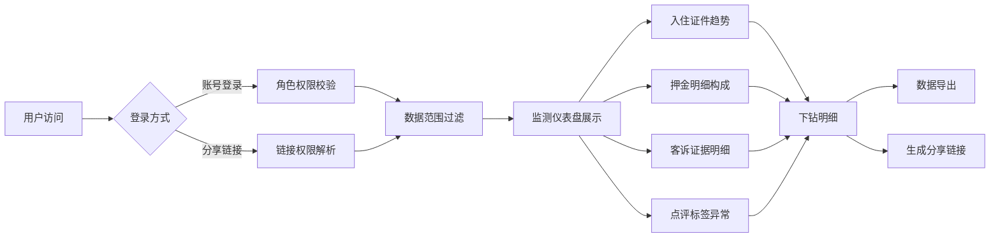

## 1. 产品概述

旅游民宿保洁排班风险监测图是一款面向民宿运营管理者的数据可视化平台，通过整合门锁记录、OTA订单、客服消息等多源数据，实时监测保洁排班风险，提升民宿运营效率与服务质量。

- 核心价值：将分散的民宿运营数据转化为可操作的风险洞察，帮助管理者及时发现保洁延误、客诉异常等问题
- 目标用户：民宿店长、保洁主管、运营经理、投资人
- 市场定位：中高端连锁民宿及民宿集群的运营管理工具

## 2. 核心功能

### 2.1 用户角色

| 角色 | 访问方式 | 核心权限 |
|------|----------|----------|
| 系统管理员 | 账号登录 | 全量数据查看、用户管理、系统配置 |
| 店长 | 账号登录/分享链接 | 本店全量数据查看、保洁排班调整 |
| 保洁主管 | 分享链接 | 管辖区域保洁数据、排班调整权限 |
| 投资人 | 分享链接 | 汇总数据查看、关键指标趋势 |

### 2.2 功能模块

1. **监测仪表盘**：核心指标概览、最近刷新时间、数据范围切换
2. **入住证件趋势图**：按时间维度展示入住证件办理数量与异常率趋势
3. **押金明细构成图**：饼图展示押金收取、退还、扣除的明细构成
4. **客诉证据明细表**：客服消息追溯、客诉类型分类、证据链展示
5. **点评标签异常标注**：OTA点评情感分析、异常标签高亮、趋势预警

### 2.3 页面详情

| 页面名称 | 模块名称 | 功能描述 |
|----------|----------|----------|
| 监测仪表盘 | 指标概览 | 保洁准时率、客诉率、押金异常率等核心KPI卡片展示 |
| 监测仪表盘 | 刷新时间 | 顶部显著位置显示数据最近刷新时间，支持手动刷新 |
| 监测仪表盘 | 角色切换 | 根据登录角色自动过滤数据范围 |
| 入住证件趋势 | 趋势图表 | 折线图展示每日入住证件数量，柱状图展示异常证件数量 |
| 入住证件趋势 | 数据筛选 | 支持按时间范围、门店、证件类型筛选 |
| 押金明细构成 | 构成饼图 | 展示押金总额、已退还、扣除中、异常扣减的比例 |
| 押金明细构成 | 明细列表 | 可下钻查看具体押金记录，关联订单信息 |
| 客诉证据明细 | 消息追溯 | 客服消息时间线展示，支持关键词搜索 |
| 客诉证据明细 | 证据关联 | 关联对应订单、保洁记录、门锁记录 |
| 点评标签异常 | 标签云图 | 高频负面标签云展示，异常标签红色标注 |
| 点评标签异常 | 预警通知 | 异常点评自动标注并生成预警 |
| 数据下载 | 图表下载 | 支持PNG/PDF格式导出图表，保留保洁准时率口径 |
| 数据下载 | 明细导出 | 支持Excel/CSV格式导出明细数据 |
| 分享链接 | 角色权限 | 生成不同角色的分享链接，控制数据可见范围 |
| 分享链接 | 有效期 | 支持设置分享链接有效期和访问密码 |

## 3. 核心流程

用户登录或通过分享链接进入系统 → 系统根据角色自动过滤数据范围 → 展示监测仪表盘及核心指标 → 点击图表下钻查看明细 → 支持数据导出和证据追溯 → 生成分享链接供外部查看

## 4. 界面设计

### 4.1 设计风格
- **设计方向**：高端商务/数据驱动风格，深蓝主色调，强调专业感和可信度
- **主色调**：#1a365d（深蓝），辅以 #2c5282、#2b6cb0
- **强调色**：#e53e3e（风险红）、#38a169（正常绿）、#dd6b20（预警橙）
- **背景**：#0f172a（深色背景），营造沉浸式数据可视化体验
- **字体**：Display - "Playfair Display"（标题），Body - "Inter"（正文）
- **卡片风格**：半透明玻璃态卡片，圆角8px，微妙阴影
- **图标风格**：线性图标，统一2px线宽

### 4.2 页面设计概览

| 页面名称 | 模块名称 | UI元素 |
|----------|----------|--------|
| 监测仪表盘 | 指标概览 | 渐变背景卡片，数字动画，趋势箭头指示 |
| 监测仪表盘 | 刷新时间 | 顶部状态栏，醒目时间显示，刷新按钮动效 |
| 入住证件趋势 | 趋势图表 | 双Y轴折线柱状组合图，悬浮 tooltip 详情 |
| 押金明细构成 | 构成饼图 | 环形图，中心显示总额，分块hover高亮 |
| 客诉证据明细 | 消息追溯 | 时间线布局，消息气泡，关联标识 |
| 点评标签异常 | 标签云图 | 大小/颜色双重编码，异常标签脉冲动效 |
| 数据下载 | 导出面板 | 浮动面板，格式选择，加载状态动画 |
| 分享链接 | 链接弹窗 | 模态框，角色选择，二维码展示 |

### 4.3 响应式
- 桌面优先设计，适配1920px及以上宽屏展示
- 平板端采用两列布局，图表自适应缩放
- 移动端单列布局，核心指标优先展示，图表支持横向滑动
- 所有交互元素支持触摸操作，最小点击区域48x48px

### 4.4 可视化动效
- 页面加载：图表数据渐进式渲染，从左到右依次呈现
- 卡片悬停：轻微上浮 + 阴影加深 + 边框高亮
- 数据刷新：数字滚动动画，图表平滑过渡
- 异常预警：脉冲呼吸动效，红色光晕闪烁
- 下钻交互：平滑展开/收起，内容淡入
