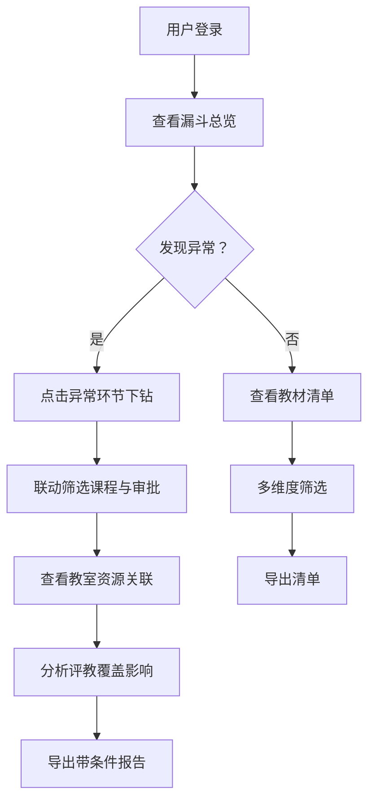

## 1. 产品概述

高校教务教材订购漏斗报表系统用于分析高校教务中的教材订购全流程数据，提供从课程计划到教材发放的完整漏斗分析。系统解决多数据源口径不一致、材料缺失追踪难、异常点定位难等痛点，帮助教务管理者清晰掌握教材订购每个环节的转化情况，识别瓶颈并持续优化。

### 核心价值
- 打通教学平台、一卡通、学生申请表等多数据源，自动记录口径差异
- 可视化展示教材订购全链路漏斗，精准定位流失环节
- 智能标注数据缺口，辅助材料补全
- 联动教室资源与评教数据，解释异常波动原因
- 导出文件自动携带筛选条件，确保数据追溯性

---

## 2. 核心功能

### 2.1 用户角色
| 角色 | 注册方式 | 核心权限 |
|------|---------|---------|
| 教务管理员 | 系统分配 | 全部功能：数据查看、筛选、导出、复盘分析 |
| 学院秘书 | 系统分配 | 本学院数据查看、筛选、导出 |
| 数据分析员 | 系统分配 | 全量数据查看、深度分析、差异处理 |

### 2.2 功能模块
1. **教材订购漏斗总览**：漏斗图展示各环节转化，关键指标卡片
2. **教材清单总览**：全量教材列表，支持多维度筛选与搜索
3. **审批记录追踪**：审批流程全记录，与课程目录联动筛选
4. **数据差异中心**：多数据源口径差异记录，版本对比
5. **缺口标注系统**：材料缺失自动识别，缺口追踪与补全
6. **异常点分析**：结合教室资源解释数据异常
7. **评教覆盖复盘**：评教覆盖率与教材订购关联分析
8. **导出中心**：带筛选条件的Excel/PDF导出，支持截图

### 2.3 页面详情
| 页面名称 | 模块名称 | 功能描述 |
|---------|---------|---------|
| 漏斗总览页 | 漏斗图模块 | 展示从课程计划→选课确认→教材申请→审批→采购→入库→发放的七阶漏斗转化 |
| 漏斗总览页 | 指标卡片区 | 显示总订购量、转化率、异常数、缺口数、评教覆盖率等核心KPI |
| 漏斗总览页 | 趋势图模块 | 近12学期各环节转化趋势，支持环比/同比分析 |
| 教材清单页 | 筛选器区 | 学院、年级、专业、课程类型、教材状态等多维度筛选 |
| 教材清单页 | 数据表格 | 教材明细展示，支持列配置、排序、分页 |
| 教材清单页 | 导出功能 | 一键导出Excel/PDF，自动携带筛选条件水印 |
| 审批追踪页 | 联动筛选 | 课程目录树选择，自动过滤对应审批记录 |
| 审批追踪页 | 流程时间线 | 可视化展示每个审批节点的时间、处理人、意见 |
| 数据差异页 | 版本管理 | 一卡通、学生申请表各版本数据快照 |
| 数据差异页 | 差异对比 | 教学平台口径与其他数据源的字段级差异对比 |
| 缺口分析页 | 缺口标注 | 材料缺失自动高亮，显示缺失类型与建议补全方式 |
| 缺口分析页 | 补全追踪 | 缺口补全进度跟踪，责任人分配 |
| 异常分析页 | 异常检测 | 自动识别订购量异常、审批超时、库存异常等 |
| 异常分析页 | 教室关联 | 关联教室容量、排课情况解释异常原因 |
| 评教复盘页 | 覆盖分析 | 评教覆盖率与教材订购完成率关联分析 |
| 评教复盘页 | 改善追踪 | 多学期覆盖度改善趋势，辅助决策 |

---

## 3. 核心流程

### 主分析流程
教务管理员登录系统后，首先查看漏斗总览了解整体订购情况，发现转化率异常环节后，点击对应环节下钻查看明细，通过多维度筛选定位问题，结合审批记录与教室资源分析原因，最后导出分析报告并标注筛选条件。

### 数据处理流程

### 用户操作流程

---

## 4. 用户界面设计

### 4.1 设计风格
- **主色调**：学术蓝 `#1E3A8A`（代表严谨与专业）
- **辅助色**：警示橙 `#F97316`（异常标注）、成功绿 `#10B981`（正常状态）、数据紫 `#8B5CF6`（分析模块）
- **中性色**：以 Slate 色系为基础，从 `#F8FAFC` 到 `#0F172A` 构建层次
- **按钮风格**：圆角4px，微阴影，hover时提升亮度5%
- **字体**：主字体使用 "PingFang SC" + "Noto Sans SC"，数字使用 "JetBrains Mono" 等宽字体
- **布局风格**：卡片式布局，12列栅格，留白充足，信息层级清晰
- **图标风格**：lucide-react 线性图标，统一16px/20px尺寸

### 4.2 页面设计概述
| 页面名称 | 模块名称 | UI元素 |
|---------|---------|--------|
| 漏斗总览页 | 顶部导航 | 品牌标识、模块导航、用户信息、全局搜索 |
| 漏斗总览页 | 指标卡片 | 大号数字、趋势箭头、环比小图表、状态标签 |
| 漏斗总览页 | 漏斗图区 | 交互式SVG漏斗图，支持点击下钻，hover显示详情 |
| 漏斗总览页 | 趋势图表 | 多折线图，支持图例切换、时间范围选择 |
| 教材清单页 | 筛选栏 | 下拉选择器、日期范围、搜索框、重置按钮，固定在顶部 |
| 教材清单页 | 数据表格 | 斑马纹、固定表头、可排序列、行hover高亮、批量选择 |
| 教材清单页 | 底部工具栏 | 分页器、每页条数选择、导出按钮组、行数统计 |
| 审批追踪页 | 课程目录树 | 可折叠树结构，多选支持，搜索高亮 |
| 审批追踪页 | 时间线组件 | 垂直线、节点圆、状态色标、时间戳、处理人头像 |
| 数据差异页 | 版本选择器 | 下拉对比选择，版本时间戳，版本说明 |
| 数据差异页 | 差异对比表 | 左右分栏对比，差异行高亮，新增/删除/修改图标标识 |
| 缺口分析页 | 缺口看板 | 按缺口类型分类的卡片，进度条，责任人标签 |
| 缺口分析页 | 缺口列表 | 状态徽章，优先级标签，补全截止日期，超时提醒 |
| 异常分析页 | 异常概览 | 异常类型分布环形图，异常趋势柱图 |
| 异常分析页 | 异常详情 | 异常原因分析面板，教室资源关联卡片，建议措施 |
| 评教复盘页 | 覆盖度仪表盘 | 半圆仪表盘，目标线，同环比箭头 |
| 评教复盘页 | 关联分析 | 散点图展示评教分与订购完成率相关性 |

### 4.3 响应式设计
- **Desktop-first**：优先优化1440px及以上大屏展示
- **平板适配**：1024px以下，侧边栏折叠为图标式，表格支持横向滚动
- **移动端**：768px以下，卡片单列布局，图表简化为关键指标，筛选器折叠为抽屉
- **触摸优化**：可点击元素最小高度44px，手势支持左右滑动切换图表

### 4.4 动效设计
- **页面加载**：骨架屏占位，内容渐入（fadeIn 300ms）
- **卡片悬浮**：translateY(-2px) + box-shadow 加深，150ms过渡
- **数据更新**：数字滚动动画（countUp），200ms完成
- **筛选联动**：表格数据交叉溶解（cross-fade）切换，200ms
- **异常闪烁**：新发现异常点脉冲动画3次，吸引注意
