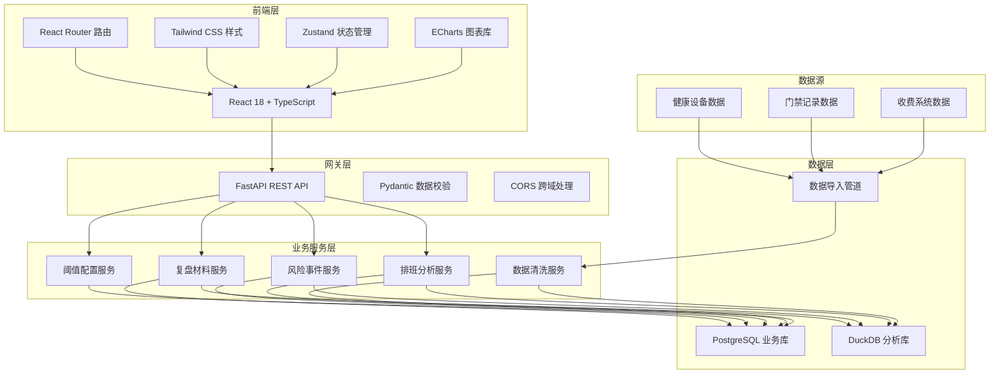
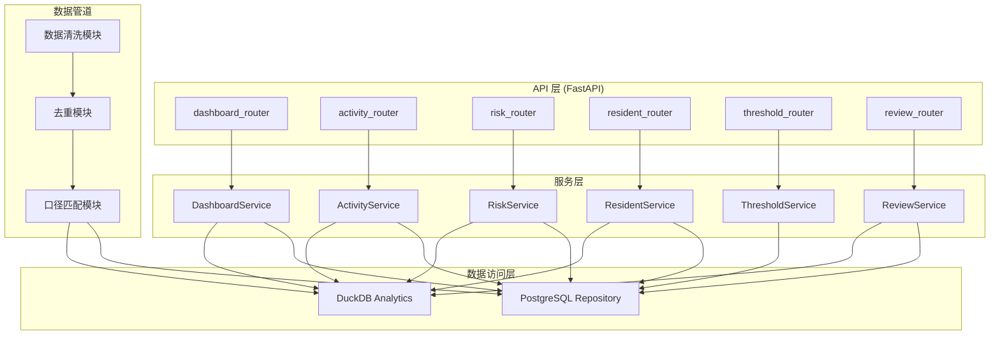
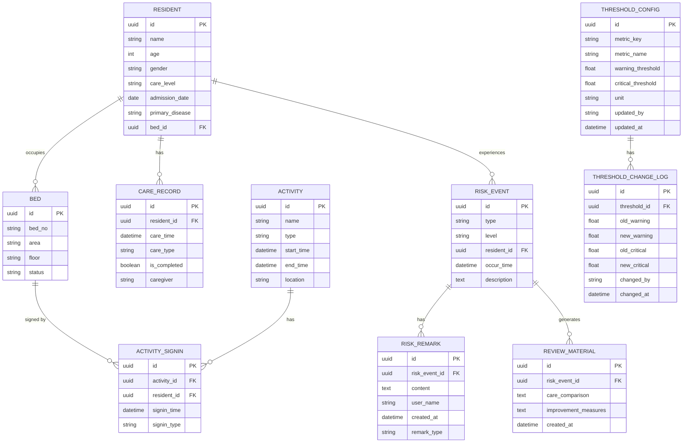

## 1. 架构设计



## 2. 技术描述

- **前端**：React 18 + TypeScript + Vite + Tailwind CSS 3 + ECharts + Zustand + React Router
- **初始化工具**：vite-init (react-ts 模板)
- **后端**：FastAPI (Python) + Uvicorn
- **数据库**：PostgreSQL (业务数据存储) + DuckDB (分析查询加速)
- **数据处理**：Python pandas + 自定义清洗管道
- **图表引擎**：ECharts 5.x

### 2.1 项目目录结构

```
MP0255/
├── .trae/documents/          # 文档目录
├── frontend/                 # 前端 React 项目
│   ├── src/
│   │   ├── components/       # 公共组件
│   │   ├── pages/            # 页面组件
│   │   ├── hooks/            # 自定义 Hooks
│   │   ├── stores/           # Zustand 状态管理
│   │   ├── utils/            # 工具函数
│   │   ├── services/         # API 服务
│   │   ├── types/            # TypeScript 类型定义
│   │   └── App.tsx
│   ├── package.json
│   ├── tailwind.config.js
│   ├── vite.config.ts
│   └── tsconfig.json
├── backend/                  # 后端 FastAPI 项目
│   ├── app/
│   │   ├── api/              # API 路由
│   │   ├── services/         # 业务逻辑
│   │   ├── models/           # 数据模型
│   │   ├── schemas/          # Pydantic 模式
│   │   ├── data_pipeline/    # 数据清洗管道
│   │   └── db/               # 数据库连接
│   ├── data/                 # 数据文件目录
│   ├── requirements.txt
│   └── main.py
└── README.md
```

## 3. 路由定义

| 路由 | 页面 | 说明 |
|------|-----|-----|
| /dashboard | 数据看板 | 床位排班漏斗概览、核心指标、风险提醒 |
| /activity | 活动签到 | 活动参与趋势、时段分布、床位关联 |
| /risk | 风险事件 | 风险类型分布、趋势、事件列表与备注 |
| /residents | 老人档案 | 床位利用率、老人画像分布 |
| /settings/thresholds | 阈值配置 | 预警阈值调整、变更记录 |
| /review/fall/:id | 跌倒复盘 | 跌倒事件详情、护理达标对比、备注回顾 |

## 4. API 定义

### 4.1 通用响应格式

```typescript
interface ApiResponse<T> {
  code: number;
  message: string;
  data: T;
}
```

### 4.2 数据看板接口

```typescript
// 漏斗数据
interface FunnelData {
  stage: string;
  value: number;
  rate: number;
}

// GET /api/dashboard/funnel
// Response: FunnelData[]

// 核心指标
interface CoreMetrics {
  bedOccupancy: number;
  careComplianceRate: number;
  riskEventCount: number;
  activityParticipationRate: number;
  bedOccupancyChange: number;
  careComplianceChange: number;
  riskEventChange: number;
  activityChange: number;
}

// GET /api/dashboard/metrics
// Response: CoreMetrics
```

### 4.3 活动签到接口

```typescript
interface ActivityTrendItem {
  date: string;
  participationRate: number;
  participantCount: number;
}

interface ActivityTimeDistribution {
  timeSlot: string;
  count: number;
}

// GET /api/activity/trend?startDate=&endDate=
// Response: ActivityTrendItem[]

// GET /api/activity/time-distribution
// Response: ActivityTimeDistribution[]
```

### 4.4 风险事件接口

```typescript
interface RiskEvent {
  id: string;
  type: 'fall' | 'pressure_ulcer' | 'wandering' | 'other';
  level: 'high' | 'medium' | 'low';
  residentName: string;
  bedNo: string;
  occurTime: string;
  description: string;
  remark: string | null;
  remarkTime: string | null;
  remarkUser: string | null;
}

interface RiskTypeDistribution {
  type: string;
  count: number;
  ratio: number;
}

// GET /api/risk/events?page=&pageSize=&type=&level=
// Response: { list: RiskEvent[], total: number }

// GET /api/risk/type-distribution
// Response: RiskTypeDistribution[]

// PUT /api/risk/events/:id/remark
// Body: { remark: string }
// Response: RiskEvent
```

### 4.5 老人档案接口

```typescript
interface ResidentProfile {
  id: string;
  name: string;
  age: number;
  gender: string;
  careLevel: string;
  bedNo: string;
  admissionDate: string;
  primaryDisease: string;
}

interface BedUtilization {
  area: string;
  totalBeds: number;
  occupiedBeds: number;
  utilizationRate: number;
}

// GET /api/residents?page=&pageSize=&careLevel=
// Response: { list: ResidentProfile[], total: number }

// GET /api/residents/bed-utilization
// Response: BedUtilization[]
```

### 4.6 阈值配置接口

```typescript
interface ThresholdConfig {
  id: string;
  metricKey: string;
  metricName: string;
  warningThreshold: number;
  criticalThreshold: number;
  unit: string;
  updatedAt: string;
  updatedBy: string;
}

// GET /api/thresholds
// Response: ThresholdConfig[]

// PUT /api/thresholds/:id
// Body: { warningThreshold: number, criticalThreshold: number }
// Response: ThresholdConfig
```

### 4.7 跌倒复盘接口

```typescript
interface FallReview {
  eventId: string;
  eventInfo: RiskEvent;
  timeline: ReviewTimelineItem[];
  careCompliance: CareComplianceData;
  remarks: ReviewRemark[];
}

interface ReviewTimelineItem {
  time: string;
  type: 'event' | 'care' | 'remark' | 'followup';
  description: string;
}

interface CareComplianceData {
  beforeEvent: { rate: number; totalTasks: number; completedTasks: number };
  afterEvent: { rate: number; totalTasks: number; completedTasks: number };
  periodDays: number;
}

interface ReviewRemark {
  id: string;
  content: string;
  user: string;
  time: string;
  type: 'initial' | 'review' | 'improvement';
}

// GET /api/review/fall/:eventId
// Response: FallReview
```

## 5. 服务端架构



## 6. 数据模型

### 6.1 ER 图



### 6.2 DDL 语句

```sql
-- 老人档案表
CREATE TABLE residents (
    id UUID PRIMARY KEY DEFAULT gen_random_uuid(),
    name VARCHAR(100) NOT NULL,
    age INTEGER NOT NULL,
    gender VARCHAR(10) NOT NULL,
    care_level VARCHAR(50) NOT NULL,
    admission_date DATE NOT NULL,
    primary_disease VARCHAR(200),
    bed_id UUID REFERENCES beds(id),
    created_at TIMESTAMP DEFAULT CURRENT_TIMESTAMP,
    updated_at TIMESTAMP DEFAULT CURRENT_TIMESTAMP
);

-- 床位表
CREATE TABLE beds (
    id UUID PRIMARY KEY DEFAULT gen_random_uuid(),
    bed_no VARCHAR(50) UNIQUE NOT NULL,
    area VARCHAR(100) NOT NULL,
    floor VARCHAR(20) NOT NULL,
    status VARCHAR(20) DEFAULT 'available'
);

-- 护理记录表
CREATE TABLE care_records (
    id UUID PRIMARY KEY DEFAULT gen_random_uuid(),
    resident_id UUID REFERENCES residents(id) NOT NULL,
    care_time TIMESTAMP NOT NULL,
    care_type VARCHAR(50) NOT NULL,
    is_completed BOOLEAN DEFAULT true,
    caregiver VARCHAR(100) NOT NULL,
    created_at TIMESTAMP DEFAULT CURRENT_TIMESTAMP
);

-- 活动表
CREATE TABLE activities (
    id UUID PRIMARY KEY DEFAULT gen_random_uuid(),
    name VARCHAR(200) NOT NULL,
    type VARCHAR(50) NOT NULL,
    start_time TIMESTAMP NOT NULL,
    end_time TIMESTAMP NOT NULL,
    location VARCHAR(200)
);

-- 活动签到表
CREATE TABLE activity_signins (
    id UUID PRIMARY KEY DEFAULT gen_random_uuid(),
    activity_id UUID REFERENCES activities(id) NOT NULL,
    resident_id UUID REFERENCES residents(id) NOT NULL,
    signin_time TIMESTAMP NOT NULL,
    signin_type VARCHAR(20) DEFAULT 'manual',
    UNIQUE(activity_id, resident_id)
);

-- 风险事件表
CREATE TABLE risk_events (
    id UUID PRIMARY KEY DEFAULT gen_random_uuid(),
    type VARCHAR(50) NOT NULL,
    level VARCHAR(20) NOT NULL,
    resident_id UUID REFERENCES residents(id) NOT NULL,
    occur_time TIMESTAMP NOT NULL,
    description TEXT,
    created_at TIMESTAMP DEFAULT CURRENT_TIMESTAMP
);

-- 风险事件备记录表
CREATE TABLE risk_remarks (
    id UUID PRIMARY KEY DEFAULT gen_random_uuid(),
    risk_event_id UUID REFERENCES risk_events(id) NOT NULL,
    content TEXT NOT NULL,
    user_name VARCHAR(100) NOT NULL,
    remark_type VARCHAR(20) DEFAULT 'initial',
    created_at TIMESTAMP DEFAULT CURRENT_TIMESTAMP
);

-- 复盘材料表
CREATE TABLE review_materials (
    id UUID PRIMARY KEY DEFAULT gen_random_uuid(),
    risk_event_id UUID REFERENCES risk_events(id) NOT NULL,
    care_comparison JSONB,
    improvement_measures TEXT,
    created_at TIMESTAMP DEFAULT CURRENT_TIMESTAMP
);

-- 阈值配置表
CREATE TABLE threshold_configs (
    id UUID PRIMARY KEY DEFAULT gen_random_uuid(),
    metric_key VARCHAR(100) UNIQUE NOT NULL,
    metric_name VARCHAR(200) NOT NULL,
    warning_threshold FLOAT NOT NULL,
    critical_threshold FLOAT NOT NULL,
    unit VARCHAR(20) DEFAULT '%',
    updated_by VARCHAR(100),
    updated_at TIMESTAMP DEFAULT CURRENT_TIMESTAMP
);

-- 阈值变更记录表
CREATE TABLE threshold_change_logs (
    id UUID PRIMARY KEY DEFAULT gen_random_uuid(),
    threshold_id UUID REFERENCES threshold_configs(id) NOT NULL,
    old_warning FLOAT NOT NULL,
    new_warning FLOAT NOT NULL,
    old_critical FLOAT NOT NULL,
    new_critical FLOAT NOT NULL,
    changed_by VARCHAR(100) NOT NULL,
    changed_at TIMESTAMP DEFAULT CURRENT_TIMESTAMP
);

-- 索引
CREATE INDEX idx_residents_bed_id ON residents(bed_id);
CREATE INDEX idx_care_records_resident_id ON care_records(resident_id);
CREATE INDEX idx_care_records_care_time ON care_records(care_time);
CREATE INDEX idx_activity_signins_activity_id ON activity_signins(activity_id);
CREATE INDEX idx_activity_signins_resident_id ON activity_signins(resident_id);
CREATE INDEX idx_activity_signins_signin_time ON activity_signins(signin_time);
CREATE INDEX idx_risk_events_resident_id ON risk_events(resident_id);
CREATE INDEX idx_risk_events_occur_time ON risk_events(occur_time);
CREATE INDEX idx_risk_events_type ON risk_events(type);
CREATE INDEX idx_risk_remarks_event_id ON risk_remarks(risk_event_id);
```
