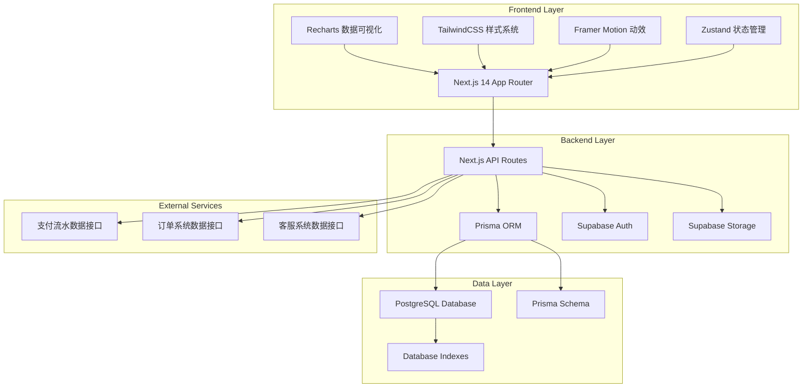
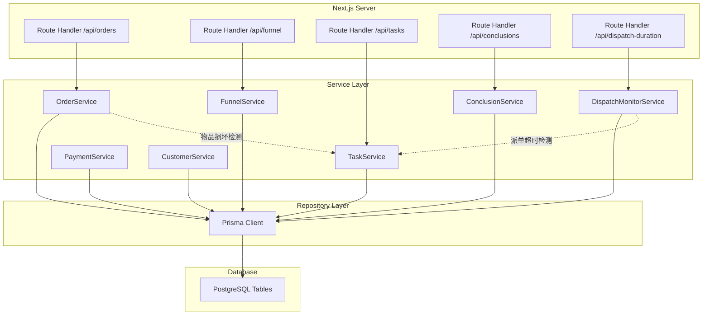
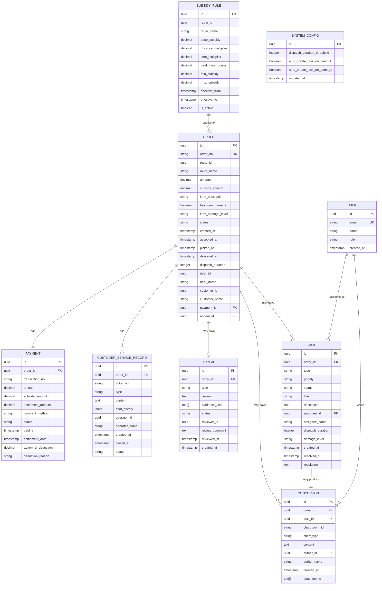

## 1. 架构设计



## 2. 技术说明

### 2.1 前端技术栈
- **框架**: Next.js 14 (App Router) with TypeScript
- **图表库**: Recharts 2.10+ 用于漏斗图、折线图、面积图
- **样式**: TailwindCSS 3.4+ 配合 CSS Variables 主题系统
- **动效**: Framer Motion 用于页面过渡、图表动画、交互反馈
- **状态管理**: Zustand 轻量级状态管理，处理筛选条件、用户状态
- **UI 组件库**: Radix UI 作为基础组件库（Dialog、Tabs、Dropdown等）
- **日期处理**: date-fns 用于日期格式化、计算派单时长
- **HTTP 客户端**: fetch API (Next.js 内置) 配合 SWR 做数据缓存和重新验证

### 2.2 后端技术栈
- **API**: Next.js Route Handlers (App Router)，提供 RESTful API
- **ORM**: Prisma 5.8+ 类型安全的数据库访问
- **认证**: Supabase Auth 邮箱密码登录 + JWT 鉴权
- **存储**: Supabase Storage 存储申诉证据图片、客服记录附件
- **数据校验**: Zod 用于 API 请求参数校验

### 2.3 数据库
- **数据库**: PostgreSQL 15+
- **部署**: Supabase Managed PostgreSQL
- **关键特性**: 使用 PostgreSQL 的 JSONB 类型存储灵活的申诉证据、全文搜索支持客服记录检索

## 3. 路由定义

| Route | Purpose |
|-------|---------|
| `/` | 漏斗报表看板主页面 |
| `/orders/[id]` | 订单明细页 |
| `/tasks` | 备注任务中心列表 |
| `/tasks/[id]` | 任务处理详情页 |
| `/config` | 系统配置页（阈值、补贴规则） |
| `/login` | 登录页 |
| `/api/orders` | 订单列表/详情 API |
| `/api/orders/[id]` | 单个订单操作 API |
| `/api/payments` | 支付流水 API |
| `/api/customer-service` | 客服记录 API |
| `/api/tasks` | 备注任务 API |
| `/api/tasks/[id]` | 单个任务操作 API |
| `/api/funnel` | 漏斗报表数据 API |
| `/api/dispatch-duration` | 派单时长趋势 API |
| `/api/config` | 系统配置 API |
| `/api/conclusions` | 处理结论 API |

## 4. API 定义

### 4.1 TypeScript 类型定义

```typescript
// 核心实体类型
interface Order {
  id: string;
  orderNo: string;
  routeId: string;
  routeName: string;
  amount: number;
  subsidyAmount: number;
  itemDescription: string;
  hasItemDamage: boolean;
  itemDamageLevel?: 'minor' | 'moderate' | 'severe';
  status: 'pending' | 'accepted' | 'picked' | 'delivered' | 'cancelled';
  createdAt: Date;
  acceptedAt?: Date;
  pickedAt?: Date;
  deliveredAt?: Date;
  dispatchDuration?: number;
  riderId: string;
  riderName: string;
  customerId: string;
  customerName: string;
  paymentId?: string;
  appealId?: string;
}

interface Payment {
  id: string;
  orderId: string;
  transactionNo: string;
  amount: number;
  subsidyAmount: number;
  settlementAmount: number;
  paymentMethod: string;
  status: 'pending' | 'success' | 'failed' | 'refunded';
  paidAt?: Date;
  settlementDate?: Date;
  abnormalDeduction?: number;
  deductionReason?: string;
}

interface CustomerServiceRecord {
  id: string;
  orderId: string;
  ticketNo: string;
  type: 'complaint' | 'appeal' | 'inquiry' | 'damage_report';
  content: string;
  chatHistory: JSONB;
  operatorId: string;
  operatorName: string;
  createdAt: Date;
  closedAt?: Date;
  status: 'open' | 'processing' | 'closed';
}

interface Appeal {
  id: string;
  orderId: string;
  type: 'subsidy' | 'damage' | 'late_dispatch';
  reason: string;
  evidenceUrls: string[];
  status: 'pending' | 'approved' | 'rejected';
  reviewerId?: string;
  reviewComment?: string;
  reviewedAt?: Date;
  createdAt: Date;
}

interface Task {
  id: string;
  orderId: string;
  type: 'item_damage' | 'dispatch_timeout';
  priority: 'low' | 'medium' | 'high';
  status: 'pending' | 'processing' | 'resolved' | 'closed';
  title: string;
  description: string;
  assigneeId?: string;
  assigneeName?: string;
  dispatchDuration?: number;
  damageLevel?: 'minor' | 'moderate' | 'severe';
  createdAt: Date;
  resolvedAt?: Date;
  resolution?: string;
}

interface Conclusion {
  id: string;
  orderId: string;
  taskId?: string;
  chartPointId: string;
  chartType: 'funnel' | 'dispatch_trend' | 'payment_trend';
  content: string;
  authorId: string;
  authorName: string;
  createdAt: Date;
  attachments: string[];
}

interface SubsidyRule {
  id: string;
  routeId: string;
  routeName: string;
  baseSubsidy: number;
  distanceMultiplier: number;
  timeMultiplier: number;
  peakHourBonus: number;
  minSubsidy: number;
  maxSubsidy: number;
  effectiveFrom: Date;
  effectiveTo?: Date;
  isActive: boolean;
}

interface SystemConfig {
  dispatchDurationThreshold: number;
  autoCreateTaskOnTimeout: boolean;
  autoCreateTaskOnDamage: boolean;
}

interface FunnelDataPoint {
  stage: 'subsidy_rules' | 'appeals' | 'settlements';
  count: number;
  amount: number;
  conversionRate: number;
  routeId?: string;
  date: string;
}

interface DispatchDurationPoint {
  date: string;
  avgDuration: number;
  maxDuration: number;
  minDuration: number;
  orderCount: number;
  timeoutCount: number;
  routeId?: string;
}
```

### 4.2 API 请求/响应 Schema

```typescript
// GET /api/funnel
interface FunnelRequest {
  startDate: string;
  endDate: string;
  routeId?: string;
}

interface FunnelResponse {
  data: FunnelDataPoint[];
  summary: {
    totalBudget: number;
    appealedAmount: number;
    settledAmount: number;
    overallConversion: number;
  };
}

// GET /api/dispatch-duration
interface DispatchDurationRequest {
  startDate: string;
  endDate: string;
  routeId?: string;
  granularity: 'hour' | 'day' | 'week';
}

interface DispatchDurationResponse {
  data: DispatchDurationPoint[];
  threshold: number;
  avgOverall: number;
  timeoutRate: number;
}

// POST /api/tasks/[id]/resolve
interface ResolveTaskRequest {
  resolution: string;
  conclusion: string;
  attachments?: string[];
}

interface ResolveTaskResponse {
  success: boolean;
  task: Task;
  conclusion: Conclusion;
}

// POST /api/conclusions
interface CreateConclusionRequest {
  orderId: string;
  chartPointId: string;
  chartType: string;
  content: string;
  taskId?: string;
  attachments?: string[];
}

interface CreateConclusionResponse {
  success: boolean;
  conclusion: Conclusion;
}
```

## 5. 服务器架构图



## 6. 数据模型

### 6.1 ER 图



### 6.2 DDL 语句

```sql
-- 启用 UUID 扩展
CREATE EXTENSION IF NOT EXISTS "uuid-ossp";

-- 创建枚举类型
CREATE TYPE order_status AS ENUM ('pending', 'accepted', 'picked', 'delivered', 'cancelled');
CREATE TYPE task_type AS ENUM ('item_damage', 'dispatch_timeout');
CREATE TYPE task_priority AS ENUM ('low', 'medium', 'high');
CREATE TYPE task_status AS ENUM ('pending', 'processing', 'resolved', 'closed');
CREATE TYPE damage_level AS ENUM ('minor', 'moderate', 'severe');
CREATE TYPE appeal_status AS ENUM ('pending', 'approved', 'rejected');
CREATE TYPE appeal_type AS ENUM ('subsidy', 'damage', 'late_dispatch');
CREATE TYPE cs_type AS ENUM ('complaint', 'appeal', 'inquiry', 'damage_report');
CREATE TYPE cs_status AS ENUM ('open', 'processing', 'closed');
CREATE TYPE user_role AS ENUM ('analyst', 'auditor', 'supervisor');
CREATE TYPE chart_type AS ENUM ('funnel', 'dispatch_trend', 'payment_trend');

-- 补贴规则表
CREATE TABLE subsidy_rule (
    id UUID PRIMARY KEY DEFAULT uuid_generate_v4(),
    route_id UUID NOT NULL,
    route_name VARCHAR(255) NOT NULL,
    base_subsidy DECIMAL(10, 2) NOT NULL DEFAULT 0,
    distance_multiplier DECIMAL(10, 2) NOT NULL DEFAULT 0,
    time_multiplier DECIMAL(10, 2) NOT NULL DEFAULT 0,
    peak_hour_bonus DECIMAL(10, 2) NOT NULL DEFAULT 0,
    min_subsidy DECIMAL(10, 2) NOT NULL DEFAULT 0,
    max_subsidy DECIMAL(10, 2) NOT NULL DEFAULT 100,
    effective_from TIMESTAMP WITH TIME ZONE NOT NULL,
    effective_to TIMESTAMP WITH TIME ZONE,
    is_active BOOLEAN NOT NULL DEFAULT true,
    created_at TIMESTAMP WITH TIME ZONE NOT NULL DEFAULT CURRENT_TIMESTAMP,
    updated_at TIMESTAMP WITH TIME ZONE NOT NULL DEFAULT CURRENT_TIMESTAMP
);

-- 订单表
CREATE TABLE "order" (
    id UUID PRIMARY KEY DEFAULT uuid_generate_v4(),
    order_no VARCHAR(64) UNIQUE NOT NULL,
    route_id UUID NOT NULL,
    route_name VARCHAR(255) NOT NULL,
    amount DECIMAL(10, 2) NOT NULL,
    subsidy_amount DECIMAL(10, 2) NOT NULL DEFAULT 0,
    item_description TEXT,
    has_item_damage BOOLEAN NOT NULL DEFAULT false,
    item_damage_level damage_level,
    status order_status NOT NULL DEFAULT 'pending',
    created_at TIMESTAMP WITH TIME ZONE NOT NULL DEFAULT CURRENT_TIMESTAMP,
    accepted_at TIMESTAMP WITH TIME ZONE,
    picked_at TIMESTAMP WITH TIME ZONE,
    delivered_at TIMESTAMP WITH TIME ZONE,
    dispatch_duration INTEGER,
    rider_id UUID NOT NULL,
    rider_name VARCHAR(255) NOT NULL,
    customer_id UUID NOT NULL,
    customer_name VARCHAR(255) NOT NULL,
    payment_id UUID,
    appeal_id UUID
);

-- 支付流水表
CREATE TABLE payment (
    id UUID PRIMARY KEY DEFAULT uuid_generate_v4(),
    order_id UUID NOT NULL REFERENCES "order"(id),
    transaction_no VARCHAR(128) NOT NULL,
    amount DECIMAL(10, 2) NOT NULL,
    subsidy_amount DECIMAL(10, 2) NOT NULL DEFAULT 0,
    settlement_amount DECIMAL(10, 2) NOT NULL DEFAULT 0,
    payment_method VARCHAR(64) NOT NULL,
    status VARCHAR(32) NOT NULL DEFAULT 'pending',
    paid_at TIMESTAMP WITH TIME ZONE,
    settlement_date DATE,
    abnormal_deduction DECIMAL(10, 2) DEFAULT 0,
    deduction_reason TEXT,
    created_at TIMESTAMP WITH TIME ZONE NOT NULL DEFAULT CURRENT_TIMESTAMP,
    updated_at TIMESTAMP WITH TIME ZONE NOT NULL DEFAULT CURRENT_TIMESTAMP
);

-- 客服记录表
CREATE TABLE customer_service_record (
    id UUID PRIMARY KEY DEFAULT uuid_generate_v4(),
    order_id UUID NOT NULL REFERENCES "order"(id),
    ticket_no VARCHAR(64) UNIQUE NOT NULL,
    type cs_type NOT NULL,
    content TEXT NOT NULL,
    chat_history JSONB,
    operator_id UUID NOT NULL,
    operator_name VARCHAR(255) NOT NULL,
    created_at TIMESTAMP WITH TIME ZONE NOT NULL DEFAULT CURRENT_TIMESTAMP,
    closed_at TIMESTAMP WITH TIME ZONE,
    status cs_status NOT NULL DEFAULT 'open'
);

-- 申诉表
CREATE TABLE appeal (
    id UUID PRIMARY KEY DEFAULT uuid_generate_v4(),
    order_id UUID NOT NULL REFERENCES "order"(id),
    type appeal_type NOT NULL,
    reason TEXT NOT NULL,
    evidence_urls TEXT[] NOT NULL DEFAULT '{}',
    status appeal_status NOT NULL DEFAULT 'pending',
    reviewer_id UUID,
    review_comment TEXT,
    reviewed_at TIMESTAMP WITH TIME ZONE,
    created_at TIMESTAMP WITH TIME ZONE NOT NULL DEFAULT CURRENT_TIMESTAMP
);

-- 任务表
CREATE TABLE task (
    id UUID PRIMARY KEY DEFAULT uuid_generate_v4(),
    order_id UUID NOT NULL REFERENCES "order"(id),
    type task_type NOT NULL,
    priority task_priority NOT NULL DEFAULT 'medium',
    status task_status NOT NULL DEFAULT 'pending',
    title VARCHAR(512) NOT NULL,
    description TEXT,
    assignee_id UUID,
    assignee_name VARCHAR(255),
    dispatch_duration INTEGER,
    damage_level damage_level,
    created_at TIMESTAMP WITH TIME ZONE NOT NULL DEFAULT CURRENT_TIMESTAMP,
    resolved_at TIMESTAMP WITH TIME ZONE,
    resolution TEXT
);

-- 处理结论表
CREATE TABLE conclusion (
    id UUID PRIMARY KEY DEFAULT uuid_generate_v4(),
    order_id UUID NOT NULL REFERENCES "order"(id),
    task_id UUID REFERENCES task(id),
    chart_point_id VARCHAR(128) NOT NULL,
    chart_type chart_type NOT NULL,
    content TEXT NOT NULL,
    author_id UUID NOT NULL,
    author_name VARCHAR(255) NOT NULL,
    created_at TIMESTAMP WITH TIME ZONE NOT NULL DEFAULT CURRENT_TIMESTAMP,
    attachments TEXT[] NOT NULL DEFAULT '{}'
);

-- 用户表
CREATE TABLE "user" (
    id UUID PRIMARY KEY DEFAULT uuid_generate_v4(),
    email VARCHAR(255) UNIQUE NOT NULL,
    name VARCHAR(255) NOT NULL,
    role user_role NOT NULL DEFAULT 'auditor',
    created_at TIMESTAMP WITH TIME ZONE NOT NULL DEFAULT CURRENT_TIMESTAMP
);

-- 系统配置表
CREATE TABLE system_config (
    id UUID PRIMARY KEY DEFAULT uuid_generate_v4(),
    dispatch_duration_threshold INTEGER NOT NULL DEFAULT 1800,
    auto_create_task_on_timeout BOOLEAN NOT NULL DEFAULT true,
    auto_create_task_on_damage BOOLEAN NOT NULL DEFAULT true,
    updated_at TIMESTAMP WITH TIME ZONE NOT NULL DEFAULT CURRENT_TIMESTAMP
);

-- 创建索引
CREATE INDEX idx_order_route_id ON "order"(route_id);
CREATE INDEX idx_order_status ON "order"(status);
CREATE INDEX idx_order_created_at ON "order"(created_at);
CREATE INDEX idx_order_has_item_damage ON "order"(has_item_damage);
CREATE INDEX idx_order_dispatch_duration ON "order"(dispatch_duration);
CREATE INDEX idx_payment_order_id ON payment(order_id);
CREATE INDEX idx_payment_status ON payment(status);
CREATE INDEX idx_cs_record_order_id ON customer_service_record(order_id);
CREATE INDEX idx_cs_record_type ON customer_service_record(type);
CREATE INDEX idx_cs_record_status ON customer_service_record(status);
CREATE INDEX idx_appeal_order_id ON appeal(order_id);
CREATE INDEX idx_appeal_status ON appeal(status);
CREATE INDEX idx_task_order_id ON task(order_id);
CREATE INDEX idx_task_type ON task(type);
CREATE INDEX idx_task_status ON task(status);
CREATE INDEX idx_task_priority ON task(priority);
CREATE INDEX idx_task_assignee_id ON task(assignee_id);
CREATE INDEX idx_conclusion_order_id ON conclusion(order_id);
CREATE INDEX idx_conclusion_chart_point ON conclusion(chart_point_id, chart_type);
CREATE INDEX idx_subsidy_rule_route ON subsidy_rule(route_id, is_active);

-- 创建函数自动计算 dispatch_duration
CREATE OR REPLACE FUNCTION calculate_dispatch_duration()
RETURNS TRIGGER AS $$
BEGIN
    IF NEW.accepted_at IS NOT NULL AND NEW.picked_at IS NOT NULL THEN
        NEW.dispatch_duration := EXTRACT(EPOCH FROM (NEW.picked_at - NEW.accepted_at))::INTEGER;
    END IF;
    RETURN NEW;
END;
$$ LANGUAGE plpgsql;

CREATE TRIGGER trigger_calculate_dispatch_duration
BEFORE UPDATE OF accepted_at, picked_at ON "order"
FOR EACH ROW
EXECUTE FUNCTION calculate_dispatch_duration();

-- 插入默认系统配置
INSERT INTO system_config (dispatch_duration_threshold, auto_create_task_on_timeout, auto_create_task_on_damage)
VALUES (1800, true, true);
```
