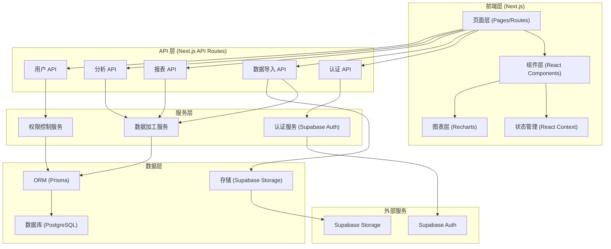
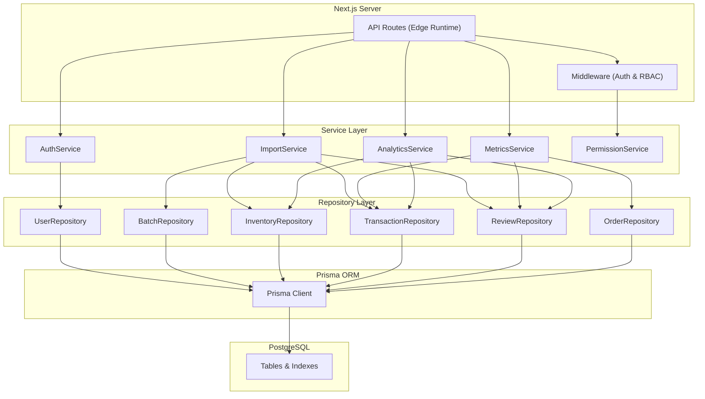
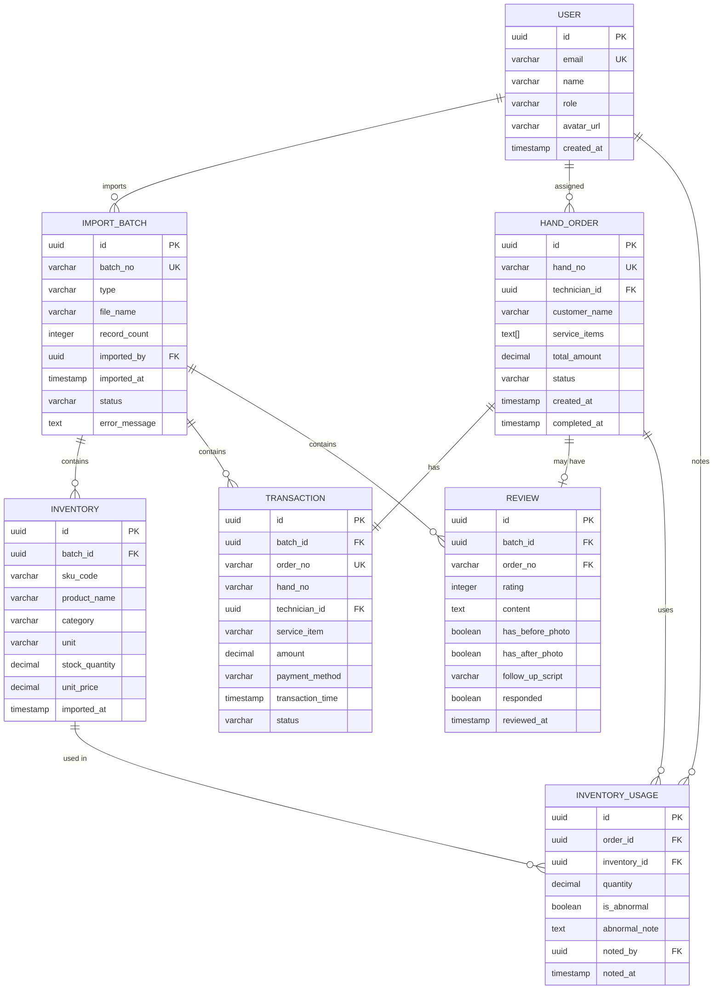

## 1. 架构设计



## 2. 技术描述

- **前端框架**：Next.js 14 (App Router) + React 18 + TypeScript
- **样式方案**：Tailwind CSS 3 + CSS Variables (主题系统)
- **图表库**：Recharts 2.10 (消费分布、漏斗图、趋势图)
- **UI 组件**：Radix UI (Headless 组件) + 自定义组件
- **动画库**：Framer Motion (页面过渡、图表动画)
- **ORM**：Prisma 5.8 (类型安全的数据库访问)
- **数据库**：PostgreSQL 15 (关系型数据存储)
- **后端服务**：Supabase (Auth、Storage、Edge Functions)
- **数据验证**：Zod (Schema 验证)
- **状态管理**：React Context + useSWR (数据请求缓存)
- **日期处理**：date-fns (日期格式化和计算)
- **图标**：Lucide React (线性图标库)
- **文件上传**：Supabase Storage + react-dropzone

## 3. 路由定义

| 路由路径 | 页面用途 | 访问权限 |
|----------|----------|----------|
| `/login` | 用户登录页 | 公开 |
| `/dashboard` | 管理层总览仪表盘 | 管理层 |
| `/my-orders` | 个人技师视图 | 技师 |
| `/analytics` | 数据分析区 | 管理层 |
| `/import` | 数据导入管理 | 管理层 |
| `/orders` | 手牌列表与详情 | 管理层/技师（仅本人） |

## 4. API 定义

### 4.1 TypeScript 类型定义

```typescript
// 用户类型
type UserRole = 'MANAGER' | 'TECHNICIAN';

interface User {
  id: string;
  email: string;
  name: string;
  role: UserRole;
  avatarUrl?: string;
  createdAt: Date;
}

// 批次记录
interface ImportBatch {
  id: string;
  batchNo: string;
  type: 'INVENTORY' | 'TRANSACTION' | 'REVIEW';
  fileName: string;
  recordCount: number;
  importedBy: string;
  importedAt: Date;
  status: 'PENDING' | 'PROCESSING' | 'COMPLETED' | 'FAILED';
  errorMessage?: string;
}

// 库存表
interface Inventory {
  id: string;
  batchId: string;
  skuCode: string;
  productName: string;
  category: string;
  unit: string;
  stockQuantity: number;
  unitPrice: number;
  importedAt: Date;
}

// 收银流水
interface Transaction {
  id: string;
  batchId: string;
  orderNo: string;
  handNo: string;
  technicianId: string;
  serviceItem: string;
  amount: number;
  paymentMethod: string;
  transactionTime: Date;
  status: 'PAID' | 'REFUNDED';
}

// 点评记录
interface Review {
  id: string;
  batchId: string;
  orderNo: string;
  rating: number;
  content: string;
  hasBeforePhoto: boolean;
  hasAfterPhoto: boolean;
  followUpScript: string;
  responded: boolean;
  reviewedAt: Date;
}

// 手牌
interface HandOrder {
  id: string;
  handNo: string;
  technicianId: string;
  customerName: string;
  serviceItems: string[];
  totalAmount: number;
  status: 'CREATED' | 'IN_SERVICE' | 'COMPLETED' | 'PAID' | 'REVIEWED';
  inventoryItems: InventoryUsage[];
  transaction?: Transaction;
  review?: Review;
  createdAt: Date;
  completedAt?: Date;
}

// 耗材领用
interface InventoryUsage {
  id: string;
  orderId: string;
  inventoryId: string;
  quantity: number;
  isAbnormal: boolean;
  abnormalNote?: string;
  notedBy?: string;
  notedAt?: Date;
}

// 报表数据
interface DashboardMetrics {
  todayRevenue: number;
  todayOrders: number;
  avgOrderValue: number;
  completionRate: number;
  yoyGrowth: number;
}

interface FunnelData {
  stage: string;
  value: number;
  conversionRate: number;
}
```

### 4.2 API 端点

| 方法 | 路径 | 描述 | 请求参数 | 响应格式 |
|------|------|------|----------|----------|
| POST | `/api/auth/login` | 用户登录 | `{ email, password }` | `{ user, token }` |
| GET | `/api/dashboard/metrics` | 获取仪表盘指标 | `{ dateRange? }` | `DashboardMetrics` |
| GET | `/api/dashboard/funnel` | 获取漏斗数据 | `{ dateRange? }` | `FunnelData[]` |
| GET | `/api/dashboard/technicians` | 技师排行 | `{ dateRange?, sortBy? }` | `TechnicianRank[]` |
| GET | `/api/analytics/consumption` | 消费分布 | `{ dimension, dateRange? }` | `ConsumptionData[]` |
| GET | `/api/analytics/photo-funnel` | 效果照片漏斗 | `{ dateRange? }` | `PhotoFunnelData[]` |
| GET | `/api/analytics/inventory-rank` | 库存领用排行 | `{ dateRange?, limit? }` | `InventoryRank[]` |
| GET | `/api/analytics/followup-trend` | 回访话术趋势 | `{ dateRange? }` | `FollowupTrend[]` |
| GET | `/api/technician/orders` | 技师个人订单 | `{ technicianId, dateRange? }` | `HandOrder[]` |
| GET | `/api/technician/metrics` | 技师个人指标 | `{ technicianId, dateRange? }` | `TechnicianMetrics` |
| POST | `/api/inventory-usage/abnormal` | 标记耗材异常 | `{ usageId, isAbnormal, note }` | `InventoryUsage` |
| POST | `/api/import/upload` | 上传数据文件 | `FormData { file, type }` | `ImportBatch` |
| GET | `/api/import/batches` | 获取导入批次 | `{ type?, page?, pageSize? }` | `{ batches, total }` |
| POST | `/api/import/process` | 处理导入批次 | `{ batchId }` | `ImportBatch` |

## 5. 服务器架构



## 6. 数据模型

### 6.1 ER 图



### 6.2 DDL 语句

```sql
-- 用户表
CREATE TABLE "user" (
    id UUID PRIMARY KEY DEFAULT gen_random_uuid(),
    email VARCHAR(255) UNIQUE NOT NULL,
    name VARCHAR(100) NOT NULL,
    role VARCHAR(20) NOT NULL CHECK (role IN ('MANAGER', 'TECHNICIAN')),
    avatar_url VARCHAR(500),
    created_at TIMESTAMPTZ NOT NULL DEFAULT CURRENT_TIMESTAMP
);

CREATE INDEX idx_user_role ON "user"(role);

-- 导入批次表
CREATE TABLE import_batch (
    id UUID PRIMARY KEY DEFAULT gen_random_uuid(),
    batch_no VARCHAR(50) UNIQUE NOT NULL,
    type VARCHAR(20) NOT NULL CHECK (type IN ('INVENTORY', 'TRANSACTION', 'REVIEW')),
    file_name VARCHAR(255) NOT NULL,
    record_count INTEGER NOT NULL DEFAULT 0,
    imported_by UUID NOT NULL REFERENCES "user"(id),
    imported_at TIMESTAMPTZ NOT NULL DEFAULT CURRENT_TIMESTAMP,
    status VARCHAR(20) NOT NULL DEFAULT 'PENDING' CHECK (status IN ('PENDING', 'PROCESSING', 'COMPLETED', 'FAILED')),
    error_message TEXT
);

CREATE INDEX idx_import_batch_type ON import_batch(type);
CREATE INDEX idx_import_batch_status ON import_batch(status);
CREATE INDEX idx_import_batch_imported_at ON import_batch(imported_at);

-- 库存表
CREATE TABLE inventory (
    id UUID PRIMARY KEY DEFAULT gen_random_uuid(),
    batch_id UUID NOT NULL REFERENCES import_batch(id),
    sku_code VARCHAR(50) NOT NULL,
    product_name VARCHAR(200) NOT NULL,
    category VARCHAR(100) NOT NULL,
    unit VARCHAR(20) NOT NULL,
    stock_quantity DECIMAL(10,2) NOT NULL,
    unit_price DECIMAL(10,2) NOT NULL,
    imported_at TIMESTAMPTZ NOT NULL DEFAULT CURRENT_TIMESTAMP
);

CREATE INDEX idx_inventory_sku ON inventory(sku_code);
CREATE INDEX idx_inventory_category ON inventory(category);
CREATE INDEX idx_inventory_batch_id ON inventory(batch_id);

-- 收银流水表
CREATE TABLE transaction (
    id UUID PRIMARY KEY DEFAULT gen_random_uuid(),
    batch_id UUID NOT NULL REFERENCES import_batch(id),
    order_no VARCHAR(50) UNIQUE NOT NULL,
    hand_no VARCHAR(50) NOT NULL,
    technician_id UUID NOT NULL REFERENCES "user"(id),
    service_item VARCHAR(200) NOT NULL,
    amount DECIMAL(10,2) NOT NULL,
    payment_method VARCHAR(50) NOT NULL,
    transaction_time TIMESTAMPTZ NOT NULL,
    status VARCHAR(20) NOT NULL DEFAULT 'PAID' CHECK (status IN ('PAID', 'REFUNDED'))
);

CREATE INDEX idx_transaction_hand_no ON transaction(hand_no);
CREATE INDEX idx_transaction_technician ON transaction(technician_id);
CREATE INDEX idx_transaction_time ON transaction(transaction_time);
CREATE INDEX idx_transaction_batch_id ON transaction(batch_id);

-- 点评记录表
CREATE TABLE review (
    id UUID PRIMARY KEY DEFAULT gen_random_uuid(),
    batch_id UUID NOT NULL REFERENCES import_batch(id),
    order_no VARCHAR(50) NOT NULL REFERENCES transaction(order_no),
    rating INTEGER NOT NULL CHECK (rating BETWEEN 1 AND 5),
    content TEXT,
    has_before_photo BOOLEAN NOT NULL DEFAULT false,
    has_after_photo BOOLEAN NOT NULL DEFAULT false,
    follow_up_script VARCHAR(200),
    responded BOOLEAN NOT NULL DEFAULT false,
    reviewed_at TIMESTAMPTZ NOT NULL
);

CREATE INDEX idx_review_order_no ON review(order_no);
CREATE INDEX idx_review_rating ON review(rating);
CREATE INDEX idx_review_reviewed_at ON review(reviewed_at);
CREATE INDEX idx_review_batch_id ON review(batch_id);

-- 手牌表
CREATE TABLE hand_order (
    id UUID PRIMARY KEY DEFAULT gen_random_uuid(),
    hand_no VARCHAR(50) UNIQUE NOT NULL,
    technician_id UUID NOT NULL REFERENCES "user"(id),
    customer_name VARCHAR(100),
    service_items TEXT[] NOT NULL DEFAULT '{}',
    total_amount DECIMAL(10,2) NOT NULL DEFAULT 0,
    status VARCHAR(20) NOT NULL DEFAULT 'CREATED' CHECK (status IN ('CREATED', 'IN_SERVICE', 'COMPLETED', 'PAID', 'REVIEWED')),
    created_at TIMESTAMPTZ NOT NULL DEFAULT CURRENT_TIMESTAMP,
    completed_at TIMESTAMPTZ
);

CREATE INDEX idx_hand_order_technician ON hand_order(technician_id);
CREATE INDEX idx_hand_order_status ON hand_order(status);
CREATE INDEX idx_hand_order_created_at ON hand_order(created_at);

-- 耗材领用表
CREATE TABLE inventory_usage (
    id UUID PRIMARY KEY DEFAULT gen_random_uuid(),
    order_id UUID NOT NULL REFERENCES hand_order(id),
    inventory_id UUID NOT NULL REFERENCES inventory(id),
    quantity DECIMAL(10,2) NOT NULL,
    is_abnormal BOOLEAN NOT NULL DEFAULT false,
    abnormal_note TEXT,
    noted_by UUID REFERENCES "user"(id),
    noted_at TIMESTAMPTZ
);

CREATE INDEX idx_inventory_usage_order ON inventory_usage(order_id);
CREATE INDEX idx_inventory_usage_inventory ON inventory_usage(inventory_id);
CREATE INDEX idx_inventory_usage_abnormal ON inventory_usage(is_abnormal);

-- 初始化数据
INSERT INTO "user" (email, name, role) VALUES
('manager@beauty.com', '张店长', 'MANAGER'),
('tech1@beauty.com', '李美容师', 'TECHNICIAN'),
('tech2@beauty.com', '王美容师', 'TECHNICIAN'),
('tech3@beauty.com', '陈美容师', 'TECHNICIAN');
```
