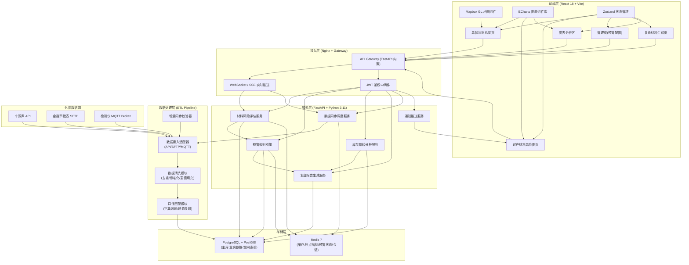
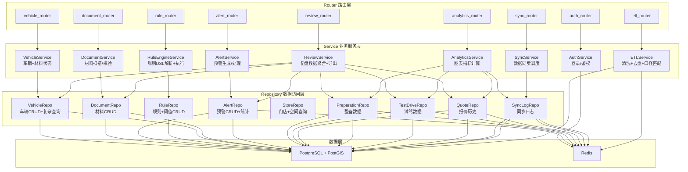
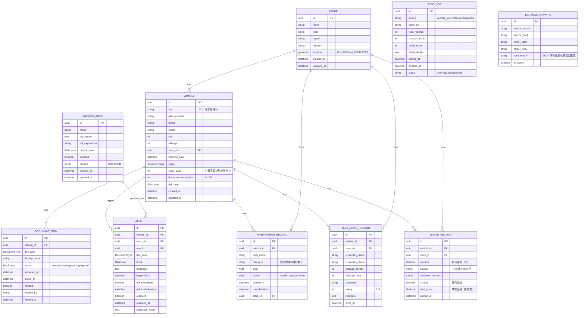
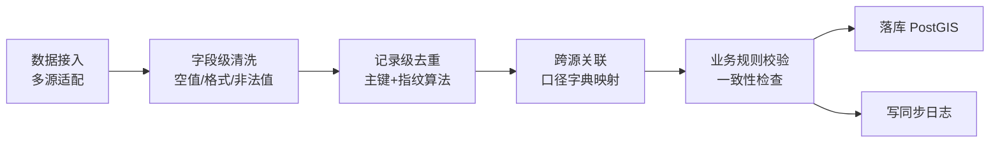

## 1. 架构设计



---

## 2. 技术描述

### 2.1 前端技术栈
- **框架**: React 18 + TypeScript 5
- **构建工具**: Vite 5 (ESBuild, HMR)
- **样式**: Tailwind CSS 3 + CSS Variables (主题系统)
- **路由**: React Router v6 (布局嵌套 + 懒加载)
- **状态管理**: Zustand 4 (切片模式, 持久化中间件)
- **UI 组件库**: 自研组件 + Radix UI 原语 (Dialog, Tabs, Slider, Tooltip)
- **图表**: ECharts 5 + echarts-for-react (蜡烛图/面积图/气泡矩阵)
- **地图**: Mapbox GL JS 3 + react-map-gl (空间可视化 + 自定义图层)
- **HTTP 请求**: Axios + React Query v5 (缓存 + 重连 + 乐观更新)
- **图标**: Lucide React
- **日期处理**: Day.js
- **文件导出**: xlsx (Excel), html2canvas + jspdf (PDF)

### 2.2 后端技术栈
- **框架**: FastAPI 0.110 + Pydantic v2 (数据校验)
- **Python 版本**: 3.11 (性能优化 + 类型提示)
- **ASGI 服务器**: Uvicorn + Gunicorn (多 worker)
- **ORM**: SQLAlchemy 2.0 (异步模式) + Alembic (迁移)
- **PostGIS**: GeoAlchemy2 (空间查询)
- **Redis**: redis-py 5 (异步连接池 + 发布订阅)
- **数据处理**: Pandas + NumPy (ETL 清洗)
- **任务调度**: APScheduler (周期性数据同步 + 预警扫描)
- **认证**: python-jose (JWT) + passlib (密码哈希)
- **API 文档**: Swagger UI (/docs) + ReDoc (/redoc)

### 2.3 数据库与缓存
- **PostgreSQL 16 + PostGIS 3.4**:
  - 存储车辆、材料、门店（含空间坐标）、整备、试驾、报价等核心业务表
  - 使用 BRIN 索引处理时间序列数据，GIST 索引处理空间数据
  - 分区表：按月份分区 `vehicle_events`，提升历史数据查询性能
- **Redis 7**:
  - String: 热点指标缓存（5 分钟 TTL）
  - Hash: 预警状态实时快照
  - Sorted Set: 实时预警时间线（按时间戳排序）
  - Pub/Sub: 预警事件实时推送到前端 SSE
  - Stream: 数据同步消费日志（用于断点续传）

### 2.4 工程化与部署
- **Monorepo**: pnpm workspaces (frontend/ backend/ shared)
- **容器化**: Docker + docker-compose (开发环境)
- **代码规范**: ESLint + Prettier (前端), Ruff + Black + mypy (后端)
- **Git hooks**: Husky + lint-staged
- **环境变量**: python-dotenv + .env.example

---

## 3. 路由定义

### 3.1 前端路由

| 路由路径 | 页面组件 | 页面用途 | 权限要求 |
|----------|----------|----------|----------|
| `/` | 重定向至 `/dashboard` | 根路径跳转 | - |
| `/dashboard` | DashboardPage | 风险监测总览（地图+指标+预警流） | 全部已登录用户 |
| `/risk-matrix` | RiskMatrixPage | 过户材料风险矩阵图+预警车辆列表 | 店长及以上 |
| `/management` | ManagementPage | 预警阈值+规则引擎+通知配置 | 风控管理员 |
| `/review/:vin` | ReviewPage | 单车复盘材料生成页 | 店长及以上 |
| `/analytics` | AnalyticsPage | 三大图表分层分析区 | 区域运营及以上 |
| `/login` | LoginPage | SSO 登录入口 | 未登录 |
| `/404` | NotFoundPage | 404 页 | - |

### 3.2 后端 API 路由分组

| 路由前缀 | 模块 | 用途 |
|----------|------|------|
| `/api/v1/auth` | auth_router | 登录、登出、刷新 Token |
| `/api/v1/stores` | store_router | 门店 CRUD、空间查询、门店指标 |
| `/api/v1/vehicles` | vehicle_router | 车辆列表/详情、材料状态、库龄 |
| `/api/v1/documents` | document_router | 过户材料 CRUD、缺失扫描、补料记录 |
| `/api/v1/alerts` | alert_router | 预警列表、确认、处理、统计 |
| `/api/v1/rules` | rule_router | 预警规则 CRUD、阈值配置、试运行 |
| `/api/v1/review` | review_router | 复盘材料生成、导出、关联数据查询 |
| `/api/v1/analytics` | analytics_router | 整备/试驾/报价三大图表数据接口 |
| `/api/v1/sync` | sync_router | 数据同步触发、同步状态、延迟信息 |
| `/api/v1/etl` | etl_router | ETL 管道管理、清洗日志、口径匹配 |

---

## 4. API 类型定义

```typescript
// ============== 共享类型 ==============
export type RiskLevel = 'low' | 'medium' | 'high' | 'critical';

export type DocumentType =
  | 'driving_license'   // 行驶证
  | 'registration_cert' // 登记证
  | 'purchase_tax'      // 购置税完税证明
  | 'insurance_policy'  // 交强险保单
  | 'invoice'           // 购车发票
  | 'other';            // 其他材料

export type TurnoverStage =
  | 'inbound'     // 入库
  | 'preparation' // 整备中
  | 'test_drive'  // 试驾中
  | 'quoting'     // 报价中
  | 'deal'        // 已成交
  | 'transfer';   // 已过户

export interface Store {
  id: string;
  name: string;
  code: string;
  region: string;
  address: string;
  lng: number; // 经度
  lat: number; // 纬度
  riskScore: number; // 0-100
  inStockCount: number;
  alertCount: number;
}

export interface Vehicle {
  id: string;
  vin: string;           // 车架号
  plateNumber: string;
  brand: string;
  model: string;
  year: number;
  mileage: number;       // 公里
  storeId: string;
  inboundDate: string;   // ISO Date
  stage: TurnoverStage;
  stockDays: number;     // 库龄
  documentCompletion: number; // 0-100 百分比
  riskLevel: RiskLevel;
}

export interface DocumentItem {
  id: string;
  vehicleId: string;
  type: DocumentType;
  name: string;
  status: 'present' | 'missing' | 'pending' | 'expired';
  uploadedAt?: string;
  expireAt?: string;
  verified: boolean;
}

export interface Alert {
  id: string;
  vehicleId: string;
  vin: string;
  storeId: string;
  storeName: string;
  documentType?: DocumentType;
  ruleId: string;
  ruleName: string;
  level: RiskLevel;
  message: string;
  triggeredAt: string;
  acknowledged: boolean;
  acknowledgedAt?: string;
  resolved: boolean;
  resolvedAt?: string;
  stockDays: number;
}

export interface WarningThreshold {
  id: string;
  documentType: DocumentType;
  name: string;
  warningDays: number;     // 首次预警天数
  criticalDays: number;    // 高风险天数
  escalationInterval: number; // 升级间隔（天）
  enabled: boolean;
  stageRequired?: TurnoverStage;
}

export interface RuleConfig {
  id: string;
  name: string;
  description: string;
  expression: string; // DSL 表达式，如: stage == 'preparation' AND missing('driving_license')
  level: RiskLevel;
  enabled: boolean;
  createdAt: string;
  updatedAt: string;
}

// ============== 图表数据 ==============
export interface MatrixBubble {
  stockAgeBucket: string; // 0-7 / 8-15 / 16-30 / 31+
  completionBucket: string; // 0-25 / 26-50 / 51-75 / 76-100
  count: number;
  riskLevel: RiskLevel;
  vehicleIds: string[];
}

export interface PreparationTrendPoint {
  date: string;
  storeId: string;
  storeName: string;
  completionRate: number;  // 整备完成率
  avgDays: number;         // 平均整备周期
  documentReadyRate: number; // 整备开始时材料齐套率
}

export interface TestDriveDistributionPoint {
  weekStart: string;
  firstTime: number;
  secondTime: number;
  thirdPlus: number;
  conversionRate: number;      // 试驾→报价转化率
  withDocumentsRate: number;   // 试驾时材料齐备率
}

export interface QuoteCandlePoint {
  date: string;
  vehicleId?: string;
  open: number;   // 当日首次报价
  close: number;  // 当日末次报价
  high: number;   // 最高报价
  low: number;    // 最低报价
  volume: number; // 报价次数
  dealPrice?: number; // 成交价（若成交）
}

export interface SyncDelayInfo {
  source: 'vehicle_source' | 'finance' | 'inspector';
  sourceName: string;
  lastSyncAt: string;
  delayHours: number;
  affectedFrom: string; // 延迟影响起始时间
  affectedTo: string;   // 延迟影响结束时间
  isDelayed: boolean;   // delayHours > 24
}

// ============== 请求/响应 ==============
export interface ApiResponse<T> {
  code: number;
  message: string;
  data: T;
  syncDelayInfo?: SyncDelayInfo[];
}

export interface PaginationParams {
  page: number;
  pageSize: number;
  sortBy?: string;
  sortOrder?: 'asc' | 'desc';
}

export interface PaginatedResponse<T> {
  items: T[];
  total: number;
  page: number;
  pageSize: number;
  totalPages: number;
}
```

---

## 5. 服务端分层架构



---

## 6. 数据模型

### 6.1 ER 图



### 6.2 DDL（关键表 + 索引）

```sql
-- 启用 PostGIS 扩展
CREATE EXTENSION IF NOT EXISTS postgis;
CREATE EXTENSION IF NOT EXISTS "uuid-ossp";

-- ============ 门店表（含空间索引） ============
CREATE TABLE stores (
    id UUID PRIMARY KEY DEFAULT uuid_generate_v4(),
    name VARCHAR(128) NOT NULL,
    code VARCHAR(32) NOT NULL UNIQUE,
    region VARCHAR(64) NOT NULL,
    address TEXT NOT NULL,
    location GEOGRAPHY(Point, 4326),
    created_at TIMESTAMPTZ NOT NULL DEFAULT NOW(),
    updated_at TIMESTAMPTZ NOT NULL DEFAULT NOW()
);

CREATE INDEX idx_stores_location ON stores USING GIST(location);
CREATE INDEX idx_stores_region ON stores(region);

-- ============ 车辆表 ============
CREATE TYPE turnover_stage AS ENUM ('inbound','preparation','test_drive','quoting','deal','transfer');
CREATE TYPE risk_level    AS ENUM ('low','medium','high','critical');

CREATE TABLE vehicles (
    id UUID PRIMARY KEY DEFAULT uuid_generate_v4(),
    vin VARCHAR(17) NOT NULL UNIQUE,
    plate_number VARCHAR(16),
    brand VARCHAR(64) NOT NULL,
    model VARCHAR(128) NOT NULL,
    year INTEGER NOT NULL,
    mileage INTEGER NOT NULL DEFAULT 0,
    store_id UUID NOT NULL REFERENCES stores(id) ON DELETE RESTRICT,
    inbound_date DATE NOT NULL,
    stage turnover_stage NOT NULL DEFAULT 'inbound',
    stock_days INTEGER NOT NULL DEFAULT 0,
    document_completion SMALLINT NOT NULL DEFAULT 0 CHECK (document_completion BETWEEN 0 AND 100),
    risk_level risk_level NOT NULL DEFAULT 'low',
    created_at TIMESTAMPTZ NOT NULL DEFAULT NOW(),
    updated_at TIMESTAMPTZ NOT NULL DEFAULT NOW()
);

CREATE INDEX idx_vehicles_store ON vehicles(store_id);
CREATE INDEX idx_vehicles_stage ON vehicles(stage);
CREATE INDEX idx_vehicles_risk  ON vehicles(risk_level);
CREATE INDEX idx_vehicles_stock ON vehicles(stock_days);
CREATE INDEX idx_vehicles_inbound ON vehicles(inbound_date DESC);
CREATE INDEX idx_vehicles_composite ON vehicles(store_id, stage, risk_level);

-- 自动维护 stock_days（每日调度或触发器）
CREATE OR REPLACE FUNCTION update_stock_days() RETURNS trigger AS $$
BEGIN
    NEW.stock_days := (CURRENT_DATE - NEW.inbound_date);
    RETURN NEW;
END; $$ LANGUAGE plpgsql;

CREATE TRIGGER trg_vehicles_stock_days
    BEFORE INSERT OR UPDATE OF inbound_date ON vehicles
    FOR EACH ROW EXECUTE FUNCTION update_stock_days();

-- ============ 材料表 ============
CREATE TYPE document_type   AS ENUM ('driving_license','registration_cert','purchase_tax','insurance_policy','invoice','other');
CREATE TYPE document_status AS ENUM ('present','missing','pending','expired');

CREATE TABLE document_items (
    id UUID PRIMARY KEY DEFAULT uuid_generate_v4(),
    vehicle_id UUID NOT NULL REFERENCES vehicles(id) ON DELETE CASCADE,
    doc_type document_type NOT NULL,
    display_name VARCHAR(128) NOT NULL,
    status document_status NOT NULL DEFAULT 'missing',
    uploaded_at TIMESTAMPTZ,
    expire_at TIMESTAMPTZ,
    verified BOOLEAN NOT NULL DEFAULT FALSE,
    verified_by VARCHAR(64),
    verified_at TIMESTAMPTZ,
    UNIQUE(vehicle_id, doc_type)
);

CREATE INDEX idx_doc_vehicle ON document_items(vehicle_id);
CREATE INDEX idx_doc_status  ON document_items(status);
CREATE INDEX idx_doc_expire  ON document_items(expire_at) WHERE expire_at IS NOT NULL;

-- ============ 预警表 ============
CREATE TABLE alerts (
    id UUID PRIMARY KEY DEFAULT uuid_generate_v4(),
    vehicle_id UUID NOT NULL REFERENCES vehicles(id) ON DELETE CASCADE,
    store_id UUID NOT NULL REFERENCES stores(id) ON DELETE RESTRICT,
    rule_id UUID,
    doc_type document_type,
    level risk_level NOT NULL,
    message TEXT NOT NULL,
    triggered_at TIMESTAMPTZ NOT NULL DEFAULT NOW(),
    acknowledged BOOLEAN NOT NULL DEFAULT FALSE,
    acknowledged_at TIMESTAMPTZ,
    resolved BOOLEAN NOT NULL DEFAULT FALSE,
    resolved_at TIMESTAMPTZ,
    resolution_notes TEXT
);

CREATE INDEX idx_alerts_vehicle ON alerts(vehicle_id);
CREATE INDEX idx_alerts_store   ON alerts(store_id);
CREATE INDEX idx_alerts_level   ON alerts(level);
CREATE INDEX idx_alerts_triggered ON alerts(triggered_at DESC);
CREATE INDEX idx_alerts_open    ON alerts(resolved, acknowledged) WHERE NOT resolved;
CREATE INDEX idx_alerts_composite ON alerts(store_id, level, resolved);

-- ============ 规则/阈值表 ============
CREATE TABLE warning_rules (
    id UUID PRIMARY KEY DEFAULT uuid_generate_v4(),
    name VARCHAR(128) NOT NULL,
    description TEXT,
    dsl_expression TEXT NOT NULL,
    default_level risk_level NOT NULL DEFAULT 'medium',
    enabled BOOLEAN NOT NULL DEFAULT TRUE,
    params JSONB NOT NULL DEFAULT '{}'::jsonb,
    created_at TIMESTAMPTZ NOT NULL DEFAULT NOW(),
    updated_at TIMESTAMPTZ NOT NULL DEFAULT NOW()
);

INSERT INTO warning_rules (name, description, dsl_expression, default_level, params) VALUES
('行驶证缺失-整备前', '进入整备阶段前必须上传行驶证',
 "stage == 'preparation' AND doc_status('driving_license') == 'missing'", 'high',
 '{"warning_days": 3, "critical_days": 7}'),
('登记证缺失-报价前', '报价前必须提供登记证',
 "stage == 'quoting' AND doc_status('registration_cert') == 'missing'", 'high',
 '{"warning_days": 2, "critical_days": 5}');

-- ============ 整备记录 ============
CREATE TABLE preparation_records (
    id UUID PRIMARY KEY DEFAULT uuid_generate_v4(),
    vehicle_id UUID NOT NULL REFERENCES vehicles(id) ON DELETE CASCADE,
    item_name VARCHAR(128) NOT NULL,
    category VARCHAR(32) NOT NULL,
    cost NUMERIC(12,2) NOT NULL DEFAULT 0,
    status VARCHAR(16) NOT NULL DEFAULT 'todo',
    started_at TIMESTAMPTZ,
    completed_at TIMESTAMPTZ,
    store_id UUID NOT NULL REFERENCES stores(id) ON DELETE RESTRICT,
    created_at TIMESTAMPTZ NOT NULL DEFAULT NOW()
);

CREATE INDEX idx_prep_vehicle ON preparation_records(vehicle_id);
CREATE INDEX idx_prep_store   ON preparation_records(store_id);
CREATE INDEX idx_prep_status  ON preparation_records(status);
CREATE INDEX idx_prep_completed ON preparation_records(completed_at DESC);

-- ============ 试驾记录 ============
CREATE TABLE test_drive_records (
    id UUID PRIMARY KEY DEFAULT uuid_generate_v4(),
    vehicle_id UUID NOT NULL REFERENCES vehicles(id) ON DELETE CASCADE,
    store_id UUID NOT NULL REFERENCES stores(id) ON DELETE RESTRICT,
    customer_name VARCHAR(64) NOT NULL,
    customer_phone VARCHAR(32),
    mileage_before INTEGER NOT NULL,
    mileage_after INTEGER NOT NULL,
    salesman VARCHAR(64),
    rating SMALLINT CHECK (rating BETWEEN 1 AND 5),
    feedback TEXT,
    drive_at TIMESTAMPTZ NOT NULL
);

CREATE INDEX idx_td_vehicle ON test_drive_records(vehicle_id);
CREATE INDEX idx_td_store   ON test_drive_records(store_id);
CREATE INDEX idx_td_date    ON test_drive_records(drive_at DESC);
CREATE INDEX idx_td_rating  ON test_drive_records(rating);

-- ============ 报价记录 ============
CREATE TABLE quote_records (
    id UUID PRIMARY KEY DEFAULT uuid_generate_v4(),
    vehicle_id UUID NOT NULL REFERENCES vehicles(id) ON DELETE CASCADE,
    store_id UUID NOT NULL REFERENCES stores(id) ON DELETE RESTRICT,
    amount NUMERIC(12,2) NOT NULL,
    source VARCHAR(32) NOT NULL DEFAULT '门店',
    customer_contact VARCHAR(64),
    is_deal BOOLEAN NOT NULL DEFAULT FALSE,
    deal_price NUMERIC(12,2),
    quoted_at TIMESTAMPTZ NOT NULL
);

CREATE INDEX idx_quote_vehicle ON quote_records(vehicle_id);
CREATE INDEX idx_quote_store   ON quote_records(store_id);
CREATE INDEX idx_quote_date    ON quote_records(quoted_at DESC);
CREATE INDEX idx_quote_deal    ON quote_records(is_deal);
CREATE INDEX idx_quote_composite ON quote_records(store_id, quoted_at, is_deal);

-- ============ 同步日志 ============
CREATE TYPE sync_source AS ENUM ('vehicle_source','finance','inspector');

CREATE TABLE sync_logs (
    id UUID PRIMARY KEY DEFAULT uuid_generate_v4(),
    source sync_source NOT NULL,
    batch_no VARCHAR(64) NOT NULL UNIQUE,
    total_records INTEGER NOT NULL DEFAULT 0,
    success_count INTEGER NOT NULL DEFAULT 0,
    failed_count INTEGER NOT NULL DEFAULT 0,
    failed_details JSONB,
    started_at TIMESTAMPTZ NOT NULL,
    finished_at TIMESTAMPTZ,
    status VARCHAR(16) NOT NULL DEFAULT 'running'
);

CREATE INDEX idx_sync_source ON sync_logs(source);
CREATE INDEX idx_sync_status ON sync_logs(status);
CREATE INDEX idx_sync_started ON sync_logs(started_at DESC);

-- 计算每源最后同步时间的视图（用于判断延迟）
CREATE MATERIALIZED VIEW mv_last_sync AS
SELECT DISTINCT ON (source)
    source,
    finished_at AS last_sync_at,
    status
FROM sync_logs
WHERE finished_at IS NOT NULL
ORDER BY source, finished_at DESC;

CREATE UNIQUE INDEX idx_mv_last_sync_source ON mv_last_sync(source);
REFRESH MATERIALIZED VIEW mv_last_sync;
```

### 6.3 Redis Key 设计规范

```
# 热点指标（按门店）
metric:store:{storeId}:daily:YYYYMMDD   -> Hash { inStock, alerts, completionRate }

# 全局缓存（5min TTL）
cache:dashboard:summary                 -> String(JSON)  总览页核心指标
cache:risk:matrix:{storeId?}:{days}     -> String(JSON)  风险矩阵数据
cache:analytics:preparation:{range}     -> String(JSON)  整备趋势
cache:analytics:testdrive:{range}       -> String(JSON)  试驾分布
cache:analytics:quote:{range}           -> String(JSON)  报价波动

# 实时预警时间线
alerts:timeline                         -> Sorted Set (score=timestamp, value=alertId)

# 车辆预警状态
alert:vehicle:{vin}                     -> Hash { level, count, lastTriggered }

# 同步延迟状态
sync:delay:info                         -> Hash { source -> delayHours, lastSyncAt }

# 会话/Token
auth:token:{jti}                        -> String (过期时间=TTL)
auth:user:{userId}                      -> Hash 用户信息
```

---

## 7. 数据清洗/去重/口径匹配设计

### 7.1 ETL 模块架构



### 7.2 核心算法

1. **去重策略**：
   - 车辆：VIN 码精确匹配为主，辅助 `车牌+品牌+型号+年份` 模糊指纹
   - 报价：`VIN+报价金额(整千取整)+日期` 组合指纹，避免同单多报
   - 试驾：`VIN+客户手机号+试驾时间(4小时窗口)` 去重

2. **口径匹配字典**：
   - 车源库品牌编码 → 统一品牌名（如 `BYD` → `比亚迪`、`BMW` → `宝马`）
   - 检测仪材料代码 → DocumentType 枚举映射表
   - 金融审批表门店编码 → stores.code 映射

3. **缺失值处理规则**：
   - 里程：用同品牌同年份中位数填充，标记 `imputed=true`
   - 入库日期：取首次材料上传日期，无则取同步日期
   - 材料状态：默认 `missing`，金融审批表可标记 `pending`
