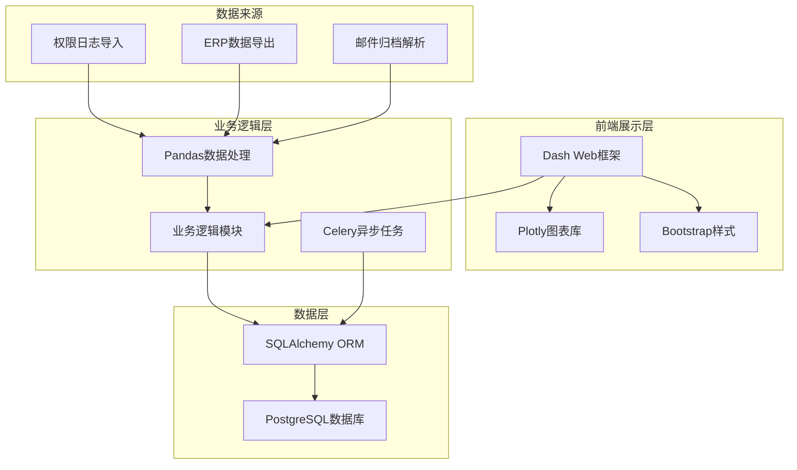
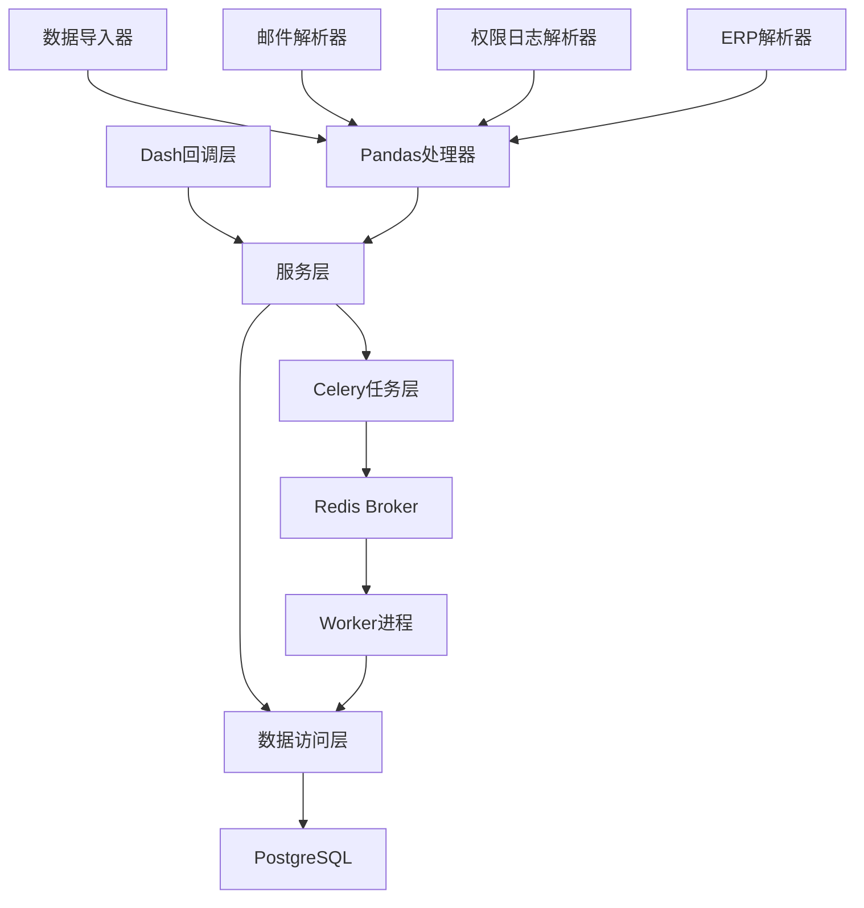
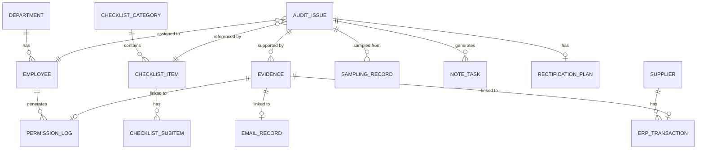

## 1. 架构设计



## 2. 技术描述

- **前端框架**: Python Dash 2.14.0 - 基于Flask的交互式Web应用框架
- **可视化库**: Plotly 5.17.0 - 交互式图表绘制
- **数据处理**: Pandas 2.1.0 - 数据清洗、分析、转换
- **数据库**: PostgreSQL 15+ - 关系型数据存储
- **ORM**: SQLAlchemy 2.0.20 - 数据库对象关系映射
- **异步任务**: Celery 5.3.0 + Redis - 数据导入、报告生成等耗时任务
- **样式框架**: Dash Bootstrap Components 1.5.0 - 响应式布局
- **Web服务器**: Gunicorn - 生产环境部署

## 3. 路由定义

| 路由路径 | 页面功能 | 核心组件 |
|----------|----------|----------|
| /dashboard | 主看板 - 风险监测总览 | 热力图、指标卡片、趋势折线图 |
| /checklist | 检查清单 - 制度条目管理 | 层级树、状态标记、进度追踪 |
| /sampling | 抽样分析 - 样本覆盖度 | 覆盖度仪表、抽样记录表 |
| /rectification | 整改追踪 - 计划与任务 | 甘特图、任务列表、证据缺失告警 |
| /suppliers | 供应商分析 - 材料排行 | 柱状图切换、雷达图 |
| /detail/\<id\> | 明细追溯 - 证据链查看 | 时间线、邮件卡片、权限日志详情 |

## 4. API 定义

### 4.1 数据导入API
```python
# 权限日志导入
def import_permission_log(file_path: str) -> dict:
    """
    请求: CSV/Excel文件路径
    响应: {imported_count: int, errors: list, task_id: str}
    """

# ERP数据导入
def import_erp_data(file_path: str) -> dict:
    """
    请求: CSV/Excel文件路径
    响应: {imported_count: int, errors: list, task_id: str}
    """
```

### 4.2 数据查询API
```python
# 获取风险汇总
def get_risk_summary(date_range: tuple, department: str = None) -> dict:
    """
    返回各部门风险等级分布、问题总数、趋势数据
    """

# 获取检查清单
def get_checklist(category: str = None) -> list:
    """
    返回树形结构的检查清单项，包含子项和状态
    """

# 获取抽样数据
def get_sampling_data(module: str = None) -> dict:
    """
    返回抽样覆盖率、样本列表、抽样详情
    """

# 获取整改计划
def get_rectification_plans(status: str = None) -> list:
    """
    返回整改计划列表，包含进度、责任人、截止日期
    """

# 获取供应商排行
def get_supplier_ranking(mode: str = 'absolute', limit: int = 20) -> list:
    """
    mode: 'absolute' 绝对值 | 'percentage' 占比
    """
```

### 4.3 操作API
```python
# 创建备注任务（证据缺失）
def create_note_task(issue_id: int, assignee: str, description: str) -> dict:
    """
    返回新创建的任务ID和状态
    """

# 更新问题状态
def update_issue_status(issue_id: int, status: str, conclusion: str = None) -> dict:
    """
    status: 'pending' | 'verified' | 'resolved' | 'closed'
    """

# 触发异步分析
def trigger_analysis(analysis_type: str) -> dict:
    """
    返回Celery任务ID，用于轮询状态
    """
```

## 5. 服务层架构



## 6. 数据模型

### 6.1 ER图



### 6.2 DDL语句

```sql
-- 部门表
CREATE TABLE department (
    id SERIAL PRIMARY KEY,
    name VARCHAR(100) NOT NULL,
    code VARCHAR(50) UNIQUE NOT NULL,
    created_at TIMESTAMP DEFAULT CURRENT_TIMESTAMP
);

-- 员工表
CREATE TABLE employee (
    id SERIAL PRIMARY KEY,
    name VARCHAR(100) NOT NULL,
    employee_no VARCHAR(50) UNIQUE NOT NULL,
    department_id INTEGER REFERENCES department(id),
    email VARCHAR(100),
    created_at TIMESTAMP DEFAULT CURRENT_TIMESTAMP
);

-- 权限日志表
CREATE TABLE permission_log (
    id SERIAL PRIMARY KEY,
    employee_id INTEGER REFERENCES employee(id),
    action VARCHAR(50) NOT NULL,
    resource VARCHAR(200) NOT NULL,
    ip_address VARCHAR(50),
    log_time TIMESTAMP NOT NULL,
    raw_data JSONB,
    imported_at TIMESTAMP DEFAULT CURRENT_TIMESTAMP,
    INDEX idx_permission_time (log_time),
    INDEX idx_permission_employee (employee_id)
);

-- 供应商表
CREATE TABLE supplier (
    id SERIAL PRIMARY KEY,
    name VARCHAR(200) NOT NULL,
    tax_no VARCHAR(50) UNIQUE,
    contact_person VARCHAR(100),
    risk_level VARCHAR(20) DEFAULT 'normal',
    created_at TIMESTAMP DEFAULT CURRENT_TIMESTAMP
);

-- ERP交易表
CREATE TABLE erp_transaction (
    id SERIAL PRIMARY KEY,
    transaction_no VARCHAR(50) UNIQUE NOT NULL,
    supplier_id INTEGER REFERENCES supplier(id),
    amount DECIMAL(15,2) NOT NULL,
    transaction_date DATE NOT NULL,
    transaction_type VARCHAR(50),
    department_id INTEGER REFERENCES department(id),
    raw_data JSONB,
    imported_at TIMESTAMP DEFAULT CURRENT_TIMESTAMP,
    INDEX idx_erp_date (transaction_date),
    INDEX idx_erp_supplier (supplier_id)
);

-- 检查清单分类
CREATE TABLE checklist_category (
    id SERIAL PRIMARY KEY,
    name VARCHAR(100) NOT NULL,
    description TEXT,
    parent_id INTEGER REFERENCES checklist_category(id),
    sort_order INTEGER DEFAULT 0,
    created_at TIMESTAMP DEFAULT CURRENT_TIMESTAMP
);

-- 检查清单项
CREATE TABLE checklist_item (
    id SERIAL PRIMARY KEY,
    category_id INTEGER REFERENCES checklist_category(id),
    item_code VARCHAR(50) UNIQUE NOT NULL,
    title VARCHAR(200) NOT NULL,
    description TEXT,
    risk_level VARCHAR(20) DEFAULT 'medium',
    sort_order INTEGER DEFAULT 0,
    created_at TIMESTAMP DEFAULT CURRENT_TIMESTAMP
);

-- 检查清单子项
CREATE TABLE checklist_subitem (
    id SERIAL PRIMARY KEY,
    item_id INTEGER REFERENCES checklist_item(id),
    title VARCHAR(200) NOT NULL,
    check_method TEXT,
    evidence_requirement TEXT,
    sort_order INTEGER DEFAULT 0,
    created_at TIMESTAMP DEFAULT CURRENT_TIMESTAMP
);

-- 审计问题表
CREATE TABLE audit_issue (
    id SERIAL PRIMARY KEY,
    checklist_item_id INTEGER REFERENCES checklist_item(id),
    title VARCHAR(200) NOT NULL,
    description TEXT,
    risk_level VARCHAR(20) NOT NULL,
    status VARCHAR(20) DEFAULT 'pending',
    department_id INTEGER REFERENCES department(id),
    discovered_date DATE NOT NULL,
    assignee_id INTEGER REFERENCES employee(id),
    conclusion TEXT,
    has_evidence BOOLEAN DEFAULT TRUE,
    created_at TIMESTAMP DEFAULT CURRENT_TIMESTAMP,
    INDEX idx_issue_status (status),
    INDEX idx_issue_risk (risk_level),
    INDEX idx_issue_date (discovered_date)
);

-- 抽样记录表
CREATE TABLE sampling_record (
    id SERIAL PRIMARY KEY,
    issue_id INTEGER REFERENCES audit_issue(id),
    sample_no VARCHAR(50) UNIQUE NOT NULL,
    transaction_id INTEGER REFERENCES erp_transaction(id),
    permission_log_id INTEGER REFERENCES permission_log(id),
    sampled_by INTEGER REFERENCES employee(id),
    sampled_at TIMESTAMP DEFAULT CURRENT_TIMESTAMP,
    result VARCHAR(20),
    notes TEXT,
    INDEX idx_sampling_issue (issue_id)
);

-- 备注任务表（证据缺失）
CREATE TABLE note_task (
    id SERIAL PRIMARY KEY,
    issue_id INTEGER REFERENCES audit_issue(id),
    title VARCHAR(200) NOT NULL,
    description TEXT,
    assignee_id INTEGER REFERENCES employee(id),
    due_date DATE,
    status VARCHAR(20) DEFAULT 'pending',
    created_by INTEGER REFERENCES employee(id),
    created_at TIMESTAMP DEFAULT CURRENT_TIMESTAMP,
    INDEX idx_task_status (status),
    INDEX idx_task_due (due_date)
);

-- 整改计划表
CREATE TABLE rectification_plan (
    id SERIAL PRIMARY KEY,
    issue_id INTEGER REFERENCES audit_issue(id) UNIQUE,
    title VARCHAR(200) NOT NULL,
    description TEXT,
    start_date DATE,
    end_date DATE,
    actual_end_date DATE,
    progress INTEGER DEFAULT 0,
    owner_id INTEGER REFERENCES employee(id),
    status VARCHAR(20) DEFAULT 'pending',
    created_at TIMESTAMP DEFAULT CURRENT_TIMESTAMP,
    INDEX idx_plan_status (status),
    INDEX idx_plan_dates (start_date, end_date)
);

-- 证据表
CREATE TABLE evidence (
    id SERIAL PRIMARY KEY,
    issue_id INTEGER REFERENCES audit_issue(id),
    type VARCHAR(50) NOT NULL,
    description TEXT,
    file_path VARCHAR(500),
    uploaded_by INTEGER REFERENCES employee(id),
    created_at TIMESTAMP DEFAULT CURRENT_TIMESTAMP
);

-- 邮件记录表
CREATE TABLE email_record (
    id SERIAL PRIMARY KEY,
    evidence_id INTEGER REFERENCES evidence(id),
    message_id VARCHAR(200) UNIQUE,
    sender VARCHAR(100) NOT NULL,
    recipients TEXT,
    subject VARCHAR(500),
    body TEXT,
    sent_at TIMESTAMP NOT NULL,
    raw_headers JSONB,
    INDEX idx_email_subject (subject),
    INDEX idx_email_date (sent_at)
);

-- Celery任务表
CREATE TABLE celery_task (
    id SERIAL PRIMARY KEY,
    task_id VARCHAR(100) UNIQUE NOT NULL,
    task_type VARCHAR(50) NOT NULL,
    status VARCHAR(20) DEFAULT 'pending',
    result JSONB,
    error_message TEXT,
    created_at TIMESTAMP DEFAULT CURRENT_TIMESTAMP,
    completed_at TIMESTAMP
);
```

### 6.3 初始化数据

```sql
-- 初始化部门
INSERT INTO department (name, code) VALUES 
('财务部', 'FIN'),
('采购部', 'PUR'),
('销售部', 'SAL'),
('人力资源部', 'HR'),
('信息技术部', 'IT'),
('行政部', 'ADM');

-- 初始化检查清单分类
INSERT INTO checklist_category (name, description, sort_order) VALUES 
('财务管理制度', '财务核算、预算、资金管理等', 1),
('采购管理制度', '供应商管理、采购流程、合同管理等', 2),
('销售管理制度', '客户管理、销售流程、收款管理等', 3),
('人事管理制度', '招聘、考勤、薪酬、离职管理等', 4),
('信息安全制度', '权限管理、数据安全、系统访问等', 5);

-- 初始化检查清单项示例
INSERT INTO checklist_item (category_id, item_code, title, description, risk_level, sort_order) VALUES 
(1, 'FIN-001', '费用报销审批', '检查费用报销是否符合审批权限规定', 'high', 1),
(1, 'FIN-002', '银行对账', '检查银行存款余额调节表编制是否及时', 'medium', 2),
(2, 'PUR-001', '供应商准入', '检查新增供应商是否经过资质审核', 'high', 1),
(2, 'PUR-002', '采购询价', '检查大额采购是否执行三方询价', 'high', 2),
(5, 'IT-001', '权限变更', '检查系统权限变更是否有审批记录', 'high', 1),
(5, 'IT-002', '离职权限回收', '检查员工离职后系统权限是否及时回收', 'critical', 2);
```
