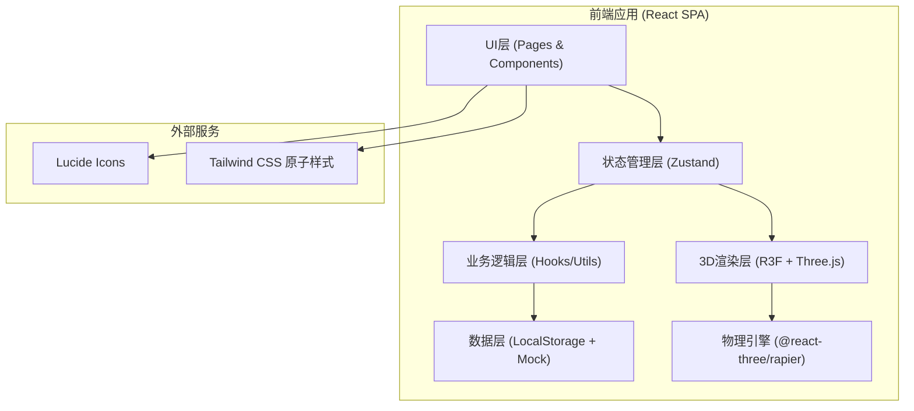

## 1. 架构设计



## 2. 技术说明

### 2.1 核心技术栈
| 分类 | 技术选择 | 版本 | 用途 |
|------|----------|------|------|
| 构建工具 | Vite | ^5.0 | 开发构建与HMR热更新 |
| 前端框架 | React | ^18.2 | 组件化UI开发 |
| 类型系统 | TypeScript | ^5.3 | 静态类型检查 |
| 3D渲染 | Three.js | ^0.160.0 | WebGL 3D图形底层 |
| 3D桥接 | @react-three/fiber | ^8.15.0 | React声明式Three.js |
| 3D工具库 | @react-three/drei | ^9.92.0 | 3D常用组件封装 |
| 物理引擎 | @react-three/rapier | ^0.14.0 | 刚体碰撞与物理模拟 |
| 后期处理 | @react-three/postprocessing | ^2.15.0 | Bloom/SSAO/抗锯齿 |
| 状态管理 | Zustand | ^4.4.7 | 全局状态与游戏状态 |
| 样式方案 | Tailwind CSS | ^3.4.0 | 原子化样式系统 |
| 图标 | lucide-react | ^0.294.0 | 线性图标库 |
| 路由 | react-router-dom | ^6.21.0 | SPA路由管理 |
| 图表 | recharts | ^2.10.3 | 复盘数据可视化 |

### 2.2 初始化方式
`pnpm create vite-init@latest . --template react-ts --force`（React+TypeScript纯前端模板）

## 3. 路由定义

| 路由路径 | 页面组件 | 权限 | 功能说明 |
|---------|---------|------|---------|
| `/` | HomePage | 公开 | 训练大厅首页 |
| `/game/:levelId` | GamePage | 学员 | 3D游戏主场景 |
| `/game/practice` | PracticePage | 学员 | 自由练习模式 |
| `/review/:recordId` | ReviewPage | 学员 | 训练复盘分析页 |
| `/records` | RecordsPage | 学员 | 历史训练记录列表 |
| `/config` | ConfigPage | 城市经理 | 配置管理首页 |
| `/config/questions` | QuestionConfigPage | 城市经理 | 题目库管理 |
| `/config/assets` | AssetConfigPage | 城市经理 | 素材库管理 |
| `/config/rewards` | RewardConfigPage | 城市经理 | 奖励与开放时间配置 |

## 4. 状态管理设计（Zustand Stores）

### 4.1 GameStore（游戏核心状态）
```typescript
interface GameState {
  mode: 'level' | 'practice';
  currentLevelId: string | null;
  phase: 'intro' | 'rule' | 'evidence' | 'settlement' | 'compensation' | 'result';
  score: number;
  timeRemaining: number;
  questions: Question[];
  currentQuestionIndex: number;
  answers: Record<string, UserAnswer>;
  startLevel: (levelId: string) => void;
  submitAnswer: (questionId: string, answer: UserAnswer) => void;
  nextPhase: () => void;
  resetGame: () => void;
}
```

### 4.2 ConfigStore（配置数据状态）
```typescript
interface ConfigState {
  questions: QuestionBank[];
  assets: AssetItem[];
  rewards: RewardConfig;
  openSchedule: OpenSchedule[];
  trainingModes: TrainingMode[];
  loadConfig: () => void;
  saveQuestion: (q: QuestionBank) => void;
  updateReward: (r: RewardConfig) => void;
}
```

### 4.3 RecordStore（训练记录状态）
```typescript
interface RecordState {
  records: TrainingRecord[];
  currentRecord: TrainingRecord | null;
  saveRecord: (record: TrainingRecord) => Promise<void>;
  getRecordsByUser: (userId: string) => TrainingRecord[];
  getRecordDetail: (id: string) => TrainingRecord | null;
}
```

## 5. 数据模型

### 5.1 核心实体ER图
```mermaid
erDiagram
    LEVEL ||--o{ QUESTION : contains
    QUESTION ||--|| QUESTION_TYPE : has
    QUESTION ||--o{ OPTION : has
    USER ||--o{ TRAINING_RECORD : generates
    TRAINING_RECORD ||--o{ ANSWER : contains
    QUESTION }o--|| ASSET : uses
    TRAINING_RECORD }o--|| REWARD : earns

    LEVEL {
        string id PK
        string name
        int difficulty
        string description
        int totalScore
    }
    QUESTION {
        string id PK
        string levelId FK
        string type ENUM
        string content
        string correctAnswer
        int score
    }
    QUESTION_TYPE {
        string code PK
        string name "rule/evidence/settlement/compensation"
    }
    OPTION {
        string id PK
        string questionId FK
        string label
        string value
        boolean isCorrect
    }
    ASSET {
        string id PK
        string type "image/model/audio"
        string url
        string tag
    }
    USER {
        string id PK
        string name
        string role
    }
    TRAINING_RECORD {
        string id PK
        string userId FK
        string levelId FK
        int score
        float accuracy
        int totalDuration
        int dispatchDuration
        datetime createdAt
    }
    ANSWER {
        string id PK
        string recordId FK
        string questionId FK
        string userAnswer
        boolean isCorrect
        int timeSpent
    }
    REWARD {
        string id PK
        string name
        string condition
        int points
    }
```

### 5.2 Mock数据结构位置
所有Mock数据存放于 `src/mock/` 目录：
- `src/mock/levels.ts` - 关卡配置与题库数据
- `src/mock/assets.ts` - 素材元数据
- `src/mock/users.ts` - 用户模拟数据
- `src/mock/records.ts` - 训练记录示例

## 6. 项目目录结构

```
MP0440/
├── public/                     # 静态资源
│   ├── models/                 # GLTF/GLB 3D模型
│   ├── textures/               # 贴图纹理
│   └── images/                 # UI图片素材
├── src/
│   ├── components/             # 通用组件
│   │   ├── ui/                 # 基础UI (Button/Card/Modal...)
│   │   ├── game/               # 游戏内组件
│   │   │   ├── HudPanel.tsx
│   │   │   ├── RuleMatcher.tsx
│   │   │   ├── EvidenceSelector.tsx
│   │   │   ├── SettlementSorter.tsx
│   │   │   └── CompensationHandler.tsx
│   │   ├── config/             # 配置页组件
│   │   └── review/             # 复盘页组件
│   ├── pages/                  # 路由页面
│   │   ├── HomePage.tsx
│   │   ├── GamePage.tsx
│   │   ├── PracticePage.tsx
│   │   ├── ReviewPage.tsx
│   │   ├── RecordsPage.tsx
│   │   └── config/             # 配置管理子页面
│   ├── hooks/                  # 自定义Hooks
│   │   ├── useGameEngine.ts
│   │   ├── useTimer.ts
│   │   ├── useDragDrop.ts
│   │   └── useSceneCamera.ts
│   ├── stores/                 # Zustand状态
│   │   ├── gameStore.ts
│   │   ├── configStore.ts
│   │   └── recordStore.ts
│   ├── three/                  # 3D场景模块
│   │   ├── CityScene.tsx       # 城市场景容器
│   │   ├── Building.tsx        # 建筑实例化
│   │   ├── RoadNetwork.tsx     # 道路网络
│   │   ├── Rider.tsx           # 骑手物理体
│   │   ├── OrderNode.tsx       # 订单节点
│   │   └── RouteLine.tsx       # 路线发光曲线
│   ├── mock/                   # Mock数据
│   ├── utils/                  # 工具函数
│   │   ├── subsidyRules.ts     # 补贴规则计算
│   │   ├── scoring.ts          # 评分逻辑
│   │   └── storage.ts          # 本地存储封装
│   ├── types/                  # TypeScript类型定义
│   │   ├── game.ts
│   │   ├── config.ts
│   │   └── record.ts
│   ├── App.tsx
│   ├── main.tsx
│   └── index.css               # Tailwind入口 + 全局样式
├── .trae/documents/            # 项目文档
├── vite.config.ts
├── tailwind.config.js
├── tsconfig.json
└── package.json
```

## 7. 关键技术实现说明

### 7.1 3D城市场景生成
- 使用`InstancedMesh`批量渲染建筑体，根据城市路网坐标程序化生成高低错落
- 道路通过多个`PlaneGeometry`拼接，边缘`LineSegments`绘制发光车道线
- `@react-three/rapier`创建Rider的Kinematic刚体，沿样条曲线更新translation实现平滑移动

### 7.2 补贴规则匹配引擎
`src/utils/subsidyRules.ts` 内置规则DSL：
```typescript
interface SubsidyRule {
  id: string;
  conditions: {
    distance?: [number, number];    // 里程区间
    timeSlot?: [string, string];    // 时段
    weather?: string[];             // 天气
    orderType?: string[];           // 订单类型
  };
  amount: number;
  type: 'fixed' | 'per_km' | 'multiplier';
}
```
引擎通过`evaluateRule()`函数遍历规则进行匹配判定。

### 7.3 拖拽交互实现
自定义`useDragDrop` Hook，结合Pointer事件实现：
- 证据卡片多选拖拽
- 排序题上下拖放
- 规则卡片与订单槽位的配对

### 7.4 数据持久化
使用`localStorage`按key前缀分区：
- `paotui:records:*` - 训练记录
- `paotui:config:*`  - 配置数据
- `paotui:user:*`    - 用户进度

配置页修改通过`utils/storage.ts`中`ConfigStorage`封装层同步写入。
