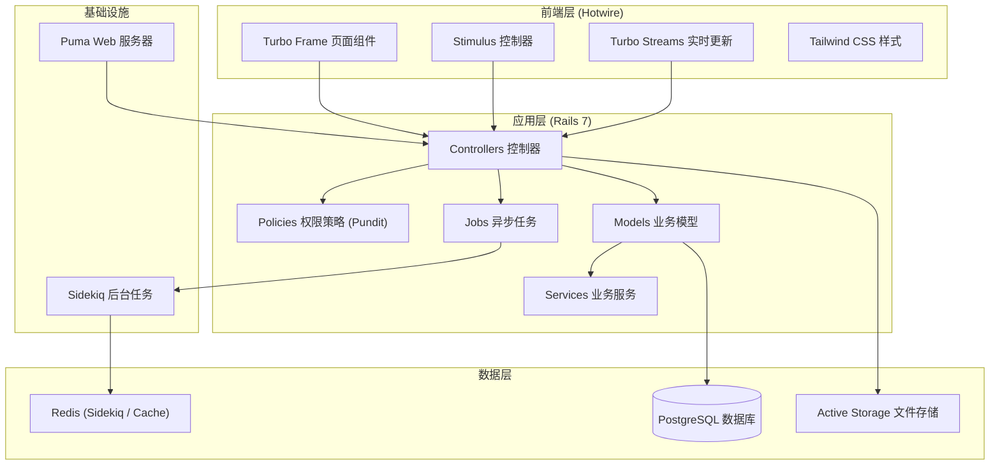
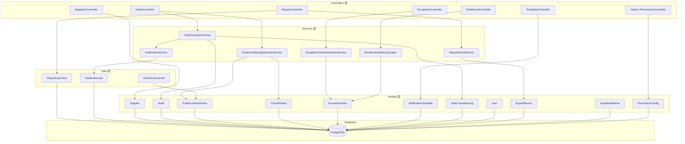
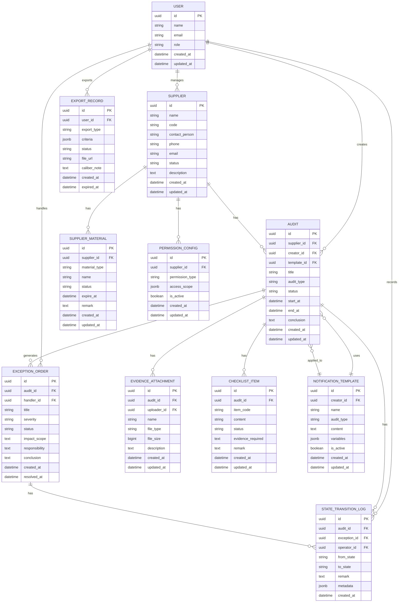

## 1. 架构设计



## 2. 技术选型说明

| 技术组件 | 版本 | 用途说明 |
|----------|------|----------|
| Ruby | 3.3.0 | 编程语言 |
| Ruby on Rails | 7.1.3 | Web 应用框架，原生支持 Hotwire |
| PostgreSQL | 15.x | 关系型数据库，支持 JSONB、全文检索 |
| Redis | 7.x | Sidekiq 队列存储、Rails 缓存 |
| Sidekiq | 7.2.x | 异步任务处理（导出、通知、数据同步） |
| Hotwire (Turbo + Stimulus) | 随 Rails 7 | 无 JS 框架的现代前端体验 |
| Tailwind CSS | 3.4.x | 原子化 CSS 框架 |
| Pundit | 2.3.x | 权限控制 |
| PaperTrail | 15.0.x | 模型版本追踪、状态变更审计 |
| Active Storage | 随 Rails 7 | 证据附件存储管理 |
| Ransack | 4.1.x | 高级搜索过滤 |
| Kaminari | 1.2.x | 分页组件 |
| Axlsx | 3.0.x | Excel 导出 |

## 3. 路由定义

| 路由 | 页面/接口用途 |
|------|--------------|
| `GET /` | 首页仪表盘 |
| `GET /dashboard` | 仪表盘数据概览 |
| `GET /suppliers` | 供应商列表 |
| `GET /suppliers/:id` | 供应商详情 |
| `POST /suppliers` | 创建供应商 |
| `PATCH /suppliers/:id` | 更新供应商 |
| `GET /audits` | 审计项目列表 |
| `GET /audits/:id` | 审计项目详情 |
| `POST /audits` | 创建审计项目 |
| `PATCH /audits/:id/transition` | 审计状态流转 |
| `POST /audits/:id/evidence` | 上传证据附件 |
| `DELETE /audits/:id/evidence/:id` | 删除证据附件 |
| `GET /audits/:id/checklist` | 检查清单 |
| `PATCH /audits/:id/checklist` | 提交检查清单 |
| `GET /exceptions` | 异常单列表 |
| `GET /exceptions/:id` | 异常单详情 |
| `POST /exceptions` | 创建异常单 |
| `PATCH /exceptions/:id/assign` | 分派责任人 |
| `PATCH /exceptions/:id/resolve` | 提交处理结论 |
| `GET /reports` | 报告导出页面 |
| `POST /reports/export` | 生成导出报告 |
| `GET /reports/download/:id` | 下载报告 |
| `GET /templates/notifications` | 通报模板列表 |
| `POST /templates/notifications` | 创建通报模板 |
| `PATCH /templates/notifications/:id` | 更新通报模板 |
| `GET /admin/permissions` | 权限管理 |
| `GET /admin/users` | 用户管理 |

## 4. 服务层 API 定义

### 4.1 核心服务类

```ruby
# 审计状态流转服务
class AuditTransitionService
  def initialize(audit, user, target_state, **options)
    # audit: 审计项目对象
    # user: 操作人
    # target_state: 目标状态
    # options: 备注、附件等
  end

  def call
    # 1. 权限校验
    # 2. 状态流转合法性校验
    # 3. 记录状态变更日志
    # 4. 触发相关业务逻辑（如证据缺失检测）
    # 5. 发送通知
  end
end

# 证据缺失检测服务
class EvidenceMissingDetectionService
  def initialize(audit)
    # 根据检查清单自动检测缺失证据
  end

  def call
    # 返回缺失证据列表
    # 严重时自动创建异常单
  end
end

# 异常单生成服务
class ExceptionOrderGenerationService
  def initialize(audit, missing_items, user)
    # audit: 关联审计项目
    # missing_items: 缺失证据项
    # user: 触发人
  end

  def call
    # 创建异常单
    # 自动计算影响范围
    # 分派默认责任人
  end
end

# 报告导出服务
class ReportExportService
  def initialize(user, export_params)
    # user: 导出人
    # export_params: 导出条件（时间范围、供应商等）
  end

  def call
    # 1. 校验权限
    # 2. 查询数据
    # 3. 计算统计指标（含口径说明）
    # 4. 异步生成 Excel/PDF
    # 5. 发送完成通知
  end
end

# 整改完成率计算服务
class RectificationRateCalculator
  def initialize(scope, period)
    # scope: 数据范围（供应商、审计类型等）
    # period: 统计周期
  end

  def call
    # 返回 { rate: 95.2%, total: 100, completed: 95, ... }
    # 附带计算口径说明
  end
end
```

## 5. 服务器架构图



## 6. 数据模型

### 6.1 ER 关系图



### 6.2 数据库迁移 DDL

```sql
-- 枚举类型定义
CREATE TYPE audit_status AS ENUM ('draft', 'pending_materials', 'in_progress', 'pending_evidence', 'pending_checklist', 'pending_notification', 'pending_approval', 'approved', 'rejected', 'archived');
CREATE TYPE exception_status AS ENUM ('open', 'assigned', 'in_progress', 'resolved', 'closed');
CREATE TYPE severity_level AS ENUM ('low', 'medium', 'high', 'critical');
CREATE TYPE user_role AS ENUM ('auditor', 'supervisor', 'admin');
CREATE TYPE material_status AS ENUM ('pending', 'approved', 'expired', 'rejected');

-- 用户表
CREATE TABLE users (
    id UUID PRIMARY KEY DEFAULT gen_random_uuid(),
    name VARCHAR(100) NOT NULL,
    email VARCHAR(100) NOT NULL UNIQUE,
    role user_role NOT NULL DEFAULT 'auditor',
    encrypted_password VARCHAR(255) NOT NULL,
    created_at TIMESTAMP NOT NULL DEFAULT CURRENT_TIMESTAMP,
    updated_at TIMESTAMP NOT NULL DEFAULT CURRENT_TIMESTAMP
);

-- 供应商表
CREATE TABLE suppliers (
    id UUID PRIMARY KEY DEFAULT gen_random_uuid(),
    name VARCHAR(200) NOT NULL,
    code VARCHAR(50) NOT NULL UNIQUE,
    contact_person VARCHAR(100),
    phone VARCHAR(50),
    email VARCHAR(100),
    status VARCHAR(20) NOT NULL DEFAULT 'active',
    description TEXT,
    created_at TIMESTAMP NOT NULL DEFAULT CURRENT_TIMESTAMP,
    updated_at TIMESTAMP NOT NULL DEFAULT CURRENT_TIMESTAMP
);

-- 供应商材料表
CREATE TABLE supplier_materials (
    id UUID PRIMARY KEY DEFAULT gen_random_uuid(),
    supplier_id UUID NOT NULL REFERENCES suppliers(id),
    material_type VARCHAR(50) NOT NULL,
    name VARCHAR(200) NOT NULL,
    status material_status NOT NULL DEFAULT 'pending',
    expire_at TIMESTAMP,
    remark TEXT,
    created_at TIMESTAMP NOT NULL DEFAULT CURRENT_TIMESTAMP,
    updated_at TIMESTAMP NOT NULL DEFAULT CURRENT_TIMESTAMP,
    INDEX idx_supplier_materials_supplier (supplier_id)
);

-- 权限配置表
CREATE TABLE permission_configs (
    id UUID PRIMARY KEY DEFAULT gen_random_uuid(),
    supplier_id UUID NOT NULL REFERENCES suppliers(id),
    permission_type VARCHAR(50) NOT NULL,
    access_scope JSONB NOT NULL DEFAULT '{}',
    is_active BOOLEAN NOT NULL DEFAULT TRUE,
    created_at TIMESTAMP NOT NULL DEFAULT CURRENT_TIMESTAMP,
    updated_at TIMESTAMP NOT NULL DEFAULT CURRENT_TIMESTAMP,
    INDEX idx_permission_configs_supplier (supplier_id)
);

-- 审计项目表
CREATE TABLE audits (
    id UUID PRIMARY KEY DEFAULT gen_random_uuid(),
    supplier_id UUID NOT NULL REFERENCES suppliers(id),
    creator_id UUID NOT NULL REFERENCES users(id),
    template_id UUID REFERENCES notification_templates(id),
    title VARCHAR(200) NOT NULL,
    audit_type VARCHAR(50) NOT NULL,
    status audit_status NOT NULL DEFAULT 'draft',
    start_at TIMESTAMP,
    end_at TIMESTAMP,
    conclusion TEXT,
    created_at TIMESTAMP NOT NULL DEFAULT CURRENT_TIMESTAMP,
    updated_at TIMESTAMP NOT NULL DEFAULT CURRENT_TIMESTAMP,
    INDEX idx_audits_supplier (supplier_id),
    INDEX idx_audits_status (status),
    INDEX idx_audits_creator (creator_id)
);

-- 证据附件表 (Active Storage 集成)
CREATE TABLE evidence_attachments (
    id UUID PRIMARY KEY DEFAULT gen_random_uuid(),
    audit_id UUID NOT NULL REFERENCES audits(id),
    uploader_id UUID NOT NULL REFERENCES users(id),
    name VARCHAR(200) NOT NULL,
    file_type VARCHAR(100),
    file_size BIGINT,
    description TEXT,
    created_at TIMESTAMP NOT NULL DEFAULT CURRENT_TIMESTAMP,
    updated_at TIMESTAMP NOT NULL DEFAULT CURRENT_TIMESTAMP,
    INDEX idx_evidence_audit (audit_id)
);

-- 检查清单表
CREATE TABLE checklist_items (
    id UUID PRIMARY KEY DEFAULT gen_random_uuid(),
    audit_id UUID NOT NULL REFERENCES audits(id),
    item_code VARCHAR(50) NOT NULL,
    content TEXT NOT NULL,
    status VARCHAR(20) NOT NULL DEFAULT 'pending',
    evidence_required TEXT,
    remark TEXT,
    created_at TIMESTAMP NOT NULL DEFAULT CURRENT_TIMESTAMP,
    updated_at TIMESTAMP NOT NULL DEFAULT CURRENT_TIMESTAMP,
    INDEX idx_checklist_audit (audit_id)
);

-- 异常单表
CREATE TABLE exception_orders (
    id UUID PRIMARY KEY DEFAULT gen_random_uuid(),
    audit_id UUID NOT NULL REFERENCES audits(id),
    handler_id UUID REFERENCES users(id),
    title VARCHAR(200) NOT NULL,
    severity severity_level NOT NULL DEFAULT 'medium',
    status exception_status NOT NULL DEFAULT 'open',
    impact_scope TEXT,
    responsibility TEXT,
    conclusion TEXT,
    created_at TIMESTAMP NOT NULL DEFAULT CURRENT_TIMESTAMP,
    resolved_at TIMESTAMP,
    INDEX idx_exception_audit (audit_id),
    INDEX idx_exception_status (status),
    INDEX idx_exception_handler (handler_id)
);

-- 通报模板表
CREATE TABLE notification_templates (
    id UUID PRIMARY KEY DEFAULT gen_random_uuid(),
    creator_id UUID NOT NULL REFERENCES users(id),
    name VARCHAR(100) NOT NULL,
    audit_type VARCHAR(50) NOT NULL,
    content TEXT NOT NULL,
    variables JSONB NOT NULL DEFAULT '{}',
    is_active BOOLEAN NOT NULL DEFAULT TRUE,
    created_at TIMESTAMP NOT NULL DEFAULT CURRENT_TIMESTAMP,
    updated_at TIMESTAMP NOT NULL DEFAULT CURRENT_TIMESTAMP
);

-- 状态变更日志表
CREATE TABLE state_transition_logs (
    id UUID PRIMARY KEY DEFAULT gen_random_uuid(),
    audit_id UUID REFERENCES audits(id),
    exception_id UUID REFERENCES exception_orders(id),
    operator_id UUID NOT NULL REFERENCES users(id),
    from_state VARCHAR(50),
    to_state VARCHAR(50) NOT NULL,
    remark TEXT,
    metadata JSONB NOT NULL DEFAULT '{}',
    created_at TIMESTAMP NOT NULL DEFAULT CURRENT_TIMESTAMP,
    INDEX idx_log_audit (audit_id),
    INDEX idx_log_exception (exception_id),
    INDEX idx_log_operator (operator_id),
    INDEX idx_log_created (created_at)
);

-- 导出记录表
CREATE TABLE export_records (
    id UUID PRIMARY KEY DEFAULT gen_random_uuid(),
    user_id UUID NOT NULL REFERENCES users(id),
    export_type VARCHAR(50) NOT NULL,
    criteria JSONB NOT NULL DEFAULT '{}',
    status VARCHAR(20) NOT NULL DEFAULT 'pending',
    file_url VARCHAR(500),
    caliber_note TEXT,
    created_at TIMESTAMP NOT NULL DEFAULT CURRENT_TIMESTAMP,
    expired_at TIMESTAMP,
    INDEX idx_export_user (user_id),
    INDEX idx_export_status (status)
);
```
